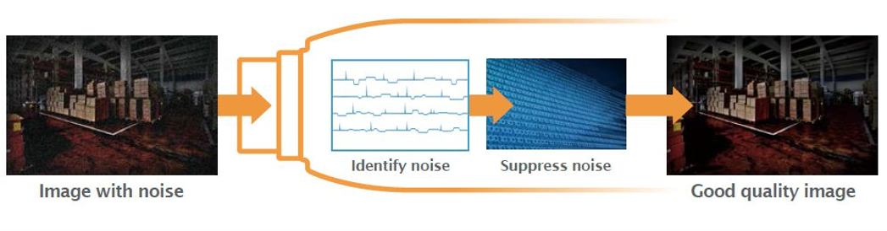
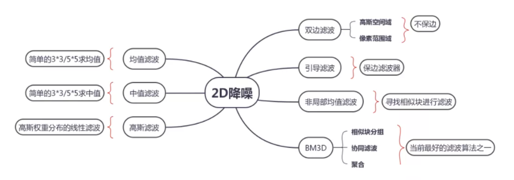
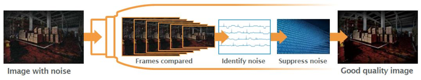

# 數字影像處理-3D降噪與2D降噪
## 什麼是3D降噪和2D降噪？
比較簡單的解釋：**一個演算法如果只利用同幀圖像資訊，稱為2D降噪；利用前後幀資訊稱為3D降噪。**  
**空域降噪（Spatial）:**  
是一種2D降噪方法，它只處理一幀圖像內部的雜訊，計算當前這一張畫面（單影格）內相鄰像素之間的幾何空間與亮度關係，不涉及前後影格的時間序列變化。降噪演算法根據實現原理不同可以分成很多種類型，比如線性/非線性、空域/頻域，頻域又包括小波變換、傅裡葉變換或其他變換。

 
在camera ISP 中使用的降噪演算法需要足夠簡單、快速、節省記憶體、適合硬體實現。經典的低通濾波器如中值濾波或高斯濾波雖然足夠簡單但是容易破壞圖像中的邊緣，所以主流ISP產品一般會使用某個加強了邊緣保持特性的改進版本，如引導濾波（guided filter），雙邊濾波（bilateral filter）等。  

### 一、 2DNR 的核心運作原理
#### 2DNR 的基本邏輯是：
影像的真實訊號通常是連續且平滑的，而雜訊（Noise）則是隨機跳變的孤立點。  
演算法會拿一個像素方陣（例如 3×3 或 5×5 的滑動窗口）在畫面上移動：  
- 中心像素：目前準備要被降噪的目標。
- 鄰近像素：周圍用來提供參考的鄰居。
- 處理方式：分析鄰居們的數值，透過加權平均或篩選，計算出一個合理的新數值來取代中心像素，進而把突兀的雜訊「磨平」。
### 二、 主流的 2DNR 演算法
2DNR 的演進主要依據「如何保留邊緣細節」來區分：  
1. 均值 / 中值濾波 (Mean / Median Filter)
    - 作法：直接取窗口內所有像素的平均值（均值），或將數值排序後取最中間的值（中值）。
    - 缺點：屬於非邊緣保持濾波。它分不清什麼是雜訊、什麼是物體的邊界，會把所有東西一起模糊掉，導致畫面變得很像「油畫」。
2. 高斯濾波 (Gaussian Filter)
    - 作法：距離中心像素越近的鄰居，給予越高的權重；越遠的權重越低。
    - 缺點：只考慮了空間距離，依然無法辨識物體的邊緣，高頻細節（如文字、毛髮）仍會被抹模糊。
3. 雙邊濾波 (Bilateral Filter) — **現代 ISP 最常用的 2D 基礎**
    - 作法：同時考慮空間距離權重與像素亮度差權重。如果鄰近像素與中心像素的「亮度差太高」，演算法會判定這是一個「物體邊緣」，進而降低該鄰居的權重，不讓它參與模糊計算。
    - 效果：既能平滑大面積的均勻雜訊（如牆壁、天空），又能成功保留物體的銳利邊緣。
### 三、 2DNR 的優點與缺點
🔵 優點
1. 無拖影（No Ghosting）：因為只處理單張畫面，完全不會受到動態物體的影響。即使車輛高速駛過，也不會產生殘影。
2. 記憶體頻寬極低：不需要緩存（Buffer）前後影格的影像，對硬體架構（SRAM/DDR）的頻寬與容量消耗極小。
3. 超低延遲：畫面一進來就能即時隨流（Streaming）處理完成。  

🔴 缺點
1. 降噪能力有上限：在極低光源（Low Light）環境下，如果雜訊太大，強行加大 2DNR 強度會導致畫面嚴重模糊，流失大量細節與紋理。
2. 無法處理時域雜訊：無法消除畫面上像雪花般隨機閃爍的動態燥點。
 
**時域降噪（Temporal）:**  
是一種3D降噪方法，它的主要思想是利用多幀圖像在時間上的相關性實現降噪。
 

一種最簡單的實現方法是時域均值濾波，即將相鄰幾幀圖像做加權平均。由於累加後雜訊的增長速度（根號關係）小於信號的增長速度（線性關係），所以圖像的信噪比會提高。這種方法的主要問題在於只適合處理靜態圖像，如果畫面中存在運動的物體則會出現偽影（ghost effect）。  

那麼對基本的時域降噪進行一些改造就可以得到一種自我調整降噪演算法：運動適應降噪 Motion Adaptive Noise Filter 。  
比如：基於運動自我調整的方法，採用區域運動檢測的方式來調整濾波權重，運動較大區域減小權重係數，運動小的區域加大權重係數，缺點是犧牲運動區域的去噪效果來減少拖影程度。

## 一、 3DNR 的核心運作原理
### 3DNR 的基本物理假設是：
在連續拍攝的畫面中，真實景物是具有連續性與統計規律的，而雜訊（如熱雜訊、散粒雜訊）則是隨機出現且互不相關的。
如果把連續 3 到 5 張照片重疊並取平均值：
- 真實景物：訊號不斷疊加，數值保持穩定。
- 隨機雜訊：正負誤差在疊加、平均的過程中互相抵消（即時域低通濾波）。
- 結果：噪點大幅下降，且完全不損害畫面的邊緣與細節，這是 2DNR 無法做到的。
二、 核心架構：運動檢測（Motion Detection）
如果畫面完全靜態，3DNR 可以做到近乎完美的降噪。但如果畫面中有物體在移動，直接將前後影格相加就會把移動物體的軌跡黏在一起，產生嚴重的殘影/拖影（Ghosting）。
因此，現代 3DNR 必須包含運動檢測（Motion Detection）機制，其運作公式通常為：
$$
\text{Output}(t) = \alpha \cdot \text{Current\_Frame} + (1 - \alpha) \cdot \text{Reference\_Frame}(t-1)
$$

其中 α（混合權重，0 到 1 之間）是由運動檢測器動態決定的：
- 靜態區域（無運動）：α 趨近於 0。ISP 會重度依賴歷史影格（參考影格）進行強烈降噪。畫面此時變得極為乾淨，細節完好。
- 動態區域（有運動）：α 趨近於 1。ISP 發現物體在動，為了避免拖影，會減少或完全關閉時域降噪，直接採用當前影格的原始數值（並轉由 2DNR 來接管該區域的降噪）。
## 三、 3DNR 的優點與缺點
🔵 優點
1. 極致的降噪能力：在夜間或極暗環境（Low Light），能大幅消除像雪花般隨機跳動的動態燥點（Time-domain noise）。
2. 完美保留高頻細節：在靜態區域，它不需要像 2DNR 那樣把畫面磨平，因此能完整保留牆壁紋理、文字、衣物纖維等細節。
3. 提升後續編碼效率：乾淨、不閃爍的畫面可以讓 H.264 / H.265 影片壓縮率大幅提升，顯著降低串流頻寬與儲存空間。  

🔴 缺點與副作用
1. 運動拖影（Ghosting）：當物體運動速度極快，或者環境太暗導致運動檢測失效時，運動物體後方會帶有一條像鬼影般的尾巴。
2. 硬體成本極高：必須在 DDR 記憶體中暫存前一影格（或數影格）的完整影像數據，對記憶體頻寬（Bandwidth）與容量消耗極大。
## 四、 進階技術：3DNR + ME/MC（運動估計與補償）
為了徹底解決動態物體的降噪問題，高階的 ISP（如高階安防晶片、手機旗艦 SoC）會在 3DNR 中加入 ME/MC（Motion Estimation / Motion Compensation，運動估計與運動補償）：
- 作法：演算法不只比對同一個座標點，還會預測運動物體「跑去哪裡了」。它會把前一影格的車子，平移對齊到當前影格的車子位置，再進行時域相加。
- 效果：即使物體在高速移動，3DNR 依然能同時發揮強效降噪，且完全不產生拖影。但這需要極其龐大的晶片算力。

前面說道**一個演算法如果只利用同幀圖像資訊，稱為2D降噪；利用前後幀資訊稱為3D降噪。**
在利用相似資訊時候，採用搜索相似塊的思路，則稱為基於運動補償的降噪。BM3D就是時空域運動補償的降噪演算法。  

基於運功補償的方法，利用運動估計和運動補償找到當前幀在前後幀中的時域預測，可以很好的去除拖影效果但時間複雜度過高，即時性不強，因為每個點都需要在一定區域裡面搜索相似塊，運算複雜度高，很難做到即時。 

因此在工業界，大多採用3D降噪方法，沒有運動補償部分，基本思路是通過判斷待濾波點是否為運動點來選擇空域濾波強度和時域平滑強度。 

一般的調試思路是在運動幅度越大的區域加強空域濾波強度同時減少時域平滑強度，在消除雜訊的同時儘量減少拖影。  

## 2DNR 與 3DNR 的關鍵對比:
現代 ISP 通常會將兩者結合（混合降噪）：  

|特性|2DNR（空域降噪）|3DNR（時域降噪）|
|----|----|----|
|處理維度|單張畫面（X軸、Y軸）|跨影格畫面（X軸、Y軸 + 時間軸）|
|最佳場景|高速運動物體、光線充足|靜態畫面、極度昏暗環境|
|副作用|強度過高時，畫面會變糊（油畫感）|運動物體邊緣會產生拖影/殘影|
|硬體成本|極低，不需要大型記憶體|高，必須緩存前幾影格的資料|

