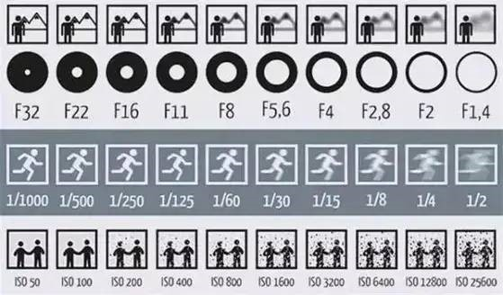
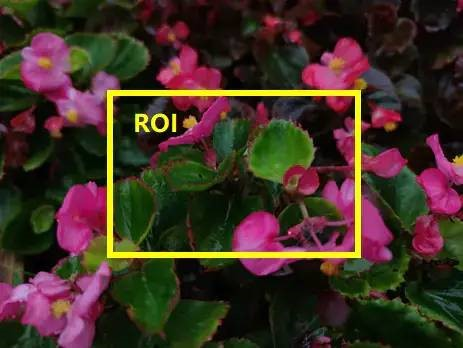
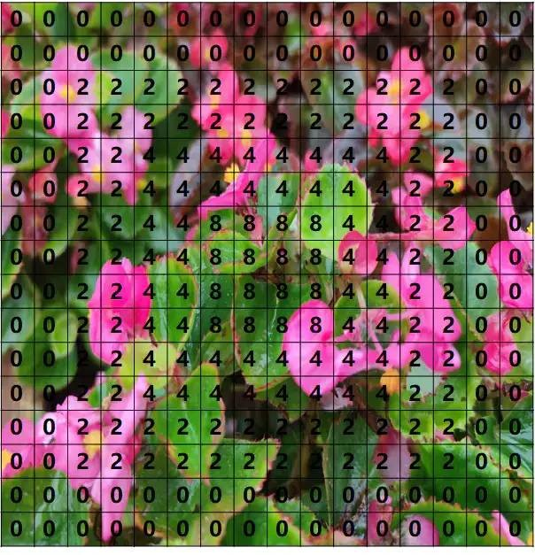
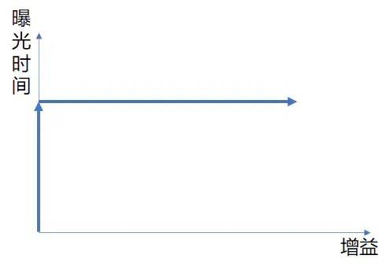
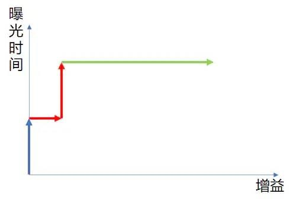

# AE（自動曝光）概念及基本原理
## 1. 概念介紹
### 自動曝光（Auto Exposure, AE）對於拍照或攝影至關重要 。  
- 曝光過度：畫面整體太亮，會損失很多細節 。  
- 曝光不足：畫面太黑，細節同樣看不見 。  
- 核心目標：將畫面亮度穩定在合適的區間，而非追求與目標亮度完全相等，以避免頻繁調節導致畫面閃爍 。  

## 2. 曝光三要素
### 曝光主要由光圈、快門、感光度（ISO/增益）三個要素決定，可比喻為接水過程 ：  

要素 | 功能描述 | 比喻 (接水)
|----|----|----|
光圈 | 控制進光量；影響景深  | 水龍頭開關大小   
快門 | 控制曝光時間；影響動態模糊   | 開水龍頭的時間長短   
感光度/增益 | 底片對光的敏感度；影響噪點與畫面細膩度  | 濾網孔徑的大小   
- 光圈：越大進光量越大，景深越小（背景易虛化）；越小進光量越小，景深越大（背景不易虛化）。  
- 快門：越長畫面越亮，移動物體拖影越明顯；越短畫面越暗，拖影越不明顯 。  
- 感光度：越大畫面越亮，噪點越明顯；越小畫面越暗，畫面越細膩 。  
## 3. 基本工作原理
### AE 系統透過統計亮度並與目標亮度比對來調整參數 。  
- 統計亮度與 ROI統計亮度：最簡單的方式是將指定區域內所有像素點的值加起來 。  
- ROI (Region of Interest)：感興趣區域，用於指定計算統計亮度的範圍 。常見設定為整個畫面、居中區域，或車載產品中常用的「居中偏下」區域 。  
### 如圖所示，用最簡單的方式理解統計亮度，可以將黃框內所有圖元點的值加起來作為當前畫面的統計亮度。而目標亮度就是在不同環境下採集的統計亮度的值

- 曝光區域權重：將畫面劃分為網格（如 16x16），每一塊區域有不同的權重值。權重越高，該區對整體亮度計算影響越大；權重為 0 則表示不參與計算 。  
### 如圖所示為一個16*16的曝光區域權重，一般情況下的曝光權重是與整個畫面對應的。每一塊的值代表了該區域參與最終計算最終統計亮度的權重值，權重值越高表示該區域對整體畫面亮度越大，權重為0表示畫面亮度與該區域沒有關係


### 調節邏輯
- 當統計亮度 > 目標亮度：降低曝光時間和增益，使畫面變暗 。  
- 當統計亮度 < 目標亮度：增大曝光時間和增益，使畫面變亮 。  
- 透過設置不同的增益等級對應不同目標亮度，並進行插值計算，即可得到簡單的自動曝光模組 。  
## 4. 曝光策略
### 在一般相機光圈固定的前提下，AE 主要調節曝光時間與增益 。  
```
 如果我要畫面變亮一些，我既可以增大光圈，也可以增大曝光時間，還可以增大感光度，那到底採用哪種方式呢？答案是根據應用場景採取策略。比如，在拍風景照時，經常有近景和遠景，那麼要使畫面都對焦清晰就需要較大的景深，因此需要用小光圈。再比如，拍運動物體時，如果曝光時間較長，那麼拍到的運動物體會是模糊到根本看不清，此時就需要減少曝光時間，增大感光度來提升亮度。。。這些就是曝光策略的部分，不過除了單反相機，一般相機的光圈都是固定的，這裡會只關注曝光和增益部分的調整
```

- 基礎策略：當畫面變暗時，先增加曝光時間，待達到最大值後再增加增益；反之，畫面變亮時，先減小增益再減少曝光時間 。  
### 如圖所示，橫坐標表示增益的大小（增益越大，畫面越暗），縱坐標表示曝光時間。這是最常見的策略就是跟隨箭頭的方向，當畫面逐漸變暗時，先走曝光時間，等到曝光時間達到最大之後再增加增益；反之，當畫面從極黑逐漸變亮時，先減小增益再調小曝光時間當然採取這種策略也會存在一些限制，比如，一般情況下晴天白天的曝光時間比較短，增益為0dB，而黃昏場景曝光可能比較大，增益也為0dB，但是晴天白天場景的亮度遠遠高於黃昏場景，而如果黃昏時採用白天場景的參數可能噪點會非常明顯，因為相機內一般不同的參數是根據增益來進行區分的

- 優化策略：針對不同場景（如白天與黃昏），可採取階梯式調整（例如先增長部分曝光時間，再走小部分增益，依此循環），藉由不同的增益等級來區分場景參數，降低噪點 。 
### 因此這種情況下，可以將曝光策略更改當畫面逐漸變暗時，先增大一部分曝光時間，再走一小部分增益；再增大曝光時間，等到曝光時間達到最大之後再增加增益這樣的情況下，可以讓晴天白天的場景對應於圖中藍色箭頭段，而黃昏場景端對應于紅色箭頭段，增益的不同就能區分兩個場景來設置不同的參數，當然具體設置什麼時候作為拐點需要經過實際測試曝光策略的還有一個就是增益的策略，曝光時間只有一個，但是增益會有AG(Analog Gian)、DG(Digital Gain)、ISP Gain、可能還會有CG(Conversion Gain)，先起用哪個再啟用哪一個也是有講究的，其中，AG、DG和CG都屬於Sensor增益，是在Sensor端生效的，而ISP Gain是在ISP端生效的。

 
- 增益類型與順序：
    - Sensor 增益：包括 AG (類比增益)、DG (數位增益)、CG (轉換增益)。Sensor 手冊通常會規定先走滿 AG 再走 DG 。  
    - ISP Gain：在 ISP 端生效。主要用於補償曝光行劇烈變化引起的亮度突變，或輔助 HDR 合成（如透過調整 ISP DG 來控制長短幀合成比重）。  