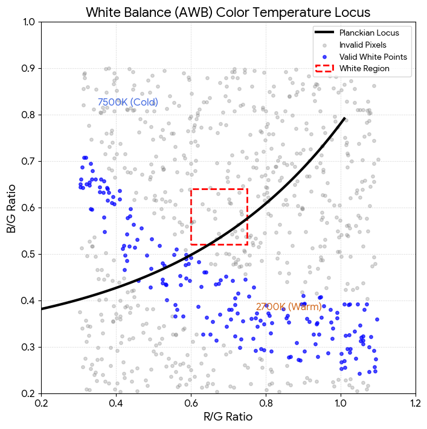

# AWB 在影像調校（Tuning）上的原理與技術說明

在影像訊號處理（ISP）的調校實務中，自動白平衡（AWB）的調整是一門**結合色度學、統計學與工程經驗的技術**。調校的目的不是去改寫演算法的底層程式碼，而是透過設定「參數」與「臨界值」，讓 AWB 演算法能完美適應特定的感光元件（Sensor）與鏡頭（Lens）。

---

### 一、 AWB 調校的核心硬體原理：為什麼必須調校？

即使兩台相機使用完全相同的 AWB 演算法，只要換了鏡頭或感光元件，就必須重新調校。原因在於：

* **感光元件光譜響應（Sensor RGB Response）的差異**：不同廠商（如 Sony、OMNIVISION、Smartsens）的感光元件，其 RGB 濾色片（CFA）對相同光源的敏感度不同。
* **鏡頭透光與偏色（Lens Transmittance）**：鏡頭玻璃鍍膜會對特定波長（如紅外光或藍紫光）有不同的衰減，且鏡頭邊緣會有暗角與偏色（Lens Shading）。

> 💡 **調校的本質**：建立一個轉換矩陣與物理邊界，將當前「硬體看到的偏色世界」，校正對齊到「人類視覺認知的真實世界」。

---

### 二、 AWB 調校的技術流程與四大核心模組

AWB 的調校工作主要圍繞在 ISP 內部的四大核心技術模組進行設定：

``` markdown
## [步驟 1: 靜態光源量測] ──> [步驟 2: 白區邊界設定] ──> [步驟 3: 權重與多光源判定] ──> [步驟 4: 動態平滑濾波]
```

#### 1. 靜態光源特徵點量測（Calibration / Golden Point Sampling）
調校的第一步是在標準燈箱中，量測相機在各種單一光源下的 $R/G$ 與 $B/G$ 比值（稱為 **Golden Points**）。

* **實作技術**：使用發射光譜符合 ISO 標準的燈箱，切換至少 5 到 7 種典型色溫：
  * **超低色溫**：Horizon（約 2300K，夕陽/燭光）
  * **低色溫**：A 光源（約 2856K，鎢絲燈）
  * **中色溫**：CWF / TL84（約 4000K-4150K，辦公室螢光燈）
  * **高色溫**：D65（6500K，標準日光）
  * **超高色溫**：D75 / Shade（7500K-9000K，陰影下或晴空藍天）
* **技術輸出**：工程師會得到一組由低色溫排列到高色溫的坐標點，這群點連接起來就是該硬體的**普朗克軌跡基準線**。

#### 2. 白區邊界與限制範圍設計（White Zone Definition）
由於現實中很少有完美的標準光源，拍出來的白點會偏離基準線。因此調校時必須在基準線周圍畫出「容許邊界」（通常在 $\Delta C_x, \Delta C_y$ 或 $R/G, B/G$ 空間中）。

* **技術要點**：
  * **高低色溫端的截斷（Truncation）**：必須限制 $K_r$ 與 $K_b$ 的最大與最小值。例如：限制 $K_r$ 最大只能放大到 2.5 倍，防止相機在極端紅光環境下（如舞台紅光）過度校正，把紅光拍成慘白色。
  * **多邊形框選（Polygon Tuning）**：在二維坐標系上畫出一個多邊形（通常是六邊形或八邊形）。只有落在多邊形內部的像素才會被判定為「白點候選者」。

#### 3. 權重矩陣與距離懲罰（Weight Matrix & Distance Penalty）
為了防止非白色的彩色物體（如大面積黃色衣服或藍色天空）干擾白平衡，調校會引入距離權重機制。

* **點對線距離**：計算某個像素的 $(R/G, B/G)$ 坐標到普朗克軌跡線的幾何距離 $d$。
* **權重函數（Weight Function）**：
  $$W = \max\left(0, 1 - \frac{d}{D_{max}}\right)$$
  距離基準線越近，權重越接近 $1$；距離越遠，權重越低。當距離大於調校設定的臨界值 $D_{max}$ 時，權重直接歸零。
* **特殊色度空間過濾**：調校時通常會結合 $YUV$ 空間，剔除亮度過高已飽和的「死白點」，或亮度過低的「暗部雜訊點」。

#### 4. 場景優先級與多光源權衡（Scenario Preference & Interpolation）
當畫面上同時出現兩種光源（如窗外日光 D65 搭配室內黃光 A 光源），或者遇到大面積單色干擾時，調校工程師需要設定權衡策略：

* **多光源插值（Multi-light source Interpolation）**：如果計算出的白點落在 A 光源與 D65 之間，演算法會根據兩者周邊像素的數量比例進行線性權重插值，找出一個過渡色溫，避免畫面顏色非黃即藍。
* **色彩偏好調校（Color Preference）**：這屬於主觀調校。例如在低色溫（暖黃光）環境下，如果完全遵循 $R=G=B$ 的絕對校正，室內會變得像日光燈一樣冷白，失去溫馨感。調校工程師此時會故意**保留部分色溫（保留約 10%~20% 的暖色調）**，這在技術上稱為「溫暖保留（Warmth Keeping）」。

---

### 三、 進階 AWB 調校技術：動態收斂與穩定性

在真實動態錄影或切換場景時，AWB 還需要調整以下控制時間與穩定性的技術參數：

| 調校技術項目 | 說明與原理 | 調校目的 |
| :--- | :--- | :--- |
| **動態收斂速度<br>(Convergence Speed)** | 設定 AWB 追蹤新光源的反應時間（通常以 Frame 幀數為單位）。 | 防止從室內走到室外時，畫面色彩突然「瞬間閃爍」變色；調校通常會讓它在 10~20 幀內緩慢平滑地過渡。 |
| **時域濾波器<br>(Temporal Filter)** | 引入前幾幀的白平衡增益進行加權平均（如 IIR 濾波器）。 | 消除環境中微小光線跳動（例如火光閃爍或螢光燈頻閃）造成的白平衡數值浮動。 |
| **動態範圍連動<br>(Gain & Bv Link)** | 根據環境光照度（Bv 值，Brightness Value）切換不同的白區範圍。 | 在**高光（戶外晴天）**環境下，白區可以縮得很嚴格以求精準；在**低光源（夜景/暗光）**環境下，雜訊極大，此時必須把白區放大並高度依賴預設的色溫先驗知識，防止畫面色彩崩壞。 |

---

### 🛠️ 調校工程師的實務總結

在業界中，AWB 調校是一個**「數據量測為骨架，美學經驗為血肉」**的過程：

1. 先在燈箱用**標準數據**畫出普朗克軌跡與白區（解決 80% 的標準場景）。
2. 再針對**極端實景**（如大晴天的草地、佈滿黃色向日葵的花田、全黑背景下的霓虹燈）去微調權重與邊界臨界值（解決 20% 的偏色失效問題）。
3. 最後透過**溫暖保留參數**，調配出符合品牌風格（如日系清透、德系濃郁或美系寫實）的最終色彩調性。


# AWB 校正原理與公式

**自動白平衡（AWB, Auto White Balance）的校正原理是透過消除環境光源的色溫影響，將影像中的白色與其他色彩還原至人眼在標準日光下所認知的真實色彩。** 其核心機制為透過演算法估計環境光色彩，計算出紅（R）、綠（G）、藍（B）三通道的增益係數（Gains），並藉由矩陣運算重新調整每個像素的顏色。

---

### 一、 AWB 的數學核心公式

不論使用哪一種白平衡演算法，其最終的校正步驟都是對影像的 R、G、B 通道進行獨立的線性縮放（通常以 G 通道為基準，保持不變）：

$$
\begin{cases} 
R_{new} = K_r \times R \\ 
G_{new} = K_g \times G \\ 
B_{new} = K_b \times B 
\end{cases}
$$

其中 $K_r, K_g, K_b$ 為**校正增益係數值**（Gains）。如果將 G 通道作為不變的參照基準（即令 $K_g = 1$），則公式可簡化為：

$$
\begin{cases} 
R_{new} = K_r \times R \\ 
G_{new} = G \\ 
B_{new} = K_b \times B 
\end{cases}
$$

* **校正的最終目標**：使影像中原本屬於白色的區域，在校正後滿足 $R_{new} = G_{new} = B_{new}$ 的中性灰/白色條件。

---

### 二、 核心增益係數計算方法（三大經典演算法）

如何尋找 $K_r$ 和 $K_b$？不同的演算法有不同的假設基礎：

#### 1. 灰度世界演算法（Gray World Algorithm）
* **原理假設**：在一幅色彩豐富的影像中，所有像素的 R、G、B 三通道的平均值應該趨近於同一個中性灰色值（常數 K）。
* **計算公式**：
  1. 計算全圖各通道的平均值 $R_{mean}, G_{mean}, B_{mean}$：
     $$R_{mean} = \frac{1}{N}\sum R, \quad G_{mean} = \frac{1}{N}\sum G, \quad B_{mean} = \frac{1}{N}\sum B$$
  2. 設定目標灰色值（通常取 G 通道的平均值以保持亮度平衡）：$K = G_{mean}$。
  3. 計算增益係數：
     $$K_r = \frac{G_{mean}}{R_{mean}}, \quad K_g = 1, \quad K_b = \frac{G_{mean}}{B_{mean}}$$

#### 2. 完美反射演算法（Perfect Reflection / White Patch Algorithm）
* **原理假設**：影像中最亮（反射率最高）的點是由高光或白色物體反射出來的，它完美反映了環境光源的顏色。
* **計算公式**：
  1. 找出影像中亮度最大（或 R+G+B 總和最大）的前 M 個像素點（白色參考點）。
  2. 計算這些點在各通道的平均值 $R_{max\_mean}, G_{max\_mean}, B_{max\_mean}$。
  3. 計算增益係數：
     $$K_r = \frac{G_{max\_mean}}{R_{max\_mean}}, \quad K_g = 1, \quad K_b = \frac{G_{max\_mean}}{B_{max\_mean}}$$

#### 3. 色溫曲線與白點檢測法（現代商用 ISP 主流）
* **原理假設**：真實世界的光源（如蠟燭、日光、LED）都符合普朗克黑體輻射軌跡。在不同的色溫下，白點在色彩空間（如 $\frac{R}{G}$ 與 $\frac{B}{G}$ 坐標系）中會落在一條特定的「色溫曲線」上。
* **運作流程**：
  1. 統計影像中落於色溫曲線附近（白區/候選白點）的像素點。
  2. 計算這群候選白點的平均坐標 $(R_{w}, G_{w}, B_{w})$。
  3. 計算增益：$K_r = \frac{G_{w}}{R_{w}}$， $K_b = \frac{G_{w}}{B_{w}}$。

---

### 三、 AWB 演算法的侷限性與改進
  
經典演算法在特定場景下容易失效：
* **大面積單色干擾**：例如拍攝一片綠色草地，灰度世界法會誤把綠色當成灰色，導致校正後的照片嚴重「補色變紫」。
* **現代改進方案**：現代相機與手機的 ISP（影像訊號處理器）會引入**權重機制**、**機器學習（AI AWB）**以及**場景辨識**，自動排除大面積的樹葉、膚色等干擾，並限制增益係數不可超出合理的色溫區間。

---

### 💡 核心結論
自動白平衡（AWB）的基本原理是**透過估計環境光源，將 R、G、B 通道乘以各自的增益係數（Gains），使影像中的白色或中性灰色像素恢復 R = G = B 的平衡狀態**。其中最基礎的計算公式為利用影像各通道的均值比值，即 $K_r = \frac{G_{mean}}{R_{mean}}$ 與 $K_b = \frac{G_{mean}}{B_{mean}}$ 來修正偏色。

---

## 普朗克軌跡（Planckian Locus）色溫曲線
#### 在影像訊號處理（ISP）與相機調校（Tuning）中，經典的灰度世界法容易因為大面積單色（如草地、藍天）而失效。
#### 為了徹底解決這個問題，現代 ISP 普遍採用 「普朗克軌跡（Planckian Locus）色溫曲線」 結合 「權重設計」 來鎖定真實的白點。

### 一、 普朗克軌跡的量測方法：如何畫出那條曲線？
在實驗室中，工程師不會直接用物理公式計算，而是透過實機量測來定義相機感光元件（Sensor）的色溫曲線。
- ### 1. 建立標準實驗環境
    - 工具：標準燈箱（包含多種標準光源）、24色卡（Macbeth ColorChecker）或全白卡 / 18% 灰卡、色溫計。
    - 主要切換光源：
        - D65：標準平均日光（色溫約 6500K）
        - D50 / TL84：正午陽光 / 商店螢光燈（色溫約 5000K / 4000K）
        - A 光源：鎢絲燈 / 暖黃光（色溫約 2856K）
- ### 2. 量測與坐標轉換步驟拍攝灰卡：
    - 將相機關閉 AWB（設為手動不調增益，即 $(K_r=1, K_b=1)）$，在各個光源下拍攝標準灰卡。
    - 提取數值：讀取灰卡影像中央區域像素的 $(R、G、B)$ 平均值。
    - 計算色彩比值：為了消除亮度干擾，將坐標空間投射到二維的比例空間（通常以 G 通道為分母）：  
$(X=\frac{R}{G},\quad Y=\frac{B}{G})$

    - 繪製曲線：將每個光源下得到的 $((R/G, B/G))$ 點連成一條平滑的弧線。這條在相機專屬坐標系上的線，就是該感光元件的普朗克軌跡（色溫曲線）。

### 二、 AWB 權重設計（Weighting Design）
有了曲線後，當相機拍下一張隨機照片時，它會統計幾萬個像素的 $(R/G, B/G))$ 分佈。此時必須透過權重矩陣（Weight Matrix）來篩選出「真正的白點」。  
- ### 1. 空間劃分（框出白區）
    工程師會在色溫曲線兩側加上上下限，形成一個「香蕉形」或「矩形」的候選白點區域（White Zone）。只有落在這個區域內的像素，才會被納入白平衡的計算。  
- ### 2. 權重分配邏輯  
並非所有在白區內的點都有同等重要性。權重通常設計為 $(0) 到 (1)$ 之間：

- 權重 = 1（核心區）：非常貼近色溫曲線的像素。代表它極有可能是受到標準光源照射的白色物體。
- 權重 = 0.5（邊緣區）：離曲線稍遠的像素。可能是稍微偏色的物體，需要降低它對整體白平衡的影響力。
- 權重 = 0（外部區）：遠離曲線的像素。例如綠色的草地或紅色的衣服，直接剔除，不參與計算。


### 量測色溫曲線：是用實驗室的標準燈，幫相機建立一條「什麼才是正常光」的標準地圖。
### 設計權重機制：是讓相機在拍照時，自動過濾雜訊（大面積彩色物體），只看地圖範圍內的有效白點。