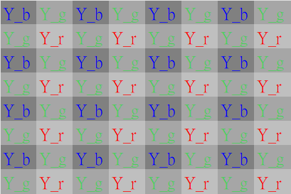
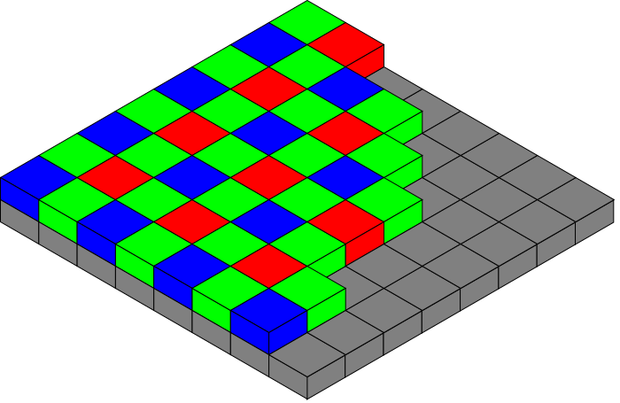
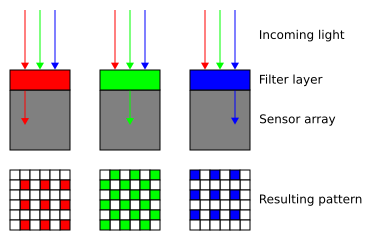
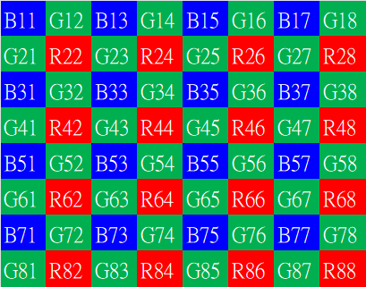
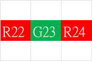
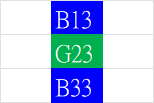
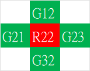
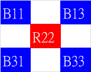

# 去馬賽克（Demosaic，或稱 Debayer）轉換與說明
去馬賽克(Demosaic)是圖像信號處理（ISP）管線中不可或缺的步驟，其核心任務是將感測器輸出的單色「馬賽克」數據轉換為全彩的 RGB 影像。
以下詳細說明其原理與使用原因：
## 1. 為什麼需要去馬賽克？（使用原因）
- 硬體限制：大多數數位相機的感測器物理上只能偵測光線的強度，無法直接辨別顏色。  
 
 
- 色彩濾鏡陣列 (CFA)：為了捕捉彩色影像，感測器表面覆蓋了一層色彩濾鏡（最常見的是 Bayer 模式）
  
。這導致每個像素實際上只能檢測紅、綠、藍三原色中的「其中一種」。
- 資訊缺失：在原始的 RAW 圖中，每個像素都缺失了 2/3 的顏色資訊（例如：綠色像素點缺少紅色與藍色的數值），影像呈現一種「馬賽克」狀態。  
    
- 還原視覺需求：為了還原成人類肉眼所見的全彩畫面，必須透過演算法補齊每個像素缺失的兩種顏色值。
## 2. 去馬賽克的運作原理
去馬賽克的本質是「猜測」與「插值」。它透過分析周圍像素的顏色與亮度變化，計算出當前像素點所缺失的色彩數值。  
- 去馬賽克的核心在於插值演算法（Interpolation）：
- 鄰近參考：演算法會參考目標像素周圍的相鄰像素顏色資訊。
- 計算缺失值：例如，當處理一個只感應到「綠光」的像素時，ISP 會讀取其上下左右的「紅光」與「藍光」像素數值，透過加權平均或其他複雜演算法，計算出該位置應有的紅色與藍色分量。
- 生成 RGB 影像：完成處理後，每個像素點都同時具備了 R、G、B 三種數值，影像從此由單色陣列變為真正的彩色影像。
- 常見的去馬賽克演算法由淺入深包含以下幾種：
```
[馬賽克感光資料] ──> [周圍像素分析] ──> [插值演算法計算] ──> [輸出 R+G+B 全彩像素]
```
 1. 雙線性插值法 (Bilinear Interpolation)原理：
 最基礎的作法。直接取該像素四周鄰近相同顏色像素的平均值，作為該點缺失的顏色數值。缺點：忽略了影像中的邊緣與線條，容易導致畫面邊緣模糊，並產生明顯的偽色（Color Artifacts）。
      - 計算邏輯： 若要計算一個「藍色像素（B）」位置缺失的「綠色（G）」數值，演算法會抓取其上下左右四個綠色像素的平均值。
      - 優缺點：計算速度極快，但會忽略影像中的邊緣特徵，導致細節處產生模糊（Blurring）與偽色（Color Artifacts）。
### 我們以還原一個綠色像素位置的紅藍色，以及一個紅色像素位置的綠藍色為例：
   ##  填補綠色格子（$G_{23}$）的紅（R）與藍（B）值   
  
### $$G_{23}r = \frac{R_{22} + R_{24}}{2}$$
  
### $$G_{23}b = \frac{B_{13} + B_{33}}{2}$$
```
這時就可以得到 G23 這個 pixle 的 {R G B}的數值 
``` 
  ## 填補綠色格子（$R_{22}$）的綠（G）與藍（B）值 
  
### $$R_{22}g = \frac{G_{12} + G_{32} + G_{21} + G_{23}}{4}$$
  
### $$R_{22}b = \frac{B_{11} + B_{13} + B_{31} + B_{33}}{4}$$
```
這時就可以得到 R22 這個 pixle 的 {R G B}的數值 
``` 
-------------------------------------------------------------------------------

 2. 邊緣導向插值法 (Edge-Directed Interpolation)原理：演算法會先偵測影像的邊緣方向（水平、垂直或對角線）。
 基礎的平均法在遇到物體邊緣時，會因為強行平均而產生偽彩色（Chrominance Artifacts）或拉鍊效應（Zipper Effect）。
      - 作法：如果發現某處是垂直線條，它就會優先沿著垂直方向的像素進行插值計算，避免跨越邊緣混合顏色。這能大幅保留影像的銳利度。
      - 計算邏輯：  
         1. 梯度偵測：計算垂直方向差值 $ΔV=∣ G_{up​} − G_{down​} ∣ $與水平方向差值 $ΔH=∣ G_{left}​ −G_{right} ∣$。
         2. 方向判斷：
            - 若 $ΔV<ΔH$，代表垂直方向像素較接近（存在垂直邊緣），則沿垂直方向平均。
            - 若 $ΔH<ΔV$，代表水平方向像素較接近，則沿水平方向平均。
      - 優點：能有效保留線條的銳利度，減少跨越邊緣的顏色混疊。
 3. 亮度與色差相關性演算法 (Chrominance-Luminance Correlation)原理：利用「人類視覺對綠色（亮度）最敏感」以及「自然影像中局部區域的色差通常很接近」的特性。
    - 作法：優先將綠色（G）通道完整插值出來（因為拜耳陣列中綠色佔了 50%）。計算紅綠色差（R-G）與藍綠色差（B-G）。利用這些色差梯度去補齊紅（R）與藍（B）的數值。這是目前主流相機與修圖軟體（如 Lightroom）最常使用的進階原理變形。
    - 計算邏輯：
      1. G 通道優先：由於綠色在拜耳陣列中佔 50%，先用邊緣導向法完整插值出所有像素的 G 值（作為亮度參考）。
      2. 計算色差（Difference Domain）：在已知 R 或 B 像素的位置，計算與 G 的差值，例如 $D_{R−G}​ = R−G$。
      3. 差值插值：利用鄰近的「色差值」進行插值，補齊所有點的 $D_{R−G}​ $ 與 $D_{B−G​} $。
      4. 還原 R/B：最後透過 $R=G+D_{R−G}​$  還原出最終像素值。  
    - 優點：這能確保 R、G、B 通道的噪聲相互關聯，維持局部色調的一致性，是專業修圖軟體（如 Lightroom）與現代 ISP 的核心原理
。
## 3. 對影像品質的影響與挑戰
去馬賽克是決定影像品質的關鍵環節，各家廠商通常將其詳細算法視為商業機密。其處理過程會帶來以下影響：
- 噪點關聯性：在插值過程中，原本獨立像素的噪點會擴散到相鄰像素，導致不同顏色通道間的噪點產生關聯。
- 偽影與銳利度：不精確的去馬賽克算法可能會在物體邊緣產生**彩色偽影（Aliasing）**或導致細節模糊。
- 管線位置：在高品質的 ISP 流程中，去馬賽克通常位於黑電平校正 (BLC)、鏡頭陰影校正 (LSC) 與自動白平衡 (AWB) 之後，但在色彩校正矩陣 (CCM) 之前執行。  

由於顏色是「算」出來的而非真實捕捉，如果演算法不夠完美，在面對高密度細密條紋（如西裝外套、遠處建築百葉窗）時，容易產生兩大相機常見紋路問題：
- 摩爾紋 (Moiré Pattern)：畫面出現不正常的波浪狀彩色條紋。
- 偽色 (False Color)：在黑白相間的細線邊緣，憑空出現紅紅綠綠的錯誤線條。  

因此，現今的 AI 去馬賽克技術（如 Adobe 的「增強細節」功能）會導入機器學習，藉由判讀數百萬張照片的經驗，更精準地還原影像細節並消除這些雜訊。
## 總結
- **去馬賽克的作用是將感測器捕捉到的「不完整顏色片段」拼湊成「完整彩色畫面」**。 如果沒有這個步驟，我們看到的影像將只是帶有網格圖案的灰階數據，而非真實世界的色彩。

--------------------------------------------------------------------------------
--------------------------------------------------------------------------------

# RAW 檔 在電腦中進行 Demosaic 軟體解碼的步驟
在電腦中，RAW 檔的 Demosaic（去馬賽克）並非獨立進行，而是內嵌在整個 RAW 檔解碼與顯像流程（RAW Development Pipeline）中。
當你將 RAW 檔匯入 Lightroom、Capture One 或開源的 RawTherapee 時，軟體會在背景依序執行以下 5 個核心解碼步驟。Demosaic 位於正中間，承上啟下：  
### 1. 讀取與資料解壓 (Parsing & Unpacking)
- 讀取元數據 (Metadata)：軟體先讀取 RAW 檔內的 EXIF 資訊，包含相機型號、ISO、白平衡設定，以及感光元件的 CFA 陣列排列方式（如：左上角第一個像素是紅還是綠）。
- 線性資料解壓：將感光元件記錄的原始數位數值（通常為 12-bit 或 14-bit 的二進位線性資料）解壓出來，還原成一張由單色像素組成的「馬賽克矩陣」。
### 2. 前置校正與白平衡 (Pre-processing & White Balance)
在真正補齊顏色（Demosaic）之前，必須先對原始數值進行物理校正：
- 黑電平校正 (Black Level Subtraction)：扣除感光元件在完全沒有光時產生的微量暗電流雜訊。
- 壞點修復 (Bad Pixel Correction)：偵測並屏蔽感光元件上的實體死點，用周圍像素替代。
- 應用白平衡 (Apply White Balance)：依據拍攝時的設定，對紅（R）、藍（B）通道的數值乘以特定增益係數（Gain），確保原本是白色的地方在矩陣數值上達到平衡。
### 3. 去馬賽克插值 (Demosaic Processing)
這是最消耗電腦算力的核心步驟。此時每個像素點依然只有單一顏色（R 或 G 或 B），軟體會執行進階演算法：
- 色彩梯度分析：分析像素周圍的明暗變化，辨識出物體的邊緣（水平、垂直或斜向）。
- 全彩插值計算：利用如 AHD (Adaptive Homogeneity-Directed) 或 AMaZE 等高階演算法，順著邊緣方向計算出每個像素缺失的另外兩種顏色。
- 完成全彩：此步驟結束後，影像正式從單色馬賽克矩陣，轉變為每個像素都擁有 R、G、B 三個數值的標準彩色影像。
### 4. 色彩空間轉換 (Color Space Transformation)
剛去馬賽克完成的 R、G、B 數值，是基於「相機感光元件物理特性」的色彩（稱為 Camera RGB）。此時色彩並不標準，且與人類肉眼所見不同：
- 相機矩陣轉換：軟體會套用該相機型號的色彩描述檔（ICC Profile / Adobe Camera Raw Profile），將 Camera RGB 轉換為標準的內部工作色彩空間（如 ProPhoto RGB 或 Adobe RGB）。
### 5. 階調對應與輸出顯像 (Tone Mapping & Rendering)
感光元件記錄的是線性的光強度，直接看會非常昏暗。
- 伽馬校正 (Gamma Correction)：將線性資料轉換為符合人類肉眼視覺特性的非線性曲線。
- 亮暗調整與降噪：套用使用者在軟體上調整的對比度、陰影、高光、以及去馬賽克後產生的摩爾紋修飾。 
- 輸出：最後將這份處理好的彩色資料，渲染在螢幕上讓你預覽，或匯出為 JPEG/TIFF 檔。