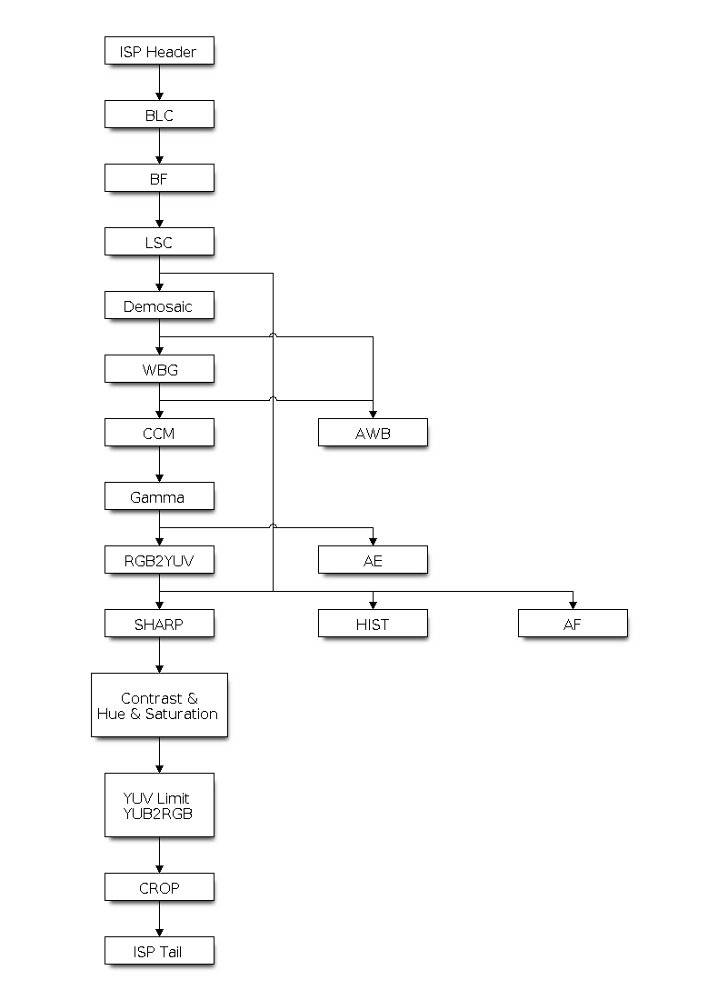

# A. ISP 操作流程

### BLC -> BF -> LSC -> Demosaic -> WBG -> AWB -> CCM -> Gamma -> AE -> SHARP -> Contrest&Hue&Saturation -> CRCP
### 調用函數
```C
esp_isp_new_processor() 
esp_isp_del_processor()  // 用於 ISP 核心處理器。
esp_isp_new_af_controller()
esp_isp_del_af_controller() //用於 ISP AF 控制器。
esp_isp_new_awb_controller()
esp_isp_del_awb_controller()  //用於 ISP AWB 控制器。
esp_isp_new_ae_controller()
esp_isp_del_ae_controller()  //用於 ISP AE 控制器。
esp_isp_new_hist_controller()
esp_isp_del_hist_controller()  //用於 ISP 長條圖控制器。
```

## 資源配置
### 安裝 ISP 驅動程式
ISP 驅動程式需要由 esp_isp_processor_cfg_t 指定配置。
指定 esp_isp_processor_cfg_t 中的配置後，可以調用 esp_isp_new_processor() 來分配和初始化 ISP 處理器。如果函數運行正常，將返回一個 ISP 處理器控制碼。請參考以下代碼：

```
esp-video-components-master\esp_video\src\device\esp_video_csi_device.c
```
```C
    esp_isp_processor_cfg_t isp_config = {
        .clk_src = ISP_CLK_SRC_DEFAULT,
        .input_data_source = ISP_INPUT_DATA_SOURCE_CSI, // Force input data source to CSI
        .has_line_start_packet = mipi_info->line_sync_en,
        .has_line_end_packet = mipi_info->line_sync_en,
        .h_res = width,
        .v_res = height,
        .yuv_range = csi_video->yuv_range,
        .yuv_std = csi_video->yuv_std,
        .input_data_color_type = in_out_format->isp_input_fmt,
        .output_data_color_type = in_out_format->isp_output_fmt,
        .bayer_order = csi_video->bayer_order,
#if ESP_VIDEO_ISP_DRIVER_HAS_BYPASS
        .flags = {
            .bypass_isp = in_out_format->isp_bypass_required
        }
```

- ## 1. BLC
ISP BLC 控制器
黑電平校正 (BLC) 旨在解決因相機感測器中光線折射不均而引起的問題。
- ## 2. BF
ISP BF 控制器
此流水線用於在拜耳模式下進行圖像輸入降噪。
- ## 3. LSC
ISP LSC 控制器
鏡頭陰影校正 (LSC) 旨在解決因相機鏡頭中光線折射不均而引起的問題。
- ## 4. Demosaic
ISP 去馬賽克控制器
此流水線用於執行圖像去馬賽克演算法，將 RAW 圖像轉換為 RGB 模式。
- ## 5. WBG
ISP White Balance Gain.
- ## 6. AWB

- ## 7. CCM
配置 CCM
色彩校正矩陣可以調整 RGB888 圖元格式的顏色比例，可用於通過演算法調整圖像顏色（例如，使用 AWB 計算結果進行白平衡），或者通過濾波演算法用作篩檢程式。
- ## 8. Gamma
啟用 gamma 校正
人眼的視覺系統對物理亮度的感知是非線性的。將 gamma 校正添加到 ISP 流水線中，可以將 RGB 座標轉換為座標與主觀亮度成正比的空間。
- ## 9. AE

- ## 10. SHARP
ISP 銳化控制器
此流水線用於在 YUV 模式下銳化輸入圖像。
- ## 11. Contrest&Hue&Saturation
ISP 色彩控制器
該流水線用於調整圖像的對比度、飽和度、色調和亮度。
對比度應為 0 ~ 1.0，預設值為 1.0
飽和度應為 0 ~ 1.0，預設值為 1.0
色調應為 0 ~ 360，預設值為 0
亮度應為 -127 ~ 128，預設值為 0

- ## 12. CRCP

----

# B. ISP IPA (Image Processing Algorithm) 參數
此說明 ESP ISP 影像處理演算法的所有可調參數。IPA 是一個管線化（pipeline）的影像處理框架，由多個演算法模組組成。下方依模組分類完整列出所有可調整的參數。
## 一、IPA 整體管線配置 ```esp_ipa_config_t```   
| 參數	| 說明 |
| ---- | ---- |
| names[] / nums | 演算法名稱陣列 | 
| enable_log | 演算法核心日誌開關 |
| version | 設定版本號 |
| ian | 影像分析設定（指向 esp_ipa_ian_config_t）|
| agc | 自動增益控制設定 |
| awb | 自動白平衡設定 |
| acc | 自動色彩校正設定 |
| adn | 自動降噪設定 |
| aen | 自動影像增強設定 |
| af | 自動對焦設定 |
| atc | 自動 AE 目標等級控制設定 |
| ext | 延伸設定（hue / brightness / stats_region）|
```C
    "version": 1,
```
## 二、IAN（Image Analyze，影像分析）
### 1. 色彩溫度分析 esp_ipa_ian_ct_config_t
| 參數 | 說明 |
| ---- | ---- |
| model | 分析模型類型（MODEL_0/1/2）|
| m_a0, m_a1, m_a2 | 來源資料模型參數 |
| f_n0 | 色溫濾波參數 |
| bp[] / bp_nums | 色溫基本參數表（a0/a1） |
| min_step | 色溫最小步進值 |
| g_a0, g_a1 | 色溫參數 |
| g_a2[] / g_a2_nums | 色溫參數 g_a2 查詢表 |
``` C  
"model": 0,
```
```C++
 "m_0":
    {
                    
    },
"m_1":
    {
        "a0": -1,
        "a1": 11
    },
"m_2":
    {
        "a0": -1,
        "a1": 11,
        "a2": 10
    },

```
``` C
    "f_n0": 1
```
``` C
 "bp":
    [
        {
            "a0": 10,
            "a1": 1
        },
        {
            "a0": 9,
            "a1": 2
        },
        {
            "a0": 8,
            "a1": 3
        },
        {
            "a0": 7,
            "a1": 4
        },
        ...
```
``` C
 "g":
    {
        "a0": -1,
        "a1": -1,
        "a2":
        [
        -1,
        1,
        -1,
        1
        ]
    },
```

### 2. 直方圖分析 esp_ipa_ian_luma_hist_config_t
| 參數 | 說明 |
| ---- | ---- |
| mean[] | 直方圖分段平均值表 |
| low_index_start/end | 低亮度區段起訖索引 |
| high_index_start/end | 高亮度區段起訖索引 |
| back_light_radio_threshold | 背光比例閾值 |
### 3. AE 區塊分析 esp_ipa_ian_luma_ae_config_t
- weight[ISP_AE_REGIONS]：AE 各區塊權重
### 4. 環境亮度分析 esp_ipa_ian_luma_env_config_t
- k：環境亮度係數
- speed_param[] / speed_param_size：速度參數陣列
- weight[]：環境亮度權重表
### 5. 整合設定 esp_ipa_ian_config_t
- enable_log：影像分析日誌
## 三、AGC（Auto Gain Control，自動增益控制）
### 基本時序與增益
|參數 | 說明 |
| ---- | ---- |
| exposure_frame_delay | 曝光生效延遲幀數 |
| gain_frame_delay | 增益生效延遲幀數 |
| exposure_adjust_delay | 曝光調整延遲時間（ms）|
| min_gain_step | 最小增益步進 |
| max_gain | 最大感測器增益（0 表示不額外限制）|
| inc_gain_ratio | 亮度增益上升比例 |
| dec_gain_ratio | 亮度增益下降比例 |
| gain_only | 僅調整增益，不動曝光 |
| fixed_exposure_time | 固定曝光時間（µs，僅在 gain_only=true）|
### 抗閃爍
| 參數 | 說明 |
| ---- | ---- |
|anti_flicker_mode	| FULL / PART / NONE |
| ac_freq | 交流電頻率（50/60Hz）|
### 亮度控制
| 參數 | 說明 |
| ---- | ---- |
| luma_low / luma_high | 低/高亮度 |
| luma_target | 目標亮度 |
| luma_low_threshold / luma_high_threshold | 低/高亮度閾值 |
| luma_low_regions / luma_high_regions | 低/高亮度區塊數 |
| luma_weight_table[ISP_AE_REGIONS] | 各區塊權重 |
| meter_mode | 測光模式（AVERAGE / HIGHLIGHT / LOWLIGHT / THRESHOLD） |
### 進階 PWL
| 參數 | 說明 |
| ---- | ---- |
| luma_pwl_enable | 環境亮度 PWL 動態目標位移開關 |
| luma_pwl[] / luma_pwl_size | 環境亮度→目標亮度位移表 |
| low_light_prior_config | 低光優先配置 |
| high_light_prior_config | 高光優先配置 |
| light_threshold_config | 亮度閾值表（含 use_env_luma、table、size） |
``` C
"agc":
        {
            "exposure":
            {
                "frame_delay": 2,
                "adjust_delay": 0
            },
            "gain":
            {
                "min_step": 0.0001,
                "frame_delay": 2
            },
            "anti_flicker":
            {
                "mode": "full",
                "ac_freq": 50
            },
            "f_n0": 1,
            "luma_adjust":
            {
                "target_low": 50,
                "target_high": 150,
                "target": 100,
                "low_threshold": 30,
                "low_regions": 10,
                "high_threshold": 220,
                "high_regions": 10,
                "weight":
                [
                    1, 1, 1, 1, 1,
                    1, 1, 1, 1, 1,
                    1, 1, 1, 1, 1,
                    1, 1, 1, 1, 1,
                    1, 1, 1, 1, 1
                ]
            },
            "mode": "high_light_priority",
            "high_light_priority":
            {
                "low_threshold": 120,
                "high_threshold": 180,
                "weight_offset": 5,
                "luma_offset": 5
            },
            "low_light_priority":
            {
                "low_threshold": 40,
                "high_threshold": 80,
                "weight_offset": 10,
                "luma_offset": 10
            },
            "light_threshold_priority":
            [
                {
                    "luma_threshold": 60,
                    "weight_offset": 5
                },
                {
                    "luma_threshold": 80,
                    "weight_offset": 10
                },
                {
                    "luma_threshold": 100,
                    "weight_offset": 15
                },
                {
                    "luma_threshold": 120,
                    "weight_offset": 20
                },
                {
                    "luma_threshold": 140,
                    "weight_offset": 25
                }
            ],
            "luma_pwl":
            {
                "enable": true,
                "table":
                [
                    {
                        "env_luma": 500,
                        "luma_shift": -15
                    },
                    {
                        "env_luma": 2000,
                        "luma_shift": 0
                    },
                    {
                        "env_luma": 5000,
                        "luma_shift": 0
                    },
                    {
                        "env_luma": 12000,
                        "luma_shift": -10
                    }
                ]
            }
        },
```
## 四、AWB（Auto White Balance，自動白平衡）
### 通用設定
| 參數 | 說明 |
| ---- | ---- |
| model	| MODEL_0（灰世界）/ MODEL_1（色溫索引）/ MODEL_2（區域分類） |
| min_red_gain_step / min_blue_gain_step | 紅/藍增益最小步進（過小不寫入硬體） |
| red_gain_scale / blue_gain_scale | 紅/藍增益縮放（1.0 = 不補償） |
| enable_log | 日誌開關 |
### Model_0（灰世界）
| 參數 | 說明 |
| ---- | ---- |
| min_counted | 觸發處理的最小白點數 |
| range | AWB 統計範圍（green_max/min、rg_max/min、bg_max/min） |
### Sub-window（與 Model 0 共用）
| 參數 | 說明 |
| ---- | ---- |
| enable_subwin | 啟用子窗口聚合（須 IPA_STATS_FLAGS_AWB_SUBWIN） |
| min_subwin_wp_counted | 每子窗口最小白點數 |
| min_subwin_participated | 至少參與的子窗口數 |
| subwin_weight[][] | 2D 子窗口權重（≤0 跳過，預設 1.0） |
| subwin_green_dark / subwin_green_mid / subwin_green_bright | 綠色亮度過濾（過暗/峰值/過亮） |
| green_luma_env / green_luma_init / green_luma_step_ratio | 綠色亮度環境變數與步進比 |
### Model_2（區域分類器）
| 參數 | 說明 |
| ---- | ---- |
| zones[] / zones_count | 色度邊界框區域表 |
| ref_points[] / ref_points_count | 校色溫參考點（含 rg/bg/radius） |
| new_w / prev_w | 時序 IIR 濾波新/舊幀權重 |
| export_ct | 將估算 CT 發佈到 KV "ct"（供 ACC 使用） |
### Model_2 時序穩定
| 參數 | 說明 |
| ---- | ---- |
| outlier_rg / outlier_bg | 逐格離群閘值（≤0 關閉） |
| zone_hysteresis_ratio	| 區域切換遲滯（1.0 平等，>1 黏滯） |
| zone_switch_count | 區域切換去抖幀數 |
| type_counter_max | 類型計數上限（達上限時清空其他） |
```C
        "awb":
        {
            "model": 0,
            "min_red_gain_step": 0.5,
            "min_blue_gain_step": 0.5,
            "min_counted": 1000,
            "range":
            {
                "green":
                {
                    "max": 200,
                    "min": 180
                },
                "rg":
                {
                    "max": 1.2,
                    "min": 0.8
                },
                "bg":
                {
                    "max": 1.2,
                    "min": 0.8
                }
            },
            "green_luma_env": "dummy_awb_luma",
            "green_luma_init": 200,
            "green_luma_step_ratio": 0.3,
            "enable_sub_win": true,
            "sub_win": {
                "min_counted": 100,
                "min_participated": 3,
                "weight": [
                    1.0, 1.0, 1.0, 1.0, 1.0,
                    1.0, 1.0, 1.0, 1.0, 1.0,
                    1.0, 1.0, 1.0, 1.0, 1.0,
                    1.0, 1.0, 1.0, 1.0, 1.0,
                    1.0, 1.0, 1.0, 1.0, 1.0
                ],
                "green": {
                    "dark": 40,
                    "mid": 100,
                    "bright": 200
                }
            },
            "new_w": 1.0,
            "prev_w": 0.0,
            "export_ct": false,
            "zone_switch_count": 1,
            "type_counter_max": 500,
            "outlier_rg": 0.0,
            "outlier_bg": 0.0,
            "zone_hysteresis_ratio": 0.0,
            "zones": [
                {
                    "type": "mct",
                    "rg": { "min": 0.45, "max": 0.70 },
                    "bg": { "min": 0.45, "max": 0.70 },
                    "enabled": true
                }
            ],
            "ref_points": [
                {
                    "ct": 5200,
                    "rg": 0.55,
                    "bg": 0.55,
                    "radius": 0.35
                }
            ]
        },
```
## 五、ACC（Auto Color Correct，自動色彩校正）
```C
        "acc":
```
### 飽和度
| 參數 | 說明 |
| ---- | ---- |
| sat_table[] / sat_table_size | 色溫→飽和度對照表 |
```C
 "saturation":
            [
                {
                    "color_temp": 1000,
                    "value": 1
                },
                {
                    "color_temp": 2000,
                    "value": 2
                },
                {
                    "color_temp": 3000,
                    "value": 3
                },
                {
                    "color_temp": 4000,
                    "value": 4
                },
                {
                    "color_temp": 5000,
                    "value": 5
                }
            ],
```
### CCM（Color Correction Matrix）
| 參數 | 說明 |
| ---- | ---- |
| model	 | MODEL_0 / MODEL_1 |
| luma_env | 亮度環境變數名 |
| luma_low_threshold / luma_low_ccm | 低亮度閾值與對應 CCM |
| ccm_table[] / ccm_table_size | 色溫→CCM 對照表 |
| gain_lut_enable | 增益型 CCM 強度 LUT 開關 |
| gain_lut[] / gain_lut_size | 增益→CCM 混合強度表 |
| min_ct_step | 最小色溫步進（MODEL_1） |
```C
 "ccm":
            {
                "low_luma":
                {
                    "luma_env": "dummy_gamma_luma",
                    "threshold": 15.5,
                    "matrix":
                    [
                        1.0, 0, 0,
                        0, 1.0, 0,
                        0, 0, 1.0
                    ]
                },
                "table":
                [
                    {
                        "color_temp": 1000,
                        "matrix":
                        [
                            1.1, 1.1, 1.1,
                            1.1, 1.1, 1.1,
                            1.1, 1.1, 1.1
                        ]
                    },
                    {
                        "color_temp": 2000,
                        "matrix":
                        [
                            1.2, 1.2, 1.2,
                            1.2, 1.2, 1.2,
                            1.2, 1.2, 1.2
                        ]
                    },
                    {
                        "color_temp": 3000,
                        "matrix":
                        [
                            1.3, 1.3, 1.3,
                            1.3, 1.3, 1.3,
                            1.3, 1.3, 1.3
                        ]
                    },
                    {
                        "color_temp": 4000,
                        "matrix":
                        [
                            1.4, 1.4, 1.4,
                            1.4, 1.4, 1.4,
                            1.4, 1.4, 1.4
                        ]
                    },
                    {
                        "color_temp": 5000,
                        "matrix":
                        [
                            1.5, 1.5, 1.5,
                            1.5, 1.5, 1.5,
                            1.5, 1.5, 1.5
                        ]
                    }
                ],
                "gain_lut":
                {
                    "enable": true,
                    "table":
                    [
                        { "gain": 1.0,  "strength": 1.0 },
                        { "gain": 8.0,  "strength": 0.5 },
                        { "gain": 16.0, "strength": 0.0 }
                    ]
                }
            },
```
### LSC（Lens Shadow Correction）
| 參數 | 說明 |
| ---- | ---- |
| lsc_table[] / lsc_table_size | 解析度+色溫→LSC 對照表 |
| lsc_disable_gain | 感測器增益≥此值時關閉 LSC（≤0 = 不關）|
```C
            "lsc":
            {
                "model": 0,
                "img_w": 1080,
                "img_h": 720,
                "lsc_tbl_size": 64,
                "table":
                [
                    {
                        "ct": 3000,
                        "calibrations_r_tbl":
                        [
                            1, 1, 1, 1, 1, 1, 1, 1, 1, 1, 1, 1, 1, 1, 1, 1, 1, 1, 1, 1, 1, 1, 1, 1, 1, 1, 1, 1, 1, 1, 1, 1,
                            1, 1, 1, 1, 1, 1, 1, 1, 1, 1, 1, 1, 1, 1, 1, 1, 1, 1, 1, 1, 1, 1, 1, 1, 1, 1, 1, 1, 1, 1, 1, 1,
                            1, 1, 1, 1, 1, 1, 1, 1, 1, 1, 1, 1, 1, 1, 1, 1, 1, 1, 1, 1, 1, 1, 1, 1, 1, 1, 1, 1, 1, 1, 1, 1,
                            1, 1, 1, 1, 1, 1, 1, 1, 1, 1, 1, 1, 1, 1, 1, 1, 1, 1, 1, 1, 1, 1, 1, 1, 1, 1, 1, 1, 1, 1, 1, 1
                        ],
                        "calibrations_gr_tbl":
                        [
                            1.5, 1.5, 1.5, 1.5, 1.5, 1.5, 1.5, 1.5, 1.5, 1.5, 1.5, 1.5, 1.5, 1.5, 1.5, 1.5, 1.5, 1.5, 1.5, 1.5, 1.5, 1.5, 1.5, 1.5, 1.5, 1.5, 1.5, 1.5, 1.5, 1.5, 1.5, 1.5,
                            1.5, 1.5, 1.5, 1.5, 1.5, 1.5, 1.5, 1.5, 1.5, 1.5, 1.5, 1.5, 1.5, 1.5, 1.5, 1.5, 1.5, 1.5, 1.5, 1.5, 1.5, 1.5, 1.5, 1.5, 1.5, 1.5, 1.5, 1.5, 1.5, 1.5, 1.5, 1.5,
                            1.5, 1.5, 1.5, 1.5, 1.5, 1.5, 1.5, 1.5, 1.5, 1.5, 1.5, 1.5, 1.5, 1.5, 1.5, 1.5, 1.5, 1.5, 1.5, 1.5, 1.5, 1.5, 1.5, 1.5, 1.5, 1.5, 1.5, 1.5, 1.5, 1.5, 1.5, 1.5,
                            1.5, 1.5, 1.5, 1.5, 1.5, 1.5, 1.5, 1.5, 1.5, 1.5, 1.5, 1.5, 1.5, 1.5, 1.5, 1.5, 1.5, 1.5, 1.5, 1.5, 1.5, 1.5, 1.5, 1.5, 1.5, 1.5, 1.5, 1.5, 1.5, 1.5, 1.5, 1.5
                        ],
                        "calibrations_gb_tbl":
                        [
                            2, 2, 2, 2, 2, 2, 2, 2, 2, 2, 2, 2, 2, 2, 2, 2, 2, 2, 2, 2, 2, 2, 2, 2, 2, 2, 2, 2, 2, 2, 2, 2,
                            2, 2, 2, 2, 2, 2, 2, 2, 2, 2, 2, 2, 2, 2, 2, 2, 2, 2, 2, 2, 2, 2, 2, 2, 2, 2, 2, 2, 2, 2, 2, 2,
                            2, 2, 2, 2, 2, 2, 2, 2, 2, 2, 2, 2, 2, 2, 2, 2, 2, 2, 2, 2, 2, 2, 2, 2, 2, 2, 2, 2, 2, 2, 2, 2,
                            2, 2, 2, 2, 2, 2, 2, 2, 2, 2, 2, 2, 2, 2, 2, 2, 2, 2, 2, 2, 2, 2, 2, 2, 2, 2, 2, 2, 2, 2, 2, 2
                        ],
                        "calibrations_b_tbl":
                        [
                            2.5, 2.5, 2.5, 2.5, 2.5, 2.5, 2.5, 2.5, 2.5, 2.5, 2.5, 2.5, 2.5, 2.5, 2.5, 2.5, 2.5, 2.5, 2.5, 2.5, 2.5, 2.5, 2.5, 2.5, 2.5, 2.5, 2.5, 2.5, 2.5, 2.5, 2.5, 2.5,
                            2.5, 2.5, 2.5, 2.5, 2.5, 2.5, 2.5, 2.5, 2.5, 2.5, 2.5, 2.5, 2.5, 2.5, 2.5, 2.5, 2.5, 2.5, 2.5, 2.5, 2.5, 2.5, 2.5, 2.5, 2.5, 2.5, 2.5, 2.5, 2.5, 2.5, 2.5, 2.5,
                            2.5, 2.5, 2.5, 2.5, 2.5, 2.5, 2.5, 2.5, 2.5, 2.5, 2.5, 2.5, 2.5, 2.5, 2.5, 2.5, 2.5, 2.5, 2.5, 2.5, 2.5, 2.5, 2.5, 2.5, 2.5, 2.5, 2.5, 2.5, 2.5, 2.5, 2.5, 2.5,
                            2.5, 2.5, 2.5, 2.5, 2.5, 2.5, 2.5, 2.5, 2.5, 2.5, 2.5, 2.5, 2.5, 2.5, 2.5, 2.5, 2.5, 2.5, 2.5, 2.5, 2.5, 2.5, 2.5, 2.5, 2.5, 2.5, 2.5, 2.5, 2.5, 2.5, 2.5, 2.5
                        ]
                    },
                    {
                        "ct": 5000,
                        "calibrations_r_tbl":
                        [
                            0.1, 0.1, 0.1, 0.1, 0.1, 0.1, 0.1, 0.1, 0.1, 0.1, 0.1, 0.1, 0.1, 0.1, 0.1, 0.1, 0.1, 0.1, 0.1, 0.1, 0.1, 0.1, 0.1, 0.1, 0.1, 0.1, 0.1, 0.1, 0.1, 0.1, 0.1, 0.1,
                            0.1, 0.1, 0.1, 0.1, 0.1, 0.1, 0.1, 0.1, 0.1, 0.1, 0.1, 0.1, 0.1, 0.1, 0.1, 0.1, 0.1, 0.1, 0.1, 0.1, 0.1, 0.1, 0.1, 0.1, 0.1, 0.1, 0.1, 0.1, 0.1, 0.1, 0.1, 0.1,
                            0.1, 0.1, 0.1, 0.1, 0.1, 0.1, 0.1, 0.1, 0.1, 0.1, 0.1, 0.1, 0.1, 0.1, 0.1, 0.1, 0.1, 0.1, 0.1, 0.1, 0.1, 0.1, 0.1, 0.1, 0.1, 0.1, 0.1, 0.1, 0.1, 0.1, 0.1, 0.1,
                            0.1, 0.1, 0.1, 0.1, 0.1, 0.1, 0.1, 0.1, 0.1, 0.1, 0.1, 0.1, 0.1, 0.1, 0.1, 0.1, 0.1, 0.1, 0.1, 0.1, 0.1, 0.1, 0.1, 0.1, 0.1, 0.1, 0.1, 0.1, 0.1, 0.1, 0.1, 0.1
                        ],
                        "calibrations_gr_tbl":
                        [
                            0.3, 0.3, 0.3, 0.3, 0.3, 0.3, 0.3, 0.3, 0.3, 0.3, 0.3, 0.3, 0.3, 0.3, 0.3, 0.3, 0.3, 0.3, 0.3, 0.3, 0.3, 0.3, 0.3, 0.3, 0.3, 0.3, 0.3, 0.3, 0.3, 0.3, 0.3, 0.3,
                            0.3, 0.3, 0.3, 0.3, 0.3, 0.3, 0.3, 0.3, 0.3, 0.3, 0.3, 0.3, 0.3, 0.3, 0.3, 0.3, 0.3, 0.3, 0.3, 0.3, 0.3, 0.3, 0.3, 0.3, 0.3, 0.3, 0.3, 0.3, 0.3, 0.3, 0.3, 0.3,
                            0.3, 0.3, 0.3, 0.3, 0.3, 0.3, 0.3, 0.3, 0.3, 0.3, 0.3, 0.3, 0.3, 0.3, 0.3, 0.3, 0.3, 0.3, 0.3, 0.3, 0.3, 0.3, 0.3, 0.3, 0.3, 0.3, 0.3, 0.3, 0.3, 0.3, 0.3, 0.3,
                            0.3, 0.3, 0.3, 0.3, 0.3, 0.3, 0.3, 0.3, 0.3, 0.3, 0.3, 0.3, 0.3, 0.3, 0.3, 0.3, 0.3, 0.3, 0.3, 0.3, 0.3, 0.3, 0.3, 0.3, 0.3, 0.3, 0.3, 0.3, 0.3, 0.3, 0.3, 0.3
                        ],
                        "calibrations_gb_tbl":
                        [
                            0.5, 0.5, 0.5, 0.5, 0.5, 0.5, 0.5, 0.5, 0.5, 0.5, 0.5, 0.5, 0.5, 0.5, 0.5, 0.5, 0.5, 0.5, 0.5, 0.5, 0.5, 0.5, 0.5, 0.5, 0.5, 0.5, 0.5, 0.5, 0.5, 0.5, 0.5, 0.5,
                            0.5, 0.5, 0.5, 0.5, 0.5, 0.5, 0.5, 0.5, 0.5, 0.5, 0.5, 0.5, 0.5, 0.5, 0.5, 0.5, 0.5, 0.5, 0.5, 0.5, 0.5, 0.5, 0.5, 0.5, 0.5, 0.5, 0.5, 0.5, 0.5, 0.5, 0.5, 0.5,
                            0.5, 0.5, 0.5, 0.5, 0.5, 0.5, 0.5, 0.5, 0.5, 0.5, 0.5, 0.5, 0.5, 0.5, 0.5, 0.5, 0.5, 0.5, 0.5, 0.5, 0.5, 0.5, 0.5, 0.5, 0.5, 0.5, 0.5, 0.5, 0.5, 0.5, 0.5, 0.5,
                            0.5, 0.5, 0.5, 0.5, 0.5, 0.5, 0.5, 0.5, 0.5, 0.5, 0.5, 0.5, 0.5, 0.5, 0.5, 0.5, 0.5, 0.5, 0.5, 0.5, 0.5, 0.5, 0.5, 0.5, 0.5, 0.5, 0.5, 0.5, 0.5, 0.5, 0.5, 0.5
                        ],
                        "calibrations_b_tbl":
                        [
                            0.8, 0.8, 0.8, 0.8, 0.8, 0.8, 0.8, 0.8, 0.8, 0.8, 0.8, 0.8, 0.8, 0.8, 0.8, 0.8, 0.8, 0.8, 0.8, 0.8, 0.8, 0.8, 0.8, 0.8, 0.8, 0.8, 0.8, 0.8, 0.8, 0.8, 0.8, 0.8,
                            0.8, 0.8, 0.8, 0.8, 0.8, 0.8, 0.8, 0.8, 0.8, 0.8, 0.8, 0.8, 0.8, 0.8, 0.8, 0.8, 0.8, 0.8, 0.8, 0.8, 0.8, 0.8, 0.8, 0.8, 0.8, 0.8, 0.8, 0.8, 0.8, 0.8, 0.8, 0.8,
                            0.8, 0.8, 0.8, 0.8, 0.8, 0.8, 0.8, 0.8, 0.8, 0.8, 0.8, 0.8, 0.8, 0.8, 0.8, 0.8, 0.8, 0.8, 0.8, 0.8, 0.8, 0.8, 0.8, 0.8, 0.8, 0.8, 0.8, 0.8, 0.8, 0.8, 0.8, 0.8,
                            0.8, 0.8, 0.8, 0.8, 0.8, 0.8, 0.8, 0.8, 0.8, 0.8, 0.8, 0.8, 0.8, 0.8, 0.8, 0.8, 0.8, 0.8, 0.8, 0.8, 0.8, 0.8, 0.8, 0.8, 0.8, 0.8, 0.8, 0.8, 0.8, 0.8, 0.8, 0.8
                        ]
                    }
                ]
            },
```
### BLC（Black Level Correction）
| 參數 | 說明 |
| ---- | ---- |
| blc->model | BLC 模型 |
| blc->blc_table[] / blc->blc_table_size | 增益→BLC 參數對照表 |
``` C
           "blc":
            {
                "model": 0,
                "stretch": true,
                "blc_table":
                [
                    {
                        "gain": 1,
                        "blc_param": {
                            "blc_top_left": 16,
                            "blc_top_right": 16,
                            "blc_bottom_left": 16,
                            "blc_bottom_right": 16
                        }
                    },
                    {
                        "gain": 17,
                        "blc_param": {
                            "blc_top_left": 32,
                            "blc_top_right": 32,
                            "blc_bottom_left": 32,
                            "blc_bottom_right": 32
                        }
                    },
                    {
                        "gain": 33,
                        "blc_param": {
                            "blc_top_left": 48,
                            "blc_top_right": 48,
                            "blc_bottom_left": 48,
                            "blc_bottom_right": 48
                        }
                    },
                    {
                        "gain": 49,
                        "blc_param": {
                            "blc_top_left": 64,
                            "blc_top_right": 64,
                            "blc_bottom_left": 64,
                            "blc_bottom_right": 64
                        }
                    }
                ]
            }   
        },
```
### 通用
- enable_log：ACC 日誌開關
## 六、ADN（Auto Denoising，自動降噪）
| 參數 | 說明 |
| ---- | ---- |
| bf_table[] / bf_table_size | 增益→Bayer 濾波器（BF）參數對照表 |
| dm_table[] / dm_table_size | 增益→去馬賽克（Demosaic）參數對照表 |
| enable_log | 日誌開關 |
```C
       "adn": {
            "bf":
            [
                {
                    "gain": 1,
                    "param": {
                        "level": 1,
                        "matrix":
                        [
                            1, 1, 1,
                            1, 1, 1,
                            1, 1, 1
                        ]
                    }
                },
                {
                    "gain": 2,
                    "param": {
                        "level": 2,
                        "matrix":
                        [
                            2, 2, 2,
                            2, 2, 2,
                            2, 2, 2
                        ]
                    }
                },
                {
                    "gain": 3,
                    "param": {
                        "level": 3,
                        "matrix":
                        [
                            3, 3, 3,
                            3, 3, 3,
                            3, 3, 3
                        ]
                    }
                },
                {
                    "gain": 4,
                    "param": {
                        "level": 4,
                        "matrix":
                        [
                            4, 4, 4,
                            4, 4, 4,
                            4, 4, 4
                        ]
                    }
                },
                {
                    "gain": 5,
                    "param": {
                        "level": 5,
                        "matrix":
                        [
                            5, 5, 5,
                            5, 5, 5,
                            5, 5, 5
                        ]
                    }
                },
                {
                    "gain": 128,
                    "param": {
                        "level": 5,
                        "sigma": 1
                    }
                },
                {
                    "gain": 144,
                    "param": {
                        "level": 5,
                        "sigma": 2
                    }
                }
            ],
            "demosaic":
            [
                {
                    "gain": 1,
                    "gradient_ratio": 1
                },
                {
                    "gain": 2,
                    "gradient_ratio": 2
                },
                {
                    "gain": 3,
                    "gradient_ratio": 3
                },
                {
                    "gain": 4,
                    "gradient_ratio": 4
                },
                {
                    "gain": 5,
                    "gradient_ratio": 5
                }
            ]
        },
```
## 七、AEN（Auto Enhancement，自動影像增強）
```C
        "aen":
```
### GAMMA
| 參數 | 說明 |
| ---- | ---- |
| gamma->model | MODEL_0 / MODEL_1 |
| gamma->luma_env | 亮度環境變數名 |
| gamma->luma_min_step | 最小亮度步進 |
| gamma->gamma_table[] / gamma_table_size | 亮度→GAMMA 對照表 |
| gamma->backlight | 背光增強設定（含 low/high_hist_ratio_threshold、env_luma_threshold、low/high_index_*、luma_env、detect_count_threshold/margin、hist_ratio_filter、model、luma_min_step、gamma_table/size） |
```C
  "gamma":
            {
                "model": 1,
                "use_gamma_param": false,
                "luma_env": "dummy_gamma_luma",
                "luma_min_step": 3.0,
                "table":
                [
                    {
                        "luma": 10.1,
                        "gamma_param": 1.0,
                        "y": 
                        [
                            0, 16, 32, 48, 64, 80, 96, 112, 128, 144, 160, 176, 192, 208, 224, 255
                        ]
                    },
                    {
                        "luma": 20.1,
                        "gamma_param": 1.3,
                        "y":
                        [
                            16, 32, 48, 56, 64, 80, 96, 112, 128, 144, 160, 176, 192, 224, 240, 255
                        ]
                    },
                    {
                        "luma": 30.1,
                        "gamma_param": 1.6,
                        "y":
                        [
                            32, 48, 56, 64, 72, 80, 96, 112, 128, 144, 160, 176, 192, 240, 248, 255
                        ]
                    }
                ],
```
```C
 "backlight":
                {
                    "low_hist_ratio_threshold": 0.2,
                    "high_hist_ratio_threshold": 0.15,
                    "env_luma_threshold": 5.0,
                    "low_index":
                    {
                        "start": 0,
                        "end": 4
                    },
                    "high_index":
                    {
                        "start": 14,
                        "end": 15
                    },
                    "luma_env": "dummy_backlight_env_luma",
                    "detect_count_threshold": 2,
                    "hist_ratio_filter": 1.0,
                    "model": 0,
                    "luma_min_step": 0.05,
                    "use_gamma_param": false,
                    "table":
                    [
                        {
                            "luma": 0.35,
                            "gamma_param": 1.0,
                            "y":
                            [
                                50, 60, 70, 80, 90, 100, 110, 120, 130, 140, 150, 160, 170, 180, 190, 255
                            ]
                        },
                        {
                            "luma": 0.70,
                            "gamma_param": 1.0,
                            "y":
                            [
                                70, 80, 90, 100, 110, 120, 130, 140, 150, 160, 170, 180, 190, 200, 210, 255
                            ]
                        }
                    ]
                }
            },
```
### Sharpen（銳化）
| 參數 | 說明 |
| ---- | ---- |
| sharpen_table[] / sharpen_table_size | 增益→銳化參數對照表 |
```C
 "sharpen":
            [
                {
                    "gain": 1,
                    "param": {
                        "h_thresh": 1,
                        "l_thresh": 1,
                        "h_coeff": 1,
                        "m_coeff": 1,
                        "matrix":
                        [
                            1, 1, 1,
                            1, 1, 1,
                            1, 1, 1
                        ]
                    }
                },
                {
                    "gain": 2,
                    "param": {
                        "h_thresh": 2,
                        "l_thresh": 2,
                        "h_coeff": 2,
                        "m_coeff": 2,
                        "matrix":
                        [
                            2, 2, 2,
                            2, 2, 2,
                            2, 2, 2
                        ]
                    }
                },
                {
                    "gain": 3,
                    "param": {
                        "h_thresh": 3,
                        "l_thresh": 3,
                        "h_coeff": 3,
                        "m_coeff": 3,
                        "matrix":
                        [
                            3, 3, 3,
                            3, 3, 3,
                            3, 3, 3
                        ]
                    }
                },
                {
                    "gain": 4,
                    "param": {
                        "h_thresh": 4,
                        "l_thresh": 4,
                        "h_coeff": 4,
                        "m_coeff": 4,
                        "matrix":
                        [
                            4, 4, 4,
                            4, 4, 4,
                            4, 4, 4
                        ]
                    }
                },
                {
                    "gain": 5,
                    "param": {
                        "h_thresh": 5,
                        "l_thresh": 5,
                        "h_coeff": 5,
                        "m_coeff": 5,
                        "matrix":
                        [
                            5, 5, 5,
                            5, 5, 5,
                            5, 5, 5
                        ]
                    }
                }
            ],
```
### Contrast（對比）
| 參數 | 說明 |
| ---- | ---- |
| con_table[] / con_table_size | 增益→對比對照表 |
```C
 "contrast":
            [
                {
                    "gain": 1,
                    "value": 1
                },
                {
                    "gain": 2,
                    "value": 2
                },
                {
                    "gain": 3,
                    "value": 3
                },
                {
                    "gain": 4,
                    "value": 4
                },
                {
                    "gain": 5,
                    "value": 5
                }
            ]
        },
```
### 通用
- enable_log：AEN 日誌開關
## 八、AF（Auto Focus，自動對焦）
```C
"af":
```
| 參數 | 說明 |
| ---- | ---- |
| model	| AF 模型類型 |
| windows[ISP_AF_WINDOW_NUM] | 採樣視窗座標 |
| weight_table[] | 各視窗權重 |
| edge_thresh | 邊緣閾值（高於此值才算有效像素） |
| max_pos / min_pos | 焦距位置上下限 |
| l1_scan_points_num / l2_scan_points_num | 第一/二階掃描點數 |
| definition_high_threshold_ratio | 清晰度上升重啟閾值 |
| definition_low_threshold_ratio | 清晰度下降重啟閾值 |
| luminance_high_threshold_ratio | 亮度上升重啟閾值 |
| luminance_low_threshold_ratio	| 亮度下降重啟閾值 |
| max_change_time | 清晰度最大變化時間（µs） |
| enable_log | 日誌開關 |
```C
{
            "windows":
            [
                {
                    "left": 50,
                    "top": 100,
                    "width": 100,
                    "height": 100,
                    "weight": 1
                },
                {
                    "left": 150,
                    "top": 200,
                    "width": 100,
                    "height": 100,
                    "weight": 10
                },
                {
                    "left": 250,
                    "top": 300,
                    "width": 100,
                    "height": 100,
                    "weight": 100
                }
            ],
            "edge_thresh": 11,
            "definition_high_threshold_ratio": 1.6,
            "definition_low_threshold_ratio": 0.6,
            "luminance_high_threshold_ratio": 1.6,
            "luminance_low_threshold_ratio": 0.6,
            "l1_scan_points_num": 11,
            "l2_scan_points_num": 12,
            "max_pos": 500,
            "max_change_time": 500
        },
        "customized_ipa_1":
        {
            "name": "esp_ipa_customized_1"
        }
```
## 九、ATC（Auto AE Target Level Control）
| 參數 | 說明 |
| ---- | ---- |
| model	| ATC 模型 |
| init_value | AE 目標等級初始值 |
| delay_frames | AE 目標等級延遲幀數 |
| luma_env | AE 目標等級亮度環境變數名 |
| min_ae_value_step	| 最小 AE 步進 |
| luma_lut[] / luma_lut_size | 亮度→AE 值查詢表 |
| enable_log | 日誌開關 |
## 十、延伸設定 esp_ipa_ext_config_t
```C
  "ext":
```
| 參數 | 說明 |
| ---- | ---- |
| hue | 色調 |
| brightness | 亮度 |
| stats_region | ISP 統計區域（左/上/寬/高）|
```C
 {
            "hue": 1,
            "brightness": 2,
            "stats_region":
            {
                "left": 3,
                "top": 4,
                "width": 5,
                "height": 6
            }
        },
```
## 十一、ISP 統計與元資料旗標
### 統計旗標 ```IPA_STATS_FLAGS_*```
AWB、AE、Histogram、Sharpen、AF、AWB_SUBWIN（六種統計資訊的有效性）
### 元資料旗標 ```IPA_METADATA_FLAGS_*```
共 20 項，控制 metadata 哪些欄位需要被更新：
AWB、RG、BG、ET（曝光）、GN（像素增益）、BF（bayer filter）、SH（sharpen）、GAMMA、CCM、BR（brightness）、CN（contrast）、ST（saturation）、HUE、DM（demosaic）、LSC、AETL（AE 目標）、SR（統計區域）、AF、FP（焦距）、BLC。
### Gamma 更新旗標
IPA_GAMMA_FLAGS_RED/GREEN/BLUE — 控制哪個色通道需更新。
## 十二、可調演算法模型清單（列舉型別）
| 模組 | 模型列舉 |
| ---- | ---- |
| AGC 測光 | ESP_IPA_AGC_METER_AVERAGE / HIGHLIGHT_PRIOR / LOWLIGHT_PRIOR / LIGHT_THRESHOLD |
| AGC 抗閃爍 | FULL / PART / NONE |
| AWB | MODEL_0（灰世界）/ MODEL_1（色溫索引）/ MODEL_2（區域分類） |
| AWB Zone | UHCT、HCT、MCT、LCT、ULCT、GREEN、SKIN  |
| IAN 色溫 | MODEL_0 / 1 / 2 |
| ACC CCM | MODEL_0 / 1 |
| ACC BLC | MODEL_0 |
| AEN GAMMA	| MODEL_0 / 1 |
| AF | MODEL_0 |
| ATC | MODEL_0 |
## 總結
整份檔案將 IPA 拆解為 9 大演算法模組（IAN、AGC、AWB、ACC、ADN、AEN、AF、ATC、EXT），共提供 超過 150 個可調參數，涵蓋：
1. 感測器控制（曝光、增益、焦距、AE 目標）
2. 影像統計分析（色溫、亮度、直方圖、背光）
3. ISP 處理鏈（BLC → BF → Demosaic → LSC → Sharpen → Gamma → CCM → 色彩屬性）
4. 演算法策略（測光、抗閃爍、AWB 模式、AF 模式、時序穩定、區域分類）
5. 校對資料表（CCM、LSC、BLC、BF、DM、Sharpen、Contrast、SAT、Gamma、CT 參考點）
每一個模組都允許透過「查表（LUT/PWL）+ 環境變數（env）」的方式動態調整，並透過 enable_log 進行除錯，是一套相當完整且彈性的 ISP 管線調校框架。  
