# Imatest 操作與說明
### Imatest 與 Image Engineering 等專業廠商，針對手機、汽車、醫療及安全監控等多元產業，研發出各類測試圖卡、照明設備以及自動化測量軟體。文件詳細列出了如解析度、色彩準確度、動態範圍及畸變等關鍵性能指標的評估方法。此外，這些資源亦強調了對 ISO 和 IEEE 等國際影像標準的遵循，並提供從實驗室環境架設到軟體授權管理的完整支援。整體而言，這些素材建構了優化數位相機系統與感測器效能的技術資源庫。

## Imatest 核心測試指標，用於評估成像系統的表現。
### 1. Sharpness (銳利度)： 衡量影像細節表現能力。
### 2. Noise (雜訊)： 評估感光元件在不同環境下的訊噪比。
### 3. Dynamic Range (動態範圍)： 衡量相機同時捕捉極亮與極暗區域的能力。
### 4. Color (色彩)： 評估色彩還原度與色彩準確性。
### 5. Distortion (畸變)： 測量鏡頭引起的光學幾何失真。
### 6. Uniformity (均勻性)： 檢查畫面中心到邊緣的亮度與色彩一致性。

--------------------------------------------------------------------------------
### 1. 測試項目說明 - 銳利度 (Sharpness)
評估影像呈現細節的能力，是影像品質最重要的指標之一。
- 測試方式： 斜邊法 (Slanted-edge)、星狀圖 (Siemens Star)。
- 測試圖卡： SFRplus、eSFR ISO (符合 ISO 12233)、SFRreg (廣角用)、Checkerboard。
- 測試步驟：
    1. 將圖卡置於均勻光源下。
    2. 對焦並拍攝，確保斜邊未產生嚴重裁剪 (Clipping)。
    3. 利用 Imatest 自動偵測 ROI (感興趣區域)。
測試數據： MTF50、MTF50P、Acutance (感知銳利度)
。

--------------------------------------------------------------------------------
### 2. 測試項目說明 - 色彩與雜訊 (Color & Noise)
評估相機還原真實色彩的能力以及感光元件產生的隨機雜訊。
- 測試方式： 比較拍攝值與圖卡標準顏色參考值之差異。
- 測試圖卡： 24-patch ColorChecker、Color/Tone 測試圖卡。
- 測試步驟：
    1. 在標準色溫（如 D65）下拍攝。
    2. 使用 Color/Tone Interactive 或 Auto 模組進行分析。
    3. 測試數據： ΔE (色彩誤差)、SNR (訊噪比)、Temporal Noise (時間雜訊)。

--------------------------------------------------------------------------------
### 3. 測試項目說明 - 動態範圍 (Dynamic Range)
衡量相機捕捉影像中極亮與極暗區域細節的能力。
- 測試方式： 拍攝高對比階調圖卡，分析亮度與雜訊關係。
- 測試圖卡： 36-patch Dynamic Range Chart (透射式膠片圖卡配合燈箱)。
- 測試步驟：
    1. 在極低環境光下（避免干擾）拍攝透射式圖卡。
    2. 確保曝光涵蓋圖卡的所有階調。
    3. 測試數據： Dynamic Range (單位為 dB 或 f-stops)、Gamma (階調響應曲線)。
- 測試數據： Dynamic Range (單位為 dB 或 f-stops)、Gamma (階調響應曲線)。
--------------------------------------------------------------------------------
### 4. 測試項目說明 - 畸變與均勻性 (Distortion & Uniformity)  
評估鏡頭引起的光學變形與畫面邊緣的亮度/色彩一致性。
- 測試方式： 幾何分析 (Geometric Calibration) 與平場分析 (Flat Field)。
- 測試圖卡： Checkerboard (畸變)、Dot Pattern、均勻白牆/燈箱 (均勻性)。
- 測試步驟：
    1. 拍攝棋盤格圖卡以分析幾何失真。
    2. 拍攝均勻白色平面（不對焦）以分析鏡頭陰影 (Lens Shading)。
- 測試數據： TV Distortion、SMIA Distortion、Uniformity (Luminance/Color Shading)。
--------------------------------------------------------------------------------
### 5. 測試項目說明 - 紋理細節與雜散光 (Texture & Stray Light)
針對進階影像處理（如降噪）對細節的影響及光線干擾進行測試。
- 測試項目：
    1. Texture Detail： 使用 Spilled Coins (落幣圖) 評估細節損失。
    2. Stray Light (Flare)： 評估非成像光線（如鬼影、耀光）的影響。
- 測試數據： Texture MTF、Normalized Stray Light。
--------------------------------------------------------------------------------
### Solutions | 不同行業解決方案 (Industries)
依據不同應用領域提供對應的測試方案：
Automotive (車載)： 專注於 IEEE 2020 標準，測試高動態範圍與影像閃爍 (Flicker)。
Security (安防)： 著重於低照度表現與遠距離偵測能力。
Medical (醫療)： 應用於內視鏡 (ISO 8600) 與顯微鏡影像品質檢驗。
Mobile (行動裝置)： 符合 CPIQ (IEEE 1858) 標準，評估手機鏡頭全方位表現。
Drone / UAV (無人機)： 測試廣角畸變與防手震 (Image Stabilization) 效能。

--------------------------------------------------------------------------------
### Solutions | 應用場景與元件解決方案 (Applications & Components)
針對特殊硬體需求提供優化測試：
超廣角測試 (Ultra-wide)： 使用預畸變圖卡與弧形架構進行校準。
紅外線 (Infrared)： 針對熱像儀與 IR 鏡頭的專用測試圖卡。
自動對焦 (Autofocus)： 測試不同距離下的對焦速度與準確度。
影像穩定 (Image Stabilization)： 配合震動台測試 OIS/EIS 效能。

--------------------------------------------------------------------------------
### 國際標準合規性 (Standards Compliance)  
列出系統需符合的相關 ISO 標準：  
ISO 12233： 解析度與 SFR 測試。  
ISO 15739： 雜訊測量。  
ISO 18844： 耀光 (Flare/Stray Light) 測量。  
ISO 17850： 幾何畸變測試。  
EMVA 1288： 機器視覺感測器測試標準。
--------------------------------------------------------------------------------

## 測試圖卡分類 (Test Charts)
根據不同的影像品質因子，Imatest 提供多種標準化圖卡：
**銳利度圖卡 (Sharpness)**： 包含斜邊 (Slanted-edge)、星狀圖 (Siemens Star)、與楔型圖 (Wedge)。  
**色彩與色調 (Color & Tone)**： 如 ColorChecker，用於評估色彩準確度與色調響應。  
**動態範圍 (Dynamic Range)**： 專門的高動態範圍圖卡，可量測感測器的最大密度 (Dmax) 與雜訊水平。  
**幾何與畸變 (Geometric & Distortion)**： 如 Checkerboard (棋盤格) 與 Dot Pattern (點陣圖)。  
**紋理細節 (Texture Detail)**： 如 Spilled Coins (落幣圖)，用於分析因降噪而損失的細節。 

### Solutions | 測試項目規劃表 (Test Plan Table)
測試項目 | 測試工具 (圖卡/軟體) | 測試環境 | 測試光源 | 測試合格標準 (參考) | 測試結果 (數據指標)
| ---- | ---- | ---- | ---- | ---- | ---- |
銳利度 (Sharpness) | eSFR ISO / SFRplus | 實驗室導軌系統 | iQ-Flatlight (D65/TL84) | ISO 12233 規範 | MTF50, MTF50P
動態範圍 (DR) | 36-patch DR Chart | 高對比屏蔽暗室 | LG3 (超高亮度) | IEEE 2020 / 120dB | Dynamic Range (dB)
色彩準確度 (Color) | ColorChecker 24 | 標準光源觀測室 | iQ-LED (全光譜) | ΔE (Color Error) < 5 | ΔE (CIE Lab*)
幾何畸變 (Distortion) | Checkerboard / Dot | 平行對齊測試架 | 均勻反射光源 | TV Distortion < 1% | SMIA / TV 
雜訊分析 (Noise) | eSFR ISO / Stepchart | 低照度暗室 | 可調亮度燈箱 (LE7) | ISO 15739 規範 | SNR (dB), Visual Noise
均勻性 (Uniformity) | Flat Field (均光板) | 積分球/平場系統 | LE7 積分球光源 | Shading < 10% | Luminance Shading
紋理細節 (Texture) | Spilled Coins (落幣圖) | 標準解析度環境 | 均勻擴散光源 | ISO 19567 規範 | Texture MTF

### 表格內容詳細說明 (一) - 項目與工具
- 測試項目： 涵蓋影像系統的所有關鍵績效指標 (KPIs)，如解析度、雜訊、動態範圍等。
- 測試工具：
    - 圖卡： 依據需求選擇自動偵測圖卡（如 eSFR ISO 符合 ISO 標準，SFRreg 適合廣角）。
    - 軟體： 使用 Imatest Master 進行分析，或 Imatest IT 進行自動化產線測試。

### 表格內容詳細說明 (二) - 環境與光源
- 測試環境： 需確保相機與圖卡完全平行，並使用消光處理的實驗室環境，避免雜散光 (Flare) 影響數據。
- 測試光源：
     - 反射式： 使用 iQ-Flatlight 提供高品質均勻照明（均勻度 >90%）。
    - 透射式： 使用 LG3 或 LE7 積分球，特別適用於高動態範圍與低照度測試。
    - 多光譜： iQ-LED 技術可模擬 D65、A、TL84 等多種標準色溫。

### 表格內容詳細說明 (三) - 標準與結果
- 測試合格標準：
    - 國際標準： 參考 ISO 12233 (解析度)、ISO 15739 (雜訊)、IEC 62676-5 (安防) 等。
    - Pass/Fail Monitor： Imatest 內建 Pass/Fail 監控功能，可設定特定門檻值進行自動判斷。
- 測試結果： 輸出 CSV、JSON 或 XML 格式的量化數據，方便進行長期品質追蹤與數據庫管理。

## **Solutions | 銳利度測試圖卡對比**
針對不同的測試需求，Imatest 提供四種主要自動偵測的斜邊圖卡方案：
特色 / 圖卡 | SFRplus | eSFR | ISO SFRreg | Checkerboard(棋盤格)
| ---- | ---- | ---- | ---- | ---- |
標準合規性 | 穩健且多功能 | 符合 ISO 12233 | 適用於多圖卡排列 | 幾何精確度高
地圖細節度 | 高 (High) | 中等 | 視排列而定 | 高 (High)
主要優勢 | 空間與畸變細節較多 | 支援詳細雜訊分析 | 適合超廣角/魚眼 | 對構圖不敏感
推薦用途 | 一般鏡頭性能評估 | 國際標準一致性測試 | 遠距離或不同焦深測試 | 透過焦距量測與高精度畸變


### SFRplus：Imatest 的經典自動對齊圖卡，提供較 eSFR ISO 更細緻的空間細節與畸變數據。
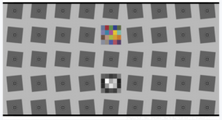
### eSFR ISO：完全符合 ISO 12233 標準，並包含楔型圖（Wedge）分析與詳細的雜訊量測。
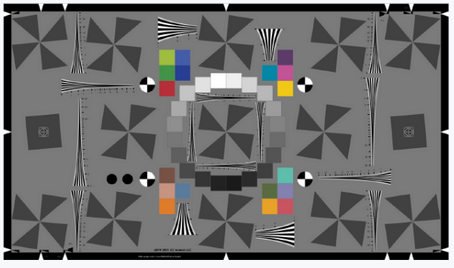
### SFRreg：使用註冊標記（Registration marks），非常適合測試超廣角魚眼鏡頭或需要在不同距離擺放多個標靶的場景。
### Checkerboard：對構圖（Framing）不敏感，特別適合用於測試**自動對焦系統（Through-focus）**與獲取極高精度的畸變數據。


## **Solutions | 動態範圍測試圖卡對比表 (Comparison Table)**
圖卡型號 | 階調數量 | 遵循標準 | 最大對比度 (dB) | 主要應用
| ---- | ---- | ---- | ---- | ---- |
TE269C (36-patch) | 36 階 | ISO 14524 / 15739 | 120 dB (1,000,000:1) | 高動態範圍 (HDR) / 車載 / 安防
TE264 (20-patch) | 20 階 | ISO 14524 / 15739 | 約 60-80 dB | 標準 OECF / 階調響應量測
TE240 (ISO 21550) | 24 階 | ISO 21550 | 4.0 / 6.0 (光學密度) | 掃描器 (Scanner) 動態範圍評估
TE259 (20-patch) | 20 階 | 一般 OECF | 80 dB (10,000:1) | 雜訊與特性曲線評估
Contrast Resolution | 多組低對比標靶 | Imatest 專利 | 視底色而定 | 寬動態範圍下的低對比特徵辨識

### 高性能 HDR 解決方案：TE269C / 36-patch DR
針對需要評估極端亮暗細節的成像系統。
")
- 核心特性： 具備 36 個圓形或方形排列的灰色區塊，密度範圍從 0.03 到 6.0。
- 性能優勢： 支援高達 120 dB 的動態範圍測試，是目前車載 ADAS (IEEE P2020) 與安防 (IEC 62676-5) 的標準推薦圖卡。
- 硬體要求： 必須搭配 LG3 等超高亮度透射式燈箱 (>150,000 lx)，以確保最暗的階塊仍有足夠信號穿透。
- 軟體支援： 使用 Imatest Color/Tone 模組或 iQ-Analyzer OECF 模組進行自動分析。

### 標準 OECF 與掃描器方案：TE264 / TE240
用於常規相機評估與工業掃描設備。
- TE264 (ISO 14524)：
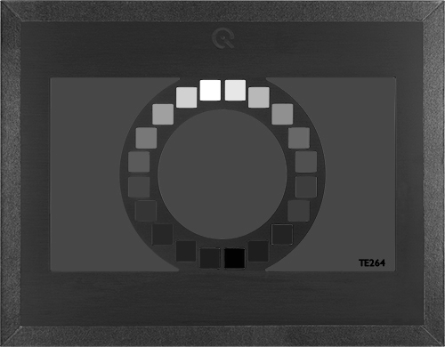
    - 遵循最基礎的數碼相機 OECF 量測標準。
    - 適用於量測 Gamma 響應與基本訊噪比 (SNR)。
- TE240 (ISO 21550)：
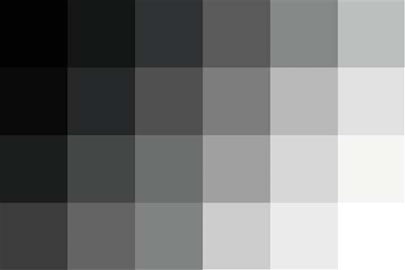
    - 專為掃描儀設計，提供 35mm 膠片尺寸或反射式材質。
    - 支援 4.0 或更高密度範圍，確保掃描設備能擷取深處陰影細節。

### 特殊應用：對比度解析度圖卡 (Contrast Resolution Chart)
評估在寬動態場景中，「看見低對比物體」的能力。
- 測試原理： 在不同亮度的背景上嵌入微小的低對比斜邊或標靶。
- 解決痛點： 傳統 DR 圖卡僅能測量系統是否「有信號」，而本圖卡能測量系統在強光或極暗處是否仍具備「空間辨識力」。
- 典型場景： 醫療內視鏡或軍事偵察影像，需在複雜光照下辨識細微組織或目標。

### 測試環境與光源配置規範
正確的圖卡必須配合正確的環境，數據才具備公信力。
- 透射式測試 (Transmissive)： 絕大多數 DR 測試需使用透射膠片圖卡配合燈箱。
    - LG3 / LG4： 提供高均勻性光源，LG3 具備 Flicker 模擬功能，適合 HDR 測試。  
    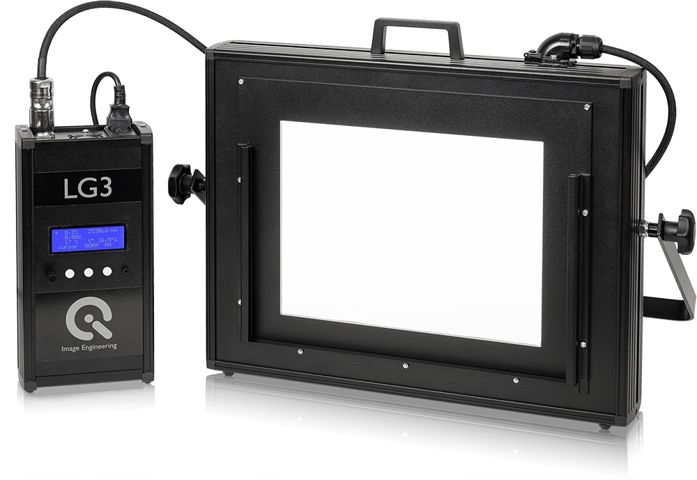
    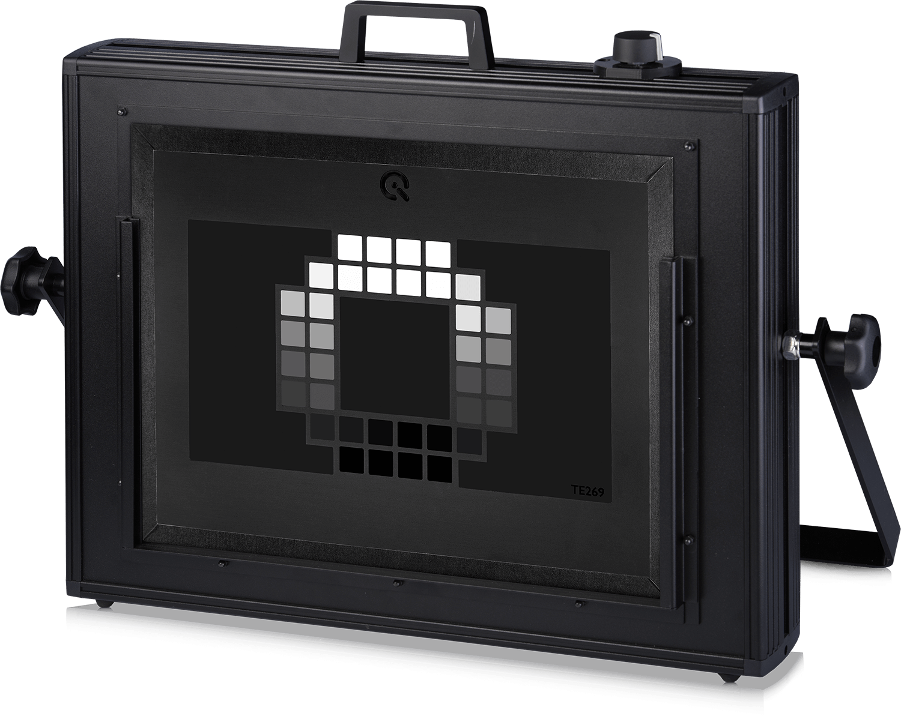
    - LE7 積分球： 提供最高等級的均勻度 (>97%)，避免光源不均誤判為動態範圍不足。  
    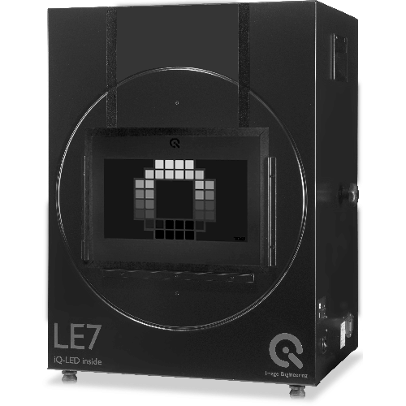
- 暗室要求： 必須在完全消光的實驗室執行，任何環境雜散光 (Flare) 都會顯著降低測得的動態範圍數值。

```
若測試車載或 HDR 相機： 唯一推薦 TE269C (36-patch) 配合 LG3 燈箱。
若測試一般消費級產品： 使用 TE264 或 TE42 綜合圖卡（內含 DR 模組）即可滿足基礎需求。
數據分析： 建議載入 Raw 檔案進行分析，以排除 ISP 降噪演算法對動態範圍數據的過度修飾。
```

## **Solutions | 色彩測試圖卡核心對比表 (Comparison Table)**
色彩準確度衡量成像系統還原真實顏色的能力，其量測核心在於比較相機輸出值與圖卡標準參考值之間的誤差 (ΔE)。
圖卡型號 / 名稱 | 色塊數量 | 主要特點 | 推薦用途
|---- | ---- | ---- | ---- |
TE188 (24 ColorChecker) | 24 | 行業最通用標準，包含 18 色塊及 6 灰塊 | 基礎色彩準確度、白平衡評估
TE230 (ColorChecker SG) | 140 | 包含 14 種膚色塊，提供更廣的色域覆蓋 | 高階色彩表徵、建立 ICC 配置文件
eSFR ISO (含色彩版本) | 20 | 整合在解析度圖卡中，支持自動偵測 | 單張影像同時獲取解析度與基礎色彩數據
TE226 (HDTV Color) | 36 | 專為高畫質電視攝像機評估設計 | 廣播電視器材、HDTV 系統校準
TE273 (Skin Tone) | 多種人像 | 包含自然膚色、單人或群像評估 | 手機自拍、美顏演算法主觀與客觀分析
TE292 (camSPECS) | 39 濾片 | 基於窄帶干涉濾光片測量光譜靈敏度 | 高精度 CCM 優化、相機光譜表徵

### 基礎標準方案：X-Rite 24 色卡 (TE188)
針對最普及的色彩校正與評估需求。  
  
設計架構： 包含 4 行 6 列，共 24 個具備已知光譜反射率的色塊。
功能優勢： 被 Imatest Color/Tone 與 Colorcheck 模組廣泛支持，是量測 ΔE (色彩誤差) 的基準。
測試步驟： 在 D65 或 A 等標準光源下拍攝，確保圖卡無眩光且未飽和，利用軟體自動定位色塊分析。

### 高階專業方案：ColorChecker SG (TE230)
針對需要極高色彩還原精度的專業應用。  
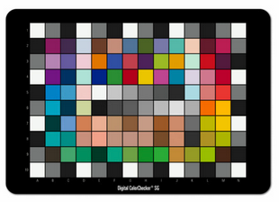  
擴展色域： 具備 140 個色塊，顯著增加膚色、半色調與飽和色的樣本數。
解決方案： 配合 iQ-Analyzer 或 camSPECS 軟體，可用於生成更精確的色彩校正矩陣 (CCM) 或 3D-MLUT 轉換。
適用場景： 醫療影像、高端數碼攝影以及汽車 ADAS 對特定顏色辨識的可靠性測試。

### 多功能整合方案：eSFR ISO 附色彩標靶
追求效率的自動化測試首選。  
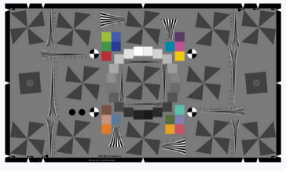  
一站式測試： 圖卡在中央區域周圍佈置了 20 個色彩區塊，符合 ISO 12233:2014 規範。
自動化支持： 軟體能自動識別色彩 ROI，無需手動框選，適合產線端的快速影像品質篩選。
限制： 樣本數較少，適合進行「一致性監控」而非深度色彩學研究。

### 光學與光譜分析解決方案 (Advanced Analysis)
從物理光譜層面解決色彩問題。
camSPECS (TE292)： 透過 39 個干涉濾光片測量感測器的光譜靈敏度，這是計算完美 CCM 的基礎數據。
")  
In-situ 數據庫優化： 利用包含 2500 種真實物體光譜的數據庫，優化相機在現實場景（而非僅圖卡）中的顏色表現。
```markdown
若為日常 QA 測試： 建議選用 TE188 (24色卡)，因其數據最易與業界其他報告進行橫向對比。
若針對美顏/手機開發： 應搭配 TE273 膚色圖卡 與 iQ-Selfie Studio 解決方案，模擬真實人像拍攝環境。
環境光源： 色彩測試必須配合 iQ-LED (如 LE7 或 iQ-Flatlight) 提供的可調光譜光源，以模擬不同色溫下的色彩還原一致性。
```
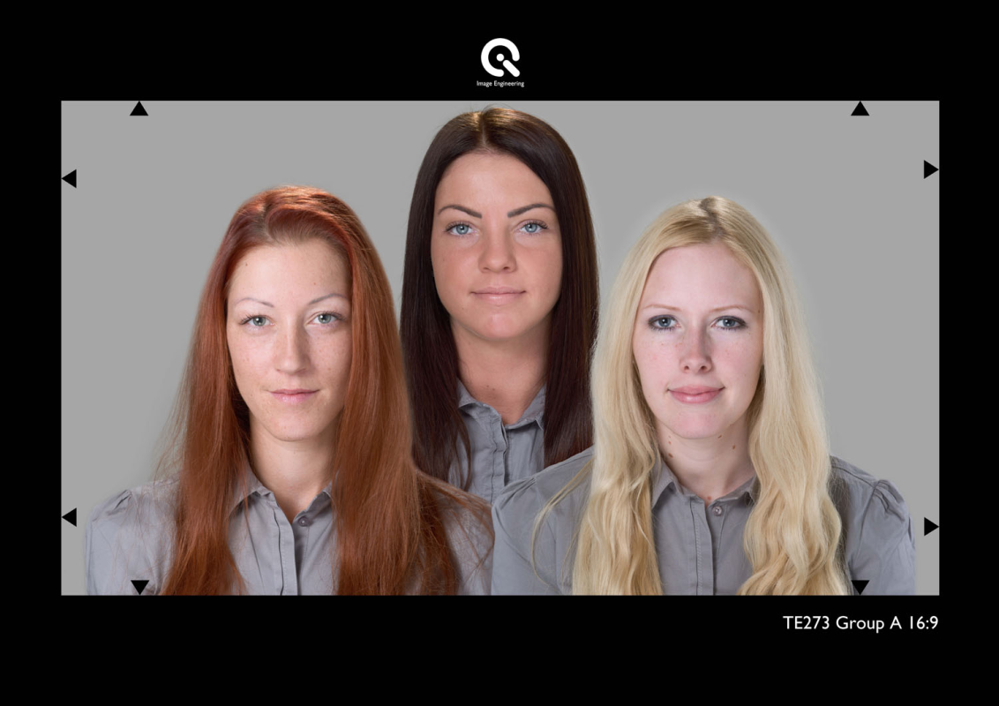  

## **Solutions | 畸變測試圖卡核心對比表 (Comparison Table)**
特色 / 圖卡 | Checkerboard (棋盤格) | SFRplus | eSFR ISO | Dot Pattern (點陣圖)
| ---- | ---- | ---- | ---- | ---- |
標準合規性 | 畸變測量能力 | 最優 (Best) | 強 (Strong) | 良好 (Good)
專用分析 | 對構圖敏感度 | 低 (不敏感) | 中等 | 中等 | 中等
主要優勢 | 高精度幾何校準 | 畸變細節較 eSFR ISO 多 | 符合 ISO 12233 標準 | 適合高精度網格分析
遵循標準 | ISO 17850 | ISO 17850 | ISO 12233 / 17850 | CPIQ / ISO 17850

### 高精度首選：Checkerboard (棋盤格) 方案
針對需要極高幾何準確度的應用（如自動駕駛校準、Through-focus 測試）。

- 技術特點： 由黑白相間的正方形組成，軟體自動偵測所有角點（Corners）進行幾何映射。
- 核心優勢：
    - 對構圖不敏感： 可自由縮放（Zoom in/out），只要畫面中能辨識出足夠的角點即可分析。
    - 極致精確： 提供最精確的畸變數據與徑向畸變（Radial Distortion）曲線。
- 建議型號： T06 (Image Engineering)。

### 空間細節平衡：SFRplus 與 eSFR ISO
適合在測量解析度（Sharpness）的同時，獲取畸變數據的場景。  
- SFRplus： 比 eSFR ISO 提供更多的空間細節與畸變數據，適合一般的鏡頭性能全面評估。
  
- eSFR ISO： 雖然畸變分析能力稍遜於 SFRplus，但完全符合 ISO 12233:2014 標準設計，適合國際標準一致性測試。
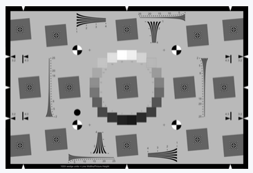  
- 特點： 包含徑向曲線分析與畸變修正顯示功能。

### 工業與國際標準方案：Dot Pattern 與 TE251
針對特定行業標準（如手機、安防）設計的專用圖卡。  
- Dot Pattern (點陣圖卡)： 透過一組圓形點陣網格（Grid of dots）來分析幾何失真與橫向色差（LCA）。  
 
- TE251 (幾何十字圖)：
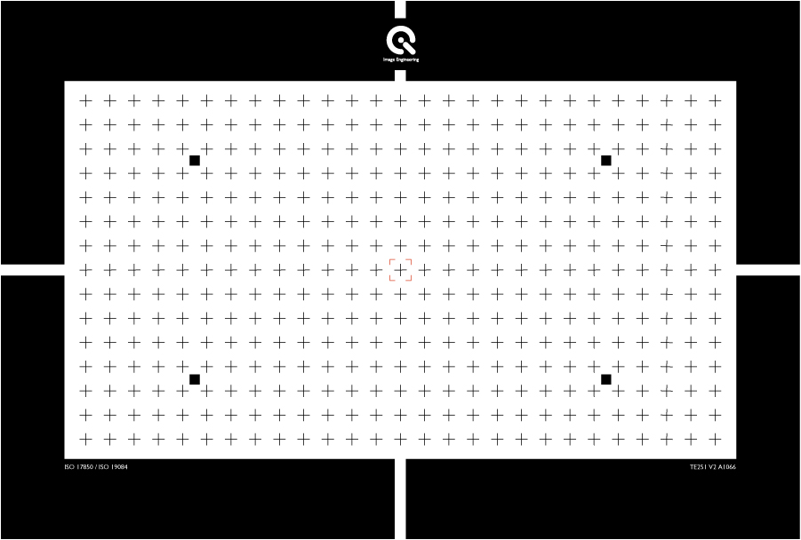   
    - 具備 15 x 27 個交叉符號，專為 ISO 17850 與 IEC 62676-5 (安防) 標準設計。
    - 常用於評估鏡頭幾何畸變、橫向色差及 TV-Distortion。

### 幾何畸變量測指標摘要 (Key Metrics)
利用上述圖卡，Imatest Distortion 模組可輸出以下關鍵數據：
- Geometric Distortion (%)： 鏡頭幾何失真百分比。
- TV Distortion： 電視畸變，用於評估畫面邊緣彎曲程度。
- Chromatic Aberration (LCA/TCA)： 橫向與縱向色差，評估因光學特性引起的顏色偏移。
- Radial Distortion Plot： 顯示隨視野（Field）變化的畸變分佈情況。
```
若主要目標是幾何校準： 務必選用 Checkerboard，其在不同距離與縮放下的穩定性最優。
若需符合手機 CPIQ 標準： 建議選用 Dot Pattern 搭配 Imatest 分析。
若需符合安防 IEC 62676-5： 選用 TE251 幾何十字圖卡可直接滿足標準規範要求。
廣角與魚眼鏡頭： 對於畸變極大的鏡頭，建議使用 SFRreg 或 預變形（Pre-distorted） 的 SFRplus 圖卡，以確保邊緣區域仍能被軟體正確偵測與分析。
```
### 雜訊類型
在進行圖卡對比前，需了解 Imatest 主要量測的雜訊類型：
視覺雜訊 (Visual Noise)： 結合人眼視覺函數 (CSF)，評估符合 ISO 15739 或 CPIQ 標準的感知雜訊。
色度雜訊 (Chroma Noise)： 評估影像中不必要的顏色斑點。
感測器原始雜訊 (Raw Noise)： 直接由 Raw 檔分析感測器的訊噪比 (SNR)。
時間雜訊 (Temporal Noise)： 透過多張影像分析隨時間變化的隨機雜訊。
固定模式雜訊 (Fixed-pattern Noise)： 包含 PRNU 與 DSNU，常用於感測器特徵評估。

## **Solutions | 雜訊分析測試圖卡核心對比表 (Comparison Table)**
特色 / 圖卡型號 | eSFR ISO | TE269C (OECF 36) | SFRplus | Flat Field (均光板)
| ---- | ---- | ---- | ---- | ---- |
雜訊分析能力 | 強 (Strong) | 最優 (Best) | 有限 (Limited) | 專用 (Spatial Noise)
主要優勢 | 銳利度與雜訊同步量測 | 高動態範圍雜訊分析 | 強大的自動對齊 | 感測器缺陷檢測
遵循標準 | ISO 12233:2014 | ISO 15739 | - | EMVA 1288
支持數據 | 視覺/色度/Raw 雜訊 | 120dB 內信噪比曲線 | 基礎灰階雜訊 | PRNU / DSNU
推薦用途 | 標準影像品質評估 | 高階 HDR / 低照度測試 | 鏡頭解析度為主 | 感測器研發與校準

### 整合型方案：eSFR ISO (斜邊圖卡附色彩/灰塊)
針對追求效率的影像評估流程。  

- 功能優勢： eSFR ISO 是 Imatest 中唯一支援詳細雜訊分析的自動化斜邊圖卡模組。
- 測試內容： 透過圖卡周圍的 20 個灰塊，可同時量測 MTF 銳利度、色度雜訊與視覺雜訊。
- 限制： 其階調範圍相對較窄，不適合用於量測超高動態範圍下的雜訊表現。

### 高階雜訊與 HDR 方案：TE269C / TE264 (OECF)
專為深入量測感測器動態範圍與雜訊關係設計。
- TE269C (36階)： 提供高達 120 dB 的密度範圍，是安防 (IEC 62676-5) 與車載標準推薦圖卡。  
")
- 量測重點：
    - SNR 曲線： 顯示隨亮度變化的訊噪比分佈。
    - 動態範圍 (Dynamic Range)： 定義信噪比降至 1 (0dB) 時的極限捕捉能力。
    - 硬體搭配： 需使用 LG3 或 LE7 等高亮度均勻燈箱進行透射式測試。

### 空間與感測器雜訊方案：Flat Field (平場分析)
- 評估感測器本身的物理雜訊特性。
- 測試方式： 拍攝完全均勻的白色平面或積分球發光口。
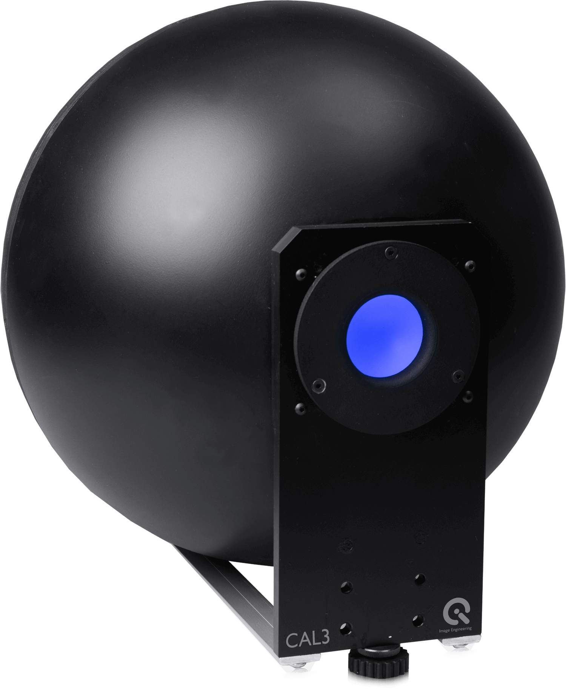
- 數據指標：
    - PRNU (光響應不均勻性)： 評估像素間對光線響應的差異。
    - DSNU (暗信號不均勻性)： 評估在無光狀態下的固定模式雜訊。
- 應用場景： 鏡頭陰影 (Shading) 校正、感測器壞點檢測與機器視覺校準。
```
若需要標準合規測試 (ISO 12233)： 務必選用 eSFR ISO，其兼顧了銳利度與詳細雜訊分析。
若針對車載/安防高動態場景： 建議選用 TE269C (36階 OECF) 搭配 LG3 燈箱，以量測最精確的 SNR 與 HDR 雜訊表現。
若需要量測感測器固有缺陷： 應採用 Flat Field (LE7 積分球) 進行統計學雜訊分析。
```

## **Solutions | 均勻性測試工具對比表 (Comparison Table)**
工具類型 | 推薦型號 | 均勻度參考 | 主要優勢 | 應用場景
| ---- | ---- | ---- | ---- | ---- |
積分球光源 | LE7 / CAL 系列 | > 97~98% | 極致均勻、模擬朗伯特性 | 感測器校準、高精度產線測試
均光板/片 | TE255 / TE282 | 視光源而定 | 使用簡便、輕量化 | 實驗室環境下的鏡頭 Shading 量測
均勻光源板 | iQ-Flatlight | > 90% | 適合大尺寸反射式圖卡補光 | 廣角鏡頭、大視野均勻性評估
多功能圖卡 | TE42 / eSFR ISO | 較低 | 單張影像獲取多項 KPI | 快速影像品質概覽、QA 篩選

### 高精度解決方案：LE7 與 CAL 積分球
針對需要排除光源干擾、僅量測相機性能的場景。
LE7 (iQ-LED 技術)： 具備 >97% 的超高均勻度，支援光譜可調，可量測不同色溫下的色彩陰影，整合測試圖卡的光譜可調式背光箱。  

CAL1 / CAL2： 緊湊型設計，適合產線端的快速校準，能在不到 1 秒內完成量測。
CAL3 / CAL3-XL： 專為廣角與魚眼鏡頭設計，凹形碗狀發光面可確保 180° 視角內的照明均勻性。  


### 便捷型測試方案：TE255 / TE282 均光片
利用物理材料特性產生均勻區域。
TE255： 具備 61% 透射率的擴散片，適合搭配透射式燈箱量測。  
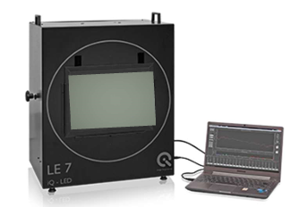  
TE282： 亞光均光板，具備 84% 透射率，專門用於暗角（Vignetting）測試。  

Restan： 高品質 PTFE 白色均光片，提供極佳的漫反射效果。

```
研發與標定： 務必選用 LE7 或 CAL1 積分球系統，以確保測試基準的純淨度。
廣角測試： 對於視場角超過 120° 的鏡頭，建議使用 CAL3 或具備預畸變設計的廣角測試箱 iQ-FoV Box。
效率考量： 若僅需日常品管，TE42 多功能圖卡 配合 iQ-Analyzer 軟體的 Shading 模組即可滿足大部分需求。
```

## **Solutions | 紋理測試圖卡核心對比表 (Comparison Table)**
紋理細節（或稱紋理銳利度）主要衡量成像系統在執行降噪（NR）處理時，保留低對比度細節的能力，這對於呈現影像的真實質感至關重要。
圖卡類型 | 推薦型號 / 名稱 | 遵循標準 | 特性與優勢
| ---- | ---- | ---- | ---- |
枯葉圖 (Dead Leaves) | TE276 | ISO 19567-2 | 模擬自然場景的隨機紋理，測試最為嚴苛
落幣圖 (Spilled Coins) | Spilled Coins | Imatest 專利 | 比例不變型圖卡，支援互相關法（Cross-correlation）
正弦西門子星圖 | TE280 | ISO 19567-1 | 具備 18% 與 48% 不同的調制度，量測低對比損失
對比頻率圖卡 | Log F-Contrast | - | 同時變化頻率與對比度，觀察降噪與銳利的臨界點
多功能綜合圖卡 | TE42 | ISO 12233 | 整合枯葉圖區域，適合快速評覽系統畫質

### 自然紋理量測：枯葉圖 (Dead Leaves / TE276)  

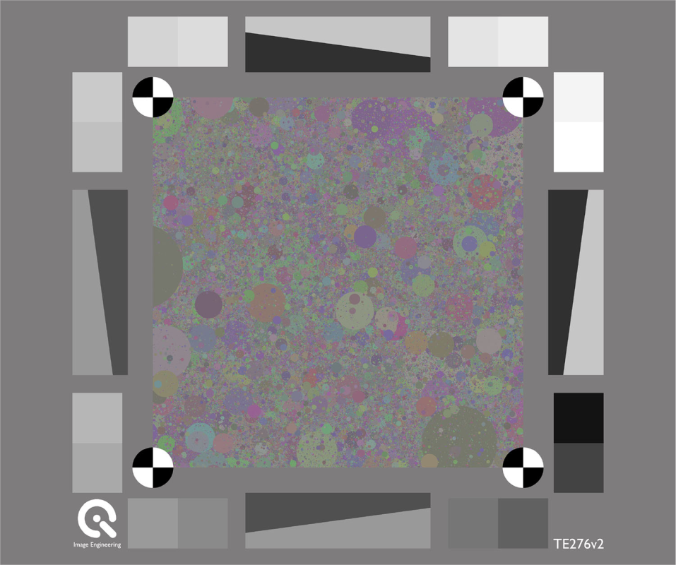
這是目前公認最能反映真實世界細節保留能力的測試工具。
設計原理： 由數千個不同大小、顏色且重疊的圓圈組成，形成一種不具備特定方向性的隨機場景。
優勢： 相較於傳統的灰階目標，枯葉圖為紋理損失提供了一個更自然、更接近現實的測試結構。
適用模組： 可搭配 Imatest Random/Dead Leaves 模組或 iQ-Analyzer Resolution 模組分析。  

### Imatest 專利方案：落幣圖 (Spilled Coins)  

Imatest 針對傳統枯葉圖易受偽影干擾的缺點進行了改良。
核心技術： 使用 互相關法 (Cross-correlation) 進行分析，有效區分影像中的真實紋理與處理產生的偽影（Artifacts）。
比例不變性 (Scale-invariant)： 確保在不同的拍攝距離下，量測數據仍具備高度的一致性。
分析指標： 輸出 Texture MTF 曲線，直觀顯示系統保留細節的頻率響應。

### 低對比細節評估：TE280 與 Log F-Contrast  
針對特定 ISP 調優需求的補充方案。
TE280 (西門子星圖版)： 符合 ISO 19567-1，透過低對比的正弦圓環觀察降噪後的解析力損失。
")  
Log F-Contrast：  
  
橫軸為頻率變化，縱軸為對比度降低。
優點： 可以非常精確地看到降噪演算法是在哪個對比度位準、哪個頻率點開始介入並導致細節消失。
```
若追求國際標準合規： 建議選用 TE276 (枯葉圖) 或 TE280 (低對比星圖)，以符合 ISO 19567 規範。
若為高階手機研發： 強烈建議使用 Spilled Coins (落幣圖) 配合 Imatest 互相關法，這是目前排除 ISP 偽影、最精確量測紋理損失的方法。
環境光源： 紋理測試對光源穩定度極度敏感，建議使用 LE7 或 iQ-Flatlight 等 iQ-LED 技術光源，以確保各光譜下的測試一致性。
```

### 特殊應用解決方案 (Specialized Solutions)
針對特定產業需求提供的專業圖卡設備：  
- 車載與安防 (Automotive & Security)：  
    - 使用 SFRreg 測試超廣角 (>180°) 魚眼鏡頭。  
    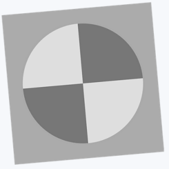    
    - 符合 IEEE 2020 與 ISO 16505 (CMS) 標準。

- 醫療影像 (Medical)：
    - 針對內視鏡 (ISO 8600) 與微距鏡頭提供極小尺寸圖卡方案。
- 行動裝置 (Mobile)：
    - 符合 CPIQ (IEEE 1858) 標準，量測解析度、色彩均勻度與紋理。
    - 紅外線測試 (Infrared)： 提供專用的紅外線熱像儀測試圖卡。
###  圖卡選擇與適應性評估 (Chart Suitability)
選擇測試圖卡時必須考慮的技術因子：
- 圖卡品質計算機 (Chart Quality Calculator)： 用於確定圖卡列印材質（如噴墨、相片紙或透射膠片）是否足以支援特定感測器的解析度。
- 預變形圖卡 (Pre-distorted Charts)： 針對高畸變鏡頭（如魚眼鏡頭）提供預補償設計，以確保在影像邊緣仍能準確分析。
- 亮度均勻性 (Lighting Uniformity)： 測試時需搭配均勻光源板或積分球，以符合 ISO 17957 等陰影校正標準。
### 實驗室硬體設備 (Equipment)
為了確保測試環境的穩定與可重複性，專業的實驗室配置包含以下設備：
均勻光源系統 (Uniform Light Sources)： 提供積分球 (Integrating Spheres) 或 LED 均勻光源板，確保畫面亮度一致性。  
測試支架與反射系統 (Test Stands & Reflective Systems)： 用於精確固定相機與圖卡，維持穩定的測試距離與角度。  
光學準直儀 (Target Collimators)： 模擬長距離測試環境，適合在有限空間內進行長焦距鏡頭測試。  
自動化與運動產生器 (Robotic Automation & Motion Generators)： 用於測試影像防手震 (Image Stabilization) 以及生產線上的自動化檢測。  

### 通用測試環境與架設 (General Test Setup)
在執行任何測試前，必須確保測試環境符合標準規範，以維持數據的一致性。
- 測試環境：
    - 實驗室： 需具備消光處理（減少反光與眩光）。
    - 光源： 需提供均勻照明，反射式測試需注意光源與圖卡夾角（通常為 45 度）；透射式需使用穩定燈箱或積分球。
- 測試架設：
    - 對齊： 相機感測器平面必須與測試圖卡完全平行。
    - 距離： 根據鏡頭焦距調整距離，確保圖卡在畫面中正確構圖（如 SFRplus 需填滿畫面）。
-   曝光控制： 避免像素飽和或過暗，影響雜訊與銳利度判斷。

### Solutions | 測試應用場景 (Applications)
針對不同產業的硬體需求提供優化組合：
廣角測試解決方案 (Wide-FoV)： 針對車載或安防鏡頭，提供 Wide-FoV Resolution 與均勻性測試設備。  
紅外線與醫療 (Infrared & Medical)： 為熱像儀、內視鏡與顯微鏡提供專用的測試圖卡與微距 (Macro) 測試設置。  
自動化生產測試： 整合 Imatest IT 軟體與機器手臂，實現產線端的快速影像品質篩選。  

