# Infinite-ISP 調適工具 (Tuning Tool) v1.1 使用者指南
Infinite-ISP 調適工具 (Tuning Tool) v1.1 的使用者指南，該軟體專為優化相機影像處理流水線的效能而設計。工具主要分為校準、分析與生成設定檔三大功能，涵蓋黑電位校準、白平衡計算及色彩校正矩陣等關鍵技術。使用者能透過視覺化界面載入 RAW 或 RGB 影像，利用內建的 ColorChecker 選取功能精準分析影像雜訊與伽瑪曲線。最終，系統會產生 configs.yml 與 isp_init.h 檔案，確保軟體模型與 FPGA 硬體之間的參數配置無縫銜接。此手冊詳細說明了從目錄結構、操作流程到資料儲存的完整步驟，協助開發者達成卓越的影像品質。
## 啟動與基本操作流程
- ### 下載路徑 :
```
https://github.com/10x-Engineers/Infinite-ISP_TuningTool/tree/main
```
- ### 啟動工具：
本校準工具的主程式入口為 ```tuning_tool.py```。啟動時，
```
python3 .\tuning_tool.py
```
系統會要求載入預設設定檔 ```default_configs.yml```，並在同目錄下自動創建一個複本 ```configs.yml```。這樣一來，您可以靈活客製化參數，同時確保原始預設設定不被破壞。
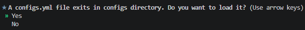
- ### 提供的模組 :
Infinite-ISP 調優工具提供以下功能。  
    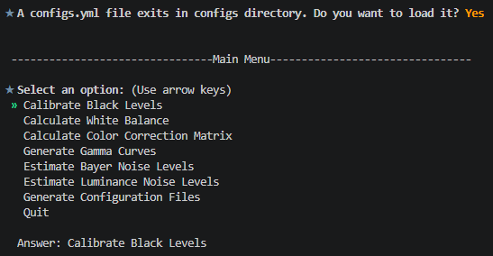
| 模組 | 描述 |
| ---- | ---- |
黑色電平校準 (BLC) | 計算原始影像中每個通道（R、Gr、Gb 和 B）的黑色電平。
白平衡 (WB) | 計算 ColorChecker RAW 或 RGB 影像的白平衡增益（R 增益和 B 增益）。
顏色校正矩陣（CCM）| 使用 ColorChecker RAW 或 RGB 影像計算 3x3 色彩校正矩陣。
伽瑪(gamma) | 將使用者定義的伽瑪曲線與 sRGB 顏色空間的伽瑪值 ≈ 2.2 進行比較。
拜耳噪音水準估計(Bayer Noise Level)	| 估計 ColorChecker RAW 影像上六個灰階色塊的雜訊水準。
亮度噪音水平估計(Luminance Noise Level)	| 估算 ColorChecker RAW 或 RGB 影像上六個灰階色塊的亮度雜訊等級。
設定檔 | 產生 Infinite-ISP_ReferenceModel 和 FPGA 韌體的設定檔。
- ### 主選單導覽：
在終端機主選單中，您可以使用鍵盤的上下方向鍵移動光標，並按 Enter 鍵選擇所需的校準或分析模組。
- ### 影像命名格式：
若要載入您的感測器影像，RAW 影像必須遵循特定的命名格式，即 ```Name_WxH_Nbits_Bayer.raw```。例如：```ColorChecker_2592x1536_12bits_RGGB.raw```。  
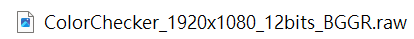
## 通用操作：ColorChecker 區域選擇與存檔
在執行白平衡或色彩校正矩陣校準時，系統會開啟影像並要求您選取 ColorChecker 區域：
- ### 精密對位：
介面上會顯示預設的選取框，您可以使用滑鼠拖曳框上的四個角點來精準對齊 ColorChecker 的色塊。
- ### 影像縮放與導覽：
使用滑鼠滾輪可以進行放大/縮小影像，並利用下方及右側的滾動條移動至特定區域。
- ### 尺寸微調：
您可以使用底部的 ```Adjust Size```、```Adjust Width``` 和 ```Adjust Height``` 滑動條來同步調整所有選取方框的大小。對齊完成後按 Continue 執行計算，或按 Redraw 恢復預設框。
- ### 存檔方式：
校準完成後，您有三種儲存數據的方式：
- (1) 直接存入 configs.yml 設定檔、
- (2) 在 GUI 中點擊 "Save" 匯出為 CSV 檔、
- (3) 點擊 "Save Images" 將校準前後的對比圖儲存為 PNG 檔案。
## 三大校準工具的使用步驟. 
### 1. 黑電平校準 (Black Level Calibration, BLC)
- 基本概念：補償感測器的內置偏置（Offset），讓影像在完全無光時的輸出能對齊真正的黑色。
- 輸入需求：
    - 計算黑電平：需使用一張直接從感測器在完全無光環境（例如蓋上鏡頭蓋）下拍攝的均勻黑色 RAW 影像。
    - 套用黑電平：需使用一張待校正的 RAW 影像。
- 操作步驟：
    1. 在主選單選擇「Calibrate Black Levels」。  
    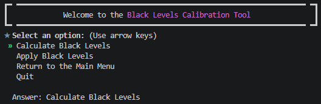
    2. 系統提供兩個選項：可以直接套用設定檔現有的黑電平（選擇「Apply Black Levels」，並可選擇是否啟用線性化），或者選擇計算黑電平。
    3. 若選擇計算，請載入您的全黑 RAW 影像。
    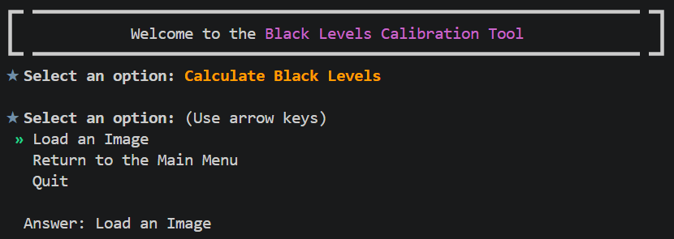
    4. 系統會自動執行演算法，並於終端機顯示 R、Gr、Gb、B 通道的個別黑電平數值。
    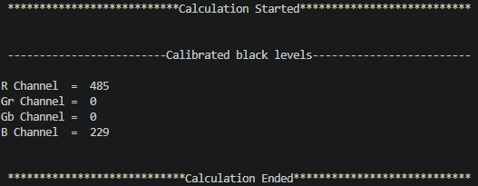
    5. 最後，您可以選擇將計算結果儲存至 configs.yml，或直接套用這組黑電平數值到其他影像並存檔。 
    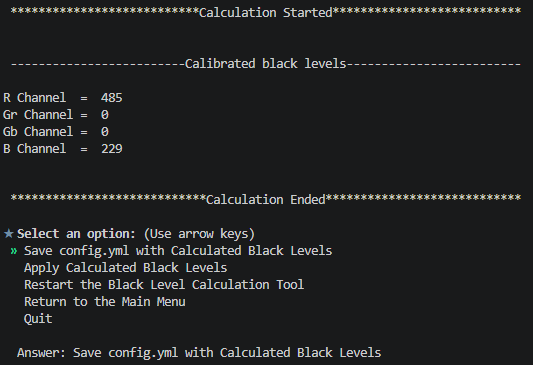
    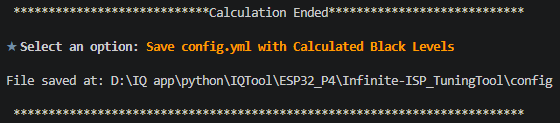  
    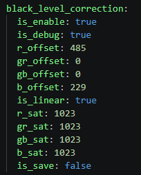
### 2. 白平衡增益計算 (White Balance Calculation, WB)
- 基本概念：調整紅（R）、綠（G）、藍（B）通道的增益值，使白色物體在不同光源下能呈現真正的白色（消除色偏）。
- 輸入需求：一張包含 ColorChecker 的 RAW 或是 RGB 影像。
- 操作步驟：
    1. 在主選單選擇「Calculate ColorChecker White Balance」。
    2. 載入含 ColorChecker 的影像。  
    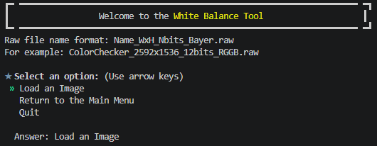
    3. 利用區域選取介面對齊 ColorChecker。演算法會特別利用最後一排的灰色色塊 (grayscale patches) 來進行增益計算。
    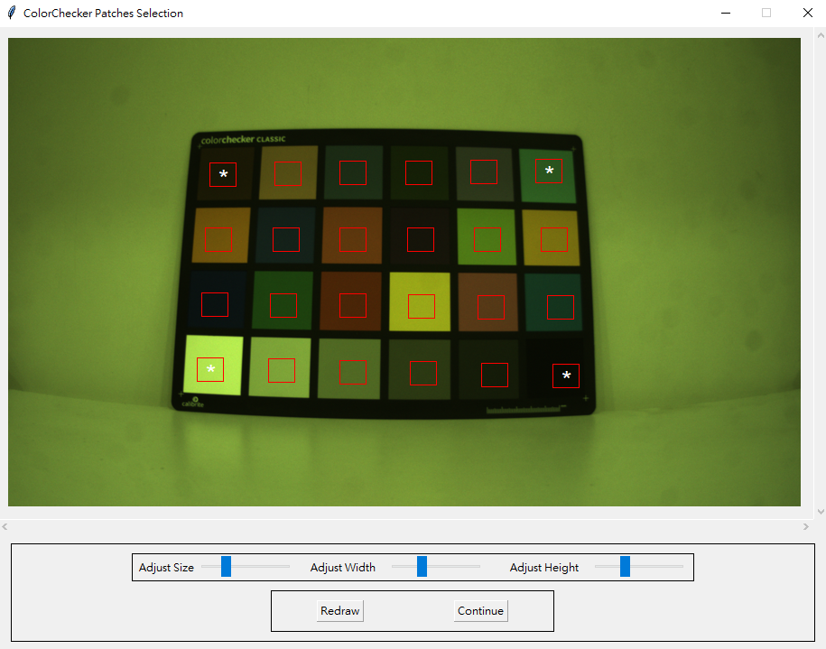
    4. 按下 Continue 開始計算，終端機隨後會顯示計算出的 R gain 與 B gain 數值。
    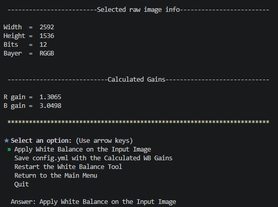
    5. 您可以選擇將增益值直接儲存至 ```configs.yml``` 設定檔，或選擇在畫面上套用增益，檢視校準前後的對比影像並儲存。
    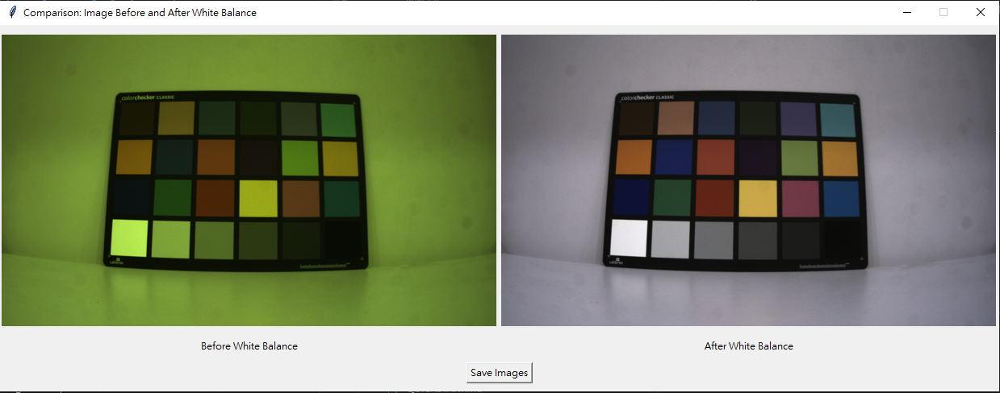
### 3. 色彩校正矩陣計算 (Color Correction Matrix, CCM)
- 基本概念：計算一個 3x3 矩陣，用來將相機捕捉到的顏色映射到目標色彩，以修正色彩偏差和不自然的飽和度。
- 輸入需求：一張包含 ColorChecker 的 RAW 或 RGB 影像（支援 .png、.jpg、.jpeg 格式）。
- 操作步驟：
    1. 在主選單選擇「Calculate Color Correction Matrix」。
    2. 載入影像並精確對齊 ColorChecker 區域。  
        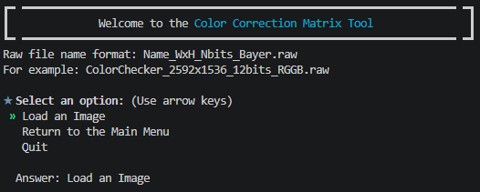
        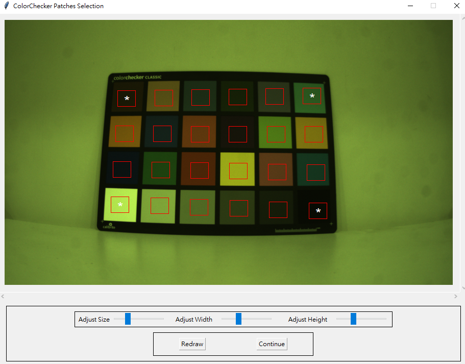
    3. 對齊後，系統會提示詢問：是否在影像中套用白平衡？（Apply White Balance?）  
        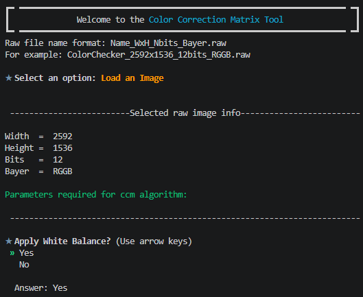
    4. 接著，系統會要求您選擇誤差矩陣演算法：$\Delta E_{ab}^{00}$ 或是 $\Delta C_{ab}^{00}$。  
        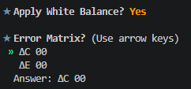
    5. 最後，系統會詢問：是否在影像中維持白平衡？（Maintain White Balance?）  
        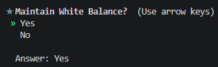
    6. 執行後，終端機會顯示兩種色彩校正矩陣：  
        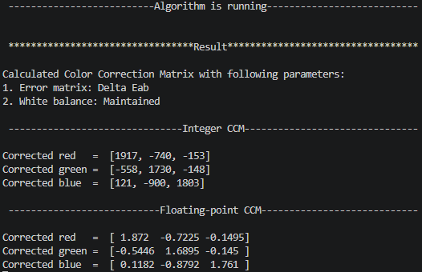
        - 整數型 CCM (Integer CCM)：適合晶片與 FPGA 等硬體實作。
        - 浮點數型 CCM (Floating-point CCM)。  
    7. GUI 會顯示校準前後的色彩對比影像，您可以選擇將結果儲存至 ```configs.yml``` 設定檔中。
        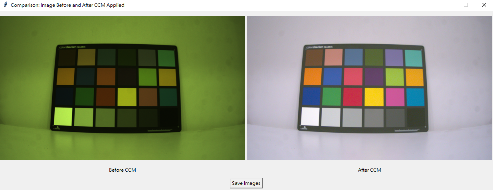
### 4. Gamma 曲線分析（Gamma Analysis） 
主要用於將使用者自訂的 Gamma 曲線與標準的 sRGB 空間 Gamma 曲線（$\gamma \approx 2.2$）進行視覺化對比。
- 其具體的調整與分析操作流程如下：
    1. 輸入與準備階段
        - 自動載入參數：此分析模組不需要載入 RAW 或 RGB 影像。系統會直接從您載入的設定檔 (configs.yml) 中，自動讀取使用者定義的 Gamma 曲線數據。
        - 準備基準曲線：系統會自動產生一條以 $\gamma = 2.2$ 為基準的標準 Gamma 曲線，用於後續的視覺化對比。
    2. 執行分析與對比步驟
        - 選單操作：在主選單中，使用鍵盤的上下鍵導覽並選擇 "Generate Gamma Curves"（或從 Gamma 模組選單中選擇比較 Gamma 曲線）。  
        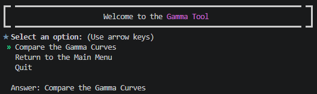
        - 曲線繪製與檢視：工具會自動開啟一個繪圖面板，並同時繪製出兩條曲線供您對比： 
            1. User-defined Gamma（使用者自訂的 Gamma 曲線，通常以藍線與紅點表示）。
            2. Gamma 2.2（標準 Gamma 2.2 曲線，通常以綠線與黑星表示）。  
        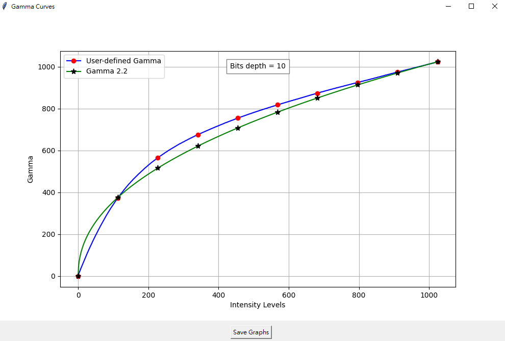
        - 透過此圖表，您可以直觀地觀察自訂 Gamma 曲線在不同輸入強度階（Intensity Levels）下的走勢是否平滑，以及其與標準 sRGB 曲線的偏差程度。
    3. 儲存對比結果
        - 儲存圖表：在顯示 Gamma 曲線繪圖的面板下方，設有一個 "Save"（或 "Save Graphs"）按鈕。
        - 若您需要記錄此次分析，點擊該按鈕即可將對比圖表結果儲存至您指定的本機位置。
### 5. Bayer 域雜訊估算 (Bayer Noise Estimation, BNE)
專門用來評估 RAW 影像中各 Bayer 通道雜訊分佈的分析工具。由於 ColorChecker 的最後一排灰色色塊（共 6 個）在理想情況下應為均勻的單色，因此演算法可以透過分析這些色塊像素值的偏差（標準差）來精準估算雜訊，進而提供降噪演算法所需的關鍵參數。
- 其具體的調整與分析操作流程如下：
    1. 準備與輸入需求
        - 影像格式限制：與其他可接受 RGB 格式的模組不同，BNE 模組必須使用 RAW 格式的影像（影像中需包含 ColorChecker 標靶）。
        - 檔名格式：RAW 影像必須遵循 Name_WxH_Nbits_Bayer.raw 的格式命名（例如：ColorChecker_2592x1536_12bits_RGGB.raw）。
    2. 執行操作步驟
        - 步驟一：啟動工具並載入影像
            1. 在主選單中，使用鍵盤方向鍵移動光標至 "Estimate Bayer Noise Levels"（或選單中的第 5 項），然後按下 Enter 鍵。
            2. 系統彈出檔案選取視窗，請選取您準備好的 ColorChecker RAW 影像。  
            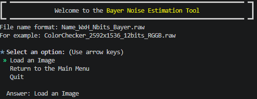
            3. 若影像載入失敗，系統會顯示錯誤並提示重新載入。
        - 步驟二：精確選取 ColorChecker 區域
            1. 影像載入後會開啟選取介面，畫面上會顯示預設的 24 格選取框。
            2. 請使用滑鼠拖曳四個角點，將紅框精準對齊 ColorChecker 上的各個色塊。  
            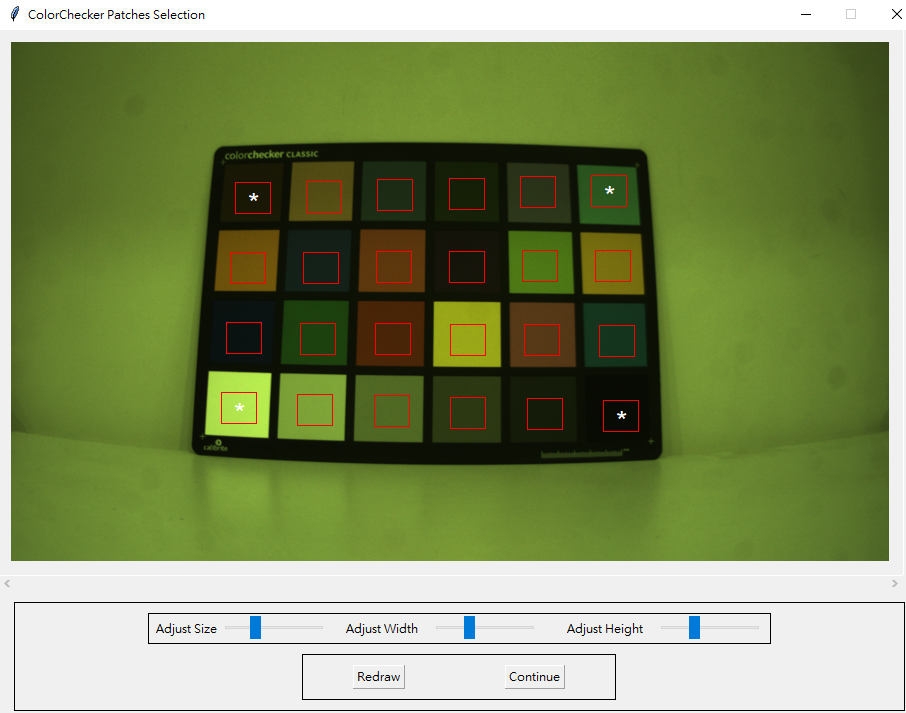
            3. 微調工具：
                - 使用滑鼠滾輪可以放大/縮小影像，並透過滑動條移動畫面以利精細對位。
                - 使用底部的 Adjust Size（調整尺寸）、Adjust Width（調整寬度）、Adjust Height（調整高度）滑動條來同步改變所有方框的大小，確保方框只框在色塊內部（避免壓到邊緣）。
            4. 對齊完畢後，特別確認最後一排的 **6 個灰色色塊（Grayscale Patches）**已確實被紅框包覆，然後點選下方的 "Continue" 按鈕開始計算。
        - 步驟三：演算法自動執行與拆分
            1. 演算法啟動後，會自動將載入的 RAW 影像拆分為三個獨立的 Bayer 通道：R、G（Gr 與 Gb）以及 B。
            2. 針對每個通道中對應的 6 個灰色色塊區域，計算其像素值的標準差（Standard Deviation）。由於灰色色塊理論上是均勻無偏差的，此處計算出的標準差即代表該色塊在該通道下的雜訊強度。
    3. 檢視與儲存估算結果
        - 檢視結果： 計算完成後，畫面上會彈出一個名為 "Bayer Noise Levels" 的 GUI 視窗，內含一個詳細數據表格。表格中會清晰列出：
            - Patch 1 至 6（由淺至深的 6 個灰色色塊）在 R、G、B 通道中各自的標準差數值。
            - 最下方會提供各通道的平均標準差（Mean Std），這是評估相機感測器整體基礎雜訊的重要指標。
            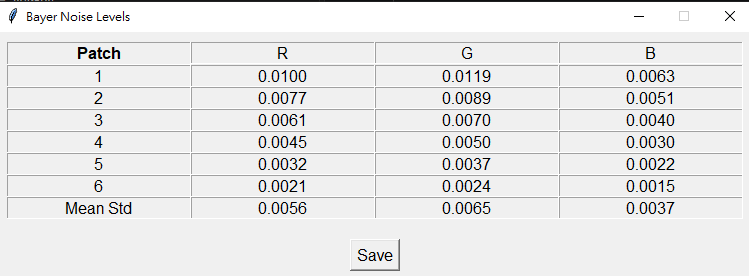
        - 儲存數據：
            - 如果您需要導出這些數據，可以點擊該視窗下方的 "Save" 按鈕，系統會跳出儲存視窗，讓您將此表格匯出為 CSV 檔案至您指定的電腦路徑。
            - 若不需儲存，點擊 "Cancel" 即可關閉視窗並返回主選單。
### 6. 亮度雜訊估算 (Luminance Noise Estimation, LNE)
用於分析影像在亮度通道（Luminance channel / Luma）中的雜訊統計特性
。透過此工具與 Bayer 雜訊估算 (BNE) 的搭配，您可以清楚比較影像在經過 ISP 處理前後（RAW 域與 RGB 域）的雜訊變化。
- 其具體的調整與分析操作流程如下：
    1. 準備工作與輸入限制
        - 影像格式：與僅接受 RAW 影像的 BNE 不同，LNE 模組同時支援 RAW 影像或 RGB 影像（例如 .png、.jpg 或 .jpeg）。
        - 必備內容：影像中必須包含完整的 ColorChecker 標靶。
        - RAW 命名格式：若使用 RAW 影像，檔名必須遵循 Name_WxH_Nbits_Bayer.raw 的格式。
    2. 詳細執行步驟
        - 步驟一：啟動模組並載入影像
            1. 在工具的主選單（Main Menu）中，使用鍵盤方向鍵移動光標至 "Estimate Luminance Noise Levels"（選單中的第 6 項），然後按下 Enter 鍵。
            2. 系統會彈出檔案選取視窗，請載入您準備好的 ColorChecker 影像。
        - 步驟二：精確選取 ColorChecker 區域
            1. 影像載入後會開啟預設的 24 格選取框。
            2. 請使用滑鼠拖曳四個角點來對齊 ColorChecker 的色塊。
            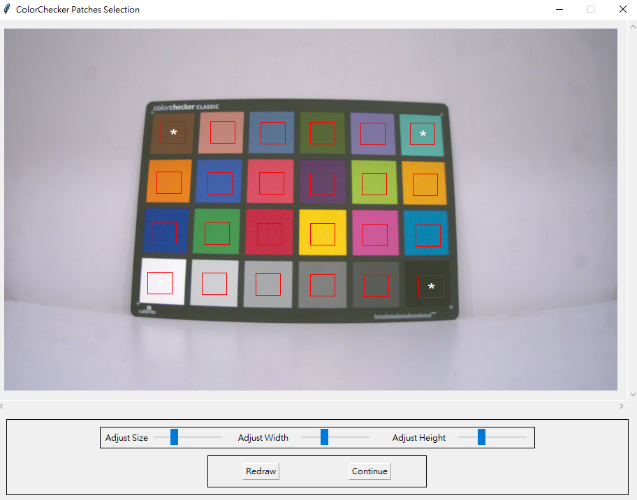
            3. 畫面調整：
                - 使用滑鼠滾輪可以放大/縮小影像，並透過滑動條移動畫面，以利看清細節。
                - 利用底部的 Adjust Size、Adjust Width 與 Adjust Height 滑動條同步調整所有選取框的大小，確保方框只框在色塊內部（特別是最後一排的 6 個灰色色塊）。
            4. 對齊完成後，點擊下方的 "Continue" 按鈕。
        - 步驟三：設定白平衡選項並執行
            1. 點選 Continue 後，系統會於終端機詢問是否在所選影像上套用白平衡："Apply White Balance? Yes/No"。
            2. 輸入您的選擇後，演算法會自動分析最後一排 6 個灰色色塊中像素值的變異數或標準差，以評估亮度通道的雜訊程度。
    3. 結果檢視與儲存
        - 數據檢視：計算完成後會彈出一個 "Luma Noise Levels" 的 GUI 視窗。視窗中會展示一個表格，詳細列出 Patch 1 至 6（由淺到深的灰色色塊）在亮度通道中的標準差 (std)，同時在上方顯示這 6 個色塊的局部影像與整體的平均標準差（Mean std）。
            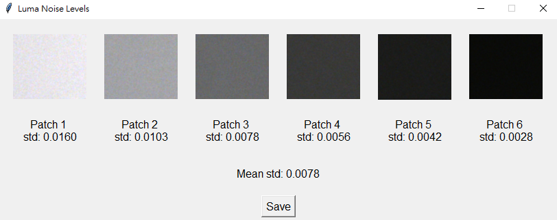
        - 儲存數據：點選視窗下方的 "Save" 按鈕，即可將此表格匯出為 CSV 檔案至您指定的本機位置。
### 如何比對 RAW 域與 RGB 域（亮度通道）之間的雜訊差異
- 要量化評估相機感測器在經過 ISP 處理（如去馬賽克 Demosaicing、白平衡、色彩校正等）後雜訊的變化，建議採用以下比對流程：
    1. 取得 RAW 域（Bayer 域）雜訊數據：
        - 使用相同的 RAW 影像執行 "Estimate Bayer Noise Levels" (BNE) 模組。
        - BNE 會將 RAW 影像拆分為三個獨立通道（R、Gr/Gb、B），並產出這 6 個灰色色塊在各通道中的原始標準差數據，將其匯出為 CSV 檔。
    2. 取得 RGB 域（亮度通道）雜訊數據：
        - 使用同張影像（或經 ISP 處理後的 RGB 影像）執行 "Estimate Luminance Noise Levels" (LNE)。
        - 在 LNE 中，您可以選擇是否套用白平衡（Apply White Balance?）來觀察白平衡增益對雜訊的放大效果。計算完成後，將結果同樣匯出為 CSV 檔。
    3. 對比與分析：
        - 將 BNE 的 RAW 通道（R, G, B）雜訊標準差，與 LNE 的亮度通道（Luminance/Y）雜訊標準差進行橫向對比。
        - 分析要點：觀察雜訊在轉換至亮度空間後是否被顯著放大。如果 LNE 的標準差顯著高於 BNE 的原始通道，這代表您的去馬賽克或色彩調整（如 CCM）可能放大了高頻雜訊。這些比對數據將成為您後續微調**降噪演算法（Denoising）**參數時的核心依據。
### 設定檔
產生 Infinite-ISP_ReferenceModel（軟體模擬管道） 與 FPGA 韌體 設定檔的操作流程非常直覺。這兩個設定檔是連通校準工具、軟體演算法與硬體實作之間的關鍵橋樑。
- 其具體的設定與操作流程如下：
    1. 進入設定檔生成選單
        - 在校準工具的主選單（Main Menu）中，使用鍵盤方向鍵移動光標至第 7 項 "Generate Configuration Files"，然後按下 Enter 鍵。
        - 系統隨後會開啟子選單，並在畫面上方顯示目前儲存的感測器資訊（Sensor Info），包含：Bit Depth（位元深度）、Bayer Pattern（Bayer 格式）、Width（寬度）與 Height（高度）。
    2. 更新感測器規格（重要前置作業）
    - ### 在產生任何設定檔之前，您必須確保感測器的參數與您實際拍攝的 RAW 影像完全一致。
        1. 在子選單中選擇 "Update Sensor Info"。
        2. 系統會引導您依序在終端機中輸入以下參數：        
            - Select the Bayer Pattern：輸入感測器 Bayer 格式（例如：rggb、bggr、grbg、gbrg）。
            - Select the Bit Depth：輸入影像位元深度（例如：10 或 12）。
            - Enter width：輸入影像寬度像素值（例如：1920）。
            - Enter height：輸入影像高度像素值（例如：1080）。
        3. 輸入完成後，選單上方的 "Sensor Info" 欄位會立即更新為新設定。
    3. 產生 configs.yml（軟體 pipeline 參考模型用）
    - 這個設定檔用於驅動 Infinite-ISP_ReferenceModel 模擬管道，將輸入的 RAW 影像轉換為輸出 RGB 影像。
        1. 在子選單中選擇 "Generate configs.yml"。
        2. 校準工具會自動將您先前在黑電平（BLC）、白平衡（WB）與色彩校正矩陣（CCM）等模組中校準、微調出來的所有最佳參數（如 R/B gain、3x3 矩陣值、BLC 通道數值）進行整合。
        3. 整合後的數據會直接寫入並儲存至工作目錄下的 configs.yml 檔案中（該檔案位於 config 資料夾下，是您在啟動工具時複製自 default_configs.yml 的實體）。
        4. 產生完成後，Infinite-ISP_ReferenceModel 軟體管道即可直接讀取此檔案以執行精準的影像重建。
    4. 產生 isp_init.h（FPGA 韌體 / 硬體模型用）
    - 這個設定檔是專為 FPGA 晶片硬體實作與韌體 設計的 baseline 初始化標頭檔（Header File）。
        1. 在子選單中選擇 "Generate isp_init.h"。
        2. 工具會自動讀取並解析剛才產生的 configs.yml 設定檔。
        3. 硬體優化轉換：演算法會將軟體用的浮點數參數自動轉換成適合硬體/FPGA 運算的整數格式（Hardware-friendly integer formats）（例如，將 CCM 轉換為 Integer CCM）。
        4. 轉換完成後，系統會在指定目錄下輸出一個名為 isp_init.h 的 C 語言標頭檔。
        5. 硬體開發人員可直接將此 .h 檔整合至 FPGA 韌體的編譯工程中，作為暫存器（Registers）與 pipeline 初始化參數的基底配置。

