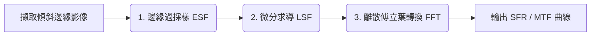

# MTF 與 SFR 的差異與測試詳細方法說明

**MTF（調製傳遞函數）是一個理論與物理概念，而 SFR（空間頻率響應）則是測量該概念的具體數位演算方法。** 

簡單來說，MTF 描述了光學系統（如鏡頭）將鏡頭前的線條對比度還原到感測器上的能力；而 SFR 則是國際標準（如 ISO 12233）所定義，透過拍攝「斜邊影像（Slanted Edge）」並經由數學計算來推導出該系統 MTF 的實作方法。

---

## 一、 MTF 與 SFR 的核心差異

| 比較項目 | MTF (Modulation Transfer Function) | SFR (Spatial Frequency Response) |
| :--- | :--- | :--- |
| **定義** | 光學系統對不同空間頻率的**對比度傳遞能力**。 | 經由特定演算法（如斜邊法）計算出的**空間頻率響應曲線**。 |
| **本質** | 偏向**理論與光學物理**的基礎概念。 | 偏向**數位影像訊號處理**的量化量測方法。 |
| **測試標的** | 傳統上使用純黑白相間的**正弦波或矩形波條紋**圖表。 | 使用帶有特定傾斜角度的**黑白高對比斜邊**圖表。 |
| **影響因素** | 純光學表現（鏡頭衍射、像差等）。 | 光學表現 + 感測器像素、雜訊與影像銳化演算法（ISP）。 |

---

## 二、 詳細測試過程與方法

目前最主流且被廣泛應用的測試方法為 **ISO 12233 斜邊法（Slanted-Edge Method）**，以下為其詳細的測試步驟與數學推導過程：

### 1. 環境與硬體架設
* **測試圖卡準備**：準備一張符合標準的測試圖卡（如 ISO 12233 圖卡），圖卡上必須包含與水平或垂直方向**傾斜 2 到 5 度**的黑白交界斜邊（Slanted Edge）。
* **光源與照明**：使用高均勻度、無頻閃的測試燈箱或光源。確保圖卡表面照度均勻（均勻度 > 90%），避免產生眩光或不必要的反射。
* **相機對齊**：將待測相機固定於堅固的翻拍台或三腳架上。確保相機感光元件（CMOS/CCD）與測試圖卡**完全平行**，並將光軸對準圖卡中心。
* **拍攝參數設定**：關閉相機內建的自動銳化、降噪等 ISP 處理（通常使用 RAW 檔拍攝）。設定適當的曝光，確保黑白交界處**沒有過曝（飽和）或過暗（剪裁）**。

### 2. 影像擷取與感興趣區域（ROI）選取
* 拍攝高畫質影像後，在電腦分析軟體中選取包含該傾斜邊緣的**感興趣區域（ROI, Region of Interest）**。
* ROI 必須跨越黑白兩側，且包含足夠的像素以進行統計。

### 3. SFR 數學演算法處理流程
選定 ROI 後，測試軟體（如 Imatest 或自行撰寫的 MATLAB 程式）會執行以下四個關鍵數學步驟：

* **計算邊緣擴散函數（ESF, Edge Spread Function）**
  * 因為邊緣是傾斜的，每一行（Row）像素穿過黑白邊界的像素坐標會有微小的水平位移。
  * 演算法會精準計算出邊緣的精確角度與中心線。
  * 將多行像素的灰階數值（Pixel Profiles）沿著邊緣方向投影、疊加並重組，形成一條超高解析度（通常是 4 倍過採樣）的灰階過渡曲線，這條曲線稱為 **ESF**。
* **計算線擴散函數（LSF, Line Spread Function）**
  * 對上述的 ESF 曲線進行**一階微分（Mathematical Differentiation）**。
  * 微分後的結果會從「階梯狀的過渡曲線」變成一個「類似鐘形的脈衝波（Impulse Response）」，這個脈衝波曲線即為 **LSF**。LSF 的寬度反映了邊緣的模糊程度。
* **執行快速傅立葉轉換（FFT）**
  * 將時域/空域的 LSF 曲線進行**快速傅立葉轉換（FFT）**，將其轉換至「空間頻率域（Spatial Frequency Domain）」。
* **歸一化輸出（Normalization）**
  * 將 0 空間頻率（DC 分量）的對比度值設為 1（即 100%）。
  * 最終得到的頻率與對比度關係曲線，就是該影像系統的 **SFR 曲線**（在排除了演算法干擾的前提下，即等同於該系統的 MTF）。

---

## 三、 常見的測試數據解讀

光學與鏡頭測試中指的是調變轉換函數（Modulation Transfer Function，簡稱 MTF）在不同對比度下降幅度的臨界點，用來量化評估鏡頭的解像力、銳利度與對比度。

簡單來說，MTF 的數值（如 50、30、10）代表影像對比度衰減到特定百分比時，所能呈現的空間頻率（通常以 lp/mm 線對/毫米，或 cycles/pixel 每個像素的週期表示）。頻率數值越高，代表鏡頭在該對比度下能看清越細微的紋理。

在分析 SFR 曲線時，業界通常會關注以下幾個關鍵指標：

* **MTF50（或 SFR50）**：對比度下降到初始值 **50%** 時的空間頻率（單位通常為 `LP/mm` 或 `Cycles/Pixel`）。這是評估人類視覺感知「銳利度（Sharpness）」最常用的指標。
* **MTF10（或 SFR10）**：對比度下降到 **10%** 時的空間頻率。這通常被視為人類肉眼能分辨出線條邊界的極限，用來評估系統的「極限解析度（Resolution）」。
* **過沖（Overshoot / Undershoot）**：如果測試出來的 SFR 曲線在低頻處大於 1（> 100%），代表相機內部進行了**人為的數位銳化處理**（Edge Enhancement），這在評估純光學鏡頭時需要特別注意並加以剔除。

## 各指標的核心定義與代表意義

指標 | 核心定義 | 實務代表意義
| ---- | ---- | ---- |
| MTF50 | 對比度降至低頻（初始）值 50% 時的空間頻率 | 人眼視覺感受的「銳利度」。許多研究指出，MTF50 是人類主觀判斷影像是否清晰、銳利的關鍵分水嶺，為業界最通用的評估基準。| 
| MTF50P | 對比度降至「峰值（Peak）」50% 時的空間頻率 | 防過度銳化的修正指標。若影像經過軟體過度銳化（Oversharpening），MTF50 的數值會虛高；此時改用 MTF50P 能排除偽影干擾，更穩定地反應真實畫質。 |
| MTF30 | 對比度降至 30% 時的空間頻率 | 工業或商用鏡頭的清晰度門檻。在很多機器視覺與光學系統評估中，MTF30 被視為可接受影像質量的下限。 | 
| MTF20 | 對比度降至 20% 時的空間頻率 | 低對比度環境下的解析極限。常用於模擬早期類比電視線（TV Lines）或測試極端光照條件下的細節留存能力。 |
| MTF10 | 對比度降至 10% 時的空間頻率 | 鏡頭的「絕對極限解像力」。對比度低於 10% 時人眼已幾乎無法分辨，此指標代表鏡頭能勉強捕捉到的最微小細節（極限邊緣），接近光學物理上的繞射極限（瑞利準則）。 |