# SigmaStar IQ Tool 影像調整流程與步驟
使用 SigmaStar IQ Tool 進行影像調整是一個系統性的過程，涵蓋了從硬體連線、基礎校正到細部畫質調優的完整流程。
以下是使用 IQ Tool 的詳細步驟介紹：
### 1. 建立連線 (Connection)
在開始調整之前，必須先讓 PC 端的 IQ Tool 與開發板（EVB）上的 iqserver 建立通訊：  
- 開發板端設定：在終端機輸入以下指令以啟動服務：  
#ifconfig eth0 up        (啟動網卡)  
#udhcpc                  (取得 IP)  
#mixer -n 1 -q           (-q 參數用於開啟 iqserver) [1, 2]  

- 工具端連線：
在 PC 開啟 IQ Tool。
選擇產品類型（如 IP Camera）。
輸入開發板的 IP 地址。
點擊 Connection 圖示（插頭形狀），圖示變色即代表連線成功。  

### 2. 介面功能導覽 (Interface Navigation)
- 連線後，您會看到以下配置：  
功能樹狀結構 (左側)：包含所有 ISP 模組的 API 集合（如 AE, AWB, OBC, Gamma, Sharpness 等）。  
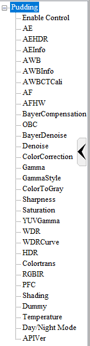
- 調整頁面 (右側)：點擊左側節點後，右方會顯示對應的參數調整介面。
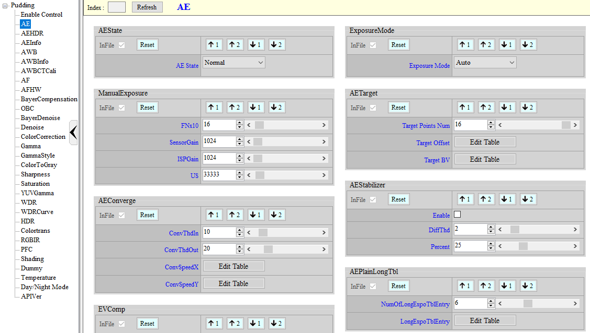
- 參數調整方式：包含直接填寫數值、下拉選單、拉動捲軸或點擊彈出表格（Edit Table）進行編輯。
### 3. 核心校正流程 (Calibration Workflow)
根據標準作業程序（SOP），建議依照以下順序使用工具內的插件（Plugin）進行基礎校正：
- 環境設定 (Step 0)：在開始校正前，需於 CalibrationInitialParameter.ini 或是 Plugin 介面的 Raw Setting 中設定原始影像資訊（如 width, height, cfa_type 等）。
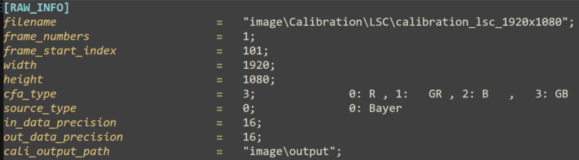
- 黑位準校正 (OBC)：選擇 CalibrationTool 內的 CalibrationOBC，在全黑環境下計算感測器的 OB 值。
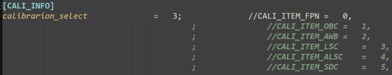
- 鏡頭陰影校正 (ALSC/LSC)：針對畫面亮度不均或邊緣色偏，使用 CalibrationALSC 或 CalibrationLSC 產生補償表。
- 白平衡校正 (AWB)：使用 AwbAnalyzerCombo 插件，在標準燈箱下校正不同色溫點的增益曲線。
- Gamma 擬合 (Gamma Fitting)：使用 Gamma Fitting 插件，拍攝 OECF 測試卡來調整亮度曲線，這必須在色彩矩陣校正之前完成。
- 色彩矩陣校正 (CCM)：使用 CCM Analyzer 插件，拍攝 24 色卡並計算色彩校正矩陣。
### 4. 畫質調優與去噪 (Tuning & Denoise)
完成基礎校正後，可針對不同 ISO 節點進行動態調整：
- 降噪調整 (NR3D/NRLuma)：建議先調整 NR3D（時間域降噪），再微調空間域降噪（NRLuma/NRChroma），以平衡殘影與雜訊。
- 銳利度 (Sharpness)：調整 OverShootGain 與 UnderShootGain 來控制黑白邊強度，並搭配 CorLut 抑制因銳化產生的雜訊。
- 寬動態 (WDR/Defog)：若場景明暗對比強烈，可開啟 WDR 模組增強細節。
### 5. 存檔與套用 (Save & Load)
即時套用：調整參數時，通常點擊 Write Page 即可將設定寫入開發板即時生效。
- 儲存參數：
    - Param file：儲存當前頁面的參數檔案。
    - Bin file：將所有調整好的參數打包成一個 *.bin 檔。之後在應用程式中呼叫 MI_ISP_API_CmdLoadBinFile 即可載入整套 IQ 設定。
    - 自動存檔：工具提供 Auto Save Bin File 功能，可設定間隔時間自動備份，避免遺失進度。
# 影像調整校正說明與步驟
## 1. OBC  
OBC（Optical Black Correction，黑位準校正）的主要目的是在 CMOS 感測器收集數據時，補償 ADC 轉換過程中的偏差。由於 ADC 可能無法精確轉換極弱的訊號，因此在輸入 ADC 前會加上一個固定偏移量（Offset），以保留暗部細節。
### OBC 的校正設定與步驟：
### 一、 校正環境與影像擷取要求
- 黑暗環境：必須在完全黑暗的環境下進行，封鎖所有可用光源。
- 鏡頭遮蓋：使用鏡頭蓋完全覆蓋鏡頭，確保沒有漏光；若鏡頭有可變光圈，應將光圈完全關閉。
- 手動曝光設定：將 AE 設為手動模式（M_Mode），並設定特定的 SensorGain。
- 擷取 RAW 影像：分別在 1X 增益和最大增益下擷取 RAW 影像。若不同增益下的校正結果差異很大，則需擷取多組影像。
### 二、 關鍵參數說明
- 在校正工具或 CalibrationInitialParameter.ini 中需設定以下參數：
    - Target：校正後預期的 16 位元殘留值，建議設定為 0。
    - AutoAssign：是否自動將一個 OB 值分配給所有增益，建議設為 1。
    - Weight：將畫面分為 3x3 區塊並設定權重，建議全部設為 1。
    - CaliGainIndex：填寫對應的 ISO 索引（0~15）。
    - out_data_precision：輸出數據精度，建議設為 16。
### 三、 校正步驟
### - 方法 A：使用 IQ Tool 插件 (CalibrationOBC)
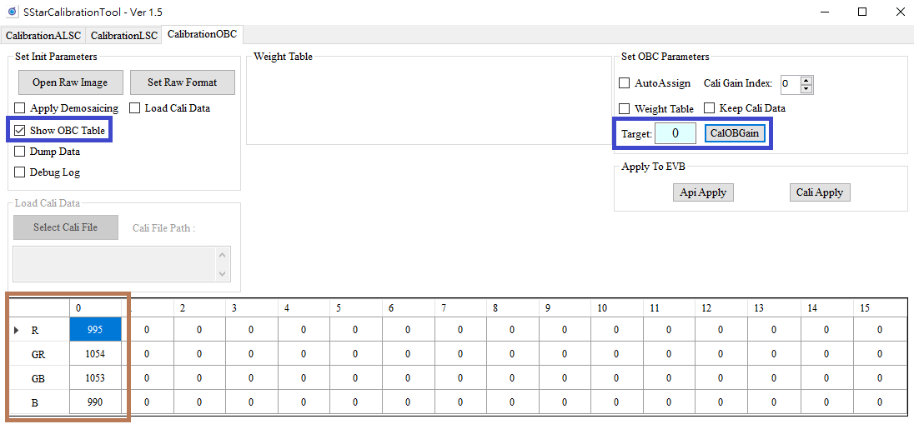
```
    - 從插件選單中選擇 CalibrationTool，然後點擊 CalibrationOBC 標籤。
    - 點擊 Set Raw Format 並根據 RAW 檔案設定對應格式資訊。
    - 點擊 Open Raw Image 開啟影像（路徑不可含中文）。
    - 勾選 Show OBC Table 以利觀察。
    - 點擊 CalOBGain，工具會根據輸入參數產生校正後的黑電平值。
    - 點擊 ApiApply 或 CaliApply 將校正結果套用到開發板。
```
### - 方法 B：使用離線校正工具 (CalibrationRelease.exe)
```
    - 將在黑暗環境拍攝的 RAW 影像放入 image 資料夾。
    - 修改 CalibrationInitialParameter.ini，將 calibration_select 設為 1 (OBC)。
    - 執行 CalibrationRelease.exe 產生 obc_cali.data 檔案。
    - 使用系統 API (MI_ISP_API_CmdLoadCaliData) 載入該校正數據。
```
### 四、 注意事項與分析
- 結果驗證：如果各增益下的校正結果差異小於 50，則校正一組 RAW 影像即可。
- 多節點設定：若高低增益間的 OB 差異過大，需手動為 16 個 ISO 索引節點分別輸入 OB 值。
- 防止串擾（Crosstalk）：完成 OBC 校正後，需確保 Gr/Gb 數值一致。建議手動調整，使 Gr=Gb=Min(Gr,Gb)，以避免產生迷宮紋現象。
- HDR 模式：在 HDR 模式下，長曝光與短曝光的 OB 值需分別進行校正。

## 2. 鏡頭陰影校正 (ALSC/LSC)
### LSC（Lens Shading Correction，透鏡陰影校正）的主要目的是產出一組 R、G、B 各 32 個項目的校正表，針對畫面不同區域給予不同的增益，以改善因鏡頭光學特性造成的亮度陰影（Y shading，即暗角現象）。
### LSC 的校正設定與具體步驟：
### 一、 校正環境準備
- 均勻光源：使用標準燈箱（如 Macbeth）搭配擴散片（Diffuser）。若無擴散片，可將鏡頭對準燈箱內的均勻灰牆。
- 亮度要求：調整燈箱亮度或 AE 目標值（建議設為 1500 左右，值域為 10~2550），確保原始影像（RAW）中心亮度足夠且不可過曝。
- 校正前提：在開始 LSC 之前，必須先完成 **OBC（黑位準校正）**與 **AWB（自動白平衡）**色溫曲線範圍的校正並套用。
- 濾光片：若使用 RGB 感測器，需確保已蓋上紅外線截止濾光片（IR-cut）。
### 二、 關鍵校正參數說明
- 在校正工具或環境參數文件（*.ini）中需設定以下項目：
    - TableSize：校正表大小，固定為 32 個項目。
    - AutoCenter：設為 1 時，工具會自動偵測影像中最亮的中心點；設為 0 則需手動指定中心座標。
    - Ratio Table：定義畫面中心到角落的校正強度比例。
    - Ratio_Threshold：用以防止角落過度補償（Over-compensation）。數值越大補償越多，數值越小則維持在最大索引值的補償量。
    - CCTNumber：校正的色溫組數，此平台支援最多 3 組（1~3）。
    - TargetIndex：目前校正的表格索引（0~2）。需注意填寫時，環境色溫必須由低到高排列。
    - OB_R/G/B_Value：當前感測器的 16 位元 OB 值（0~65535）。
### 三、 校正操作步驟
### 方法 A：使用 IQ Tool 插件 (CalibrationLSC)
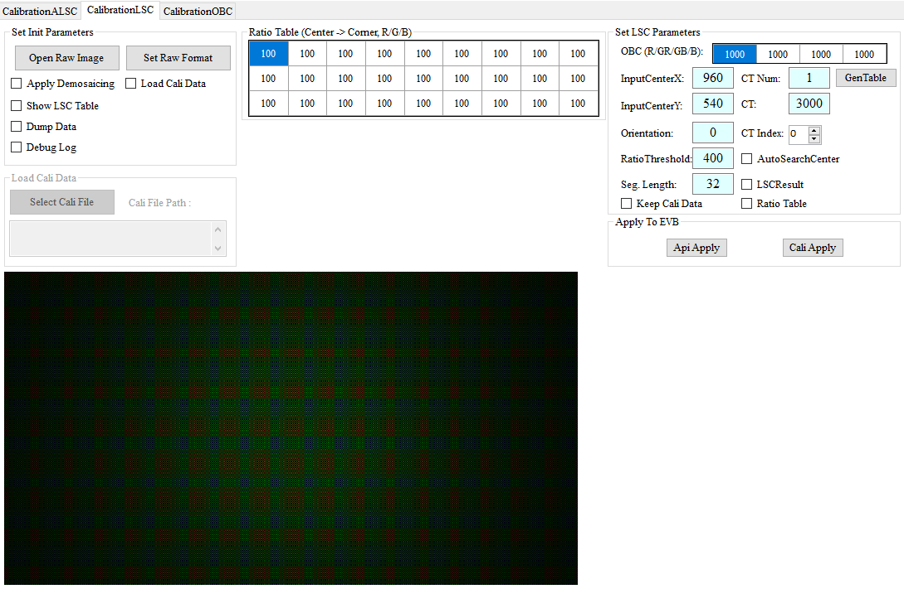
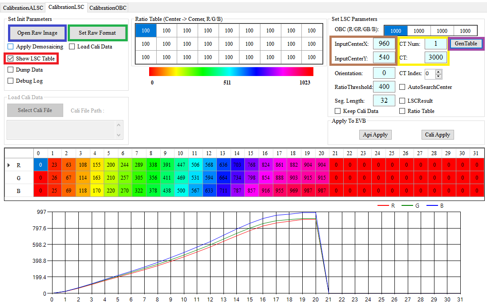
```
- 從插件選單選擇 CalibrationTool，點擊 CalibrationLSC 標籤。
- 點擊 Set Raw Format 設定影像解析度與格式。
- 點擊 Open Raw Image 開啟拍攝好的 RAW 影像（路徑不可含中文）。
- 勾選 Show LSC Table 以觀察生成的曲線與數據。
- 設定 LSC 參數，包含 OB 值、**CT（色溫）**及中心點偵測方式。
- 點擊 GenTable 計算並產生 LSC 增益表。
- 點擊 ApiApply 或 CaliApply 將數據下載到開發板（EVB）進行即時驗證。
```
## 重要步驟：完成後必須前往 LSC 模組頁面點擊 Read，確認參數已正確儲存在 API bin 檔案中。
### 方法 B：使用離線校正工具 (CalibrationRelease.exe)
- 將 RAW 影像放入 image 資料夾。
- 修改環境參數文件 CalibrationInitialParameter.ini：
```
    - 在 [RAW_INFO] 設定影像路徑與格式。
    - 將 calibration_select 設為 3（或 4，取決於版本）來指定 LSC。
    - 設定 load_calibration_data：校正第一組色溫時設為 0，其餘設為 1 以保留先前數據。
    - 執行 CalibrationRelease.exe，工具將自動產生 lsc_cali.data 檔案。
    - 透過系統 API (MI_ISP_API_CmdLoadCaliData) 載入並套用該數據。
```
## 注意事項
**優先權順序：系統載入數值的優先權為 lsc_cali.data > API bin > iqfile。**
**便利性：正常流程建議先載入 .data 檔，此時數據會儲存在 API bin 中，後續即可直接在 API 界面進行微調，無需每次開機重新載入 .data 檔。**

### ALSC（自適應透鏡陰影校正）的主要目的是改善因鏡頭光學特性導致的亮度陰影（Lens Shading，如暗角）顏色陰影（Color Shading）。
### ALSC 的校正設定與步驟：
### 一、 校正環境準備
- 光源要求：將鏡頭瞄準 DNP 標準燈箱的均勻光源屏幕。若無標準燈箱，可將鏡頭覆蓋磨砂玻璃並瞄準標準燈箱的光源。
- 亮度設定：調整燈箱亮度或 AE 目標值，使影像中心亮度達到最大亮度的 70% 左右（可使用 ImageJ 確認）。
- 校正順序：在進行 ALSC 之前，必須先完成 **OBC（黑位準校正）**與 **AWB（自動白平衡）**色溫曲線範圍的校正。
- 感測器準備：使用 RGB 感測器時，需確保 IR-cut 濾光片已覆蓋。
--------------------------------------------------------------------------------
### 二、 校正設定參數說明
- 在校正工具（CalibrationTool 或 CalibrationInitialParameter.ini）中需設定以下關鍵參數：
    - Ratio Table：定義畫面中心到角落的校正強度比例。
    - OBC：輸入當前感測器的 16 位元 OB 值。
    - GridX / GridY：陰影補償表的尺寸，預設為 27x17。
    - CT (Color Temperature)：設定當前光源的色溫值（例如 3000K）。
    - CT Num：選擇要校正的色溫組數（1~3 組）。
    - CT Index：選擇當前正在校正哪一組色溫表，色溫設定必須由低到高排列。
    - Delta Mode：定義非等距格點設定，提供 16 種預設模式。
--------------------------------------------------------------------------------
### 三、 校正步驟
### 方法 A：使用 IQ Tool 插件 (CalibrationALSC)
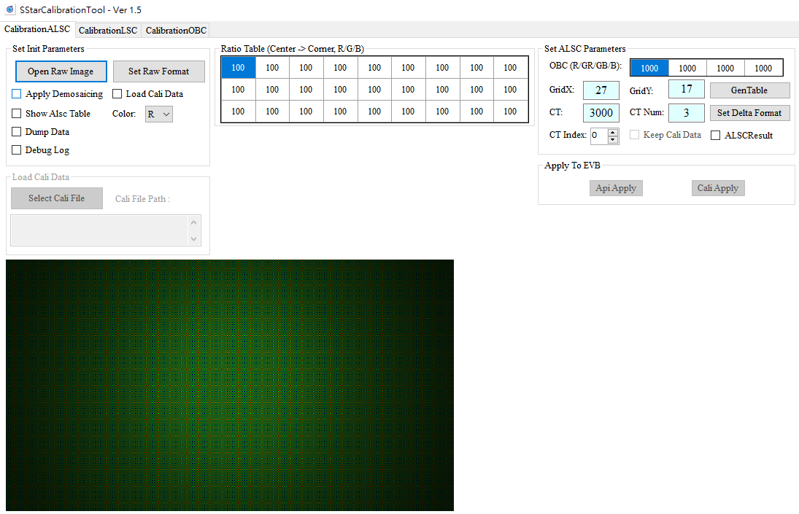
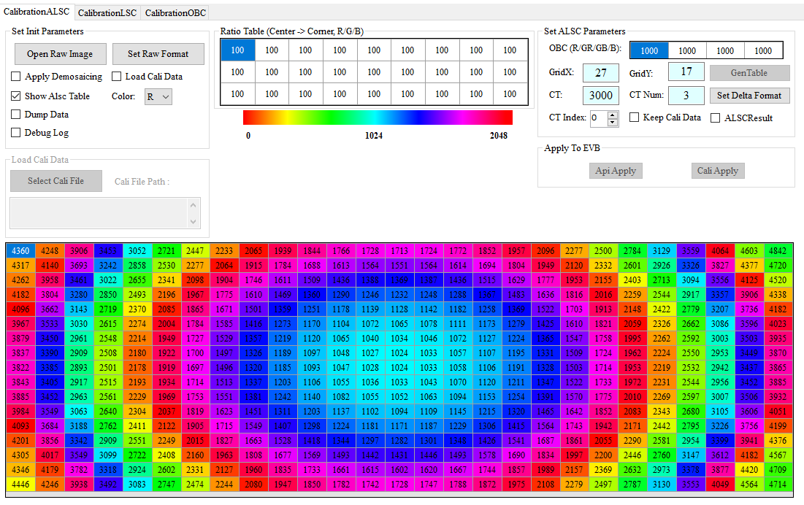
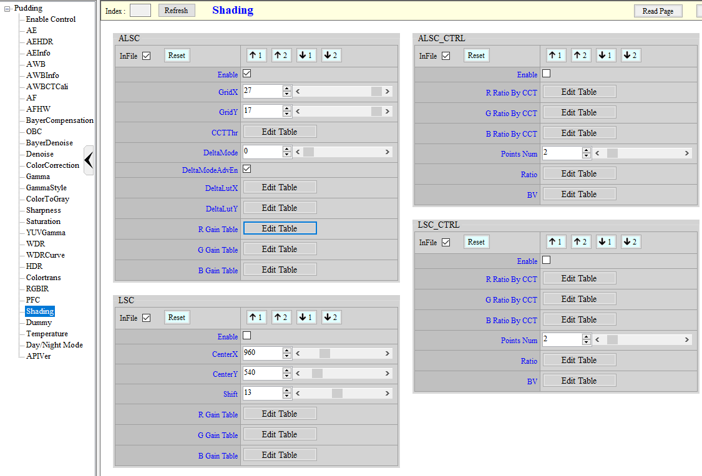
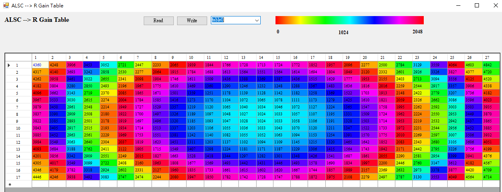
```
- 從插件選單中選擇 CalibrationTool，然後點擊 CalibrationALSC 標籤。
- 點擊 Set Raw Format，根據 RAW 檔案設定格式資訊。
- 點擊 Open Raw Image 開啟拍攝好的原始影像（路徑不可含中文）。
- 勾選 Show ALSC Table 以利觀察。
- 設定對應的 OBC 參數與 色溫 (CT) 參數。
- 點擊 GenTable 開始計算並產生校正表。
- 點擊 API Apply 將數據套用到開發板（EVB）進行即時驗證。
- 重要步驟：套用後必須前往 ALSC 模組頁面點擊 read page，才能將校正參數儲存在工具中。
```
### 方法 B：使用離線校正工具 (CalibrationRelease.exe)
```
- 將 RAW 影像放入 calibration\SampleCode\Release\image 資料夾中。
- 修改環境參數文件 CalibrationInitialParameter.ini，在 [RAW_INFO] 區段設定影像路徑、格式，並將 calibration_select 設為 4 (ALSC)。
- 執行 CalibrationRelease.exe，工具將自動產生 alsc_cali.data 檔案。
- 透過系統 API (MI_ISP_API_CmdLoadCaliData) 載入此 .data 檔案即可生效。
```
## 注意事項
**資料儲存限制：由於 ALSC 的增益表資料量較大，無法直接儲存在 API bin 檔案中，因此每次系統啟動時都必須重新載入 alsc_cali.data。**
**環境一致性：若更換了鏡頭或感測器組合，必須重新進行 ALSC 校正。**
## 補充說明
**雖然在 ISP 硬體流水線（Pipeline）中 AWB 位於 shading 校正之後，但來源文件指出，shading 是否校正對 AWB 的初步範圍判定影響較小。因此，建議先界定好 AWB 的色溫曲線範圍，讓系統能識別當前光源環境，進而確保 ALSC 校正表能正確關聯到對應的色溫點上。**

## 3. 自動白平衡 (AWB) 
自動白平衡 (AWB) 校正的主要目的是自動計算感測器在不同標準光源下的 R/G 和 B/G 增益，以確保影像在不同色溫環境下的灰階區域（Gray scale）不會產生色偏，讓 R、G、B 數值盡可能接近。
### AWB 校正的設定與步驟：
### 一、 校正環境與準備
- 灰卡準備：在標準燈箱（如 Macbeth）內放置灰卡，並確保灰卡佔滿整個畫面。
- 前置條件：
    - 務必確保 OBC (黑位準校正) 已經完成校正且確實套用。
    - 若使用 RGB 感測器，須確認 IR-cut 濾光片 已確實蓋上。
    - 曝光設定：將 AE 設為 Auto，並調整 AE Target（建議值約為 1500，值域 0~2550），以防止影像過曝導致統計數據失真。
### 二、 使用 IQ Tool 插件校正步驟 (AwbAnalyzerCombo)
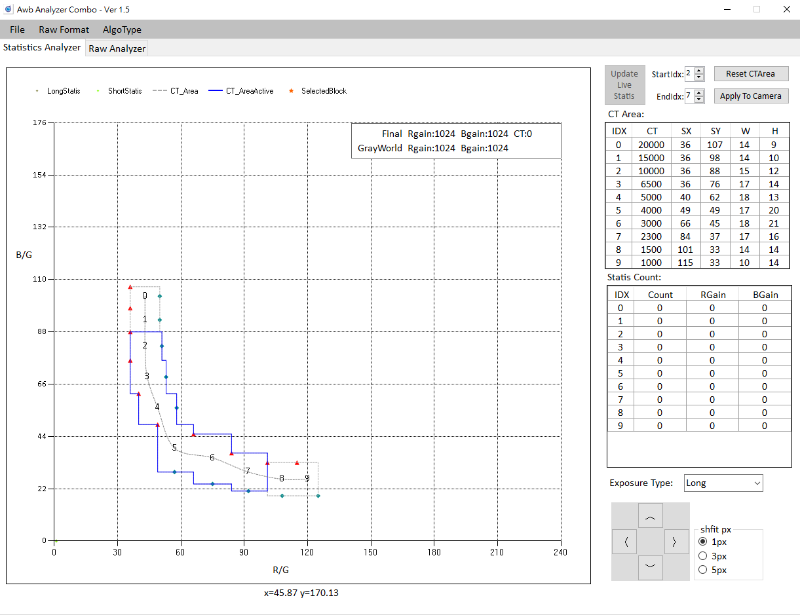
- 這是調整色溫曲線範圍（CT Area）最常用的方法：
- 開啟插件：從插件選單中選擇 AwbAnalyzerCombo。
- 設定色溫範圍：
    - 設定 StartIdx 與 EndIdx 來決定 AWB 的有效區間。
    - 建議設定為 StartIdx = 2 (約 10000K) 到 EndIdx = 7 (約 2300K)，確保在此色溫範圍內執行 AWB。
- 獲取統計值：
    - 準備色溫計量測當前燈源的實際色溫。
    - 點擊 Update Live Statis 更新當前統計資料（畫面上的綠點即為統計落點）。
    - 點擊 File -> Save Statistics 儲存資料以便後續分析。
    - 調整色溫框 (CT Area)：
    - 拖曳色溫框的控制點（三角形或藍線），使統計落點包含在對應的色溫框內。
    - 確認右上方推算出的色溫 (CT) 接近實際量測值，並保持曲線平滑。
    - 重複光源校正：切換至不同色溫的光源（如 D65, TL84, A 燈），重複上述步驟 3 與 4。
    - 套用與存檔：
    - 點擊 Apply To Camera 將設定寫入開發板。
## 重要：回到 API Tool 介面點選 AWBCTCali 頁面，點擊 Read Page 將設定讀回，最後儲存為 Bin file 以確保開機時能自動載入。
### 三、 生產線批量校正步驟 (Generating *.data)
若需用於生產線補償各個相機模組間的差異，需產生 awb_cali.data：
- 選擇 Golden Sample：挑選一台 AWB 統計落點最接近平均值的機器作為基準機。
- 環境參數設定：
    - 在 CalibrationInitialParameter.ini 中，將 calibration_select 設為 2 (AWB)。
    - 設定 HighLowCTMode：模式 0（單一色溫）或 模式 1（高低色溫兩組）。
- 執行校正程序：
    - 先拍攝 Golden Sample 的 RAW 影像並執行 CalibrationRelease.exe 生成初始數據。
    - 再拍攝待測機 (Unit Sample) 的 RAW 影像，將 load_calibration_data 設為 1，再次執行程序產出最終的 awb_cali.data。
    - 應用數據：透過 MI_ISP_API_CmdLoadCaliData API 載入此數據。
### 四、 核心參數說明
- eAlgType：算法模式，包括 GrayWorld（全統計值）、Normal（最高落點數框）、Balance（有效框）、Focus（偏向單一色溫）。
- Speed：收斂速度，數值越大收斂越快（預設 20）。
- ConvInThd / ConvOutThd：內/外收斂區間。ConvOutThd 建議設為 64，避免燈源微幅變動時白平衡反應過度。
- RG / BG Strength：全局 R 與 B 增益微調，128 代表 1 倍。
- WeightWin：將畫面分為 9x9 區域並分別給予權重，可讓白平衡計算更偏向特定區域。
- AWBStabilizer：穩定器功能。開啟後可避免環境穩定時 AWB 頻繁觸發導致畫面閃爍。

## 4. Gamma 擬合 (Gamma Fitting)
Gamma 擬合 (Gamma Fitting) 的主要目的是將當前調整機台的亮度曲線（Gamma）校正到與「對比機（參考模型）」接近的狀態。由於顏色擬合結果極易受到亮度差異（來自 AE 和 Gamma）的影響，因此必須在進行色彩矩陣（CCM）校正之前完成 Gamma 擬合。
### Gamma 擬合校正設定與詳細步驟：
### 一、 校正環境與前期準備
- 測試圖卡：準備標準的 OECF 測試卡。
- 光源設定：確保光線均勻照射在圖卡上。
- 拍攝位置：將圖卡置於畫面中間，注意不要讓圖卡佔滿整個畫面，以避免受到鏡頭陰影（Shading）的干擾。
- 動態範圍：校正前請確認動態範圍已設定為 Full Range。
- 曝光控制：
    - Gamma 擬合必須在相同曝光基准下進行才準確。
    - 建議手動控制曝光，使 OECF 圖卡中最亮的色塊數值盡量接近 255（但不要剛好等於 255），以此作為擬合的基準點。
    - 調整機台拍攝 RAW 影像；對比機台拍攝 JPG 影像。
### 二、 IQ Tool 插件操作步驟
請從 IQ Tool 上方的插件選單中選擇 「Gamma Fitting」 開啟介面。
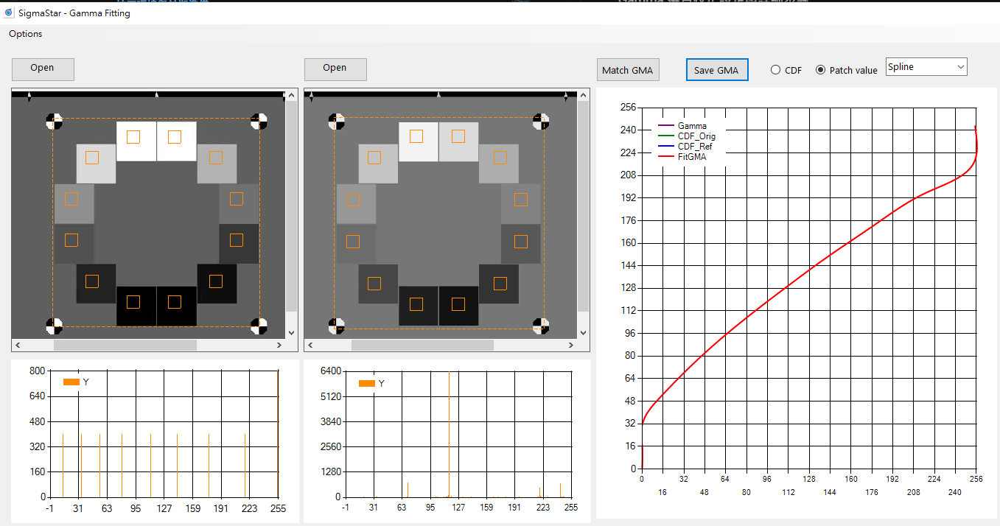
1. 讀取來源（Source）影像數據
    - 點選工具列的 Options -> Raw Setting，輸入正確的原始影像資訊（Width, Height, CFA 等）及 OB（黑位準）值（此步驟不需要設定白平衡）。
    - 點選 Open Source 開啟拍攝好的調整機台 RAW 檔案。
    - 使用鼠標在畫面上拖曳框選 OECF 圖卡的各個色塊，並確認每個 patch 都正確落在對應位置。
2. 讀取目標（Target）影像數據
    - 點選 Open Target 開啟對比機台的 JPG 影像檔案。
    - 重複上述框選色塊的動作（此步驟不需再設定 Raw Setting 資訊）。
3. 設定擬合參數
    - 取值方式 (Value Method)：建議選擇 「Patch values」。
    - 擬合方式 (Fitting Method)：建議選擇 「Exponential」。
4. 執行擬合與存檔
    - 點選 「Match GMA」 按鈕開始執行 Gamma 擬合計算。
    - 觀察曲線：理想的 Gamma 曲線應保持 Smooth（平滑） 且 遞增 的狀態。
    - 手動檢查：若曲線無異常，點選 「Save GMA」 儲存結果。存檔後請務必檢查曲線的頭尾是否分別落在 0 與 1023 處，若不是則需手動修改。
### 三、 注意事項
- 順序依賴：在校正序列中，Gamma 擬合位於 AWB 之後、CCM 之前。
- 對去噪的影響：先完成 Gamma 與顏色校正後再調整去噪（Denoise），會使去噪參數的微調變得容易許多。
- 套用參數：在 Gamma 介面調整完曲線後，必須手動點選 「Write Page」 才能將資料寫入硬體生效，Gamma 模組不會像其他 API 一樣自動寫入（Auto Write）。
## 5. 色彩矩陣校正 (CCM, Color Correction Matrix)
色彩矩陣校正 (CCM, Color Correction Matrix) 的主要目的是透過計算獲得一個 3x3 的校正矩陣，將感測器拍攝到的顏色數據（通常使用 24 色卡）轉換為符合預期的目標顏色，以確保相機在不同色溫下的色彩表現準確。　　
###　CCM 校正的詳細設定與操作步驟：
### 一、 校正前置準備與環境需求
- 先決條件：在進行 CCM 校正之前，必須先完成 Gamma 擬合。這是因為色彩擬合結果極易受到亮度（由 AE 和 Gamma 決定）的影響。
- 拍攝環境：
    - 將 24 色卡放置在標準燈箱中心，佔據畫面 50% 至 80% 的區域。
    - 設定燈箱光源（如 D65、TL84 或 A 燈）。
    - 曝光控制：微調 AE 目標值或燈箱亮度，確保 RAW 影像中 24 色卡的 第 19 格（白格）不會過曝。
    - 擷取影像：使用 API Tool 擷取原始的 RAW 影像檔案。
### 二、 IQ Tool 插件操作步驟 (CCM Analyzer)
請開啟 IQ Tool，從插件選單中選擇 「CCM Analyzer」。
1. 設定來源影像 (Source Image)
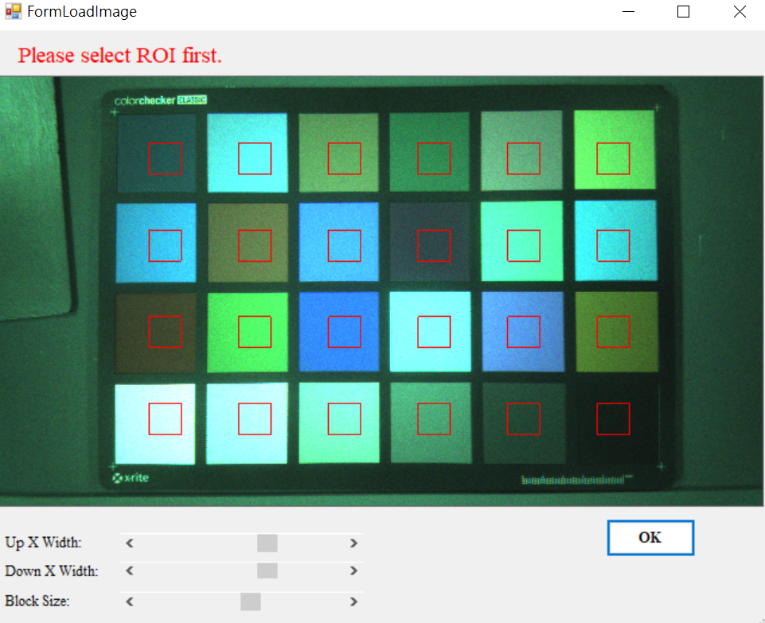
    - 點擊 Set 按鈕設定正確的原始影像資訊（Width, Height, CFA 等）。
    - 點擊 Open Source 開啟拍攝好的 RAW 檔案。
    - 框選色塊：在彈出的視窗中，用滑鼠拖曳紅框以確保 24 個色塊都正確被選中。
2. 設定目標色彩 (Target Image)
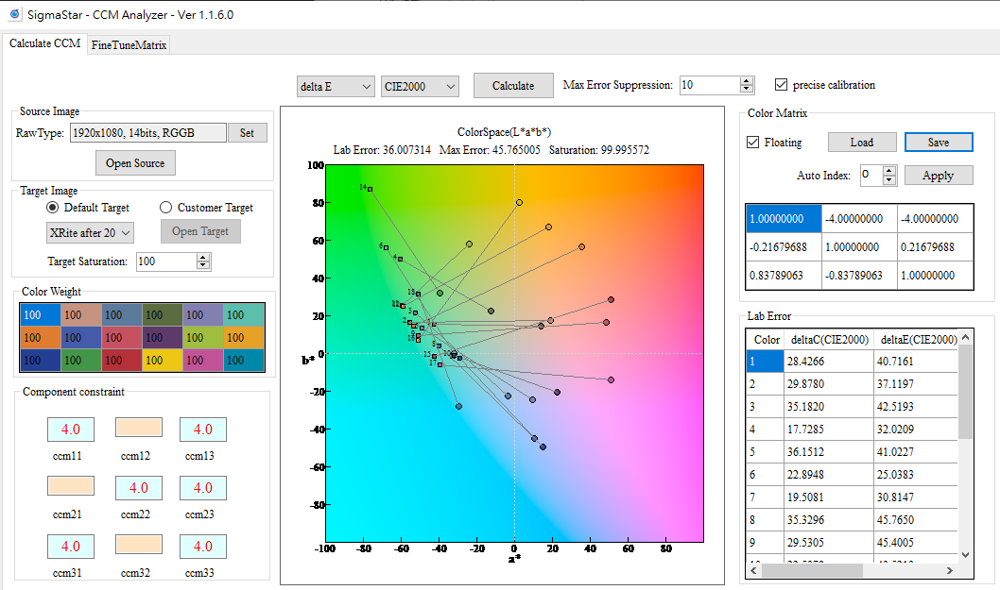
    - 選擇目標模型：可選擇預設目標（如 SkypeCertification, XRite after 2014, BabelColor 等）或自定義目標。
    - 目標飽和度 (Target Saturation)：設定預期的校正後飽和度百分比，建議範圍為 80% ~ 120%（預設 100）。
3. 設定權重與限制
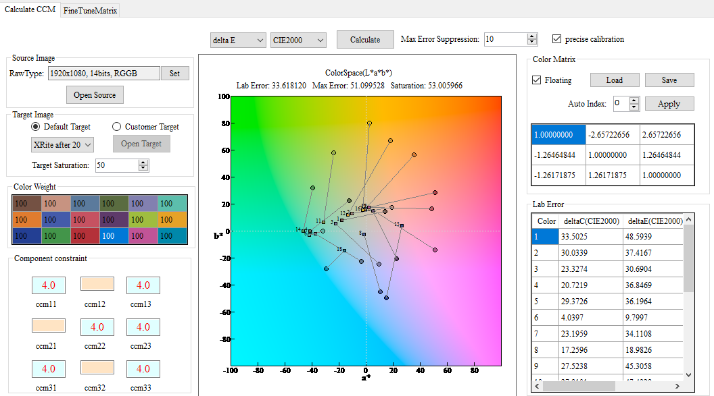
    - 顏色權重 (Color Weight)：可調整特定色塊的權重，權重越高，該顏色的擬合結果越準確（預設 100）。
    - 成分限制 (Component Constraint)：限制矩陣各成分的數值範圍，以防止顏色過度偏移。
4. 執行擬合計算
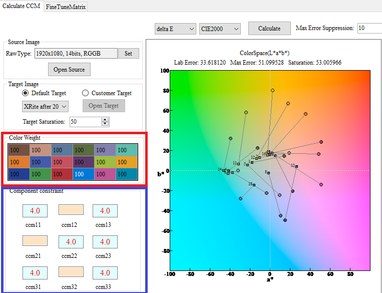
    - 目標函數：選擇 delta C（僅考慮色域誤差）或 delta E（包含亮度誤差）。
    - 色差公式：選擇 CIE 76 或 CIE 2000。
    - 最大誤差抑制 (Max Error Suppression)：預設 10，建議設定在 50 以下，用於在平均誤差與最大誤差之間取得平衡。
    - 點擊 Calculate 按鈕開始計算矩陣。
5. 套用校正結果
    - 取消勾選 Floating，選擇對應的索引編號（Index），點擊 Apply 將結果下載至開發板。
    - 針對剩餘的其他光源重複上述步驟，完成所有色溫點的校正。
### 三、 參數說明與細部調整
- 色溫節點 (CCTthr)：CCM 支持最多 16 組 色溫設定。填寫參數時，必須遵循 Index 0 到 15 對應色溫由低到高 的規則。
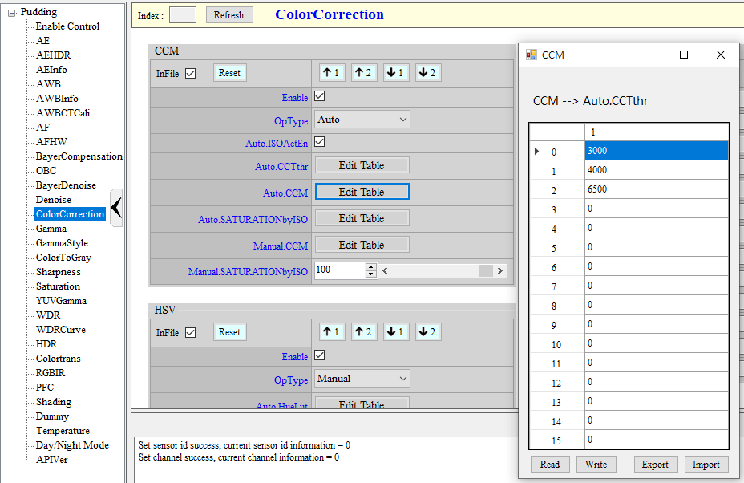
- 矩陣總和檢查：每一橫列（Row）的總和應為 1024（代表 1 倍增益）。若數值不符，需手動微調矩陣以避免畫面整體亮度偏離。
- ISO 飽和度控制 (SATURATIONbyISO)：此參數根據當前 Gain 值，在用戶定義矩陣與單位矩陣（Unit Matrix）之間進行內插調整。值為 0 代表完全不使用 CCM，100 代表完全套用校正後的 CCM。
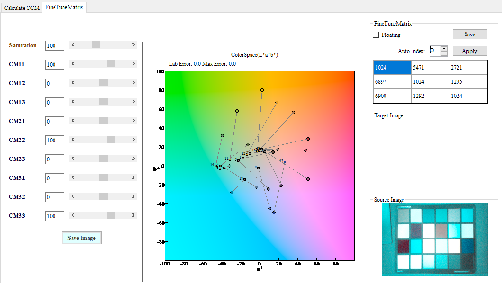
- 夜間模式處理 (ISOActEn)：若勾選此項，當系統進入 Night 模式時，CCM 會自動切換為單位矩陣以降低雜訊干擾。
## 提示：若單靠 CCM 無法達到理想的色彩呈現，可接續使用 HSV 插件 對特定顏色的飽和度與色相進行更細緻的補償。校正完成後，請務必在 AWB 模組中儲存為 Bin 檔案，以確保設定能在開機時自動載入。
## 7. 自動曝光調整 ((AE, Auto Exposure))
自動曝光 (AE, Auto Exposure) 的主要目的在於透過收集到的影像統計數據，自動計算並輸出最適當的光圈值、Sensor 增益（Sensor Gain）、ISP 數位增益（ISP Gain）與快門時間（Shutter），以將畫面的整體亮度控制在最理想的狀態。
由於 AE 的統計值取樣點位於 Gamma 模組之前，因此系統建議的畫面目標亮度（AE Target）約為 470（AE 亮度單位為 8bit * 10，總值域範圍為 0 ~ 2550）。
###　AE 調整的詳細設定與操作步驟：
### 一、 AE 調整關鍵參數與設定說明
在 IQ Tool 的 AE 樹狀節點中，AE 的控制可分為以下幾個核心子模組：
1. 狀態與手動控制 (```AEState```> & ```ManualExposure```)
    - AE State：控制 AE 的運作狀態。Normal AE 為正常自動曝光；Pause AE 則會將曝光參數凍結在當前狀態。在進行手動畫質調校（如去噪、銳化）時，通常會將此參數設為 Pause 以避免亮度變動干擾判斷。
    - FNx10 / SensorGain / ISPGain / US：手動曝光參數。增益（Gain）的基礎倍率以 1024 代表 1 倍增益（1x）；快門（US）單位為微秒 ($\mu s$)47。
2. 曝光行程表 (```AEPlainTbl```)
    - ExpoTblEntry：曝光行程表（由亮至暗排列）。在此表中，每一列（Row）的相鄰節點每次只能變更「光圈、快門、增益」其中一個數值，且數值必須符合 Sensor 的硬體物理限制。
3. 收斂控制 (```AEConverge```)ConvThdIn (內收斂區間)：
    - 當 AE 處於收斂過程中，若畫面亮度已達到 Target ± 內收斂區間，AE 即停止調整。
    - ConvThdOut (外收斂區間)：當前亮度偏差超出 Target ± 外收斂區間 時，系統會重新啟動 AE 收斂程序（建議值為 64）。
    - ConvSpeedY (收斂速度比例)：值域為 0 ~ 1024。數值過小會導致 AE 反應遲緩甚至無法收斂；數值過大則會造成亮度迅速劇烈變化，在視訊畫面上產生閃爍現象。
4. 測光權重與亮度權重 (```AEWinWeight``` & ```AELumaWeight```)
    - WindowWeighting：提供一個 16x16 的測光權重矩陣（支援 Average、Center、Spot 三種預設模式），用以決定畫面中不同區域對曝光計算的貢獻比例。
    - AELumaWeight：可針對特定的亮度（Luma）或飽和像素數量（Saturate Count）給予不同的曝光權重，以提升高對比場景的目標亮度適應性。
5. 動態曝光策略 (```ExposureStrategyEx``` & ```AdaptiveGamma```)
    - ExposureStrategyEx：新版動態曝光策略。系統會分析畫面的直方圖（Histogram），並依照策略動態微調 SceneTarget1314。Count Mode：指定高於/低於特定亮度的統計像素佔總像素的千分比。
        - Target Mode：指定最亮/最暗前特定千分比的平均亮度目標。
        - Priority：設定優先保護暗部細節（DarkTone / 防止欠曝）或亮部細節（BrightTone / 抑制過曝）。
    - AdaptiveGamma：需搭配 StrategyEx 使用，讓 Gamma 曲線能根據動態 AE Target 進行動態混和，顯著增加影像的動態範圍。
### 二、 AE 調整與調校標準步驟
要將一個新 Sensor 的自動曝光調整至最佳狀態，建議依循以下步驟進行調校：
- 步驟 1：建立基礎曝光行程表（Exposure Table）
    - 1. 設定光圈值：確認使用的鏡頭光圈值，將其乘以 10 後填入 ```LongExpoTblEntry``` 的第一欄（例如光圈 F1.6 則填入 16）。  
    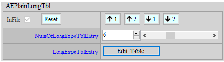
    - 2. 設定最大增益限制：向 Sensor 廠商確認該模組支援的最大增益（Maximum Gain），填入行程表倒數第一列的第三欄（Total Gain）。  
    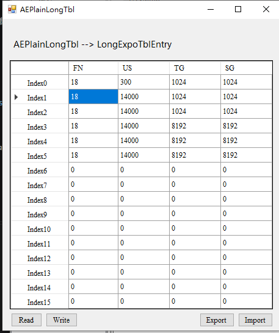
    - 3. ISP Gain 分配：若調校中不希望使用到 ISP 的數位增益（以避免數位降噪劣化），可直接將第三欄（Total Gain）的數值複製到第四欄（Sensor Gain）中，使兩者一致。
- 步驟 2：設定 AE Target 亮度曲線
    - 1. 在不同的環境亮度（BV 值）下，透過 ```AETarget>``` 設定對應的 ```Target Offset```。
    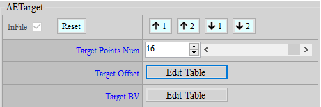
    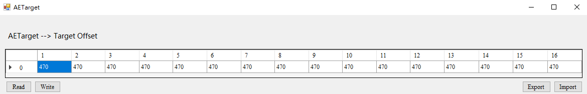
    - 2. 在低照度環境（低 BV）下，若發現暗區雜訊（Noise）難以控制，建議適當調高 AE Target。這能讓 AE 自動拉亮畫面，其控噪效果通常優於直接使用 WDR 模組強行拉亮暗部。
- 步驟 3：調整收斂速度與防抖動
    - 1. 變更環境光源，觀察曝光收斂過程。逐步微調 ConvSpeedY 的曲線，確保在不同亮度轉換下，畫面亮度能平滑、無閃爍地過渡到目標亮度。
    - 2. 若畫面常因局部的微小變化（如風吹草動、路人走過）頻繁觸發 AE 抖動，請開啟 ```AEStabilizer``` 功能。將 DiffThd 設為 2，並設定 Percent（預設 50%），以確保局部變動比例小於閥值時 AE 保持穩定。
    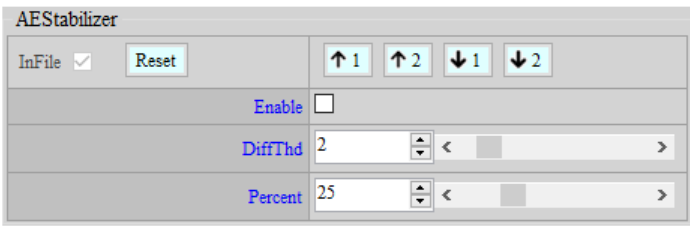
- 步驟 4：設定抗閃爍 (De-flicker)
    - 1. 開啟 ```FlickerEx```（新版偵測抗閃爍）並將工作模式（OpType）設為 Auto。
    - 2. 調整 ```AmpSensitivity```（建議值 70）與 ```ScoreThd```（建議值 50），使系統能精確辨識環境中的光源頻率（50Hz / 60Hz），並自動調整快門時間以消除滾動的條紋（Banding）。
    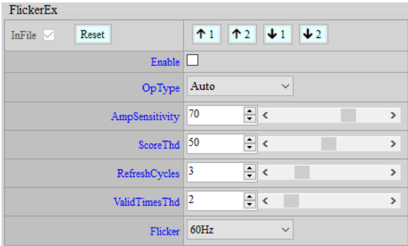
- 步驟 5：調優動態曝光策略（以戶外與背光人臉為例）
    - 1. 戶外強光防過曝：若戶外畫面容易過曝，可啟用 ```ExposureStrategyEx```。調整 Bright Tone (BT) 參數，降低 ```BT_Target```，使亮區獲得更好的細節保護。
    - 2. 背光人臉拉亮：若遇到背光導致人臉過暗：
        - 可先將 PreEnhance 設在 11 ~ 15（值越大暗處拉得越亮，但畫面會稍顯朦朧）。
        - 亦可將 Exposure Strategy 優先權設為 DarkTone，調整 ```DT_Target``` 與 ```DT_MaxOffsetUp```，讓系統在偵測到大面積暗部時，自動調高 AE Target 以補償人臉亮度。
    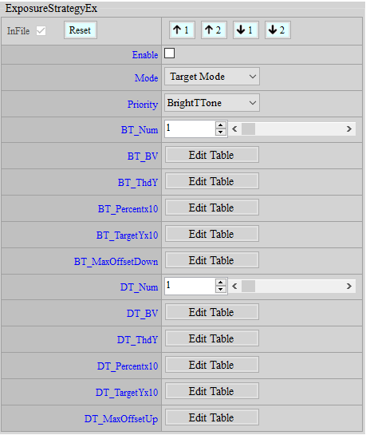
- 步驟 6：套用與保存設定
    - 1. 調整完畢後，在 IQ Tool 介面上點擊 Read Page 將板子上的當前參數讀回。
    - 2. 點選上方選單 File -> Save -> Bin file，將整套調整好的 AE 參數打包儲存至 API bin 檔案中，確保開機時能自動加載生效。

## 7. 畫質調優與去噪 (Tuning & Denoise)
### 降噪調整 (NR3D/NRLuma)
降噪調校（Denoise）是畫質優化非常核心的關鍵。降噪通常分為時域降噪（NR3D）與空域降噪（NRLuma/NRChroma），其主要目的是在「壓抑雜訊」與「保留細節/避免拖影」之間取得最佳平衡。
- ### 一、 調校前置準備（Pre-requisites）
    為了確保調校不受其他自動演算法或參數插值的干擾，請務必遵循以下設定：
    1. 套用基礎校正：確保 OBC（黑位準）、ALSC/LSC（陰影校正）、Gamma 與 Color（CCM 顏色矩陣）皆已校正並套用。
    2. 固定曝光（Manual SV 模式）：將 AE 設為手動的 SV_Mode，直接給定每個 ISO 節點的特定 Gain 值（增益），並由低倍增益（Low Gain）依序往高倍增益（High Gain）逐點調校。
    3. 保持畫面安定（高 Gain 技巧）：在調校高 Gain 節點時，若因為無降噪且開啟 Sharpness 導致畫面雜訊過大、難以觀察，建議在開始調校前暫時將 Y.TF.STR（時域降噪強度）開強，讓畫面定住，以便觀察與調整其他前級功能。
    4. 環境確認：確保鏡頭擦拭乾淨、確實對焦，且 RGB 感測器的 IR-cut 濾光片確實蓋上。
- ### 二、 NR3D（時域降噪）調整設定與步驟
    NR3D 主要是用來降低隨時間跳動的 Y（亮度）和 Color（色彩）雜訊，開強能有效控噪，但副作用是會產生拖影（Ghost images）。
        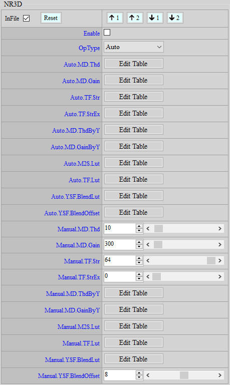
    - 核心參數說明
        - TF.LUT：利用畫面差值與運動資訊來決定時域降噪強度的查找表。
        - MD.Thd / MD.Gain：運動偵測閥值與比例控制。MD.Thd 值越大，低於閥值的區域越容易被判斷為靜止，3DNR 就越強（建議不要超過 10）。
        - M2S.LUT：動態區轉靜止區的收斂控制。值越大時域降噪越弱、空域降噪越強。曲線必須維持平滑，否則物體移動後的過渡邊界會顯得極不自然。
        - Y.SF.BlendLUT：根據運動偵測（Motion）資訊動態調整空域降噪（NRLuma）強度的比例（左至右代表動到靜）。
    - 調校步驟
        1. 靜止畫面降噪調整：
            - 先針對完全靜止的畫面，降低雜訊跳動。
            - 將 TF.Str 設為 63（或最大值），然後逐步增加 MD.Gain 直到畫面整體看起來安定為止。
            - 若 MD.Gain 需要設得非常大畫面才安定，可適度調高 MD.Thd，但建議不超過 10。
        2. 移動後殘影消除（動到靜過渡）：
            - 觀察物體移動過後的區域，調整 M2S.LUT。
            - 若希望殘影越少，需將值調大（此時移動過後的區域空域降噪會變強且維持較久，但畫面會稍顯擾動）；若希望移動後的區域迅速變清楚且能容忍輕微殘影，則將值調小。
            - 官方推薦平滑曲線建議值：{24, 18, 11, 8, 7, 7, 6, 6, 6, 5, 5, 5, 5, 4, 4, 4}。
        3. 動態模糊與雜訊微調平衡：
            - 逐步加大 Y.SF.BlendLUT 的值，平衡移動物體的模糊度與雜訊。
            - 重要：最後一格（代表完全靜止）建議固定為 0，以最大程度保留靜止畫面的細節。
        4. 解決高 Gain 粉紅色拖影：
            - 在高 Gain 且移動強烈的區域，如果 TF.LUT 下降不夠快，移動物體邊緣可能會出現粉紅色拖影。
            - 此時可啟用 AREn（時域降噪限制開關），並透過 ARLumaTh 與 ARMotTh 限制在較亮、較動的區域將 3DNR 強度歸零，以消除粉紅拖影。
- ### 三、 NRLuma（空域亮度降噪）調整設定與步驟
    在 3DNR 調整完成後，若畫面仍有殘留的空間微粒雜訊，會使用 NRLuma（2D 降噪） 進行細部微調。
        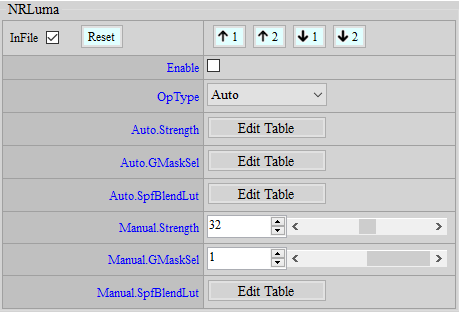
    - 核心參數說明（以新版算法為例）
        - Strength：空域亮度降噪的整體強度控制（0 ~ 63）。
        - KernelStr：空域 Filter 核心強度（0 ~ 7）。
        - KernelStrByDiff：Filter 混合權重表，橫軸為周圍點與中心點的差異，縱軸為權重。
    - 調校步驟
        1. 首先將 Strength 設為最大值（63），此時降噪效果最明顯。
        2. 調整 KernelStr，在「壓抑顆粒雜訊」與「保留細節（如物體紋理）」之間找到最佳的平衡點。
        3. 若 KernelStr 調整後仍無法達到預期（例如平坦區不夠平滑，或細節被抹得太嚴重），可以微調 KernelStrByDiff 的曲線（正常情況下，差異越小權重設越大，代表越相似的區域抹得越平）。
        4. 最後，適當調降 Strength 到畫面看起來自然、不顯得油畫感即可。
- ### 四、 NRLuma_Adv（進階空域亮度降噪）調整設定與步驟
    NRLuma_Adv 採用了更先進的邊緣偵測與分級算法（支援 L1、L2 邊緣），能更精準地分離出「邊緣區」與「平坦區」，實現邊緣不失真、平坦區極致平滑的效果。
        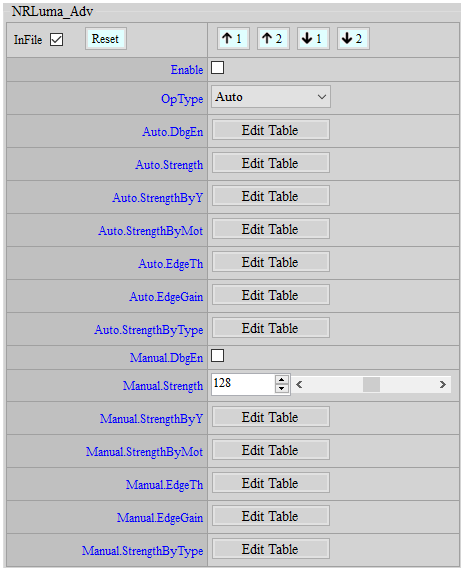
    - 核心參數說明
        - DbgMode：Debug 模式。開啟後畫面越亮代表越偏向 Edge（邊緣）區，越暗代表越偏向 Non-Edge（平坦）區，可用於觀察邊緣偵測是否精確。
        - EdgeTh：Edge 偵測閥值，低於閥值判定為雜訊（會進行 NR 抹平），高於閥值判定為邊緣（減弱 NR 保護細節）。
        - StrengthByType：混和 Filter。StrengthByType 傾向保留細節，StrengthByType 傾向強效去噪，系統會依邊緣強度動態混和兩者。
        - SmoDeltaSft / SmoDeltaLut：邊緣區域內部的細部去噪參數。
    - 調校步驟
        1. 區分邊緣與平坦區：
            - 將 DbgMode 設為 1 或 3，觀察畫面。
            - 微調 EdgeTh，確保畫面中真正的物體邊緣（如文字、線條、人臉輪廓）被精準辨識為亮區，而無意義的背景雜訊區保持為暗區。
        2. 設定基礎降噪強度：
            - 將 DbgMode 設回 0。
            - 將 StrengthByY（亮度強度）與 StrengthByMot（運動強度）先設為 0。
            - 調整 StrengthByType 與 StrengthByType，分別給予邊緣區與非邊緣區最適當的基礎降噪力量。
        3. 亮度與動態補強：
            - 如果發現暗處雜訊仍然明顯，可調高 StrengthByY 對應暗區的節點。
            - 如果運動時空域降噪需要加強，可微調 StrengthByMot。
        4. 邊緣去噪微調：
            - 若邊緣區（Edge 內部）仍有跳動雜訊，可以透過調整 SmoDeltaSft（值越大去噪越強）和 SmoDeltaLut 來讓邊緣兩側的過渡更加平順、乾淨。
### 顏色降噪 / 色彩降噪（NRChroma）
NRChroma（顏色降噪 / 色彩降噪） 模組主要用於壓抑畫面中的彩色雜訊（Color noise / Chroma noise）。此調整可分為基礎顏色降噪 (NRChroma) 與進階顏色降噪 (NRChroma_Adv) 兩種模組。
- ### 一、 NRChroma（基礎顏色降噪）
    這是一個較為簡單的降噪模組。其副作用是如果調整強度過高，容易導致嚴重的色彩溢出 / 色溢（Color bleeding），因此在調校時建議不要開得太強。
        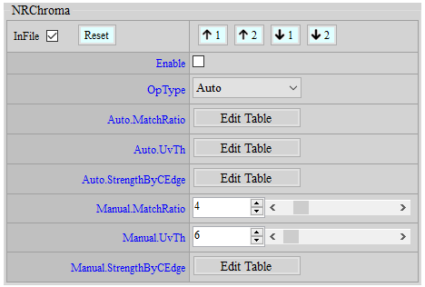
    - 核心參數說明
        - MatchRatio（符合比例閥值）：值域範圍 0 ~ 31。數值設定越大，顏色降噪強度越強。
        - UvTh（U/V 雜訊閥值）：值域範圍 0 ~ 256。數值設定越大，降噪強度越強。
        - StrengthByCEdge：依據 color edge（顏色邊緣）強度來控制 NRChroma 的降噪力量。值域範圍 0 ~ 511，數值越大則降噪越強。
    - 調校步驟
        1. 擴散彩色雜訊：調整 MatchRatio 和 UvTh。此時會觀測到畫面上的彩色雜訊開始散開。請微調這兩個參數到一個可接受的範圍，注意避免過強而產生色彩溢出現象。
        2. 抑制邊緣色溢：降低 StrengthByCEdge 參數，用以進一步壓抑或修復有色彩溢出（Color-bleeding）的邊緣區域。
- ### 二、 NRChroma_Adv（進階顏色降噪）
    NRChroma_Adv 提供了更細緻的控制，可針對不同的亮度、邊緣、運動狀態以及 Y/C（亮度/色度）差異進行多維度的顏色降噪控制。
        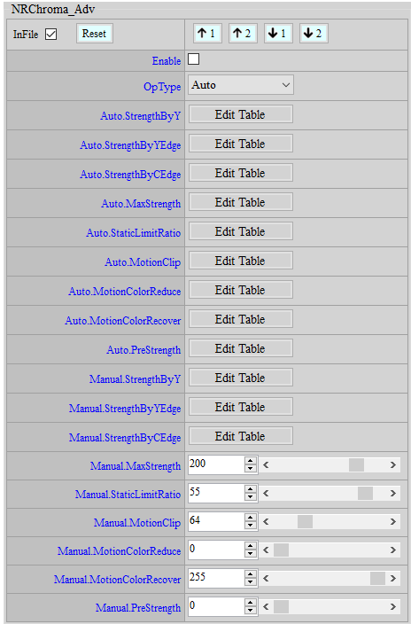
    - 核心參數說明
        - StrengthByY：針對不同亮度給予不同的 NR 強度控制。橫軸由左至右代表亮度由暗到亮，值域範圍 0 ~ 255，值越大越強。
        - StrengthByYEdge：利用 Luma（亮度）偵測 Edge 程度，並針對不同 Edge 大小給予不同的 NR 強度控制。橫軸越右邊代表 Edge 越大，值域 0 ~ 63，值越大越強。
        - StrengthByCEdge：利用 Chroma（色度）偵測 Edge 程度，並給予對應的 NR 強度。橫軸越右邊代表 Edge 越大，值域 0 ~ 255，值越大越強。
        - MaxStrength：控制 Y/C 差異小（色差小）的區域之 NR 強度。值域 0 ~ 255，值越大降噪越強。
        - StrengthByMot：依據運動（Motion）資訊調整 NR 強度。橫軸代表 motion，越右邊越偏向靜止，值域 0 ~ 63，值越大越強。
        - MotionClip：針對移動區域額外給予的 NR 強度。值域 0 ~ 255，值越大降噪越強。
        - MotionColorReduce：針對移動區域降低飽和度（飽和度降低能使彩色雜訊更容易被移除）。值域 0 ~ 255，值越大飽和度降越多。
        - MotionColorRecover：針對移動區域，可依據 MotionColorReduce 所降低的比例再將增益（Gain）乘回來。值域 0 ~ 255，值越大飽和度回復越多。
        - PreStrength：針對 Chroma（色度）預先進行簡單的去噪處理。值域 0 ~ 128，值越大越強。
    - 調校步驟
        1. 關閉動態補強：在開始調校前，先將 MotionClip 設定為 0。
        2. 調整靜態區降噪：觀察畫面中的靜態區域，調整 MaxStrength 和 StrengthByMot，將靜態畫面下的彩色雜訊調整到可以接受的乾淨程度。
        3. 補強動態區降噪：觀察畫面中的動態（移動）區域，開始逐步調高 MotionClip。此步驟會在靜態降噪的基礎上，額外增強移動部分的去噪力量。
        ### 註：如果發現將 MotionClip 調整到極限後，動態區色噪仍然不夠乾淨，請回到步驟 2 重新加強基礎的靜態 NR 強度。
        4. 動態飽和度平衡（選用）：
            - 若移動區域的彩色雜訊仍難以去除，可調高 MotionColorReduce，這會壓抑移動物體的飽和度，使 NRChroma_Adv 能更輕易地消滅彩色雜訊。
            - 如果不希望看到移動區域的物體顏色變淡，可再微調拉高 MotionColorRecover，把損失的飽和度再拉回來。
## ⚙️ 完成降噪調整（3DNR、Luma 降噪與 Chroma 降噪）後，畫面的清晰度可能會有微幅下降。可以接著配合調整 Sharpness (銳化強度) 參數，以還原影像的邊緣與細節。
### 銳化強度（Sharpness）
Sharpness（銳化強度） 的調校目的是為了在不同亮度、畫面區域、以及動態/靜態場景下，精確控制影像邊緣與細節紋理的清晰度，並避免銳化過度導致的雜訊放大或鋸齒狀邊緣。  
銳化調整通常在 AWB、Gamma 和色彩矩陣（CCM）等基礎校正完成後進行。
- ### 一、 核心參數與設定說明
    調校介面主要分為 Sharpness（基礎） 與 Sharpness_EX（進階） 兩個模組：  
        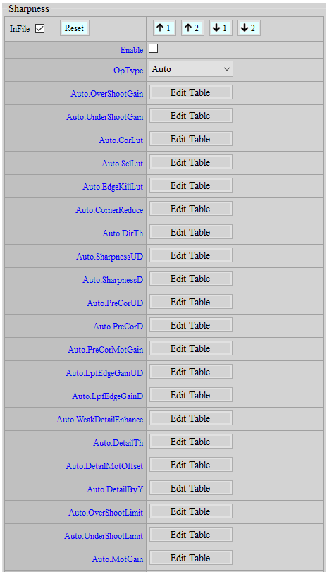
        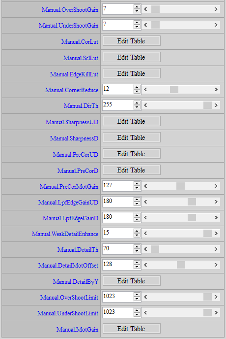
        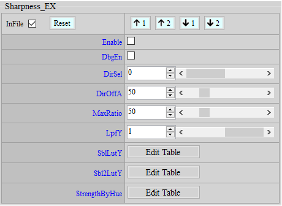
    1. 基礎邊緣控制（黑白邊）  
        - OverShootGain（白邊強度）：控制影像亮部邊緣（白邊）的銳化強度，值越大邊緣越白、越銳利，但過高會產生白邊刺眼感。
        - UnderShootGain（黑邊強度）：控制影像暗部邊緣（黑邊）的銳化強度。
        - OverShootLimit / UnderShootLimit：依據周圍最亮/最暗點限制邊緣的過沖。設為 0 時，邊緣上限不會超過周圍最亮/最暗的 Y 值（即完全不產生過沖邊緣）。
    2. 頻段與向性控制 (Filter)
        系統提供 6 種不同的邊緣濾波器（無向性與方向性，分別有高/中/中低頻段）：
        - SharpnessUD（無向性邊緣強度）：用於增強發絲、草地等細小無規則的紋理細節。SharpnessUD 作用於高頻，SharpnessUD作用於低頻。
        - SharpnessD（方向性邊緣強度）：用於增強規則的影像邊緣（如線條、建築邊界），但調整過強會導致鋸齒（jaggy）現象。
        - PreCorUD / PreCorD：分別對無向性與方向性邊緣進行 Coring（去噪/同減動作）。數值越大，細小的微弱邊緣越會被忽略而不做銳化，有助於平坦區的控噪。
    3. 平坦區與亮度控噪
        - CorLut（亮度門檻查找表）：根據畫面亮度（Luma）調整邊緣輸出。數值越大則該亮度下的邊緣越弱，可用於抑制因銳化產生的雜訊，但會稍微犧牲細節。
        - SclLut / SclByY：根據畫面亮度調整整體銳化增益，值越大邊緣越強。常用於降低暗處的銳化，以避免暗部雜訊被過度放大。
        - EdgeKillLut（小邊緣消除查找表）：根據輸入的邊緣強度來重新映射輸出邊緣。通常建議將第一格節點（Node 0）設為 0，這樣可以將微小的小邊緣（通常是雜訊）直接抹平，讓平坦區更平順。
        - CornerReduce（角落銳度衰減）：離畫面中心越遠，鏡頭光學表現越差，且邊緣常因 ALSC（透鏡陰影補償）導致角落雜訊較大。使用此參數可讓銳化強度從中心向角落遞減，改善周邊雜訊。
    4. 運動與色相控制 (Motion & Hue)
        - GainByMot / MotionGain：根據運動量（Motion）調整最終邊緣強度。橫軸越右邊代表越偏靜止。運動時（左側）適度調低可減少運動殘影處的雜訊。
        - StrengthByHue：根據特定色相（Hue）調整銳化。例如可以故意調降膚色區域的銳利度以減少人臉移動雜訊，或增加綠色色相來強化樹木植物細節。
- ### 二、 標準調校步驟
    請開啟 IQ Tool，從左側選單點選 Sharpness，建議遵循以下步驟進行調校：
    - 步驟 1：初步設定黑白邊強度
        - 觀察畫面中具有強烈明暗對比的邊緣（例如黑白線條、文字邊緣）。
        - 微調 OverShootGain（白邊）和 UnderShootGain（黑邊）至黑白邊邊緣清晰且看起來自然、不刺眼的程度。
            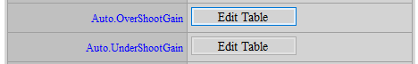
    - 步驟 2：分配無向性與方向性濾波器
        - 系統有高中低頻的無向性/方向性濾波器。您可嘗試單獨將某些濾波器設為 0，觀察不同頻段在畫面上的影響。
        - 調整 MidRatioUDByMot、HighRatioUDByMot 與 HighRatioUDByState 來取得高低頻段混合的最佳比例。
        - 調整 DirRatioByState 權衡無向性與方向性邊緣的混合。通常建議僅在單純的強邊緣區使用方向性 SharpnessD（連續性佳），其餘複雜區與平坦區以無向性 SharpnessUD 為主，以免產生奇怪的水平/垂直條紋。
            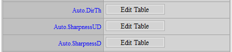
    - 步驟 3：控制平坦區與暗處雜訊
        - 觀察平坦區：是否有無意義的顆粒雜訊被銳化放大。若有，逐步調大高頻與低頻的 PreCorUD 與 PreCorD（Coring 值），將雜訊從銳化範圍中剔除。
            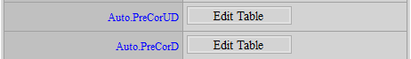
        - 利用 EdgeKillLut：將 EdgeKillLut 的前幾個斷點數值降低，可以更有效地壓抑微小邊緣，使平坦背景顯得非常乾淨平順。
            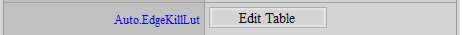
        - 觀察暗區：若暗處雜訊因銳化變得明顯，可調高 SclLut（或 SclByY）對應暗區亮度的節點，藉此降低暗部的銳化增益。
            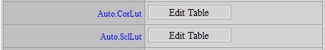
    - 步驟 4：優化鏡頭周邊（角落）畫質
        - 觀察畫面角落。若角落因 ALSC 增益補償而產生較多雜訊，可將 CornerReduce 數值調小，使角落銳度衰減，進而抑制邊緣雜訊。
            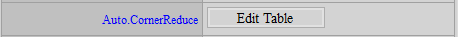
    - 步驟 5：動態降噪與運動補償
        - 當畫面中有物體移動時，若移動物體邊緣雜訊過大，可微調 GainByMot 與 StdAdjByMot，讓系統在偵測到運動（Motion 偏向左側）時，自動調降銳化強度，使動態畫面保持安定。
        - 此步驟建議搭配 3DNR 與 NRLuma 進行反覆微調，達到靜態細節飽滿、動態平順無雜訊的平衡。
    - 步驟 6：白邊限制與細部微調
        - 若在某些高對比場景下黑白邊仍會產生極端的過曝白點，可適當降低 OverShootLimit 與 UnderShootLimit，將邊緣的過沖物理限制在周圍點的亮度範圍內。
        - 確認無誤後，於 IQ Tool 介面點選 Read Page 讀回，並儲存為 Bin file 載入至系統中。
### 色相與飽和度調整（HSV, Hue, Saturation, Value）
HSV (Hue, Saturation, Value) 調整屬於色彩校正（Color Correction）的第二階段
。當色彩校正矩陣（CCM）套用後，若仍有局部特定顏色需要微調，可使用 HSV 模組將整個 360 度色域平均切成 24 等分，針對每個等分的**色相（Hue）與飽和度（Saturation）**進行獨立且細緻的增減與旋轉。
- ### 一、 HSV 核心參數說明
    HSV 參數的切換主要分為「依據環境色溫 (CCT)」與「依據增益值 (ISO/Gain)」兩種機制，調校時必須確認當前參數的切換依賴關係：
        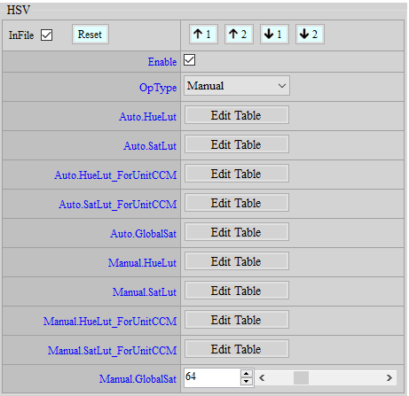
    1. 色溫關聯參數 (CCT-based)
    這類參數支援最多 16 組色溫節點（與 CCM 共用 CCTthr 節點設定），索引由小到大對應色溫由低到高。
    - HueLut (色相查找表)：控制 24 個等分色相的旋轉角度。值域為 -64 ~ 64（0 代表不改變）。
    - SatLut (飽和度查找表)：控制 24 個等分色相的局部飽和度。值域為 0 ~ 255（64 代表 1 倍，即不改變）。
    - HueLut_ForUnitCCM / SatLut_ForUnitCCM：當系統在夜間或特定低照度下切換至**單位矩陣（Unit CCM）**時，對應啟用的 HSV 色相與飽和度查找表。
    2. 增益關聯參數 (Gain/ISO-based)
    這類參數會隨影像的 Gain 值（ISO 節點）變化進行內插與切換。
    - HueLut_ByIso / SatLut_ByIso：隨系統 Gain 值動態切換的局部色相與飽和度控制。
    - GlobalSat (整體飽和度)：控制畫面的全局飽和度，隨 Gain 值切換。值域為 0 ~ 255（64 代表 1 倍）。
        - ### 調校控噪秘訣：若要降低低照度下的雜訊（Noise），建議使用 GlobalSat 來調降飽和度，其控噪效果較佳；若要提高飽和度，則建議使用 YUV Domain 的 Saturation API，較不易引起暗部雜訊上升。
- ### 二、 HSV 調校標準步驟
    在開始 HSV 調整之前，請確保已完成 OBC（黑位準）、AWB（白平衡）、Gamma 擬合與 CCM（色彩矩陣） 的基礎校正並套用。
    - 步驟 1：開啟 HSV 模組與設定模式
    1. 在 IQ Tool 左側功能樹中點選 HSV 節點。
    2. 勾選 Enable 啟用 HSV 功能。
    3. 將 OpType（工作模式）設定為 Auto（自動模式，系統將根據色溫與 Gain 自動內插參數）。
    - 步驟 2：局部色相微調 (Hue Adjustment)
        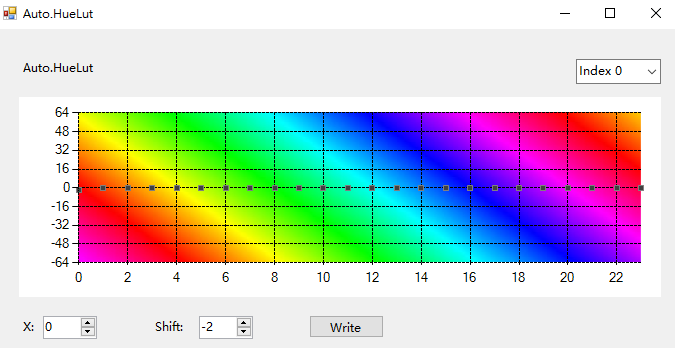
    1. 點擊 ```Auto.HueLut``` 旁的 Edit Table 按鈕，彈出彩色漸層的曲線調校介面。
    2. 在介面右上方下拉選單中，選擇當前環境色溫對應的 Index（例如 Index 0 代表低色溫，Index 15 代表高色溫）。
    3. 觀察畫面中需要修正的顏色（例如人臉膚色偏黃、或是特定綠色植物偏藍）。
    4. 在色相格（0 ~ 23 共 24 格）中，找到該顏色落點的控制點。
    5. 用滑鼠向上或向下拖曳該控制點，使色相旋轉，直到畫面顏色符合預期。
    6. 調整完畢後，點擊 Write 將設定寫入開發板即時預覽。
    - 步驟 3：局部飽和度微調 (Saturation Adjustment)
        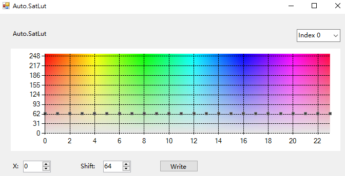    
    1. 點擊 ```Auto.SatLut``` 旁的 Edit Table。
    2. 同樣先選擇對應環境色溫的 Index。
    3. 針對需要特別強調或壓抑的色彩控制點進行拖曳：
        - 若某個顏色過於刺眼或產生色溢，可將該點向下拖曳（數值小於 64）降低飽和度。
        - 若希望特定顏色（如紅色或藍色）更鮮豔，可向上拖曳（數值大於 64）提升飽和度。
    4. 點擊 Write 套用。
    - 步驟 4：低照度與夜間模式參數配對 (Unit CCM)
    1. 若您的系統開啟了 ISOActEn（夜間自動將 CCM 切換為單位矩陣以降低雜訊），當光線變暗、系統切入夜間時，原本的 ```HueLut``` / ```SatLut``` 將不再適用。
    2. 此時，必須調整 ```Auto.HueLut_ForUnitCCM``` 與 ```Auto.SatLut_ForUnitCCM``` 查找表，以確保在單位矩陣下，畫面仍能保有自然、不嚴重色偏的基礎色彩表現。
        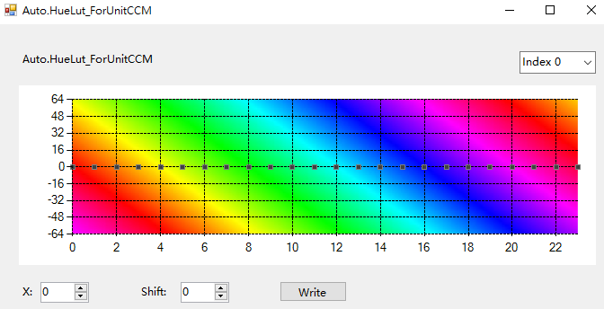
        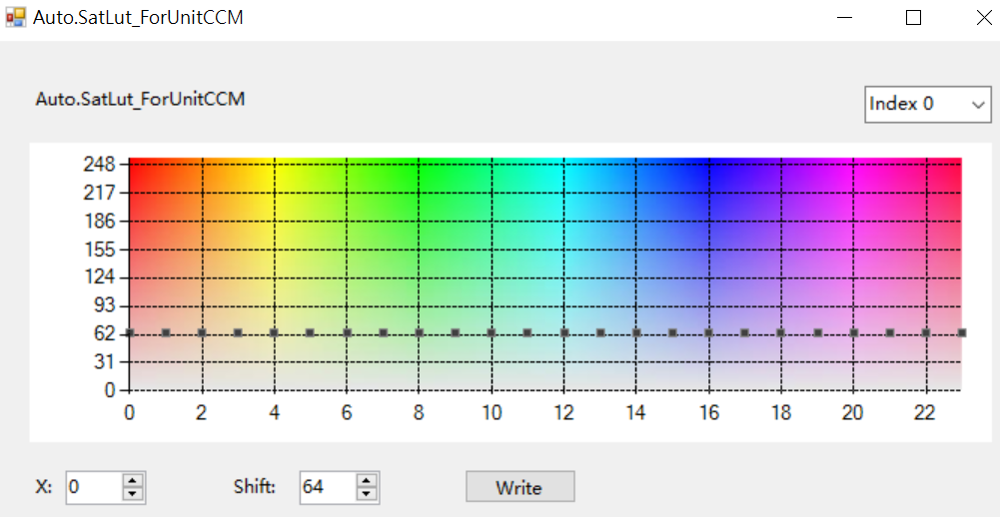
    - 步驟 5：隨 Gain 變動之動態微調 (By ISO)
    1. 若發現在高增益（高 ISO）環境下，特定顏色因去噪（Denoise）或雜訊干擾而產生色偏或雜訊放大。
    2. 可編輯 ```HueLut_ByIso```<--目前工具無此設定 與 ```Auto.GlobalSat``` 參數表，讓系統隨 ISO 增高自動調降特定敏感顏色（如暗部或膚色）的飽和度，達到更好的雜訊抑制效果。
        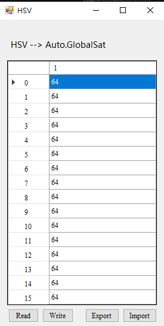    
    - 步驟 6：讀回參數與儲存 Bin 檔
    1. 當所有色溫節點與高低 ISO 參數皆微調滿意後，在 AWBCTCali 或 AWB 模組頁面中點擊 **Read Page**。
    2. 將板子上所有動態寫入的設定完全讀回至 IQ Tool。
    3. 點選上方選單 File -> Save -> Bin file，將整套調校完畢的參數匯出為 ```.bin``` 檔案，完成色彩微調流程。
### 寬動態 (WDR，Wide Dynamic Range)
WDR (Wide Dynamic Range，寬動態) 主要是透過區域性的影像動態範圍調整，讓同一個畫面中可以同時看清亮部與暗部的細節
。此技術採用 block-based local histogram equalization (分塊局部直方圖均衡化) 的方式，來加強區域性的影像動態範圍。
- ### 一、 WDR 關鍵參數說明
    WDR 的調整參數主要可以分為亮度與對比度控制、細節增強、去色彩控噪以及連動控制四個部分：
    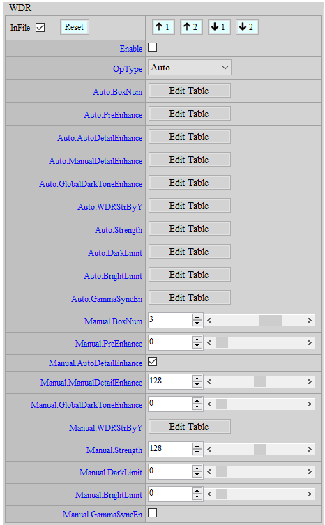    
    1. 亮度與對比度控制
    - BoxNum (分塊數量)：根據 Sensor 的長寬比例提供 1~4 的大小選擇。數字愈大，分塊愈多且愈小，適合用來優化與關注畫面中的細小對象；而尺度設大（數字小）畫面整體表現較為自然，且此參數不支援 by ISO 變動。
    - GlobalDarkToneEnhance / DarkToneEnhance (全局暗處增亮曲線)：提供 16 條預設的曲線供選擇（0~15），數字愈大代表暗處拉得愈亮。
        - ### 註：HDR 模式與 Linear 模式的 16 條預設曲線並不相同。
        - ## 重要：不建議 by ISO 切換不同的 DarkToneEnhance 曲線，否則容易發生畫面閃爍（Flicker）的問題。
    - Strength (整體強度)：WDR 局部色調映射（LTM）的整體強度控制（0~255），數值愈大寬動態效果愈強。
    - WDRStrByY (亮度分區強度控制)：一組 33 個節點的查找表，由左至右對應畫面由暗到亮的區域，用以控制不同亮度位置的 WDR 作用強度。
    - DarkLimit / BrightLimit (暗區/亮區限制)：用以限制 WDR 在極暗或極亮區域的作用。如果您不希望暗處被過度拉亮（導致色彩異常或雜訊過大），可調高 DarkLimit；若不希望亮區被拉得太暗，可調高 BrightLimit。
    2. 細節增強
    - PreEnhance (亮區動態區間比例)：預設值為 2，數值愈大（如開啟新版支援的 11~15）暗處會拉得愈亮，但畫面整體會顯得稍濛。
    - AutoDetailEnhance / ManualDetailEnhance：細節加強控制。開啟 Auto（1）時系統會自動做銳度補強；若關閉並使用手動，數值 128 代表 1 倍，大於 128 畫面變銳利，小於 128 畫面變模糊。
    3. 去色彩控噪 (De-saturation)
    - DeSatLut：隨亮度調整去色彩功能的程度。橫軸由左至右對應亮度由暗到亮，縱軸為色彩增益（128 = 1x），數值愈小去色彩愈強，畫面愈偏灰。主要用於解決因 WDR 拉得太強導致高增益處出現色偏或雜訊顯眼的問題。
    - DeSatSrc：去色彩的亮度來源（0 = 過完 Curve1 的亮度，1 = 過完 global tone 的亮度，2 = WDR 處理前的原始亮度）。
    4. 連動控制
    - GammaSyncEn (Gamma 連動開關)：當 WDR 與 Gamma 曲線連動時能達到最佳效果，但若您的主 Gamma 曲線有設定 by ISO 切換，開啟連動會導致畫面閃爍。此時務必將其設為 disable（關閉）。
    - StrengthByOpsCnt：依據分塊內的 local WDR 反向行為個數來等比例調降 WDR 強度。可用於減輕因 WDR 作用過強導致的亮度反轉或小區塊過暗/過亮問題。
- ### 二、 WDR 調校步驟
    當您需要調整一個場景的 WDR 時，建議依循以下標準步驟進行：
    - 步驟 1：啟用並確認預設效果
        - 在 WDR 調整介面上勾選 Enable，觀察預設效果是否足夠。
        - 根據場景中想要關注的目標物體大小，優先選擇 BoxNum。一般為了兼容全場景，建議選擇 2 或 3（尺度設大畫面較為自然）。
    - 步驟 2：調整 LTM 整體強度
        - 如果寬動態效果太強或太弱，直接微調 Strength 參數。
        - 調校控噪技巧：Strength 通常不宜設得太大，特別是在低照度（低光）場景中。建議此時適度降低 WDR 力量，改用前級的 RGB Gamma 或 Y Gamma 來調亮畫面，如此較不容易拉出明顯的暗部噪點，且能保持較好的對比度。
    - 步驟 3：調整全局亮度分配 (Dark Tone)
        - 如果對暗部的拉亮效果不滿意，可以調整 GlobalDarkToneEnhance 的曲線編號（0~15）。
        - 若預設的 16 條曲線不敷使用，可開啟 WDRCurve 進行自定義，手動繪製一條平滑的亮度分配曲線，並透過調整 Curve1 與 Curve2（後級亮度曲線）將暗部提亮。
    - 步驟 4：針對不同亮度節點微調 (WDRStrByY)
        - 若想要進一步微調，可針對 WDRStrByY 進行拉動。
        - 建議將左側暗處的強度適度減弱，這樣可以在保留畫面對比度的同時，有效抑制暗區雜訊。
    - 步驟 5：設定極端亮度限制
        - 若 WDR 拉亮暗處後產生了色彩異常或雜訊難以控制的不良反應，請微調 DarkLimit（注意：此參數的有效效果主要集中在 245~255 的極端區間，調整時需要精細微調）。
    - 步驟 6：消除畫質異常
        - 解決亮度反轉/光暈：若畫面出現小區塊過暗、過亮或亮度反轉，請微調 StrengthByOpsCnt。
        - 解決高 Gain 色偏：若高增益下畫面因拉亮而色偏，請調降 DeSatLut 來進行局部去色彩（使色偏處偏灰）。
        - 防閃爍確認：檢查 Gamma 是否有隨 ISO 切換，若有，請確保 GammaSyncEn 設為 disable。
### 去霧功能（Defog）
Defog（去霧功能） 模組主要用於提升因霧氣、霾害或低對比環境下影像的對比度、亮度與灰階呈現，以達到更通透、清晰的畫面效果。
- ### 一、 Defog 關鍵參數說明
    Defog 模組被歸類在 WDR（寬動態） 的子選單下。其功能通常透過以下 API 結構進行軟體設定與工具調整：
    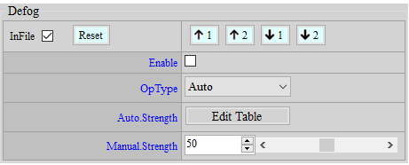  
    - 1. API 結構體定義 (MI_ISP_IQ_DEFOG_TYPE_t)
    在底層 mi_isp_iq.h 標頭檔中，Defog 主要由以下結構所控制：
    - bEnable（功能開關）：設定 Defog 功能是否啟用（SS_FALSE = 0 關閉；SS_TRUE = 1 開啟）。
    - enOpType（工作模式）：
        - SS_OP_TYP_AUTO (0)：自動模式。在此模式下，系統提供 16 組 stParaAPI 設定，可對應 16 個不同 ISO 增益（Gain） 下的去霧強度進行動態切換與內插。
        - SS_OP_TYP_MANUAL (1)：手動模式。固定使用單一設定值。
    - u8Strength（去霧強度）：
        - 數值範圍：0 ~ 100。
        - 預設值：50。
        - 數值設定越大，畫面中對比度、亮度和灰階的可變調整強度就越強，去霧效果越明顯。
    - 2. 底層 API 函數
    若要在應用程式中直接呼叫設定，可使用以下定義於 libmi_isp.so 庫的函數：
    - MI_ISP_IQ_SetDefog(DevId, Channel, *data)：設定當前 Defog 參數值。
    - MI_ISP_IQ_GetDefog(DevId, Channel, *data)：獲取當前 Defog 參數值。
- ### 二、 IQ Tool 介面調校與步驟
    - 步驟 1：開啟調整介面
    1. 在 IQ Tool 左側選單的功能樹狀結構中，點選 WDR 節點。
    2. 在右方彈出的子介面中，切換或尋找 Defog 的調整區塊。
    - 步驟 2：設定基本開關與模式
    1. 勾選 Enable 啟用 Defog 功能。
    2. 將 OpType 設為 Manual（手動模式）進行基礎效果觀察；若要用於全天候日夜切換場景，建議調整完成後設回 Auto 並針對 16 個增益區間微調強度。
    - 步驟 3：調整強度與驗證
    1. 直接拉動或修改 Manual.Strength 的數值（預設為 50）。
    2. 觀察畫面：
        - 若畫面仍顯得朦朧、通透度不足，逐步調高 Strength 數值。
        - 若畫面因對比度拉得太高，導致暗部死黑或亮部過曝，請逐步調低 Strength。
    3. 調整至對比度與細節層次達到最佳平衡點即可。
- ### 三、 官方調校重要建議（Tuning Tips）
    - 優先使用 WDR 進行對比度優化： 雖然 Defog 可以增強畫面對比，但官方調校 SOP 特別強調：建議優先將 WDR（寬動態）作為主要的去霧功能接口。
        - 因為 WDR 是基於「分塊局部直方圖均衡化（LTM）」來做更細緻的亮度分配，其畫面表現相較於單純全局拉對比的 Defog 而言會更加自然，且更不容易在低照度場景下被拉出嚴重的暗部雜訊。
    - 避免高 ISO 產生顆粒噪點： 在低照度（高 Gain）環境下，過強的 Defog 強度會將暗處的噪點（Noise）強行放大。因此若在 Auto 模式下調校，建議隨 ISO 增加，逐步調降高 ISO 節點的 u8Strength 強度，以維護高增益下的畫質純淨。
### 高動態範圍 (HDR，High Dynamic Range)
HDR (High Dynamic Range，高動態範圍) 是透過合成兩張（長曝光與短曝光）不同曝光條件的圖像，獲取動態範圍高於單一曝光（Linear mode）的影像
。其調試的核心重點在於畫面的亮度分配（如何在 8-bit 的 0~255 範圍內擠入最多需要的資訊）。
- ### 一、 第一階段：AE（自動曝光）設置
    長、短兩張影像的曝光比例（HDR Ratio）直接關係到 HDR 的動態範圍大小
。然而比例並非越大越好，短曝影像需乘上 HDR Ratio 才能與長曝匹配，因此比例越大，乘上的增益（Gain）越多，影像的噪點（Noise）也隨之增大。
    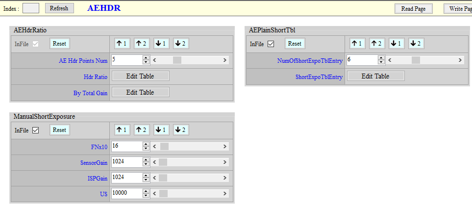 
- 在 AE 環節主要需要決定三個參數：
    1. Max Short Shutter：與 Sensor 運作的 fps 及頻率有關，建議設為最大限制值。
    2. HDR Ratio：視場景動態範圍需要而定。過大的 Ratio 會帶來雜訊，過小的 Ratio 則會限制長曝時間。一般建議設為 10x (10240)，亦可支援 16x (16384)。
    3. AE Target：控制畫面整體亮度，通常設與單張 Linear mode 相同。若後續暗部雜訊難以控制，可適度調高此值，其控噪效果優於直接用 WDR 強行拉亮。
- AE 曝光表設定步驟：
    1. 依據 Sensor spec 及 fps 計算出短曝的最長、最短曝光時間，填入短曝曝光表（AEPlainShortTbl）。
    2. 將欲使用的 HDR Ratio 填入對應的欄位（可隨環境亮度 BV 設定不同比例）。
    3. 對齊長短曝：依照 HDR Ratio，將短曝曝光表中的 Shutter 乘上 HDR Ratio 的倍數，填入長曝曝光表中（例如：短曝 2100μs，則長曝填入 21000μs）。
- ### 二、 第二階段：HDR 核心融合設置（HDR API）
    HDR 融合主要是控制長曝與短曝影像的交界與疊加比例，避免過曝與顏色異常。
    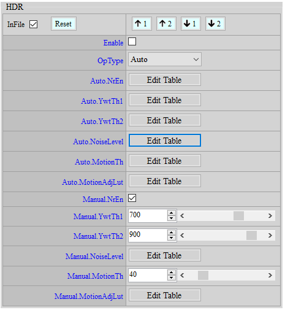  
    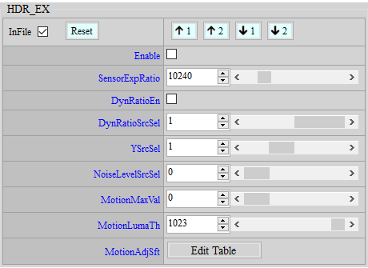  
    1. 關鍵融合門檻調校 (YwtTh1 與 YwtTh2)
        - YwtTh1（融合下界）：亮度低於此值會完全選用長曝數據。
        - YwtTh2（融合上界）：亮度高於此值會完全選用短曝數據。介於兩者之間則採用長、短曝混合（Blending）。
    - 調校步驟：
        1. 將 YwtTh2 設為 0。
        2. 逐漸調高 YwtTh1 的數值，直到在畫面中觀察到「長曝飽和處」快要出現因過曝導致的異常色彩或色偏（通常細節會開始丟失）為止，此臨界點即為最佳的 YwtTh1。
        3. 決定 YwtTh1 後，建議將 YwtTh2 設為 YwtTh1 + (50 ~ 100)。（若 th2 設得太大，亮區雜訊表現較好，但細節會因為融合到過曝的长曝數據而流失）。
    2. 其餘關鍵 HDR 參數設定
    - SensorExpRatio：長短曝的亮度比，必須手動填入與 AE 曝光表相同的 HDR Ratio 數值。
    - DynRatioEn (動態補償)：建議開啟。當實際曝光時間因快門計算精度無法剛好是指定倍數時，此功能可消彌長短曝的實際亮度誤差，防止交界處異常。
    - NrEn：短曝張額外的 2D 降噪，開啟可使短曝影像更乾淨，但需注意是否有移動模糊問題。
- ### 三、 第三階段：WDR 亮度分配與優化
    長短曝影像在 16-bit 空間融合後，會經由 WDR 的 Global Dark Tone Enhance（全局暗處增亮曲線）重新進行亮度分配，並降為 12-bit 輸出。
    - 調校步驟：
    1. 調整增亮曲線：GlobalDarkToneEnhance 提供 16 條預設曲線（0 為維持線性；07 與 815 是兩種不同形態的拉亮曲線，數字越大暗處越亮）。選擇一條適合的曲線將暗部細節還原。
    2. 改善通透性與對比：經增亮曲線拉亮後，畫面可能通透度不足、對比度變差。此時可適度增加 WDR Strength，加強 LTM（局部色調映射）效果來提升層次感。
    3. 暗部雜訊控制：
        - 若暗處拉亮後產生嚴重的噪點或色彩異常，可調高 DarkLimit 來限制極暗處的 WDR 作用強度（此參數在 245 ~ 255 的區間效果才顯著，需微調）。
        - 若有 by ISO 不同的拉亮需求，建議維持固定的 GlobalDarkToneEnhance 曲線，改用 WDRStrByY 搭配 Strength 做 by ISO 調整，以避免頻繁變更曲線造成畫面閃爍（Flicker）。
- ### 四、 常見問題與排查方法
    1. 長短曝融合區出現破碎狀閃動：
        - 通常是長、短曝亮度不匹配造成。請檢查 AE 的 HDR Ratio 與 HDR API 的 SensorExpRatio 兩邊數值是否一致。
    - 亦可嘗試關閉 Dynamic Ratio 補償機制，完全由手動 YwtTh1 與 YwtTh2 來做合成邊界對齊，觀察亮度是否存在明顯落差。
    2. 融合鬼影（Ghost images）：
        - 儘量在移動區域採用短曝影像，以減弱鬼影。
        - 可調低 MotionTh，使其更容易判定為動區而選用短曝（但調太小會導致平坦靜止區也被判為動區，使畫面變髒）。
        - 可調低 MotionAdjLut 曲線，增加動區使用短曝的比例。
    3. 中高亮度局部色彩異常且細節丟失：
        - 此為長曝飽和過曝點被引入融合畫面中，請調低 YwtTh1，避免過曝區參與合成。
    4. 背光人臉過暗：
        - 可將 PreEnhance 設為 11 ~ 15，值越大暗處拉得越亮（但整體畫面會稍微偏濛）。
        - 縮小 BoxNum（讓 local 尺度變大），畫面整體對比與過暗的人臉會較為自然。
### 串擾補償（Crosstalk，Green Equal）
- 成因：主要源於鏡頭與感測器（Sensor）的搭配性問題。當光線進入感測器微鏡片（Micro lens）的角度過大時，本該由特定像素接收的訊號會被鄰近像素誤收，導致 Gr 與 Gb 通道的輸出差異變大。此現象最常發生在影像角落或光線以特定角度入射時。
- 現象：畫面中會出現不自然的迷宮紋（Labyrinth / Maze pattern）。
- ### 一、 Crosstalk 核心參數說明
    在 IQ Tool 的左側選單點選 BayerCompensation 即可找到 Crosstalk 調整介面：
    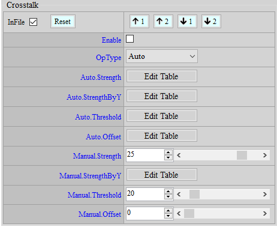 
    - Strength（強度值）：值域為 0 ~ 31，數值設定越大，補償效果越強45。此功能若設定過強會造成畫面細節流失，若無串擾問題建議不要開啟。
    - StrengthByY（依亮度調整強度）：一組對應亮度的曲線，橫軸越往右代表畫面越亮，值域為 0 ~ 127（64 代表不調整），數值越大效果越強。
    - Threshold（閥值比例）：值域為 0 ~ 255，數值越大，串擾補償的作用範圍越廣。
    - Offset（閥值平移量）：值域為 0 ~ 4095，數值越大，作用範圍越廣。
- ### 二、 Crosstalk 調校步驟
    1. 設定初始值：將 Offset 設為 0，並將 Threshold 設為 128。
    2. 調整基礎強度：將 Strength 從 0 開始逐步往上調，觀察畫面上需要消除迷宮紋的區域與需要保留細節的區域。當兩者達到可接受的平衡點時停止調整。
    3. 閥值微調：若需進一步微調，可利用 Threshold 來控制補償的作用範圍。
    4. 暗處補強：如果發現畫面暗處（低亮度區域）的迷宮紋依然明顯，再逐步拉大 Offset。
    - ### 注意事項與模組依賴
        - OBC 階段的預防：在進行 OBC（黑位準校正）時，務必確保 Gr 與 Gb 的黑位準數值完全一致，以從前級預防 Crosstalk 發生8。官方建議採用手動微調，將兩者設定為當前兩通道的最小值：$Gr = Gb = Min(Gr, Gb)$。
        - 去偽彩（Anti-False Color）的前置條件：去偽彩（False Color）的調整效果與 Crosstalk 存在高度相依910。如果 Crosstalk 沒調好導致畫面偽色嚴重，後級的去偽彩將無法將顏色去除乾淨，因此務必先完成 Crosstalk 調校，再調整去偽彩。
### 去偽彩（False Color，AntiFalseColor）
AntiFalseColor（False Color，去偽彩） 主要用於解決在去馬賽克（Demosaic）插值過程中，因未考慮方向或方向判斷錯誤，在影像高頻區域或邊緣所產生的錯誤顏色（偽色/摩爾紋）。
- ### 一、 調校前置重要觀念
    1. Crosstalk 優先於去偽彩：去偽彩的調整效果與 Crosstalk（串擾補償） 存在高度相依。若 Crosstalk 沒調好導致 Bayer 階段的 Gr/Gb 不平衡，後級的去偽彩將無法把顏色去除乾淨，因此務必先完成 Crosstalk 調校，再調整去偽彩。
    2. 輔助解決紫邊：開啟 False Color 對較細的紫邊有部分抑制效果。若去偽彩開到最強紫邊仍嚴重，可再利用 HSV 模組 針對紫色色相降低飽和度（調整時需注意避開正常紫色物體）。
- ### 二、 方案 A：新版 SDK 參數與步驟（如 SSD268 平台）
    1. 關鍵參數說明
        - bEnable：去偽彩功能啟用開關（0：關閉，1：開啟）。
        - bDbgEn（Debug 模式）：值域 0 ~ 1。影像中被判斷為摩爾紋的區域會變亮，畫面越亮代表去偽彩（降飽和度）強度越強。
        - ### 註：此 Debug 模式會與 Demosaic 的 Debug 模式衝突。在工具寫入（Write page）時，系統會先呼叫 False Color 再呼叫 Demosaic，因此畫面預設會以 Demosaic 的 Debug 畫面為主。若要觀看去偽彩的 Debug 畫面，需在工具中單獨對 False Color 呼叫一次 API。
    - u8ColorSpaceSel（去 YUV/RGB 灰）：
        - 0：在 RGB domain 做灰（對齊 G 通道的值），這會些微影響亮度。
        - 1：在 YUV domain 做灰，僅降低 U/V 飽和度，不會影響畫面亮度。
    - u8Preserve（邊緣保護強度）：值域 0 ~ 7。數值設定越大，影像邊緣越不容易被判斷為摩爾紋區域，去偽彩強度越弱。
    - u8Strength（整體強度）：值域 0 ~ 31。數值設定越大，判定為摩爾紋的區域越容易降低飽和度，去偽彩強度越強。
    2. 調校步驟
        1. 將 u8Strength 設為最大值 (31)，並開啟 bDbgEn，觀察畫面中高頻偽彩區是否被正確判定（呈現高亮）。
        2. 調整 u8Preserve 以保護不需去色的邊緣細節，防止正常細節被當作摩爾紋而褪色。
        3. 確認判定範圍正確後，關閉 bDbgEn，並逐步調降 u8Strength 至畫面看起來自然且偽色被壓抑為止。
        4. 切換 u8ColorSpaceSel（0 或 1），觀察何種色彩空間的褪色效果在當前鏡頭下表現更為平順、自然。
- ### 三、 方案 B：傳統 SOP 參數與步驟
    在部分早期產品或特定 SOP 文件中，去偽彩是藉由設定高頻與邊緣閾值來進行兩階段判定： 
        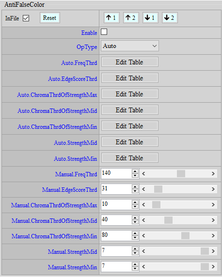 
        - $$\text{IF (freq } > \text{FreqThrd \&\& edgeScore } < \text{EdgeScoreThrd) } \rightarrow \text{ 判定為摩爾紋區}$$
    1. 關鍵參數說明
        - FreqThrd（頻率閥值）：值域 0 ~ 255。設定越小，高頻判定條件越寬鬆，越容易判定為摩爾紋並移除偽色。
        - EdgeScoreThrd（邊緣閥值）：值域 0 ~ 255。設定越大，邊緣分數判定條件越寬鬆，越容易移除偽色。
        - ChromaThrdOfStrengthMax：最大強度色度閥值（值域 0 ~ 127），設定越大越容易移除偽色。
        - StrengthMin：最小強度（值域 0 ~ 7），數值越小，降飽和度的程度越強（影像越偏灰）。
    2. SOP 調校步驟
        1. 進入單色模式：將 ChromaThrdOfStrengthMax 和 EdgeScoreThrd 設到最大，並將 FreqThrd、ChromaThrdOfStrengthMid、ChromaThrdOfStrengthMin 設到最小，此時畫面應會呈現黑白（Mono）狀態。
        2. 找出頻率閥值：逐步增加 FreqThrd，直到除了偽彩區域外，全畫面的正常顏色恢復正常，記錄此時的 FreqThrd 值。
        3. 找出邊緣閥值：將 FreqThrd 設回 0。逐步減少 EdgeScoreThrd，直到除了偽彩區域外，全畫面顏色恢復正常，記錄此時的 EdgeScoreThrd 值。
        4. 調整最大去色範圍：維持 FreqThrd 為 0，並將 EdgeScoreThrd 設回最大。逐步調降 ChromaThrdOfStrengthMax，使全畫面顏色正常，同時讓偽彩區域變灰（優先保護正常區域的顏色）。
        5. 微調過渡區偽色：
            - 調高 ChromaThrdOfStrengthMid 讓殘留的偽色變淡。
            - 調高 ChromaThrdOfStrengthMin 進一步壓低邊緣殘留偽色的飽和度。
            - ### 註：設定時需確保 ChromaThrdOfStrengthMin > ChromaThrdOfStrengthMid，且 StrengthMid < StrengthMin。
        6. 還原閥值與微調：將步驟 2 與步驟 3 記錄的 FreqThrd 和 EdgeScoreThrd 數值填回。若發現正常色彩區域出現不正常的去色副作用，請微調增加 FreqThrd 或調降 EdgeScoreThrd 來恢復正常色彩。
### 去馬賽克/插值（Demosaic）
- ### 一、 核心參數說明
    Demosaic 的控制結構主要定義在 DEMOSAIC_PARAM_t 結構體中，其參數可細分為以下四大類：
    1. Debug 模式控制 (u8DbgMode)
        - ```0```：正常輸出影像。
        - ```1```：顯示方向判斷影像。在此畫面下，不同顏色區域代表系統對該區塊的方向判定：
            - 紅色：垂直方向區。
            - 藍色：水平方向區。
            - 綠色：細節非加強區。
            - 白色：細節加強區。
            - 黑色：無向性（無方向）區域。
        - ```2```：顯示 Non-smooth（非平滑）影像（需開啟 bSmoEn 才有效）。畫面越亮代表越不會被抹平；畫面越黑代表越會被抹平。
        - 註：此 Debug 模式會與去偽彩（False Color）的 Debug 模式衝突，若兩者同時開啟，通常會以後呼叫的 API 為主。
    2. 方向與無向性區域判定
        - u8IsoTh（無向性區域判斷閥值）：值域 0 ~ 1273。數值越大，會有越多區域被判定為無向性區域，但過大可能導致細節模糊及出現拉鏈狀 artifacts。
        - u8GradientTh（方向性區域判斷閥值）：值域 0 ~ 633。數值越大，越少區域會被判定成方向性區域（可能導致細節模糊與拉鏈狀 artifacts）；數值太小則會使細節區域變少。
    3. 細節加強控制（Dtl 系列）
        - bDtlEn：細節加強功能總開關。
        - bDtlBypassColorCheck（細節區忽略顏色判斷開關）：
            - ```1```：忽略顏色判斷，所有的細節區都會被強制判定為「細節加強區」。
            - ```0```：開啟顏色判斷。此時，只有當綠色通道（G）的值大於一定閥值時，才會判定為細節加強區。
            - 判定條件公式：
            $G > (R \text{ or } B) \times \text{u8DtlColorRatio} + \text{u8DtlColorOft}$。
        - u8DtlColorRatio：細節區顏色判斷比例（0 ~ 255），數值越大越不容易被判定成細節加強區。
        - u8DtlColorOft：細節區顏色判斷偏移量（0 ~ 63），數值越大越不容易被判定成細節加強區。
        - u8DtlHScale / u8DtlMScale：分別控制細節加強區內，**高頻（H）與中頻（M）**區域的加強程度（0 ~ 15），數值越大加強越多。
    4. 抹平功能（Smo 系列）
        - bSmoEn：抹平（Smoothing）功能開關。用於修復因 Demosaic 插值錯誤所產生的邊緣異常。
        - u8SmoRange：抹平作用範圍（0 ~ 7），值越大抹平的區域越多。
        - u8SmoStrength：抹平強度（0 ~ 255），值越大強度越強。
- ### 二、 標準調校步驟
    調校時建議於 IQ Tool 中開啟 BayerCompensation 介面，依循以下步驟進行：
        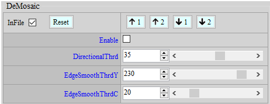 
    - 步驟 1：初始化設定
        - 暫時將抹平功能與細節加強功能關閉，即將 bSmoEn 設為 0、bDtlEn 設為 0。
    - 步驟 2：區分方向性與細節區將 u8DbgMode 設為 1 以觀察方向判定畫面1。對照畫面上的紅、藍、黑等區塊，微調 u8IsoTh 與 u8GradientTh，使畫面中的「無方向區域（黑色）」、「有方向區域（紅/藍）」與「細節區域（綠/白）」的分布符合影像的實際物理特性。
    - 步驟 3：微調細節加強判斷範圍
        1. 保持 u8DbgMode 設為 1。
        2. 觀察「細節非加強區（綠色）」與「細節加強區（白色）」的分布。
        3. 若要讓更多細節區被強化，微調 bDtlBypassColorCheck、u8DtlColorRatio 和 u8DtlColorOft。
    - 步驟 4：套用細節加強
        1. 將 u8DbgMode 設回 0（回到正常影像畫面）。
        2. 將 bDtlEn 設為 1 啟用細節加強。
        3. 拉動 u8DtlHScale 與 u8DtlMScale 參數，微調中高頻細節的清晰度。
    - 步驟 5：啟用抹平功能（選用）
        1. 若物體邊緣仍殘留有因去馬賽克插值錯誤（插值色差）而產生的異常條紋，可啟用 bSmoEn = 1。
        2. 將 u8DbgMode 設為 2，觀察畫面黑白分布，確認欲抹平的區域有正確被辨識（越黑代表越會被抹平）。
        3. 微調 u8SmoRange 與 u8SmoStrength 直到邊緣異常消除，隨後將 u8DbgMode 設回 0 觀察最終影像。
    - ### ⚠️ 官方調校重要注意事項
        1. Demosaic 模組的參數通常建議先使用系統預設值。 若無特殊異常，切勿做大範圍調整，以免設定無法兼容其他多樣化的場景。
        2. 請勿將抹平（Smo）功能當成一般的雜訊降噪（NR）來使用。
        3. 請勿將細節加強（Dtl）功能當成一般的銳化（Sharpness）來使用。
    ### 除非在後級的降噪模組與 Sharpness 模組都已經調到極限、無法再優化時，才可回頭微調 Demosaic 模組進行最後補強1。
###  動態壞點校正 （DynamicDP，Dynamic Defective Pixel Correction）
    DynamicDP（Dynamic Defective Pixel Correction，動態壞點校正） 屬於前級 Bayer 模組。由於 Sensor 存在硬體製造工藝限制，百萬像素的 Sensor 常存有數十至數百 ppm 的壞點，且這些壞點在經過去馬賽克（Demosaic）插值與濾波後會擴散變大，甚至在色彩校正（CCM）後顏色會顯著增強。因此，必須在插值之前，利用 DynamicDP 將壞點動態偵測並予以取代補償。
- ### 一、 調整介面位置
    - 在 IQ Tool 左側功能樹選單中，點選 BayerCompensation，即可在右側主面板找到 DynamicDP 調整頁面。
    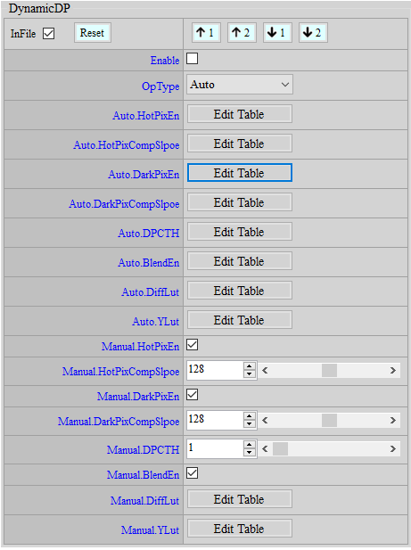 
- ### 二、 關鍵參數說明
    底層 API 主要由結構體 MI_ISP_IQ_DYNAMIC_DP_TYPE_t 控制，其核心參數如下：
    1. 壞點補償啟用開關
        - HotPixEn / bHotPixEn：啟用/關閉亮壞點（Hot pixel）補償功能。
        - DarkPixEn / bDarkPixEn：啟用/關閉暗壞點（Dark pixel）補償功能。
    2. 偵測閥值控制
        - HotPixCompSlope / u16HotPixCompSlope：判斷是否為亮壞點的斜率閥值。值域為 0 ~ 255。數值設得越大，判斷條件越嚴格（越不容易被判定為亮壞點）；數值越小則越容易判定。
        - DarkPixCompSlope / u16DarkPixCompSlope：判斷是否為暗壞點的斜率閥值。值域為 0 ~ 255。同樣是數值越大越嚴格。
        - DPCTH / u16DPCTH：當前像素與周圍同通道（Same-channel）像素的差異閥值。值域為 0 ~ 255。數值越大越不容易判定為壞點，數值越小越容易判定。
    3. 混合與細節挽救（Blending）
        - BlendEn / bBlendEn：啟用/關閉混合功能。
        - DiffLut / u16DiffLut：依據「DPC 校正結果」與「原始值」的差異程度進行混合的查找表。值域為 0 ~ 1024，數值越大代表越傾向直接用校正值取代原始值。
        - YLut / u16YLut：依據「亮度（Y）」進行混合的查找表。值域為 0 ~ 1024，數值越大代表越傾向直接用校正值取代。
- ### 三、 調校與步驟
    - 第一階段：基礎閥值調整
        1. 確定啟用功能：根據畫面上出現的雜訊點類型（亮點或暗點），勾選啟用 HotPixEn 或 DarkPixEn。
        2. 理解雙重成立條件：系統要執行壞點補償，必須同時滿足 DPCTH 與 PixCompSlope 的閥值條件。
        3. 微調斜率與細節平衡：
            - 一邊觀察畫面中的壞點，一邊逐漸增加 HotPixCompSlope / DarkPixCompSlope 的數值。
            - 調整至壞點雜訊消失，且影像細節（Texture）保留達到可接受平衡時，即可停止。
    - 第二階段：啟用混合挽救細節
        1. 如果在第一階段為了消滅壞點，將 Slope 調得太低，導致畫面正常的邊緣或細節被誤判並抹除：
            - 勾選啟用 BlendEn 混合功能。
            - 編輯 DiffLut 與 YLut 曲線，透過與原始影像進行不同比例的 Blending 混色，在「去除壞點」與「挽救細節」之間取得更精細的平衡。
### 群聚壞點校正（DynamicDP_Cluster）
DynamicDP_Cluster（群聚壞點校正） 模組是專門為了解決「多個相鄰像素同時為壞點」之情況而設計的。
一般的 DynamicDP 是依靠「單點與周圍像素的差異」來判定壞點，但如果壞點呈群聚狀態（周圍點也是壞點），偵測機制就會受到干擾
。因此，DynamicDP_Cluster 會在計算前先將周圍最亮或最暗的點排除，排除後再送入壞點校正模組處理。
- ### 一、 調整介面位置
    - 在 IQ Tool 左側選單中，點選 BayerCompensation，即可在右側主面板找到 DynamicDP_Cluster 調整頁面。
    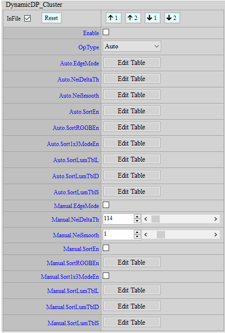 
- ### 二、 核心參數說明
    1. 基礎邊緣模式 (EdgeMode)
    - EdgeMode：邊緣模式開關。啟用後，系統在判斷時會對周圍點排除並換掉 0 ~ 1 個最亮點或最暗點，避免極端壞點干擾平均值計算。
    2. 周圍均值判定 (Nei 系列)
    - NeiDeltaTh（周圍點差值閥值）：設定周圍 8 個點與這 8 點平均值的差異閥值。若某鄰近點與均值的差大於此閥值，則計入累計個數（Count）。
    - NeiSmooth（累計閥值）：當上述累計個數（Count）小於此閥值時，系統才會對最亮（或最暗）點執行取代。
    3. 排序模式控制 (Sort 系列)  
    此模式會將周圍像素的亮度進行排序，確保「周圍只有一個點極亮/極暗，其餘點亮度相似」時才進行替換。最多可替換周圍 02 個最亮點與 01 個最暗點。  
    - SortEn：排序模式總開關。
    - SortRGGBEn：可針對 R、Gr、Gb、B 獨立通道選擇是否啟用排序補償。
    - Sort1x3ModeEn（1x3 補償模式）：若中心相鄰的兩點剛好分別是「最亮點」與「次亮點」，且次亮點與第三亮點的差大於設定閥值，系統會強制將這兩個最亮點用第三亮點取代。
    - SortLumaTblL（最亮與次亮閥值）：此閥值可隨亮度進行曲線調整。數值設得越大，代表最亮點必須超過次亮點非常多才會被替換，判斷條件越嚴格。
    - SortLumaTblD（最暗與次暗閥值）：隨亮度調整的暗點補償閥值，數值越大判斷越嚴格。
    - SortLumaTblS（次亮/暗與第三亮/暗閥值）：數值設得越小，要求次亮點與第三亮點必須越相似才允許替換，判斷條件越嚴格。
- ### 三、 標準調校步驟
    - 步驟 1：啟用輔助模式
        - 當畫面上出現單純使用 DynamicDP 無法消除的群聚型壞點時，在介面上勾選啟用 EdgeMode 或 SortEn。
        - 備忘：開得越多、越寬鬆越容易消除壞點，但同時也比較容易傷害正常的畫面細節（如紋理、邊緣）。
    - 步驟 2：寬鬆偵測與細緻融合（建議做法）
        1. 為了最大程度消滅群聚壞點，建議將 DynamicDP_Cluster 的判定條件設定得較為寬鬆，讓絕大多數壞點都能被偵測抓出。
        2. 針對被判定為壞點的區域，微調其後續的 Blending（混合比例） 參數，在「完美去壞點」與「保留影像原有細節」之間取得最平滑自然的平衡。


## 建議事項：
調整畫質前請務必保持鏡頭乾淨且對焦準確。
若要從頭開始調整新 Sensor，建議先透過 Enable Control 關閉所有功能，觀察原始畫質後再逐一開啟調整。