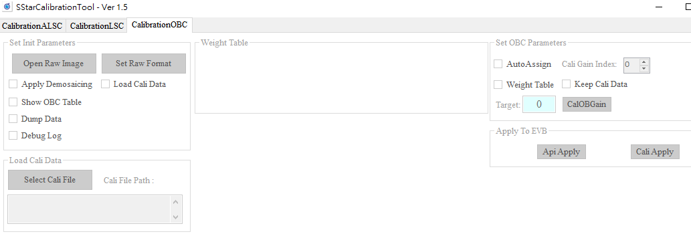
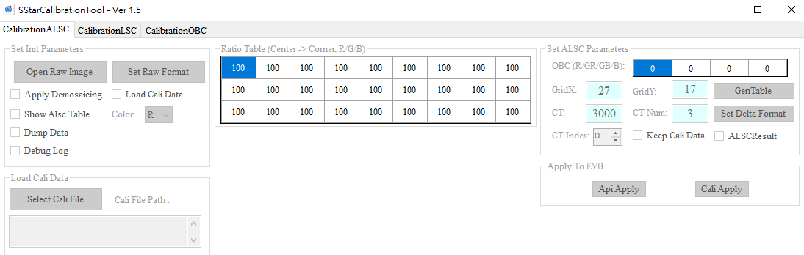
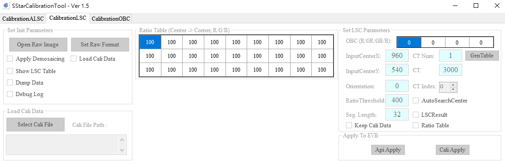

# SigmaStar IQ Tool 影像調整流程與步驟
使用 SigmaStar IQ Tool 進行影像調整是一個系統性的過程，涵蓋了從硬體連線、基礎校正到細部畫質調優的完整流程。
以下是使用 IQ Tool 的詳細步驟介紹：
### 1. 建立連線 (Connection)
在開始調整之前，必須先讓 PC 端的 IQ Tool 與開發板（EVB）上的 iqserver 建立通訊：  
- 開發板端設定：在終端機輸入以下指令以啟動服務：  
#ifconfig eth0 up        (啟動網卡)  
#udhcpc                  (取得 IP)  
#mixer -n 1 -q           (-q 參數用於開啟 iqserver) [1, 2]  

- 工具端連線：
在 PC 開啟 IQ Tool。
選擇產品類型（如 IP Camera）。
輸入開發板的 IP 地址。
點擊 Connection 圖示（插頭形狀），圖示變色即代表連線成功。  

### 2. 介面功能導覽 (Interface Navigation)
- 連線後，您會看到以下配置：  
功能樹狀結構 (左側)：包含所有 ISP 模組的 API 集合（如 AE, AWB, OBC, Gamma, Sharpness 等）。

- 調整頁面 (右側)：點擊左側節點後，右方會顯示對應的參數調整介面。

- 參數調整方式：包含直接填寫數值、下拉選單、拉動捲軸或點擊彈出表格（Edit Table）進行編輯。
### 3. 核心校正流程 (Calibration Workflow)
根據標準作業程序（SOP），建議依照以下順序使用工具內的插件（Plugin）進行基礎校正：
- 環境設定 (Step 0)：在開始校正前，需於 CalibrationInitialParameter.ini 或是 Plugin 介面的 Raw Setting 中設定原始影像資訊（如 width, height, cfa_type 等）。

- 黑位準校正 (OBC)：選擇 CalibrationTool 內的 CalibrationOBC，在全黑環境下計算感測器的 OB 值。

- 鏡頭陰影校正 (ALSC/LSC)：針對畫面亮度不均或邊緣色偏，使用 CalibrationALSC 或 CalibrationLSC 產生補償表。
- 白平衡校正 (AWB)：使用 AwbAnalyzerCombo 插件，在標準燈箱下校正不同色溫點的增益曲線。
- Gamma 擬合 (Gamma Fitting)：使用 Gamma Fitting 插件，拍攝 OECF 測試卡來調整亮度曲線，這必須在色彩矩陣校正之前完成。
- 色彩矩陣校正 (CCM)：使用 CCM Analyzer 插件，拍攝 24 色卡並計算色彩校正矩陣。
### 4. 畫質調優與去噪 (Tuning & Denoise)
完成基礎校正後，可針對不同 ISO 節點進行動態調整：
- 降噪調整 (NR3D/NRLuma)：建議先調整 NR3D（時間域降噪），再微調空間域降噪（NRLuma/NRChroma），以平衡殘影與雜訊。
- 銳利度 (Sharpness)：調整 OverShootGain 與 UnderShootGain 來控制黑白邊強度，並搭配 CorLut 抑制因銳化產生的雜訊。
- 寬動態 (WDR/Defog)：若場景明暗對比強烈，可開啟 WDR 模組增強細節。
### 5. 存檔與套用 (Save & Load)
即時套用：調整參數時，通常點擊 Write Page 即可將設定寫入開發板即時生效。
- 儲存參數：
    - Param file：儲存當前頁面的參數檔案。
    - Bin file：將所有調整好的參數打包成一個 *.bin 檔。之後在應用程式中呼叫 MI_ISP_API_CmdLoadBinFile 即可載入整套 IQ 設定。
    - 自動存檔：工具提供 Auto Save Bin File 功能，可設定間隔時間自動備份，避免遺失進度。
# 影像調整校正說明與步驟
## 1. OBC  
OBC（Optical Black Correction，黑位準校正）的主要目的是在 CMOS 感測器收集數據時，補償 ADC 轉換過程中的偏差。由於 ADC 可能無法精確轉換極弱的訊號，因此在輸入 ADC 前會加上一個固定偏移量（Offset），以保留暗部細節。
### OBC 的校正設定與步驟：
### 一、 校正環境與影像擷取要求
- 黑暗環境：必須在完全黑暗的環境下進行，封鎖所有可用光源。
- 鏡頭遮蓋：使用鏡頭蓋完全覆蓋鏡頭，確保沒有漏光；若鏡頭有可變光圈，應將光圈完全關閉。
- 手動曝光設定：將 AE 設為手動模式（M_Mode），並設定特定的 SensorGain。
- 擷取 RAW 影像：分別在 1X 增益和最大增益下擷取 RAW 影像。若不同增益下的校正結果差異很大，則需擷取多組影像。
### 二、 關鍵參數說明
- 在校正工具或 CalibrationInitialParameter.ini 中需設定以下參數：
    - Target：校正後預期的 16 位元殘留值，建議設定為 0。
    - AutoAssign：是否自動將一個 OB 值分配給所有增益，建議設為 1。
    - Weight：將畫面分為 3x3 區塊並設定權重，建議全部設為 1。
    - CaliGainIndex：填寫對應的 ISO 索引（0~15）。
    - out_data_precision：輸出數據精度，建議設為 16。
### 三、 校正步驟
### - 方法 A：使用 IQ Tool 插件 (CalibrationOBC)

```
    - 從插件選單中選擇 CalibrationTool，然後點擊 CalibrationOBC 標籤。
    - 點擊 Set Raw Format 並根據 RAW 檔案設定對應格式資訊。
    - 點擊 Open Raw Image 開啟影像（路徑不可含中文）。
    - 勾選 Show OBC Table 以利觀察。
    - 點擊 CalOBGain，工具會根據輸入參數產生校正後的黑電平值。
    - 點擊 ApiApply 或 CaliApply 將校正結果套用到開發板。
```
### - 方法 B：使用離線校正工具 (CalibrationRelease.exe)
```
    - 將在黑暗環境拍攝的 RAW 影像放入 image 資料夾。
    - 修改 CalibrationInitialParameter.ini，將 calibration_select 設為 1 (OBC)。
    - 執行 CalibrationRelease.exe 產生 obc_cali.data 檔案。
    - 使用系統 API (MI_ISP_API_CmdLoadCaliData) 載入該校正數據。
```
### 四、 注意事項與分析
- 結果驗證：如果各增益下的校正結果差異小於 50，則校正一組 RAW 影像即可。
- 多節點設定：若高低增益間的 OB 差異過大，需手動為 16 個 ISO 索引節點分別輸入 OB 值。
- 防止串擾（Crosstalk）：完成 OBC 校正後，需確保 Gr/Gb 數值一致。建議手動調整，使 Gr=Gb=Min(Gr,Gb)，以避免產生迷宮紋現象。
- HDR 模式：在 HDR 模式下，長曝光與短曝光的 OB 值需分別進行校正。

## 2. 鏡頭陰影校正 (ALSC/LSC)
### LSC（Lens Shading Correction，透鏡陰影校正）的主要目的是產出一組 R、G、B 各 32 個項目的校正表，針對畫面不同區域給予不同的增益，以改善因鏡頭光學特性造成的亮度陰影（Y shading，即暗角現象）。
### LSC 的校正設定與具體步驟：
### 一、 校正環境準備
- 均勻光源：使用標準燈箱（如 Macbeth）搭配擴散片（Diffuser）。若無擴散片，可將鏡頭對準燈箱內的均勻灰牆。
- 亮度要求：調整燈箱亮度或 AE 目標值（建議設為 1500 左右，值域為 10~2550），確保原始影像（RAW）中心亮度足夠且不可過曝。
- 校正前提：在開始 LSC 之前，必須先完成 **OBC（黑位準校正）**與 **AWB（自動白平衡）**色溫曲線範圍的校正並套用。
- 濾光片：若使用 RGB 感測器，需確保已蓋上紅外線截止濾光片（IR-cut）。
### 二、 關鍵校正參數說明
- 在校正工具或環境參數文件（*.ini）中需設定以下項目：
    - TableSize：校正表大小，固定為 32 個項目。
    - AutoCenter：設為 1 時，工具會自動偵測影像中最亮的中心點；設為 0 則需手動指定中心座標。
    - Ratio Table：定義畫面中心到角落的校正強度比例。
    - Ratio_Threshold：用以防止角落過度補償（Over-compensation）。數值越大補償越多，數值越小則維持在最大索引值的補償量。
    - CCTNumber：校正的色溫組數，此平台支援最多 3 組（1~3）。
    - TargetIndex：目前校正的表格索引（0~2）。需注意填寫時，環境色溫必須由低到高排列。
    - OB_R/G/B_Value：當前感測器的 16 位元 OB 值（0~65535）。
### 三、 校正操作步驟
### 方法 A：使用 IQ Tool 插件 (CalibrationLSC)

```
- 從插件選單選擇 CalibrationTool，點擊 CalibrationLSC 標籤。
- 點擊 Set Raw Format 設定影像解析度與格式。
- 點擊 Open Raw Image 開啟拍攝好的 RAW 影像（路徑不可含中文）。
- 勾選 Show LSC Table 以觀察生成的曲線與數據。
- 設定 LSC 參數，包含 OB 值、**CT（色溫）**及中心點偵測方式。
- 點擊 GenTable 計算並產生 LSC 增益表。
- 點擊 ApiApply 或 CaliApply 將數據下載到開發板（EVB）進行即時驗證。
```
## 重要步驟：完成後必須前往 LSC 模組頁面點擊 Read，確認參數已正確儲存在 API bin 檔案中。
### 方法 B：使用離線校正工具 (CalibrationRelease.exe)
- 將 RAW 影像放入 image 資料夾。
- 修改環境參數文件 CalibrationInitialParameter.ini：
```
    - 在 [RAW_INFO] 設定影像路徑與格式。
    - 將 calibration_select 設為 3（或 4，取決於版本）來指定 LSC。
    - 設定 load_calibration_data：校正第一組色溫時設為 0，其餘設為 1 以保留先前數據。
    - 執行 CalibrationRelease.exe，工具將自動產生 lsc_cali.data 檔案。
    - 透過系統 API (MI_ISP_API_CmdLoadCaliData) 載入並套用該數據。
```
## 注意事項
**優先權順序：系統載入數值的優先權為 lsc_cali.data > API bin > iqfile。**
**便利性：正常流程建議先載入 .data 檔，此時數據會儲存在 API bin 中，後續即可直接在 API 界面進行微調，無需每次開機重新載入 .data 檔。**

### ALSC（自適應透鏡陰影校正）的主要目的是改善因鏡頭光學特性導致的亮度陰影（Lens Shading，如暗角）顏色陰影（Color Shading）。
### ALSC 的校正設定與步驟：
### 一、 校正環境準備
- 光源要求：將鏡頭瞄準 DNP 標準燈箱的均勻光源屏幕。若無標準燈箱，可將鏡頭覆蓋磨砂玻璃並瞄準標準燈箱的光源。
- 亮度設定：調整燈箱亮度或 AE 目標值，使影像中心亮度達到最大亮度的 70% 左右（可使用 ImageJ 確認）。
- 校正順序：在進行 ALSC 之前，必須先完成 **OBC（黑位準校正）**與 **AWB（自動白平衡）**色溫曲線範圍的校正。
- 感測器準備：使用 RGB 感測器時，需確保 IR-cut 濾光片已覆蓋。
--------------------------------------------------------------------------------
### 二、 校正設定參數說明
- 在校正工具（CalibrationTool 或 CalibrationInitialParameter.ini）中需設定以下關鍵參數：
    - Ratio Table：定義畫面中心到角落的校正強度比例。
    - OBC：輸入當前感測器的 16 位元 OB 值。
    - GridX / GridY：陰影補償表的尺寸，預設為 27x17。
    - CT (Color Temperature)：設定當前光源的色溫值（例如 3000K）。
    - CT Num：選擇要校正的色溫組數（1~3 組）。
    - CT Index：選擇當前正在校正哪一組色溫表，色溫設定必須由低到高排列。
    - Delta Mode：定義非等距格點設定，提供 16 種預設模式。
--------------------------------------------------------------------------------
### 三、 校正步驟
### 方法 A：使用 IQ Tool 插件 (CalibrationALSC)

```
- 從插件選單中選擇 CalibrationTool，然後點擊 CalibrationALSC 標籤。
- 點擊 Set Raw Format，根據 RAW 檔案設定格式資訊。
- 點擊 Open Raw Image 開啟拍攝好的原始影像（路徑不可含中文）。
- 勾選 Show ALSC Table 以利觀察。
- 設定對應的 OBC 參數與 色溫 (CT) 參數。
- 點擊 GenTable 開始計算並產生校正表。
- 點擊 API Apply 將數據套用到開發板（EVB）進行即時驗證。
- 重要步驟：套用後必須前往 ALSC 模組頁面點擊 read page，才能將校正參數儲存在工具中。
```
### 方法 B：使用離線校正工具 (CalibrationRelease.exe)
```
- 將 RAW 影像放入 calibration\SampleCode\Release\image 資料夾中。
- 修改環境參數文件 CalibrationInitialParameter.ini，在 [RAW_INFO] 區段設定影像路徑、格式，並將 calibration_select 設為 4 (ALSC)。
- 執行 CalibrationRelease.exe，工具將自動產生 alsc_cali.data 檔案。
- 透過系統 API (MI_ISP_API_CmdLoadCaliData) 載入此 .data 檔案即可生效。
```
## 注意事項
**資料儲存限制：由於 ALSC 的增益表資料量較大，無法直接儲存在 API bin 檔案中，因此每次系統啟動時都必須重新載入 alsc_cali.data。**
**環境一致性：若更換了鏡頭或感測器組合，必須重新進行 ALSC 校正。**
## 補充說明
**雖然在 ISP 硬體流水線（Pipeline）中 AWB 位於 shading 校正之後，但來源文件指出，shading 是否校正對 AWB 的初步範圍判定影響較小。因此，建議先界定好 AWB 的色溫曲線範圍，讓系統能識別當前光源環境，進而確保 ALSC 校正表能正確關聯到對應的色溫點上。**

## 3. 自動白平衡 (AWB) 
自動白平衡 (AWB) 校正的主要目的是自動計算感測器在不同標準光源下的 R/G 和 B/G 增益，以確保影像在不同色溫環境下的灰階區域（Gray scale）不會產生色偏，讓 R、G、B 數值盡可能接近。
### AWB 校正的設定與步驟：
### 一、 校正環境與準備
- 灰卡準備：在標準燈箱（如 Macbeth）內放置灰卡，並確保灰卡佔滿整個畫面。
- 前置條件：
    - 務必確保 OBC (黑位準校正) 已經完成校正且確實套用。
    - 若使用 RGB 感測器，須確認 IR-cut 濾光片 已確實蓋上。
    - 曝光設定：將 AE 設為 Auto，並調整 AE Target（建議值約為 1500，值域 0~2550），以防止影像過曝導致統計數據失真。
### 二、 使用 IQ Tool 插件校正步驟 (AwbAnalyzerCombo)

- 這是調整色溫曲線範圍（CT Area）最常用的方法：
- 開啟插件：從插件選單中選擇 AwbAnalyzerCombo。
- 設定色溫範圍：
    - 設定 StartIdx 與 EndIdx 來決定 AWB 的有效區間。
    - 建議設定為 StartIdx = 2 (約 10000K) 到 EndIdx = 7 (約 2300K)，確保在此色溫範圍內執行 AWB。
- 獲取統計值：
    - 準備色溫計量測當前燈源的實際色溫。
    - 點擊 Update Live Statis 更新當前統計資料（畫面上的綠點即為統計落點）。
    - 點擊 File -> Save Statistics 儲存資料以便後續分析。
    - 調整色溫框 (CT Area)：
    - 拖曳色溫框的控制點（三角形或藍線），使統計落點包含在對應的色溫框內。
    - 確認右上方推算出的色溫 (CT) 接近實際量測值，並保持曲線平滑。
    - 重複光源校正：切換至不同色溫的光源（如 D65, TL84, A 燈），重複上述步驟 3 與 4。
    - 套用與存檔：
    - 點擊 Apply To Camera 將設定寫入開發板。
## 重要：回到 API Tool 介面點選 AWBCTCali 頁面，點擊 Read Page 將設定讀回，最後儲存為 Bin file 以確保開機時能自動載入。
### 三、 生產線批量校正步驟 (Generating *.data)
若需用於生產線補償各個相機模組間的差異，需產生 awb_cali.data：
- 選擇 Golden Sample：挑選一台 AWB 統計落點最接近平均值的機器作為基準機。
- 環境參數設定：
    - 在 CalibrationInitialParameter.ini 中，將 calibration_select 設為 2 (AWB)。
    - 設定 HighLowCTMode：模式 0（單一色溫）或 模式 1（高低色溫兩組）。
- 執行校正程序：
    - 先拍攝 Golden Sample 的 RAW 影像並執行 CalibrationRelease.exe 生成初始數據。
    - 再拍攝待測機 (Unit Sample) 的 RAW 影像，將 load_calibration_data 設為 1，再次執行程序產出最終的 awb_cali.data。
    - 應用數據：透過 MI_ISP_API_CmdLoadCaliData API 載入此數據。
### 四、 核心參數說明
- eAlgType：算法模式，包括 GrayWorld（全統計值）、Normal（最高落點數框）、Balance（有效框）、Focus（偏向單一色溫）。
- Speed：收斂速度，數值越大收斂越快（預設 20）。
- ConvInThd / ConvOutThd：內/外收斂區間。ConvOutThd 建議設為 64，避免燈源微幅變動時白平衡反應過度。
- RG / BG Strength：全局 R 與 B 增益微調，128 代表 1 倍。
- WeightWin：將畫面分為 9x9 區域並分別給予權重，可讓白平衡計算更偏向特定區域。
- AWBStabilizer：穩定器功能。開啟後可避免環境穩定時 AWB 頻繁觸發導致畫面閃爍。

## 4. Gamma 擬合 (Gamma Fitting)
Gamma 擬合 (Gamma Fitting) 的主要目的是將當前調整機台的亮度曲線（Gamma）校正到與「對比機（參考模型）」接近的狀態。由於顏色擬合結果極易受到亮度差異（來自 AE 和 Gamma）的影響，因此必須在進行色彩矩陣（CCM）校正之前完成 Gamma 擬合。
### Gamma 擬合校正設定與詳細步驟：
### 一、 校正環境與前期準備
- 測試圖卡：準備標準的 OECF 測試卡。
- 光源設定：確保光線均勻照射在圖卡上。
- 拍攝位置：將圖卡置於畫面中間，注意不要讓圖卡佔滿整個畫面，以避免受到鏡頭陰影（Shading）的干擾。
- 動態範圍：校正前請確認動態範圍已設定為 Full Range。
- 曝光控制：
    - Gamma 擬合必須在相同曝光基准下進行才準確。
    - 建議手動控制曝光，使 OECF 圖卡中最亮的色塊數值盡量接近 255（但不要剛好等於 255），以此作為擬合的基準點。
    - 調整機台拍攝 RAW 影像；對比機台拍攝 JPG 影像。
### 二、 IQ Tool 插件操作步驟
請從 IQ Tool 上方的插件選單中選擇 「Gamma Fitting」 開啟介面。
1. 讀取來源（Source）影像數據
    - 點選工具列的 Options -> Raw Setting，輸入正確的原始影像資訊（Width, Height, CFA 等）及 OB（黑位準）值（此步驟不需要設定白平衡）。
    - 點選 Open Source 開啟拍攝好的調整機台 RAW 檔案。
    - 使用鼠標在畫面上拖曳框選 OECF 圖卡的各個色塊，並確認每個 patch 都正確落在對應位置。
2. 讀取目標（Target）影像數據
    - 點選 Open Target 開啟對比機台的 JPG 影像檔案。
    - 重複上述框選色塊的動作（此步驟不需再設定 Raw Setting 資訊）。
3. 設定擬合參數
    - 取值方式 (Value Method)：建議選擇 「Patch values」。
    - 擬合方式 (Fitting Method)：建議選擇 「Exponential」。
4. 執行擬合與存檔
    - 點選 「Match GMA」 按鈕開始執行 Gamma 擬合計算。
    - 觀察曲線：理想的 Gamma 曲線應保持 Smooth（平滑） 且 遞增 的狀態。
    - 手動檢查：若曲線無異常，點選 「Save GMA」 儲存結果。存檔後請務必檢查曲線的頭尾是否分別落在 0 與 1023 處，若不是則需手動修改。
### 三、 注意事項
- 順序依賴：在校正序列中，Gamma 擬合位於 AWB 之後、CCM 之前 [Artifacts 1]。
- 對去噪的影響：先完成 Gamma 與顏色校正後再調整去噪（Denoise），會使去噪參數的微調變得容易許多。
- 套用參數：在 Gamma 介面調整完曲線後，必須手動點選 「Write Page」 才能將資料寫入硬體生效，Gamma 模組不會像其他 API 一樣自動寫入（Auto Write）。
## 色彩矩陣校正 (CCM, Color Correction Matrix)
色彩矩陣校正 (CCM, Color Correction Matrix) 的主要目的是透過計算獲得一個 3x3 的校正矩陣，將感測器拍攝到的顏色數據（通常使用 24 色卡）轉換為符合預期的目標顏色，以確保相機在不同色溫下的色彩表現準確。　　
###　CCM 校正的詳細設定與操作步驟：
### 一、 校正前置準備與環境需求
- 先決條件：在進行 CCM 校正之前，必須先完成 Gamma 擬合。這是因為色彩擬合結果極易受到亮度（由 AE 和 Gamma 決定）的影響。
- 拍攝環境：
    - 將 24 色卡放置在標準燈箱中心，佔據畫面 50% 至 80% 的區域。
    - 設定燈箱光源（如 D65、TL84 或 A 燈）。
    - 曝光控制：微調 AE 目標值或燈箱亮度，確保 RAW 影像中 24 色卡的 第 19 格（白格）不會過曝。
    - 擷取影像：使用 API Tool 擷取原始的 RAW 影像檔案。
### 二、 IQ Tool 插件操作步驟 (CCM Analyzer)
請開啟 IQ Tool，從插件選單中選擇 「CCM Analyzer」。
1. 設定來源影像 (Source Image)
    - 點擊 Set 按鈕設定正確的原始影像資訊（Width, Height, CFA 等）。
    - 點擊 Open Source 開啟拍攝好的 RAW 檔案。
    - 框選色塊：在彈出的視窗中，用滑鼠拖曳紅框以確保 24 個色塊都正確被選中。
2. 設定目標色彩 (Target Image)
    - 選擇目標模型：可選擇預設目標（如 SkypeCertification, XRite after 2014, BabelColor 等）或自定義目標。
    - 目標飽和度 (Target Saturation)：設定預期的校正後飽和度百分比，建議範圍為 80% ~ 120%（預設 100）。
3. 設定權重與限制
    - 顏色權重 (Color Weight)：可調整特定色塊的權重，權重越高，該顏色的擬合結果越準確（預設 100）。
    - 成分限制 (Component Constraint)：限制矩陣各成分的數值範圍，以防止顏色過度偏移。
4. 執行擬合計算
    - 目標函數：選擇 delta C（僅考慮色域誤差）或 delta E（包含亮度誤差）。
    - 色差公式：選擇 CIE 76 或 CIE 2000。
    - 最大誤差抑制 (Max Error Suppression)：預設 10，建議設定在 50 以下，用於在平均誤差與最大誤差之間取得平衡。
    - 點擊 Calculate 按鈕開始計算矩陣。
5. 套用校正結果
    - 取消勾選 Floating，選擇對應的索引編號（Index），點擊 Apply 將結果下載至開發板。
    - 針對剩餘的其他光源重複上述步驟，完成所有色溫點的校正。
### 三、 參數說明與細部調整
-色溫節點 (CCTthr)：CCM 支持最多 16 組 色溫設定。填寫參數時，必須遵循 Index 0 到 15 對應色溫由低到高 的規則。
- 矩陣總和檢查：每一橫列（Row）的總和應為 1024（代表 1 倍增益）。若數值不符，需手動微調矩陣以避免畫面整體亮度偏離。
- ISO 飽和度控制 (SATURATIONbyISO)：此參數根據當前 Gain 值，在用戶定義矩陣與單位矩陣（Unit Matrix）之間進行內插調整。值為 0 代表完全不使用 CCM，100 代表完全套用校正後的 CCM。
- 夜間模式處理 (ISOActEn)：若勾選此項，當系統進入 Night 模式時，CCM 會自動切換為單位矩陣以降低雜訊干擾。
## 提示：若單靠 CCM 無法達到理想的色彩呈現，可接續使用 HSV 插件 對特定顏色的飽和度與色相進行更細緻的補償。校正完成後，請務必在 AWB 模組中儲存為 Bin 檔案，以確保設定能在開機時自動載入。


## 建議事項：
調整畫質前請務必保持鏡頭乾淨且對焦準確。
若要從頭開始調整新 Sensor，建議先透過 Enable Control 關閉所有功能，觀察原始畫質後再逐一開啟調整。