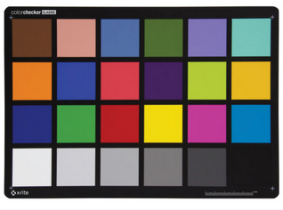
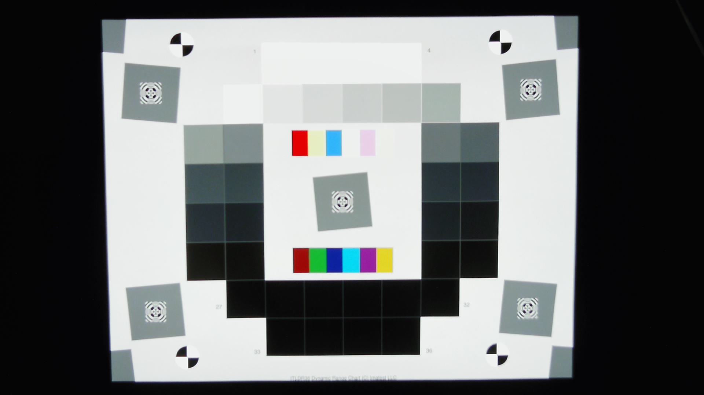
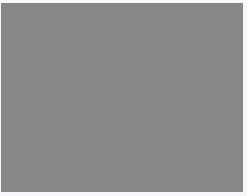
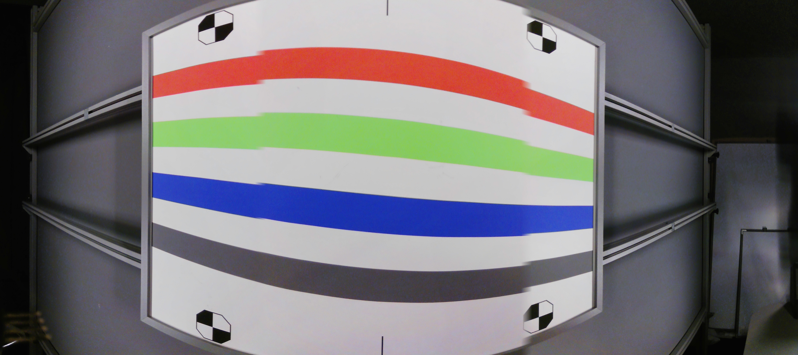
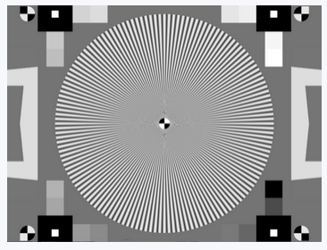
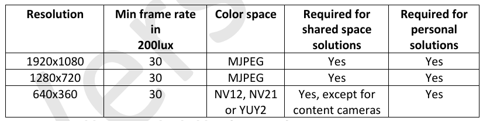
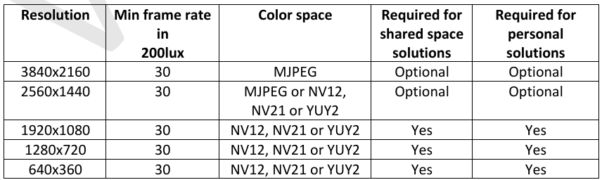
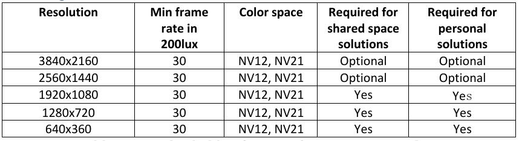
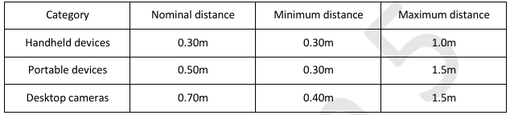

# 《Microsoft Teams 視訊擷取規範》
針對個人裝置及會議室共享空間設備，詳盡定義了獲得官方認證所需的技術標準。微軟在文中規定了影像解析度、畫質屬性與驅動程式相容性，旨在優化視訊通話的互操作性與使用者體驗。文件深入涵蓋了諸如調變轉換函數 (MTF)、自動曝光、色彩準確度及系統延遲等關鍵性能指標的測試程序。此外，該規範還將性能表現區分為標準 (Standard) 與進階 (Premium) 兩個等級，供硬體合作夥伴作為設計研發的參考依據。最後，內容亦包含針對不同會議室規模的視野範圍需求，以及確保設備在多種光照環境下皆能穩定運作的評估準則。

## 名詞定義
- A-light： 光譜功率分佈與 CIE 定義的「標準光源 A」（白熾燈/鹵素燈）相似的白熾光源。
- Color accuracy (色彩準確度)： 量測相機擷取的色彩，與測試圖卡（如 ColorChecker）標準色彩之間的偏差值。
- Color uniformity (色彩均勻性)： 量測整個影像畫面中色彩的變異度，而非僅比較中心與邊角。
- Color space (色彩空間)： 代表色彩的數學模型。電腦螢幕標準為 sRGB，相機擷取則主要使用 YUV。
- Depth of field (景深)： 相機能清晰成像的最前與最後物體之間的物理距離範圍。
- DUT (受測設備)： Device Under Testing。
- Dynamic range (動態範圍)： 相機能擷取且未產生亮度截波（unclipped）的灰階密度範圍。
- Edge roughness (邊緣粗糙度)： 影像邊緣的粗糙程度，常由去馬賽克（demosaicing）、影像縮放（scaling）或去噪演算法引起。
- Field of view (FOV / 視野)： 相機在特定瞬間能看見的物理世界角度範圍。
- Focus (對焦)： 當物體某點的光在影像中收斂到極致即為對焦，其模糊界線由 MTF 來判定。
- Gamma (伽馬值)： 視訊系統中用於對亮度值進行編碼與解碼的非線性運算，用以呈現自然的影像對比。
- Geometric distortion (幾何畸變)： 影像偏離直性投影（直線在畫面中仍保持直線）的偏差度。
- Jitter (抖動)： 訊號週期性相對於參考時鐘源的標準偏差。
- Latency (延遲)： 系統的時間延遲。對視訊通話最重要的是「端到端延遲」（光子進入相機到螢幕發出光子的時間）。
- MTF (調變轉換函數)： 光學轉換函數的振幅。MTF30 代表 MTF 衰減至低頻值 30% 時的空間頻率（cy/px），代表影像能接受的最高清晰頻率。
- Oversharpening (過度銳化)： 特徵化影像相對於標準銳化模型之銳化程度的指標。
- Relative illumination (相對照度)： 即暗角（Vignetting），影像亮度從中心向邊角遞減的量值。
- ROI (感興趣區域)： Region of Interest。
- SNR (訊雜比)： Signal to Noise Ratio。
## 實驗室環境
以下是基於微軟 Teams 視訊擷取規格書說明的完整實驗室測試實施指南：
### 1. 實驗室物理測試環境建置
- 空間與反射控制： 測試實驗室必須為完全隔絕外部光源的暗室。房間的地板、天花板、牆壁和設備支架皆必須為無光澤（Matt）的黑色或深灰色，以避免在測試目標或相機上產生任何光影反射。測試圖表後方的背景牆面則建議塗成中灰色。
- 照明控制系統（Automated Light Setup）：
    - 測試必須使用可精確調整與變更照度（Lux）與色溫（Kelvin）的自動化照明系統。主要光源使用 4 盞 Color Kinetics ColorBlast intelliHue Powercore Gen4 Optifield 燈具，以 X 字形配置架設於距離圖卡表面 72cm 的平面上。此設定可在 1mx1m 的測試圖表上達到 90% 面積內照度變異低於 10% 的高均勻度。其色溫調整範圍可涵蓋 2000K 至 10000K 之間。
    - 輔助光源列（Auxiliary Lights）： 包含 2700K Warm LED、A-light（鹵素白熾燈）、5000K Cool LED、CFL 3500K 等標準光源，安裝於兩側的垂直燈架上，並利用鏡子來導向光能，以確保在相當於 X-Rite ColorChecker 大小的中心區域上達到 10% 以內的照明均勻度。
    - 光照強度與色溫必須在測試圖表的中心位置，使用專業的**分光光度計（如 Gigahertz-Optik MSC15）**進行精確量測與校正。
- 測試軟硬體組件： 測試時將 DUT 相機連接至測試 PC，並利用遠端擷取工具（Remote Capture Tool, RCT） 擷取 raw 或 MJPEG 影像，並透過 TCP 傳輸至 Video TMT (Test Management Tool) / Video Analyzer 電腦進行客觀數據分析。
### 2. 測試前置條件與健全測試（Sanity Tests）  
在進行正式定量測試前，受測設備（DUT）必須通過基本的要求與前置驗證：
- 端到端視訊健全測試（Video Sanity Tests）： 必須由兩位測試人員在 Well-lit office（面部照度至少 200 Lux）與 Simulated living room（照度 40 Lux ± 20 Lux，並使用檯燈模擬背光與眩光環境）條件下進行實際通話評估，評估項目包含視訊渲染、影像動作（手部揮舞測試抖動、拍手測試影音同步）、白板讀取品質及鏡頭縮放控制等。
- 驅動程式與 CPU 使用率限制： USB 相機必須支援標準 UVC 與 UAC 驅動程式。若配有客製化驅動程式，在 Windows 系統「平衡」電源計畫下以 1080p 30fps 執行遠端擷取工具時，該程序之 CPU 使用率必須低於 30%。
- 3A 控制穩定時間： 自動白平衡（AWB）、自動曝光控制（AEC）與自動增益控制（AGC）必須預設啟用，且影像在變更測試目標或光照條件後，個人裝置需在 5 秒內、會議室裝置需在 20 秒內完成影像穩定。
- 幾何與視野一致性： 所有解析度下的像素寬高比必須在 0.98 至 1.02 之間，以確保測試軟體（Video Analyzer）能正確自動偵測測試圖卡的感興趣區域（ROI）。此外，在不同解析度間切換時，畫面中心移位必須 ≦ 3%，垂直視野變化必須 ≦ 25%。
- 對焦性能與亮度範圍： 自動對焦需在 5 分鐘實際動作中保持 99% 時間皆處於對焦狀態，且支援手動對焦 API 關閉自動對焦功能。在關閉 YUV 轉換（YUV Transform）下，使用 ITDR-36 圖表驗證亮度範圍，確保 black patch 平均像素值 ≧ 16 且 white patch 平均像素值 ≦ 235。擷取視訊時，硬體之使用指示燈（Usage indicator）也必須開啟。
### 3. 靜態影像品質量測與標準圖卡運用
測試時，相機必須對準特定的標準圖卡，擷取畫面並傳送至 Video Analyzer 進行客觀指標分析：
- MTF 與細節品質量測： 使用 **SFR Plus (5x7) 測試圖卡**（分大、小尺寸），量測**空間頻率響應（MTF30）**、**過度銳化（Oversharpening）**、**邊緣粗糙度（Edge roughness）**、以及個人裝置的**景深（Depth of Field）**。以標準級為例，個人裝置在 20 Lux/80 Lux 照度下，中心區域的 MTF30 需落在 [0.3, 0.8] cy/px 區間，邊緣粗糙度需 ≦ 0.138。  
 測試圖卡")
- 曝光、對比與色彩精確度： 使用 **X-Rite ColorChecker Classic 圖卡（需填充至少 70% 垂直視野）**：  

    - 曝光準確度： 第 22 號色塊的 Y（亮度）通道平均值需落在區間。
    - 對比度（Gamma）： 必須落在 [0.4, 0.75] 區間，確保於 Gamma 2.2 的標準顯示器上呈現自然對比。
    - 色彩準確度： 量測 1-18 號色塊的平均色差45，在 3000K LED（80 Lux）光源下需滿足平均色差 Mean $\Delta C_{00} \le 10$ 且最大色差 Max $\Delta C_{00} \le 15$。
    - 色彩飽和度（Saturation）： 在多種光源下需落於 [85%, 135%] 區間（A-light 則為 [80%, 135%]）。
    - 白平衡誤差（White balance error）： 第 21 號色塊在 3000K LED 光源下的白平衡誤差需滿足 $\Delta C_{00} \le 15$。
- 動態範圍量測： 搭配均勻背光燈箱使用 ITDR-36 穿透式圖卡（填充至少 70% 垂直視野），量測相機的動態範圍（Dynamic range）。個人裝置動態範圍需 ≧ 33 dB，會議室裝置需 ≧ 36 dB。  

- 紋理銳度量測（Texture Acutance）： 使用 Dead Leaves / Spilled Coins 圖卡，確保相機在進行雜訊抑制時不抹平人臉或背景的自然細節。在 20 Lux 與 80 Lux 下，個人裝置的紋理銳度皆需 ≧ 0.70。  

- 幾何畸變量測（Geometric Distortion）： 使用 Imatest Dot Pattern 點矩陣圖卡，相機需看見至少 15 排點且不看到 dotted 區域外。依相機 FOV 大小不同，畸變程度需限制在 ≦ 6% 到 ≦ 14% 之間。對於圓柱投影（cylindrical projection）相機，則需多圖拼接覆蓋整個畫面對角線進行分析。

- 均勻度與雜散光量測： 使用 **Gray Board（中灰板）** 測量鏡頭的相對照度（Relative illumination）與色彩均勻性（Color uniformity）。色彩均勻性 Max C 需 ≦ 10。此外，在相機上方 10cm 架設一盞同型號眩光燈進行**雜散光/眩光（Veiling glare）**測試，開啟前後的灰階影像平均絕對像素差必須 ≦ 10。

- 影像拼接與會議室專屬指標：
    - 多鏡頭相機需使用 Color Bars 圖卡量測拼接品質（Stitching quality），接縫處之邊緣不連續性需 ≦ 1.5 pixels、色差不連續性需 ≦ 5、亮度不連續性需 ≦ 5%。  
    
    - 共享空間裝置需在最大推薦測試距離與最近距離下，使用 Siemens Star 圖卡測量限制空間解析度（LSR30 ≧ 0.7 cy/cm）、最近使用者清晰度（Acuity ≧ 0.17 cy/px）及數位變焦品質。  
    
### 4. 時間特性、延遲與實際通話性能
除了靜態量測外，影像品質的動態表現與通話穩定度亦需在實驗室進行量測：
- 首幀捕獲與解析度切換時間： 首幀捕獲時間必須 ≦ 1500 ms，且解析度切換時間也必須 ≦ 1500 ms。
- 影格抖動（Jitter）： 所有解析度與 30 fps 下，影格抖動必須 ≦ 7 ms。
- 本機系統延遲（System Latency）： 使用閃爍 LED 搭配專屬的延遲量測套件（Latency measurement kit），在 200+ Lux 照度、關閉 YUV 轉換條件下量測，本機系統延遲需滿足：YUY2 格式 ≦ 130 ms，MJPEG/NV12 格式 ≦ 140 ms。
- 影音同步（Audio/Video Synchronization）： 使用閃爍 LED 與蜂鳴喇叭量測 A/V 偏離，必須維持在音訊領先 < 75ms 且音訊落後 < 105ms 之間。
- 實際通話中影格率（E2E Call Frame Rate）：
    - 在理想網路環境中，DUT 與配備 1080p 相機的參考電腦（Reference PC）建立實際的 Teams 雙向視訊通話。
    - 將參考電腦的視訊輸出通過 DVI 擷取卡以固定 50 或 60 fps 擷取畫面，並利用 Video Analyzer 分析實際的傳送與接收影格率。
    - 個人裝置的發送影格率在 80/160/200 Lux 下需 > 29 fps（20 Lux 下需 > 14 fps）；會議室裝置發送影格率在 200 Lux 下需 > 29 fps；兩者的接收影格率皆需 > 29 fps。    
### 透過上述嚴格的物理環境、前置條件健全測試、標準圖卡精密量測以及通話中的延遲與影格率驗證，便能全方位確保視訊通話在實驗室測試環境下的影像品質符合高標準要求。
## Entry criteria for video testing」（視訊測試准入與前置要求）
受測設備（DUT）在進入實驗室進行精密的客觀畫質（量化）測試之前，必須強制通過的基本要求與前置驗證。
如果在此章節中有任何一個項目未通過，測試人員有權直接終止後續的所有測試，並判定該設備不符合認證標準。
### 1. Video prerequisite testing (視訊健全性預選測試)
- 目的： 在開始複雜的實驗室量化測試之前，透過實際通話找出 average 使用者（一般用戶）一眼就能察覺的明顯瑕疵。此測試著重於基本可用性，而非精密數值。
- 步驟與測試項目： 測試需要兩名人員（近端與遠端）在兩種環境下進行實際 Teams 通話測試（會議室設備僅需在辦公室環境測試）：
    - 環境一：辦公室光源環境（Well-lit office），面部照度至少 200 Lux，且光源不得直接直射相機。
    - 環境二：模擬客廳環境（Simulated living room），面部照度在 40 Lux ± 20 Lux，並在使用者後方 1.5 公尺放置鎢絲燈，模擬背光與眩光。
    - Video Render (視訊渲染測試)： 遠端使用者將畫面最大化（至 720p 或 1080p），確認視訊啟動時間與解析度切換順暢度。檢查是否有相機遮擋、構圖不良、影像模糊、過度銳化光暈、視訊卡頓（Jerkiness）、編碼馬賽克（Blockiness）或色彩異常等瑕疵。同時測試開關燈光時，影像能否無異常地正確復原。
    - Image Motion (動作測試)： 近端使用者揮手（測試畫面有無抖動/Jitter）、拍手（測試影音 A/V 是否同步），遠端使用者確認影格率是否流暢。
    - Whiteboard (白板測試，僅限共享空間設備)： 近端使用者在白板不同位置書寫 10 公分高的文字，遠端使用者需能清晰閱讀，或可遠端控制鏡頭 Pan/Tilt/Zoom 來讀取。
    - Zooming & Additional features (縮放與附加功能，僅限共享空間設備)： 評估多鏡頭/雲台鏡頭的縮放與旋轉順暢度。若支援主動發言者追蹤（Active speaker view），須驗證其不會受到白板或牆壁的語音反射干擾，且能同時處理多人交談。
### 2. Driver (驅動程式要求)
- 目的： 確保外接式 USB 相機能在不需安裝第三方驅動的情況下，與作業系統完美相容，並確保客製化驅動程式（若有）不會過度佔用 CPU 資源而拖累電腦效能。
- 步驟與測試項目：
    - 標準 UVC 支援： 設備必須支援 USB Video Class (UVC) 1.0 或更新標準，並在使用 Windows 內建的 usbvideo.sys 驅動程式下能完全正常運作。
    - 標準 UAC 支援： 若相機內建麥克風，必須支援 USB Audio Class (UAC) 1.0 標準，並可與 Windows 內建的 usbaudio.sys 驅動程式完美配合。
    - OEM 驅動的 CPU 使用率限制（僅限個人裝置）： 若相機配有內建影像處理的 OEM 驅動程式，在使用「遠端擷取工具（RCT）」擷取影像時，該程序的 CPU 平均使用率必須在規定限制之內（VGA 30fps 下 < 8%、720p 下 < 16%、1080p 下 < 30%）。
### 3. Basic video attributes (基本視訊屬性要求)
- 目的： 確保相機硬體能夠原生支援 Teams 所需的解析度、影格率以及色彩空間，避免設備對 Teams 申報了它在實際通話中根本無法維持穩定影格率的高解析度。
- 步驟與測試項目：
    - 相機必須能在 200 Lux 光源下，提供符合規範的解析度、色彩空間與影格率組合（如 Table 所示）：
        - USB 2.0 相機： 必須支援 1080p@30fps (MJPEG)、720p@30fps (MJPEG) 以及 360p@30fps (NV12、NV21 或 YUY2)。
            
        - USB 3.0 相機： 必須支援 1080p@30fps、720p@30fps、360p@30fps 的無壓縮格式（NV12、NV21 或 YUY2）。
            
        - MIPI 相機： 必須支援 1080p/720p/360p@30fps (NV12 或 NV21)。
            
    - Android 裝置必須支援 NV21 色彩空間。
### 4 Pre-conditions to enable testing the video quality requirements (畫質量化測試的前置啟用條件)
- 目的： 這是為了確保後續在進行自動化畫質檢驗時，自動化軟體（Video Analyzer）能夠成功、穩定且可靠地運作。因此，相機的自動白平衡、自動曝光與自動對焦等功能，必須在特定時限內快速穩定下來，以契合自動化腳本的擷取時程。
- 步驟與測試項目：
    - 防閃爍 (Anti-flicker)： 相機必須具備抑制 50Hz/60Hz 交流電日光燈頻閃的能力，避免頻閃嚴重降低影像的信噪比（可能劣化 > 8 dB）。標準級必須支援手動選擇，高級（Premium）則要求能自動偵測並切換頻閃模式。
    - 3A 控制與穩定時間： 自動白平衡（AWB）、自動曝光（AEC）與自動增益（AGC）必須預設開啟24more_horiz。當更換測試圖卡或變更光照後，個人裝置必須在 5 秒內完成影像穩定，而會議室裝置則必須在 20 秒內穩定。
    - 像素寬高比 (Pixel aspect ratio)： 所有解析度下的像素寬高比必須滿足 $0.98 \le R \le 1.02$，防止畫面產生拉伸變形，並確保測試軟體能順利自動偵測圖卡的感興趣區域（ROI）。
    - 視野一致性 (Field of view consistency)： 在不同解析度（如頻寬限制或光照變化導致解析度切換）之間轉換時，畫面中心位移必須 $\le 3\%$，垂直視野（VFOV）尺寸變化必須 $\le 25\%$，以維持流暢的使用者體驗。
    - 自動對焦效能 (Autofocus performance)： 自動對焦相機在 5 分鐘通話測試中，必須在 99% 的時間內保持對焦；且必須能透過 API 關閉自動對焦並設為預設名義距離，以避免視訊時產生擾人的「對焦游移（focus swimming）」。
    - 明暗度與色彩空間正確性驗證： 使用穿透式 ITDR-36 圖卡。驗證在關閉 YUV 轉換時，有限範圍（Limited range）的 raw 格式（YUY2/NV12）之黑色色塊（Patch 36）平均像素值 $\ge 16$，白色色塊（Patch 1）$\le 235$3132。若數值不正確，當 Teams 用戶端在渲染時拉伸色彩範圍，就會造成亮度渲染錯誤。
    - 使用指示燈 (Usage indicator)： 在相機捕捉/傳送視訊時，必須亮起擴散、低亮度的指示燈（如 LED），並在關閉通話時熄滅，以確保使用者隱私。
## Video quality requirements in lab environment」（實驗室環境下的視訊品質要求）
受測相機在實驗室標準環境下，必須通過的各項量化（定量）影像品質指標。
這些測項總共分為 6 大類別（細節品質、色調與雜訊、色彩品質、幾何、陰影均勻性、時間特性），每個測項皆有其獨特的目的、對應的標準測試圖卡與客觀量測方法。以下為您詳細說明各測項內容：
## 1. Detail quality (細節品質) 測項
此類別旨在確保相機鏡頭的解析度足以匹配感測器，且感測器在經過內部影像處理與去馬賽克（demosaicing）後，仍能保留足夠的畫面細節。  
- ### MTF (調變轉換函數 / 空間頻率響應)：
    - #### 定義與目的： MTF30（調變轉換函數衰減至低頻值 30% 時的空間頻率）是用來量測相機系統空間頻率響應的指標。MTF30 代表影像中能被接受並清晰捕捉的最高空間頻率。MTF 表現不佳通常歸因於劣質鏡頭、鏡頭與感測器不匹配，或不良的影像訊號處理（ISP）。
    - #### 測試圖卡與方式： 預設使用 SFR Plus (small) 圖卡，或可交替使用 SFR Plus (large)。Video Analyzer 會自動偵測並分析圖卡中心區域的 2 個水平與 2 個垂直邊緣，並報告多個邊緣中最差的一組數值。
    - #### 測試環境要求 (光源、色溫、距離)
    1. 光源與色溫（Light Setup & Color Temperature）：
        - 個人解決方案（Personal solutions）： 必須在 3000K LED 的色溫光源下，分別測試低光源 20 Lux 以及典型光源 80 Lux 兩種照度條件。
        - 共享空間解決方案（Shared space solutions）： 必須在 3000K LED 的色溫光源下，測試明亮光源 200 Lux 的照度條件。
    2. 測試距離（Testing Distance）：
        - 個人解決方案： 測試距離依設備類別的**標稱/標稱距離（Nominal distance）**進行架設：
            
            - 手持式裝置（Handheld）： 0.30m（測試範圍為 0.30m 至 1.0m）。
            - 可攜式裝置（Portable）： 0.50m（測試範圍為 0.30m 至 1.5m）。
            - 桌上型相機（Desktop）： 0.70m（測試範圍為 0.40m 至 1.5m）。
        - 共享空間解決方案： 細節品質（Section 4.1）統一在 1.0m 的物理距離下進行測試（若說明書未特別標示，預設亦為 1.0m）。
        - 受測相機（DUT）狀態設定：
            - 若相機支援自動對焦（Autofocus），測試期間自動對焦必須維持開啟（ON）。
            - 若相機支援光學變焦（Optical zoom），建議將鏡頭拉到最廣角端（zoom out as much as possible）。
    - #### 測試圖卡與分析區域 (Test Target & ROI)
        - 標準測試圖卡：
            - 預設使用 SFR Plus (small) 測試圖卡。
            - 若相機視角（FOV）較寬，且所有角落色塊能完整塞入更寬的 ROI 畫面中，可替換使用 SFR Plus (large)。
            - 允許使用對比度相似的客製化斜邊圖卡（Slanted edge charts），但由於系統無法自動偵測，必須以手動方式在 Video Analyzer 中進行量測。
        - 感興趣區域（ROI / Region of Interest）：
            - 主要分析對象為測試圖卡正中心區域的 2 個水平斜邊與 2 個垂直斜邊（共 4 個邊緣）。
    - #### 分析與計算方式：
        - 使用 Video Analyzer 軟體對 ROI 進行自動化偵測與計算。
        - 系統會計算這 4 個邊緣的 MTF30 數值，並**以其中表現最差的一個邊緣數值（worst case）**作為該設備最終回報與判定的測試結果。
    - #### 合格判定標準 (Success Criteria)
        微軟將 MTF30 的判定標準（單位：cycles per pixel，簡寫為 cy/px）分為 Standard (標準級，即通過 Teams 認證的強制性合格門檻) 與 Premium (高級，僅作為卓越畫質的設計指引，非強制性)：
        - A. 個人解決方案 (Personal Solutions) 判定標準  

        | 測試項目 (照度 / 色溫 / 區域) | Standard (標準級門檻) | Premium (高級指引) |
        | ---- | ---- | ---- |
        | MTF30 (20 Lux, 3000K LED, 中心) | [0.3, 0.8] cy/px | [0.4, 0.7] cy/px |
        | MTF30 (80 Lux, 3000K LED, 中心) | [0.3, 0.8] cy/px | [0.4, 0.7] cy/px |
        | MTF30 (80 Lux, 3000K LED, 80% 中心圓形區域) | 不適用 (N/A) | [0.3, 0.7] cy/px |

        - B. 享空間解決方案 (Shared Space Solutions) 判定標準

        | 測試項目 (照度 / 色溫 / 區域) | Standard (標準級門檻) | Premium (高級指引) |
        | ---- | ---- | ---- |
        | MTF30 (200 Lux, 3000K LED, 中心) | [0.3, 0.8] cy/px | [0.4, 0.7] cy/px |

        ### 註：微軟之所以將合格標準限制在一個區間（例如 Standard 為 [0.3, 0.8]），除了下限值代表清晰度必須足夠外，上限值（0.8 或 0.7）的限制是為了防止製造商藉由極端、不自然的「過度銳化（Oversharpening）」演算法強行拉高清晰度數據，因為過度銳化會導致影像高對比邊緣產生嚴重白邊、光暈或黑線等人工痕跡。

- ### Oversharpening (過度銳化)：
    - #### 定義與目的： 用於量測相機對影像邊緣進行銳化處理的程度。雖然軟體能透過極端的銳化演算法強行提高 MTF 值，但過度銳化會導致高對比邊緣產生光暈（halos）或異常暗線等不自然的視覺人工痕跡。此測項旨在將過度銳化或銳化不足（undersharpening）限制在合理區間內。
    - #### 測試圖卡與方式： 使用與 MTF 相同的 SFR Plus 測試圖卡與中心邊緣區域，由 Video Analyzer 自動偵測分析並回報最差值。
    - #### 測試環境與架設要求 (光源, 色溫, 距離)
    1. 光源與色溫（Light Setup & Color Temperature）：
        - 必須在 3000K LED 的色溫光源下進行測試。
        - 個人解決方案（Personal solutions）： 分別量測 20 Lux、80 Lux 以及 200 Lux 三種照度條件。
        - 共享空間解決方案（Shared space solutions）： 僅量測 200 Lux 的照度條件。
    2. 測試距離（Testing Distance）： 由於過度銳化屬於「 Detail quality（細節品質）」的測項之一，其測試物理距離與該節規範一致：
        - 個人解決方案（依產品類別設定標稱距離）：
            - 手持式裝置（Handheld）： 0.30m（測試範圍為 0.30m 至 1.0m）。
            - 可攜式裝置（Portable）： 0.50m（測試範圍為 0.30m 至 1.5m）。
            - 桌上型相機（Desktop）： 0.70m（測試範圍為 0.40m 至 1.5m）。
        - 共享空間解決方案： 統一架設於 1.0m 的測試物理距離。
        - 相機設定： 若受測相機（DUT）支援自動對焦，測試期間自動對焦必須開啟；若支援光學變焦，建議將鏡頭拉到最廣角端。
    - #### 測試圖卡與分析區域 (Test Target & ROI)
        - 標準測試圖卡： 預設使用 SFR Plus (small) 測試圖卡（或可替換使用 SFR Plus (large)）。
        - 感興趣區域（ROI）： 測試圖卡正中心區域的 2 個水平斜邊與 2 個垂直斜邊（中心正方形周圍）。
        - 數據計算： 使用 Video Analyzer 進行自動化 ROI 偵測與分析。測試最終會回報這 4 個邊緣中**表現最差的一個數值（worst case）**作為判定依據。
    - #### 合格判定標準 (Success Criteria)
        微軟將過度銳化與銳化不足的偏差度以絕對百分比（即 $| \le X\% |$）來判定2。標準分為 Standard（標準級門檻，強制性） 與 Premium（高級指引，非強制性）：
        - A. 個人解決方案 (Personal Solutions) 判定標準2無論在低照度或典型照度下，個人裝置皆須控制在極佳的銳化範圍內：
        
        | 測試項目 (照度 / 色溫 / 區域) | Standard (標準級門檻) | Premium (高級指引) |
        | ---- | ---- | ---- |
        | Oversharpening (20 Lux, 3000K LED, 中心) | 絕對值 ≦ 20% | ≤ 20% | 
        | Oversharpening (80 Lux, 3000K LED, 中心) | 絕對值 ≦ 20% | ≤ 20% |
        | Oversharpening (200 Lux, 3000K LED, 中心) | 絕對值 ≦ 20% | ≤ 20% | 
        - B. 共享空間解決方案 (Shared Space Solutions) 判定標準2由於會議室設備通常需要將畫面傳輸至大螢幕，對於遠端呈現的邊緣銳利度要求之標準略有不同：

        | 測試項目 (照度 / 色溫 / 區域) | Standard (標準級門檻) | Premium (高級指引) |
        | ---- | ---- | ---- |
        | Oversharpening (200 Lux, 3000K LED, 中心) | 絕對值 ≦ 30% | ≤ 30% |

- ### Edge roughness (邊緣粗糙度)：
    - #### 定義與目的： 邊緣粗糙度主要反映影像下縮放（downscaling）演算法的品質。影像邊緣常因去馬賽克、空間去噪、縮放演算法（例如「最鄰近插值法」會導致邊緣鋸齒，而「雙立方/Bicubic 插值法」表現則優秀許多）或過高的雜訊而變得粗糙。
    - #### 測試圖卡與方式： 使用 SFR Plus 圖卡，量測中心 4 個邊緣，並由 Video Analyzer 自動計算。
    - #### 測試環境與架設要求 (光源, 色溫, 距離)
    1. 光源與色溫（Light Setup & Color Temperature）：
        - 受測設備（DUT）必須在 3000K LED 的色溫光源下進行測試。
        - 測試照度（Lux Level）：
            - 個人解決方案（Personal solutions）： 測試照度為低光源的 80 Lux。
            - 共享空間解決方案（Shared space solutions）： 測試照度為明亮環境的 200 Lux。
    2. 測試距離（Testing Distance）： 由於邊緣粗糙度屬於「 Detail quality（細節品質）」的子測項之一，其測試物理距離需遵循該節之規範：
        - 個人解決方案：依照設備類別（Table 2）的**標稱距離（Nominal distance）**架設：
            - 手持式裝置（Handheld）： 0.30m。
            - 可攜式裝置（Portable）： 0.50m。
            - 桌上型相機（Desktop）： 0.70m。
        - 共享空間解決方案：統一架設於 1.0m 的測試物理距離（若產品說明書中未特別標明，預設即為 1.0m）。
    - #### 測試圖卡與分析區域 (Test Target & ROI)
    1. 標準測試圖卡：
        - 參考 MTF 測試細節（Table 22），預設使用 SFR Plus (small) 測試圖卡。
        - 若相機視角（FOV）較寬，且所有角落色塊能完整納入畫面中，可替換使用 SFR Plus (large)。
        - 允許使用對比度相似的客製化斜邊圖卡（Slanted edge charts），但由於系統無法自動偵測，必須在 Video Analyzer 中以手動方式進行量測。
    2. 感興趣區域（ROI / Region of Interest）：
        - 測試圖卡正中心正方形周圍的 2 個水平斜邊與 2 個垂直斜邊（共 4 個邊緣）。
    3. 分析與數據計算：
        - 使用 Video Analyzer 進行自動化 ROI 偵測與數據計算。
        - 系統會量測上述邊緣，並**以其中表現最差的一個邊緣數值（worst case）**作為該設備最終回報與判定的測試結果。
    - #### 合格判定標準 (Success Criteria)
        邊緣粗糙度（ER）為一無單位數值，數值愈小代表影像縮放後邊緣愈平滑、演算法品質愈佳。其標準分為 Standard（標準級門檻，強制性合格門檻） 與 Premium（高級指引，非強制性）：
        - A. 個人解決方案 (Personal Solutions) 判定標準
            - Standard (標準級門檻)：```ER ≦ 0.1```
            - Premium (高級指引)：```ER ≦ 0.05```
        - B. 共享空間解決方案 (Shared Space Solutions) 判定標準
            - Standard (標準級門檻)：```ER ≦ 0.1```
            - Premium (高級指引)：```ER ≦ 0.05```
    ### (備註：無論是個人或是會議室裝置，在對應的測試照度下，其標準級（Standard）的合格底線一律為 0.1，而要達到頂級畫質設計目標（Premium）則需小於或等於 0.05。)

- ### Depth of field (景深)：
    - #### 定義與目的： 確保固定焦距或手動對焦的相機鏡頭，在規範的最小至最大工作距離範圍內，皆能捕捉到清晰對焦的影像。註：此測項僅適用於個人裝置，共享空間/會議室設備的景深由第 5 章的 5.1.1 與 5.1.2 指標取代。
    - #### 測試圖卡與方式： 使用 SFR Plus (small) 圖卡，需確保圖卡至少填滿 75% 的像素區域。相機在類別對應的最小與最大距離下進行影像擷取，量測中心 4 個邊緣，並由 Video Analyzer 計算最差值。若相機支援自動對焦，測試期間自動對焦需開啟。
    - #### 測試環境與架設要求 (光源, 色溫, 距離)
    1. 光源與色溫（Light Setup & Color Temperature）：
        - 測試必須在 80 Lux 的照度條件下進行。
        - 色溫（Color Temperature）： 光源色溫統一使用 3000K LED。
    2. 測試距離（Testing Distance）：相機必須分別在設備類別所規定的**最小工作距離（Minimum distance）與最大工作距離（Maximum distance）**下進行擷取測試。各類別的具體距離如下：
        - 手持式裝置（Handheld）： 最小距離為 0.30m，最大距離為 1.0m。
        - 可攜式裝置（Portable）： 最小距離為 0.30m，最大距離為 1.5m。
        - 桌上型相機（Desktop）： 最小距離為 0.40m，最大距離為 1.5m。
    3. 測試圖卡（Test Chart）：
        - 預設使用 SFR Plus (small) 測試圖卡。
        - 擷取時，必須確保完整圖卡填滿至少 75% 的像素區域。若因相機視野（FOV）過寬或測試距離導致圖卡在畫面中顯得過小，則允許替換使用 SFR Plus (large) 圖卡。
    4. 受測相機（DUT）狀態設定：
        - 若是固定焦距（Fixed focus）或手動對焦的相機鏡頭，在變更最小與最大工作距離時，不允許進行任何焦距調整。
        - 若是支援自動對焦（Autofocus）的相機，在測試期間必須開啟自動對焦，且允許在變更距離後最多有 5 秒的時間讓對焦收斂穩定。
    - ####  測試分析與判定標準（Success Criteria）
        - 分析區域（ROI）：
            - 使用影像分析儀（Video Analyzer）自動偵測圖卡正中心區域的 2 個水平斜邊與 2 個垂直斜邊（共 4 個邊緣）。
        - 數據回報：
            - Video Analyzer 會計算這 4 個邊緣在最小與最大距離下的 MTF30 數值，並以這 4 個邊緣中**表現最差的一個邊緣數值（worst case）**作為該設備的最終判定依據。
        - 合格判定標準： 受測設備在最小與最大工作距離下，其最差邊緣的 MTF30 必須符合以下數值區間（單位：cy/px）：

        | 測試項目 (照度 / 色溫 / 區域) | Standard (標準級門檻) | Premium (高級設計指引) |
        | ---- | ---- | ---- |
        | 80 Lux, 3000K LED, 最小距離下之 MTF30 最差值 | [0.3, 0.8] cy/px | [0.4, 0.7] cy/px |
        | 80 Lux, 3000K LED, 最大距離下之 MTF30 最差值 | [0.3, 0.8] cy/px | [0.4, 0.7] cy/px |
- ### Texture acutance (紋理銳度)：
    - #### 定義與目的： 許多新式相機使用微小像素感測器，感光度較低且雜訊較高。雖然可透過雜訊抑制（降噪）改善信噪比（SNR），但過度的降噪會將影像中的微小細節抹平（例如人臉肌理或背景牆面紋理），導致影像看起來不自然。此測項用於確保相機在降噪時，不會過度損害微小細節與紋理。
    - #### 測試圖卡與方式： 個人裝置使用 8”x8” 或 12”x12” Spilled Coins (Dead Leaves) 圖卡，共享空間裝置使用 12”x12” 尺寸。由 Video Analyzer 自動偵測與分析。測試解析度包含 1080p，以及支援的 1440p 與 2160p。
    - #### 測試環境與架設要求
    1. 光源與色溫（Light & Color Temperature）：
        - 測試光源統一使用 3000K LED。
        - 測試照度（Lux Levels）：
            - 個人解決方案（Personal solutions）： 分別在低光源 20 Lux 與典型光源 80 Lux 照度下進行測試。
            - 共享空間解決方案（Shared space solutions）： 在明亮光源 200 Lux 照度下進行測試。
    2. 測試解析度（Resolutions）：
        - 必須測試 1920x1080。若受測相機（DUT）支援，也必須測試 2560x1440 與 3840x2160。
        - 測試距離（Testing Distance）：
            - 個人解決方案： 參考產品類別（Table 2）的標稱距離（Nominal distance）架設（手持式 0.30m、可攜式 0.50m、桌上型 0.70m）。但有一項關鍵限制：如果標稱距離超過 1.0 公尺，則測試距離一律改採用 1.0 公尺。
            - 共享空間解決方案： 由於屬於 4.1 節細節品質測項，測試距離統一設定為 1.0 公尺（若廠商說明書未特別標示最小支援距離，則預設為 1.0 公尺）。
    3. 相機設定：
        - 若相機支援自動對焦，測試期間自動對焦必須開啟；若支援光學變焦，建議將鏡頭拉到最廣角端。
    - #### 測試圖卡與分析方式
    1. 標準測試圖卡：
        - 使用標準的 Spilled Coins (Dead Leaves) 紋理測試圖卡。
            - 個人解決方案： 預設使用 8”x8” 圖卡，亦可替換使用 12”x12”。
            - 共享空間解決方案： 統一使用 12”x12” 尺寸（霧面/matte）的圖卡。
    2. 數據分析方法：
        - 使用 Video Analyzer 軟體對影像的感興趣區域（ROI）進行自動化偵測與數據分析。其量測演算標準基於 CPIQ Texture Acutance, Phase 3 規範。
    - #### 合格判定標準 (Success Criteria)
        紋理銳度為無單位數值，數值愈高代表保留的細節愈多、影像畫質愈自然。微軟定義的合格標準如下：
        - A. 個人解決方案 (Personal Solutions) 判定標準

        | 測試光源與照度 | Standard (標準級門檻) | Premium (高級設計指引) |
        | ---- | ---- | ---- |
        | Acutance (20 Lux, 3000K LED) | ≧ 0.70 | ≧ 0.80 |
        | Acutance (80 Lux, 3000K LED) | ≧ 0.70 | ≧ 0.83 |
        - B. 共享空間解決方案 (Shared Space Solutions) 判定標準

        | 測試光源與照度 | Standard (標準級門檻) | Premium (高級設計指引) |
        | ---- | ---- | ---- |
        | Acutance (200 Lux, 3000K LED) | ≧ 0.70 | ≧ 0.83 |
        ### (備註：無論是個人或是共享空間裝置，其標準級（Standard）的最低通過門檻一律為 0.70。若相機因過度降噪而使紋理銳度低於此數值，在視訊會議中便會呈現出不自然的「油畫感」或細節嚴重遺失。)

## 2. Tonal response and noise (色調響應與雜訊) 測項
確保相機能在各種光照強度下提供自然、足夠的影像對比度，並有效控制干擾視線的雜訊。
- ### Dynamic range (動態範圍)：
    - #### 定義與目的： 量測相機能擷取且未產生亮度截波（unclipped，即過曝死白或過暗死黑）的灰階密度範圍。足夠的動態範圍可確保在拍攝使用者與背景時，不會遺失大面積的亮部或暗部細節。
    - #### 測試圖卡與方式： 搭配均勻背光燈箱使用穿透式的 ITDR-36 穿透式圖卡。圖卡需填充至少 70% 的垂直視野，量測所有 36 個灰階色塊，並由 Video Analyzer 自動偵測與計算。
    - #### 測試環境與架設要求
    1. 背光與燈箱光源 (Backlight & Light Box)：
        - 由於 ITDR-36 是穿透式（transmissive）圖卡，測試時必須在圖卡後方配備一個提供均勻發光表面的專用燈箱（Light box），微軟實驗室通常採用 Image Quality Labs IQL-LE002 D65 燈箱。
        - 亮度截波限制（Clipping requirement）： 測試時，燈箱背光亮度或相機曝光的調整，必須確保擷取畫面中至少有一個最亮色塊（bright patch）與至少一個最暗色塊（dark patch）產生亮度截波（clipping）。如果自動曝光無法達成此條件，允許測試人員手動調整燈箱背光亮度或相機曝光。
    2. 測試距離限制 (Distance)：
        - 圖卡與相機之間的距離必須架設到讓該圖卡填滿所有受測解析度下至少 70% 的垂直視野（vertical field of view）。
        - 為了確保自動化測試與重複測試的準確性，規格書推薦以具備最小視野（smallest field of view）的解析度為基準，來盡可能最小化相機與圖卡間的物理距離。
    - #### 測試圖卡 (Test Target)
        - 測試統一採用 ITDR-36 穿透式圖卡（36-Patch Dynamic Range Test Chart (transmissive)）。
    - #### 分析方法與合格判定標準 (Success Criteria)
        - 分析方法： 受測相機對準圖卡擷取影像後，使用 Video Analyzer 軟體對 ITDR-36 圖卡上的**全部 36 個灰階色塊（All patches）**進行感興趣區域（ROI）自動偵測，並計算出客觀的動態範圍數值（單位為分貝，dB）。
        - 判定標準： 規格書針對動態範圍（DR）數值定義了 Standard (標準級，認證強制合格門檻) 與 Premium (高級，卓越畫質之設計指引) 兩種標準：

        | 裝置類別 | Standard (標準級門檻) | Premium (高級設計指引)  |
        | ---- | ---- | ---- |
        | 個人解決方案 (Personal Solutions) | DR ≧ 33 dB | DR ≧ 36 dB |
        | 共享空間解決方案 (Shared Space Solutions) | DR ≧ 36 dB | DR ≧ 40 dB |

- ### Exposure accuracy (曝光準確度)：
    - #### 定義與目的： 驗證自動曝光控制（AEC）的精確度，確保影像在典型光源環境下擁有合適的亮度與對比，不致過曝或曝光不足。
    - #### 測試圖卡與方式： 使用 X-Rite ColorChecker Classic 圖卡，量測第 22 號灰階色塊的 Y（亮度）通道平均值。由 Video Analyzer 自動定位 ROI 並計算。
    - #### 測試環境與架設要求
    1. 光源與色溫（Light Setup & Color Temperature）：
        - 必須測試 3000K LED 以及 5000K LED 兩種不同色溫的光源。
        - 測試照度（Lux）需依裝置類型，在 20 Lux、80 Lux、200 Lux 以及 1000 Lux 不同的條件下進行量測。
    2. 測試距離（Testing Distance）： 由於曝光準確度屬於非類別相依的測項，其測試距離完全遵循 ColorChecker 圖卡的標準架設規範：
        - 受測設備（DUT）在測試時絕不能在 ColorChecker 圖卡上投射出任何陰影。
        - 在所有受測的解析度下，圖卡必須填滿至少 70% 的垂直視野（vertical field of view）。
        - 為了確保測試的可重複性（repeatability）與自動化，規格書推薦以具備最小視野（smallest field of view）的解析度為基準，來盡可能最小化相機與圖卡之間的物理距離。
    - #### 測試圖卡與分析區域 (Test Target & ROI)
        - 測試圖卡： 使用標準的 X-Rite ColorChecker Classic 測試圖卡。
        - 感興趣區域（ROI）： 測試分析圖卡最下排灰階色塊中的第 22 號灰階色塊（Patch 22）。
        - 量測與分析方法： 使用 Video Analyzer 軟體對圖卡進行自動化 ROI 偵測，量測並計算第 22 號色塊的 Y（亮度）通道平均值（Mean value of Y channel）。
    - #### 合格判定標準 (Success Criteria)
        第 22 號色塊的 Y（亮度）通道平均值必須符合以下規定的數值區間。標準分為 Standard（標準級門檻，強制性合格門檻） 與 Premium（高級指引，非強制性）：
        - A. 個人解決方案 (Personal Solutions) 判定標準

        | 測試光源、色溫與照度條件 | Standard (標準級門檻) | Premium (高級設計指引) |
        | ---- | ---- | ---- |
        | Y (20 Lux, 3000K LED) | [92,162]  | [102, 142] |
        | Y (80 Lux, 3000K LED) | [92,162]  | [102, 142] |
        | Y (200 Lux, 3000K LED) | [92,162] | [102, 142] |
        |Y (1000 Lux, 5000K LED) | [92,162] | [102, 152] |
        - B. 共享空間解決方案 (Shared Space Solutions) 判定標準
        ### 會議室/共享空間裝置在低照度 20 Lux 下不需要進行此項測試：
        | 測試光源、色溫與照度條件 | Standard (標準級門檻) | Premium (高級設計指引) |
        | ---- | ---- | ---- |
        | Y (80 Lux, 3000K LED) | [92,162] | [102, 142] |
        | Y (200 Lux, 3000K LED) | [92,162] | [102, 142] |
        | Y (1000 Lux, 5000K LED) | [92,162] | [102, 142] |

- ### Gamma (伽馬值)：
    - #### 定義與目的： Windows 電腦顯示器與投影機的標準伽馬值（Gamma）通常標準化為 2.2（透過 sRGB）。因此，相機的編碼 Gamma 需設定在 0.45 左右，以確保整個「擷取至渲染（capture-to-render）」系統呈現線性響應。若相機 Gamma 遠大於 0.45，會使影像對比度過大且看起來不自然。
    - #### 測試圖卡與方式： 使用 ColorChecker 圖卡，量測第 20 到 23 號色塊，由 Video Analyzer 自動偵測並分析其非線性色調映射曲線。
    - #### 測試環境與架設要求
        - 測試圖卡（Test Target）： 使用標準的 X-Rite ColorChecker Classic 測試圖卡。
        - 感興趣區域（ROI）： 圖卡最下排灰階色塊中的第 20 到 23 號色塊（Patches 20-23）。
        - 光源與色溫（Light Setup & Color Temperature）： 統一在 3000K LED 的色溫光源下進行測試。
        - 測試照度（Lux Levels）：
            - 個人解決方案（Personal solutions）： 須在低光源 20 Lux 以及典型光源 80 Lux 兩種照度下測試。
            - 共享空間解決方案（Shared space solutions）： 須在明亮光源 200 Lux 照度下測試。
        - 測試距離（Testing Distance）與擺放限制： 遵循 ColorChecker 圖卡的標準安裝規範：
            - 受測設備（DUT）在測試期間絕不能在 ColorChecker 圖卡上投射出任何陰影。
            - 在所有受測解析度下，圖卡必須填滿至少 70% 的垂直視野（VFOV）。
            - 為確保自動化測試的準確性與重複性，建議以具備最小視野（smallest field of view）的解析度為基準，來盡可能最小化相機與圖卡之間的物理距離。
    - #### 分析方法與合格判定標準（Success Criteria）
        - 分析方法： 使用 Video Analyzer 軟體對圖卡進行自動化 ROI 偵測，分析第 20 到 23 號色塊並計算出客觀的 Gamma 數值。
        - 合格判定標準： 微軟將 Gamma 判定標準分為 Standard（標準級，認證強制門檻） 與 Premium（高級設計指引，非強制性）：
        - A. 個人解決方案 (Personal Solutions) 判定標準

        | 測試光源、色溫與照度條件 | Standard (標準級門檻) | Premium (高級設計指引) |
        | ---- | ---- | ---- |
        | Gamma (20 Lux, 3000K LED) | [0.4, 0.75] | [0.4, 0.65] |
        | Gamma (80 Lux, 3000K LED) | [0.4, 0.75] | [0.4, 0.65] |
        - B. 共享空間解決方案 (Shared Space Solutions) 判定標準
        #### 共享空間設備不需測試低光源 20 Lux 的條件：
        | 測試光源、色溫與照度條件 | Standard (標準級門檻) | Premium (高級設計指引) |
        | ---- | ---- | ---- |
        | Gamma (200 Lux, 3000K LED) | [0.4, 0.75] | [0.4, 0.65] |
- ### Spatial SNR (空間信噪比)：
    - #### 定義與目的： 空間信噪比（SNR）是在單張靜態影像中量測像素雜訊的指標。它反映了在同一張擷取畫面中，單一像素與其鄰近像素之間的像素級亮度與色彩變異（pixel level variation）。
    - #### 測試圖卡與方式： 使用 ColorChecker 圖卡，量測第 22 號色塊。透過 Video Analyzer 自動定位並計算空間信噪比。
    - #### 測試環境與架設要求
        - 光源與色溫（Light Setup & Color Temperature）：
        - 受測相機必須在 3000K LED 以及 6000K LED 兩種不同色溫的光源下進行測試。
        - 測試照度（Lux Levels）：
            - 個人解決方案（Personal solutions）： 必須在低光源 20 Lux 以及典型光源 80 Lux 兩種照度下分別進行測試。
            - 共享空間解決方案（Shared space solutions）： 僅需在明亮光源 200 Lux 照度下進行量測。
        - 測試距離（Testing Distance）與擺放限制：
            - 受測設備（DUT）在測試期間絕不能在 ColorChecker 圖卡上投射出任何陰影。
            - 在所有受測的視訊解析度下，圖卡必須填滿至少 70% 的垂直視野（VFOV）。
            - 為了確保測試的可重複性與自動化，建議以具備最小視野（smallest FOV）的解析度為基準，來盡可能最小化相機與圖卡之間的物理距離。
    - #### 測試圖卡與分析區域 (Test Target & ROI)
        - 標準測試圖卡： 使用標準的 X-Rite ColorChecker Classic 測試圖卡。
        - 感興趣區域（ROI）： 分析圖卡最下排灰階色塊中的第 22 號灰階色塊（Patch 22）。
        - 數據分析： 使用 Video Analyzer 軟體自動偵測圖卡上的 ROI，並計算出客觀的空間信噪比（dB）數值。
    - #### 合格判定標準 (Success Criteria)
        - 信噪比數值以分貝（dB）呈現，數值愈高代表畫面雜訊愈低、畫質愈純淨。微軟定義的標準分為 Standard（標準級門檻，強制性合格門檻） 與 Premium（高級指引，非強制性）：
        - A. 個人解決方案 (Personal Solutions) 判定標準

        | 測試光源、色溫與照度條件 | Standard (標準級門檻) | Premium (高級設計指引) |
        | ---- | ---- | ---- |
        | SNR (20 Lux, 3000K LED) | ≧ 30 dB | ≧ 33 dB |
        | SNR (20 Lux, 6000K LED) | ≧ 30 dB | ≧ 33 dB |
        | SNR (80 Lux, 3000K LED) | ≧ 33 dB | ≧ 36 dB |
        | SNR (80 Lux, 6000K LED) | ≧ 33 dB | ≧ 36 dB |
        - B. 共享空間解決方案 (Shared Space Solutions) 判定標準
        ### 會議室/共享空間裝置在明亮光源下，對畫面純淨度的強制門檻要求更高：
        | 測試光源、色溫與照度條件 | Standard (標準級門檻) | Premium (高級設計指引) |
        | ---- | ---- | ---- |
        | SNR (200 Lux, 3000K LED) | ≧ 38 dB | ≧ 41 dB |
        | SNR (200 Lux, 6000K LED) | ≧ 38 dB | ≧ 41 dB |
- ### Temporal SNR (時間信噪比)：
    - #### 定義與目的： 時間信噪比（TSNR）是量測連續影格之間像素值的時間變異。相對於空間雜訊是單張影格內的空間變異，時間雜訊則是比較兩張相鄰、極短時間間隔擷取的影像中，同一個物理像素位置的數值差異。時間雜訊在觀看即時視訊（Live video）而非單張靜態照片時，對肉眼特別明顯（常呈現為畫面中飄動的雪花噪點）。
    - #### 測試圖卡與方式： 使用 ColorChecker 圖卡。測試時必須在相機固定、完全不移動的情況下，連續擷取兩張具備相同解析度的獨立影格，並利用 Video Analyzer 計算第 22 號色塊在影格間的像素差異值。
    - #### 測試環境與架設要求
        - 測試圖卡與分析區域： 使用標準的 X-Rite ColorChecker Classic 測試圖卡。量測與分析區域為圖卡最下排灰階色塊中的第 22 號灰階色塊（Patch 22）。
        - 光源、色溫與照度：
            - 個人解決方案： 必須在 3000K LED 與 6000K LED 兩種色溫光源下，分別測試低光源 20 Lux 以及典型光源 80 Lux 兩種照度條件。
            - 共享空間解決方案： 必須在 3000K LED 與 6000K LED 兩種色溫光源下，測試明亮光源 200 Lux 的照度條件。
        - 測試距離與擺放限制：
            - 受測相機（DUT）絕不能在 ColorChecker 圖卡上投射出任何陰影。
            - 圖卡必須填滿受測解析度下至少 70% 的垂直視野。
            - 為提升重複測試的準確性與自動化，建議以具有最小視野的解析度為基準，來盡可能最小化相機與圖卡之間的物理距離。
        - 影像擷取方式：
            - 測試時，相機必須完全固定、不產生任何物理移動。
            - 在最短的時間間隔內，連續擷取兩張解析度相同且獨立的影格，並利用 Video Analyzer 軟體選取這兩張擷取畫面進行比對分析。
    - #### 合格判定標準 (Success Criteria)
        時間信噪比的單位為分貝（dB），數值愈高代表影格間的雜訊愈低，畫質愈穩定純淨。微軟定義的標準如下：
        - A. 個人解決方案 (Personal Solutions) 判定標準

        | 測試光源、色溫與照度條件 | Standard (標準級門檻) | Premium (高級設計指引) |
        | --- | ---- | ---- |
        | TSNR (20 Lux, 3000K LED) | ≧ 30 dB | ≧ 33 dB |
        | TSNR (20 Lux, 6000K LED) | ≧ 30 dB | ≧ 33 dB |
        | TSNR (80 Lux, 3000K LED) | ≧ 33 dB | ≧ 36 dB |
        | TSNR (80 Lux, 6000K LED) | ≧ 33 dB | ≧ 36 dB |
        - B. 共享空間解決方案 (Shared Space Solutions) 判定標準

        | 測試光源、色溫與照度條件 | Standard (標準級門檻) | Premium (高級設計指引) |
        | ---- | ---- | ---- |
        | TSNR (200 Lux, 3000K LED) | ≧ 38 dB | ≧ 41 dB |
        | TSNR (200 Lux, 6000K LED) | ≧ 38 dB | ≧ 41 dB |
## 3. Color quality (色彩品質) 測項
確保相機在不同的光源色溫下，能呈現出對人類視覺而言自然、正確的色彩與白平衡。
- ### Color accuracy (色彩準確度)：
    - #### 定義與目的： 量測相機所擷取到的色彩，與測試圖卡標準色彩之間的偏差值（色差），確保色彩在各種光源色溫下（如 2700K 暖光 LED、A-light 鹵素燈、3000K LED、6000K LED 等）皆能看起來逼真與自然。
    - #### 測試圖卡與方式： 使用 ColorChecker 圖卡，分析第 1 到 18 號彩色色塊。由 Video Analyzer 計算色差公式 $\Delta C_{00}$ 的平均值（Mean）與最大值（Max）。
    - #### 測試圖卡與分析區域（Test Target & ROI）
        - 標準測試圖卡： 必須使用標準的 X-Rite ColorChecker Classic 測試圖卡。
        - 感興趣區域（ROI）： 影像分析儀（Video Analyzer）會自動偵測並定位圖卡上的 第 1 到 18 號彩色色塊（Patches 1–18） 進行分析。
        - 量測指標： 計算受測畫面與標準值之間的色差公式 $\Delta C_{00}$，並回報其平均值（Mean $\Delta C_{00}$）與最大值（Max $\Delta C_{00}$）。
    - #### 架設與距離要求（Test Setup & Distance）
        - 遮影限制： 受測設備（DUT）在測試期間，絕不能在 ColorChecker 圖卡上投射出任何陰影。
        - 視野覆蓋率： 在所有受測解析度下，ColorChecker 圖卡必須填滿至少 70% 的垂直視野（VFOV）。
        - 距離優化建議： 為了確保測試重複性（Repeatability）與自動化，建議以具備最小視野（Smallest FOV）的解析度為基準，來盡可能最小化相機與圖卡之間的物理距離。
    - #### 光源、色溫與照度要求
        - 測試必須涵蓋多種模擬真實世界環境的標準光源，其照度（Lux）與色溫（Kelvin）規格如下：
            - A-light： 指光譜功率分佈與 CIE「標準光源 A」相似的鎢絲鹵素燈/白熾燈。相較於其他光源，微軟對 A-light 的色彩準確度要求較為寬鬆，以允許畫面保留溫暖的黃色調。
            - 標準 LED 與 CFL 燈具： 包含 2700K 暖光 LED、3000K LED、3500K CFL（螢光燈）、5000K 冷光 LED 以及 6000K LED。
                - 2700K E27 Warm LED（暖光 LED，照度為 80 Lux）
                - 3000K LED（個人裝置測 20 Lux 與 80 Lux；共享空間裝置測 200 Lux）
                - 6000K LED（個人裝置測 80 Lux；共享空間裝置測 200 Lux）
                - 5000K E27 Cool LED（冷光 LED，照度為 80 Lux）
                - CFL 3500K（緊湊型螢光燈，照度為 80 Lux）
    - #### 合格判定標準（Success Criteria）
        微軟針對色彩準確度指標，分別定義了 Standard（標準級門檻，認證強制性合格標準） 與 Premium（高級設計指引，非強制性）：
        - A. 個人解決方案（Personal Solutions）合格標準個人裝置在低光源（20 Lux）至典型室內光源（80 Lux）下的指標要求如下：

        | 測試光源條件（色溫 / 照度）| Standard (標準級門檻) | Premium (高級設計指引) |
        | ---- | ---- | ---- |
        | 2700K E27 Warm LED (80 Lux) | 平均 $\Delta C_{00} \le 15$<br>最大 $\Delta C_{00} \le 20$ | 平均 $\Delta C_{00} \le 10$<br>最大 $\Delta C_{00} \le 15$ |
        | A-light (80 Lux) | 平均 $\Delta C_{00} \le 15$<br>最大 $\Delta C_{00} \le 20$ | 平均 $\Delta C_{00} \le 10$<br>最大 $\Delta C_{00} \le 15$ |
        | 3000K LED (20 Lux) | 平均 $\Delta C_{00} \le 10$<br>最大 $\Delta C_{00} \le 15$ | 平均 $\Delta C_{00} \le 5$<br>最大 $\Delta C_{00} \le 10$ |
        | 3000K LED (80 Lux) | 平均 $\Delta C_{00} \le 10$<br>最大 $\Delta C_{00} \le 15$ | 平均 $\Delta C_{00} \le 5$<br>最大 $\Delta C_{00} \le 10$ |
        | 6000K LED (80 Lux) | 平均 $\Delta C_{00} \le 10$<br>最大 $\Delta C_{00} \le 15$ | 平均 $\Delta C_{00} \le 5$<br>最大 $\Delta C_{00} \le 10$ |
        | 5000K E27 Cool LED (80 Lux) | 平均 $\Delta C_{00} \le 10$<br>最大 $\Delta C_{00} \le 15$ | 平均 $\Delta C_{00} \le 5$<br>最大 $\Delta C_{00} \le 10$ |
        | CFL 3500K (80 Lux) | 平均 $\Delta C_{00} \le 10$<br>最大 $\Delta C_{00} \le 15$ | 平均 $\Delta C_{00} \le 5$<br>最大 $\Delta C_{00} \le 10$ |

        - B. 共享空間解決方案（Shared Space Solutions）合格標準
        ### 會議室/共享空間裝置不需進行低光源 20 Lux 測試，但在明亮照明下需符合以下規範（請注意，3000K 與 6000K LED 在會議室裝置的測試照度為 200 Lux）：
        | 測試光源條件（色溫 / 照度）| Standard (標準級門檻) | Premium (高級設計指引) |
        | ---- | ---- | ---- |
        | 2700K E27 Warm LED (80 Lux) | 平均 $\Delta C_{00} \le 15$<br>最大 $\Delta C_{00} \le 20$ | 平均 $\Delta C_{00} \le 10$<br>最大 $\Delta C_{00} \le 15$ |
        | A-light (80 Lux) | 平均 $\Delta C_{00} \le 15$<br>最大 $\Delta C_{00} \le 20$ | 平均 $\Delta C_{00} \le 10$<br>最大 $\Delta C_{00} \le 15$ |
        | 3000K LED (200 Lux) | 平均 $\Delta C_{00} \le 10$<br>最大 $\Delta C_{00} \le 15$ | 平均 $\Delta C_{00} \le 5$<br>最大 $\Delta C_{00} \le 10$ |
        | 6000K LED (200 Lux) | 平均 $\Delta C_{00} \le 10$<br>最大 $\Delta C_{00} \le 15$ | 平均 $\Delta C_{00} \le 5$<br>最大 $\Delta C_{00} \le 10$ |
        | 5000K E27 Cool LED (80 Lux) | 平均 $\Delta C_{00} \le 10$<br>最大 $\Delta C_{00} \le 15$ | 平均 $\Delta C_{00} \le 5$<br>最大 $\Delta C_{00} \le 10$ |
        | CFL 3500K (80 Lux) | 平均 \Delta C_{00} \le 在微軟 Teams 視訊硬體規格書中，**色彩準確度（Color accuracy）**測試旨在評估相機在不同光源色溫下所擷取的影像顏色是否自然、真實。 | |

- ### Color saturation (色彩飽和度)：
    - #### 定義與目的： 確保相機在各種照度與色溫下，影像色彩擁有合適且適中的飽和度，避免色彩看起來過於慘白黯淡（飽和度過低）或過度飽和鮮豔（飽和度過高）。
    - #### 測試圖卡與方式： 使用 ColorChecker 圖卡，分析第 1 到 18 號彩色色塊，由 Video Analyzer 計算飽和度百分比。
- ### White balance error (白平衡誤差)：
    - #### 定義與目的： 除了整體色彩準確度外，自動白平衡（AWB）必須確保灰色調（中性色）在畫面中保持中性灰，而不會偏向任何粉紅色（pink）或洋紅色（magenta）等干擾視覺的偏色。
    - #### 測試圖卡與方式： 使用 ColorChecker 圖卡，量測第 21 號中灰色色塊的白平衡誤差值（$\Delta C_{00}$）37。由 Video Analyzer 自動定位並計算。
## 4. Geometry (幾何) 測項
確保相機的視角（FOV）符合場景需求，且不會產生誇張的線條形變或拼接痕跡。
- ### Field of view (視野)：
    - #### 定義與目的： 確保相機有足夠寬廣的視野。對於個人解決方案，限制視野的關鍵在於垂直視野（VFOV），以確保能拍到使用者的頭部與軀幹；對於會議室/共享空間，關鍵則在於水平視野（HFOV），以完整容納所有會議參與者。
    - #### 測試圖卡與方式： 使用 ColorChecker 圖卡。透過 Video Analyzer 自動偵測圖卡物理大小與像素比例，進而計算出視野角度。
- ### Geometric distortion (幾何畸變)：
    - #### 定義與目的： 對於使用線性投影（rectilinear projection）的相機，低幾何畸變可確保場景中的直線在畫面上保持筆直。過大的畸變（如魚眼形變）會扭曲空間，讓人難以正確感知場景物體的實際大小與形狀。
    - #### 測試圖卡與方式： 預設使用 Dot Pattern (small) 測試圖卡，交替使用 Dot Pattern (large) 圖卡。線性投影相機需讓圖卡填滿整個視野，量測至少 15 排點，且相機必須極精準對齊，避免產生梯形透視畸變。若相機支援柱狀投影（cylindrical projection），則需在畫面不同部分擷取多張圖卡影像（覆蓋至少一條對角線）進行多點拼接幾何分析。
- ### Stitching quality (拼接品質)：
    - #### 定義與目的： 針對擁有多鏡頭（multi-lens）的全景/寬視野相機，確保各鏡頭影像在融合拼接成一張大畫面時，接縫處不會產生明顯的視覺瑕疵。
    - #### 測試圖卡與方式： 使用 Color Bars 測試圖卡，測試距離為相機規定的最小使用距離。相機方向必須對準，使影像拼接縫垂直穿過圖卡中 4 條彩條的中心。由 Video Analyzer 分析並報告接縫處的邊緣不連續性（Edge discontinuity）、色彩不連續性（Color discontinuity）與亮度不連續性（Brightness discontinuity）。
## 5. Shading (陰影 / 均勻性) 測項
確保相機畫面各區域的亮度和色彩高度一致，避免鏡頭品質或內部反射導致邊角過暗或偏色。
- ### Relative illumination (相對照度 / 邊角失光)：
    - #### 定義與目的： 相對照度或暗角（Vignetting），是指影像亮度從中心向四個邊角遞減的物理現象。此測項旨在確保相機能捕捉到亮度均勻的使用者與背景影像。
    - #### 測試圖卡與方式： 使用標準 Gray board（中灰板） 作為測試目標。相機必須拉近到畫面上只有灰板表面，且受測相機（DUT）本身不能在灰板上產生任何陰影投射。由 Video Analyzer 量測並計算全畫面的相對照度百分比（Corner RI）。
- ### Color uniformity (色彩均勻性)：
    - #### 定義與目的： 量測整個影像畫面中色彩的變異度，而非僅比較中心與邊緣，確保畫面色彩表現一致，避免產生一邊偏黃、一邊偏綠等色彩不均勻瑕疵。
    - #### 測試圖卡與方式： 同樣將相機對準標準 Gray board。由 Video Analyzer 自動分析整個影格，計算最大色差變異數值（Max C）。
- ### Veiling glare (雜散光 / 眩光)：
    - #### 定義與目的： 當強光源（如室內天花板日光燈）直射或進入相機視野時，光線會在鏡頭內部鏡片組之間產生多次反射並散射至感測器上，形成雜散光（stray light）。這會嚴重劣化畫面中陰暗處的對比度，降低相機的實質動態範圍與清晰度。無防反射鍍膜（AR coating）或無光學遮光罩的設備極易產生此瑕疵。
    - #### 測試圖卡與方式： 使用 Gray board 作為背景。在相機上方 10cm 架設一盞同型號的眩光燈（其在相機位置的照度校正為 80 Lux，但不能使灰板表面照度增加超過 5 Lux）：
        1. 僅開啟 2 盞主輔助光源（照射灰板），擷取第一張影像。
        2. 同時開啟主輔助光源與眩光燈，擷取第二張影像。
        3. 將兩張影像轉為灰階，由 Video Analyzer 計算這兩張影像之間所有像素的平均絕對像素差值（average of absolute value pixel differences）。差值愈小，代表抗雜散光與眩光的能力愈優秀。
## 6. Timing (時間特性) 測項
視訊通話的影像品質不限於靜態畫質，時間上的流暢度、超低延遲以及影音同步，是維持高品質視訊會議體驗的關鍵。
- ### Jitter (影格時間抖動)：
    - #### 定義與目的： 確保相機及其驅動程式能夠以高度穩定、一致的速率輸出影像影格，防止影格間隔變異過大，導致視訊在視覺上產生卡頓、掉幀或撕裂感。
    - #### 測試圖卡與方式： 利用 Video Analyzer 連接遠端擷取工具（Remote Capture Tool, RCT）進行長時間的高精度影格時間戳記分析，測量在 30 fps 下影格間隔的標準差。
- ### Time to capture first image, change resolutions (首幀捕獲與解析度切換時間)：
    - #### 定義與目的：
        1. 首幀捕獲時間： 指相機從開啟到輸出並渲染第一張影像的時間。時間越短，使用者感知的通話建立延遲就越低。
        2. 解析度切換時間： 指相機在不同解析度間切換並重新建立視訊流所需的時間。這能確保 Teams 在網路變動時能流暢切換畫質，並防止在切換期間因重置相機流而導致嚴重的影音不同步。
    - #### 測試圖卡與方式： 透過 RCT 程式配合 Video Analyzer 自動化記錄其初始化與解析度轉換過程，並針對所有要求的解析度進行實測。
- ### System latency (系統影像延遲)：
    - #### 定義與目的： 確保相機、USB 匯流排、驅動程式和用戶端渲染不會引入過高的處理延遲。延遲量測涵蓋整個本機系統的端到端表現——即從物理光子進入相機鏡頭，到顯示器發射出對應影像光子的時間。
    - #### 測試圖卡與方式： 受測相機必須對準 Blinking LED（閃爍 LED） 測試圖表，並將其置於影像畫面的中心列。透過專屬的 延遲量測套件（Latency measurement kit） 與 RCT（此時關閉 YUV 轉換）測量光電反應的時間差，並由 Video Analyzer 分析出本機影像延遲（單位毫秒）。
- ###  Audio/video synchronization (影音同步性 / A/V Sync)：
    - #### 定義與目的： 確保傳送與接收端的視訊和音訊訊號保持高度同步，避免通話中產生對不上嘴型（Lip sync）的問題。如果相機為了處理影像使用了過多的影格緩衝（frame buffers），或音訊處理產生嚴重延遲，都容易導致影音不同步。
    - #### 測試圖卡與方式： 使用配備閃爍 LED 與蜂鳴喇叭（Blinking LED / beeping speaker）的 Timing 測試圖卡。在 1280x720 解析度、關閉 YUV 轉換下，利用延遲量測套件搭配 Video Analyzer 計算音訊領先或落後視訊的時間差。
- ### Video frame rate during a call (通話中視訊影格率)：
    - #### 定義與目的： 確保視訊串流在實際與遠端連線通話期間，能夠穩定維持高流暢影格率，不產生顯著的品質衰退。
    - #### 測試圖卡與方式： 受測相機（DUT）與一台配置有 1080p 相機的參考電腦（Reference PC）建立實際的 Teams 雙向通話。透過專用 DVI 影像擷取卡，將參考電腦上接收並顯示的視訊輸出以固定 50 或 60 fps 擷取下來，由 Video Analyzer 計算出實際的發送（Send）影格率與接收（Receive）影格率是否符合流暢度規範。
### Table 3：共享空間裝置不同會議室類型之關鍵參數對照表
| 會議室類型 / 尺寸 | 相機配置位置 (Camera Position) | 最大推薦測試距離 (Max Distance) | 水平視野要求 (HFOV) | 最小測試距離 (Min Distance) |
| ---- | ---- | ---- | ---- | ---- |
| Phone Room<br>(電話亭 / 2m × 2m) | 前置相機 (Front of room) | 1.5m | ≧ 90° | 0.4m |
|  | 桌上相機 (On the table) | N/A | — | N/A |
| Focus Room<br>(焦點會議室 / 3m × 3m) | 前置相機 (Front of room) | 2.6m | ≧ 90° | 非觸控裝置：1.0m<br>觸控裝置：0.4m |
| | 桌上相機 (On the table) | 1.0m | ≧ 180° | 0.5m |
| Small Room<br>(小型會議室 / 3m × 4.5m 或 4.5m × 4.5m) | 前置相機 (Front of room) | 3.3m | ≧ 82° | 1.0m |
| | 桌上相機 (On the table) | 1.2m | ≧ 270° | 0.5m |
| Medium Room<br>(中型會議室 / 4.5m × 6m) | 前置相機 (Front of room) | 5.0m | ≧ 76° | 1.0m |
| | 桌上相機 (On the table) | 1.5m | ≧ 270° | 0.5m |
| Large Room<br>(大型會議室 / 4.5m × 8.5m) | 前置相機 (Front of room) | 7.4m | ≧ 70° | 1.5m |
| | 桌上相機 (On the table) | 3.3m | 360° | 0.5m |
| Extra-Large Room<br>(特大型會議室 / 6m × 10m) | 前置相機 (Front of room) 9.0m | ≧ 70° | 1.5m |
| | 桌上相機 (On the table) | 3.3m | 360° | 0.5m |
| Collaboration: Huddle Room<br>(協作：小型討論空間 / 觸控螢幕周圍 2.3m 半徑) | 前置相機 (Front of room) | 2.3m | ≧ 120° | 0.4m |
| | 桌上相機 (On the table) | N/A | — | N/A |
| Collaboration Meeting Room<br>(協作：會議討論室 / 觸控螢幕周圍 2.3m 半徑) | 前置相機 (Front of room) | 2.3m | ≧ 120° | 0.4m |
| | 桌上相機 (On the table) | N/A | — | N/A |
| Collaboration: Lounge<br>(協作：沙發休閒區 / 3.5m 半徑) | 前置相機 (Front of room) | 3.5m | ≧ 90°<br>(若搭配觸控螢幕使用則需 120°) | 1.0m |
| | 桌上相機 (On the table) | N/A | — | N/A |

### 關鍵測試規範與補充說明
1. 觸控設備（Touch Enabled Devices）的最小距離例外： 根據 Table 3 註解，所有支援觸控的共享空間設備（例如配有觸控螢幕的會議顯示器），其最小測試距離一律設定為 0.4m。且其測試設定需比照第 2.4.2 節的個人解決方案進行配置。
2. 變焦（Zoom）對視野（HFOV）的影響限制： 如果受測裝置需要使用變焦功能才能達到目標房間大小的「最大推薦測試距離」，則在量測 HFOV 時，必須套用與該最大距離測試時相同級別的變焦設定，並以此變焦狀態下的 HFOV 與對照表中的規格進行比對驗證。
3. 實驗室尺寸受限時的應變方法（Mirror Setup）： 若測試實驗室的物理空間不夠大，無法容納特大型會議室等極端測試距離（如 9.0m），微軟規格書允許**在測試室中使用一面平面鏡（Mirror）**來反射光路，以模擬加倍的測試距離。此時測試人員必須針對鏡像產生的反轉影像進行相應的軟體數據調整。
