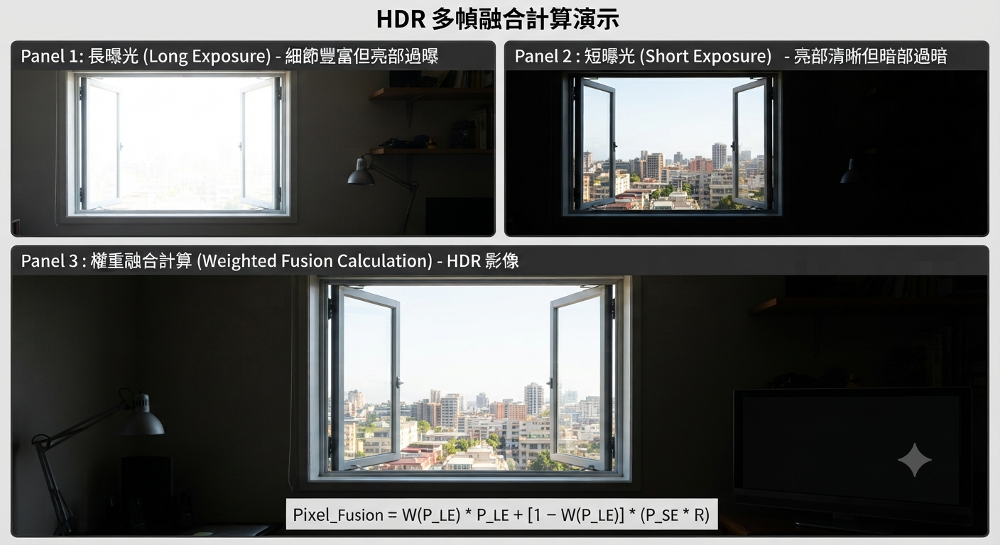

# 📷 WDR vs HDR：ISP 影像訊號處理與計算機制

在 ISP（Image Signal Processor）領域中，**WDR（寬動態範圍）** 與 **HDR（高動態範圍）** 的核心目的都是為了解決高反差光線環境下的明暗細節保留問題，但在技術實現的階段與計算機制上有本質上的不同。

## 📖 一、 名詞解釋與深度定義
### 1. HDR (High Dynamic Range, 高動態範圍)
*   **核心定義**：一種**「超越傳統硬體單次曝光極限」**的影像獲取技術。
*   **技術本質**：專注於 **前端數據採集（Data Acquisition）**。
*   **運作機制**：在極短時間內由 Sensor 採集長曝光（捕獲暗部）與短曝光（捕獲亮部）的多幀 RAW 數據，在物理層面進行高位元（16-bit 以上）的線性融合，擴展物理感光的極限。

### 2. WDR (Wide Dynamic Range, 寬動態範圍)
*   **核心定義**：一種**「在有限的顯示範圍內，極大化呈現明暗細節」**的影像處理能力。
*   **技術本質**：專注於 **後端數據呈現與壓縮（Data Rendering & Compression）**。
*   **運作機制**：無論輸入源是單幀 Linear 還是融合後的 HDR 數據，WDR 透過色調映射（Tone Mapping）演算法，動態調高暗部、壓低高光，將寬廣的動態範圍「擠入」顯示器能呈現的範圍（通常為 8-bit YUV, 0~255）。
---

## 🧭 二、 核心概念與差異對比

| 特性指標 | 🛑 HDR (High Dynamic Range) | ⚙️ WDR (Wide Dynamic Range) |
| :--- | :--- | :--- |
| **主要技術階段** | **前端 Sensor 採集 / 數據融合層面** | **後端圖像處理 / 顯示壓縮層面** |
| **輸入資料源** | Sensor 直接輸出的長、短曝光（多幀）原始數據 | 單張影像（Linear mode 或已由 Sensor 合成的影像） |
| **核心處理目的** | 擴展物理採集極限，確保物理亮部不過曝、暗部有細節 | 調亮暗部、壓低高光，將寬廣動態範圍「擠入」有限顯示範圍 |
| **常見應用產業** | 消費型攝影、智慧型手機、高階車載相機 | 安全監控、行車紀錄器、電子後視鏡 |

---
## ⚠️ 三、 使用上的問題與硬體限制

### 🛑 1. HDR 的主要缺陷與限制

*   **運動偽影與鬼影（Motion Artifacts / Ghosting）**
    *   *原因*：多幀（長/短曝光）在時間上有先後順序。
    *   *後果*：若物體或相機在採集期間移動，融合時邊緣會錯位，產生不自然的黑影、殘影或鋸齒色彩邊緣。
*   **LED 閃爍問題（LED Flicker）**
    *   *原因*：現代 LED（車燈、號誌）採用高頻 PWM 驅動。HDR 為了抓取高光，其短曝光（Short Exposure）時間極短。
    *   *後果*：短曝光時間可能剛好落在 LED 熄滅的微秒週期，導致融合後的車燈或紅綠燈嚴重閃爍甚至完全熄滅（自動駕駛與車載 ADAS 的致命傷）。
*   **幀率（FPS）減半與頻寬暴增**
    *   *原因*：要在 30fps 下輸出時序 HDR（Time-multiplexed），Sensor 必須以 60fps 速率輸出長短曝光畫面。
    *   *後果*：功耗翻倍、傳輸頻寬（MIPI D-PHY/C-PHY）吃緊、ISP 運算負擔與記憶體讀寫（DDR Bandwidth）壓力大增。

---

### ⚙️ 2. WDR 的主要缺陷與限制

*   **暗區噪點放大（Noise Amplification）**
    *   *原因*：WDR（特別是 Local Tone Mapping）為了讓暗處清晰，會對低亮度區域進行強力的局部增益（Gain）放大。
    *   *後果*：隱藏在暗處的傳感器隨機噪點（Random Noise）和散粒噪點（Shot Noise）隨之成倍放大，導致畫面暗區出現嚴重的綠色/紫色色雜訊與顆粒感。
*   **邊緣光暈效應（Halo Artifacts）**
    *   *原因*：局部色調映射（LTM）利用濾波器（如雙邊或引導濾波器）分離背景亮度層時，在極亮與極暗交界處（如天空與建築物邊緣）會產生計算誤差。
    *   *後果*：在高反差邊緣的暗側出現不自然的「發光白邊（Halo）」，亮側出現「黑邊」，畫面呈現強烈的人工合成感（俗稱塑料感）。
*   **色彩失真與灰暗感（Color Washout / Graying）**
    *   *原因*：強行壓縮高光並拉高暗部時，若僅調整了亮度通道（Y），而沒有等比例修正與補償色彩通道（UV）。
    *   *後果*：整體畫面看起來灰濛濛的，對比度雖然拉近了，但影像失去了原有的立體感、通透度與色彩飽和度。

---

## 🛠️ 四、 業界前沿解決方案（Tuning & Hardware）

| 面臨問題 | 硬體/演算法對策 | 技術原理 |
| :--- | :--- | :--- |
| **HDR 運動鬼影** | **Staggered HDR** | 縮短長短曝光行與行之間的讀出時間差（Line-interleaved）。 |
| **HDR LED 閃爍** | **DCG (Dual Conversion Gain) / Split Pixel** | 單次曝光內透過大小像素或切換電容同時輸出高/低靈敏度信號，**實現零時差 HDR**。 |
| **WDR 暗區噪點** | **RAW-domain TNR** | 在 WDR 強力放大暗部前，先在前端 RAW 域進行 3D 時域降噪（3DNR）。 |
| **WDR 邊緣光暈** | **AI LTM / Guided Filter** | 引入神經網路或引導濾波器更精準地識別物理邊緣，徹底消除高反差發光白邊。 |

---
## 🧮 五、 ISP 中的核心計算機制

### 1. HDR 計算：多幀融合（Multi-Frame Fusion）
HDR 的計算發生在 ISP 前端的 **RAW 域**。目的是將長曝光（Long Exposure, LE）和短曝光（Short Exposure, SE）兩張（或多張）影像結合成一張高位元（如 16-bit/20-bit）的超高動態範圍影像。



#### ① 曝光比值對齊（Ratio Alignment）
計算長短曝光時間比值（Exposure Ratio）： 
$$R = \frac{T_{\text{long}}}{T_{\text{short}}}$$

將短曝光的像素值乘以 $R$，對齊到與長曝光相同的物理量階：
$$\text{Pixel}_{\text{Aligned\_SE}} = \text{Pixel}_{\text{SE}} \times R$$

#### ② 權重融合計算（Weight Blending）
根據長曝光像素的亮度來決定融合比例的權重函數 $W(x)$：
*   **暗區（未過曝）**：長曝光細節好、噪點低，權重 $W \approx 1$。
*   **亮區（接近飽和）**：長曝光過曝，轉用短曝光數據，權重 $W \approx 0$。

$$\text{Pixel}_{\text{Fusion}} = W(P_{\text{LE}}) \times P_{\text{LE}} + [1 - W(P_{\text{LE}})] \times (P_{\text{SE}} \times R)$$

#### ③ 運動去鬼影（De-ghosting）
檢測兩幀之間的像素差值，若大於設定閾值（Threshold），代表物體移動，ISP 會強制將該區域權重切換為完全由單一幀（通常是短曝光）決定，避免產生黑影或殘影。

---

### 2. WDR 計算：色調映射與對比增強（Tone Mapping）
WDR 的計算通常發生在 ISP 後端的 **YUV 域**（或色彩空間轉換後）。當高動態範圍影像（16-bit）要輸出到標準顯示器（8-bit, 0~255）時，WDR 負責計算如何分配這有限的亮度階層。

#### ① 全局色調映射（Global Tone Mapping, GTM）
使用一條非線性的曲線（如 S 型曲線或 Log 函數）作用於全圖像素。
$$\text{Pixel}_{\text{out}} = f(\text{Pixel}_{\text{in}})$$
*   **計算邏輯**：高光部分的斜率變平緩（壓縮高光防止過曝），暗部部分的斜率變陡峭（拉伸暗部提升細節）。這屬於一對一的靜態或動態函數對照表（LUT）計算。

#### ② 局部色調映射（Local Tone Mapping, LTM）
為避免全局調整導致畫面失去對比度，LTM 會利用雙邊濾波器（Bilateral Filter）或引導濾波器（Guided Filter）將影像拆解為兩層：
1.  **基底層（Base Layer）**：低頻背景亮度。
2.  **細節層（Detail Layer）**：高頻物體邊緣與紋理。

$$\text{WDR}_{\text{Out}} = \text{Compress}(\text{Base}) + \alpha \times \text{Detail}$$
*   **計算邏輯**：僅對「基底層」進行大幅度的動態範圍壓縮（把亮暗差距拉近），而「細節層」則保持原樣甚至乘以放大係數 $\alpha$ 進行增強，最後重新相加，確保黑陰影處的局部對比度依然清晰。

---

## 🔄 六、 現代 ISP 的協同工作流（Workflow）

```💡
[ Sensor 採集長短曝光 ] 
       │
       ▼
[ ISP 前端：HDR 計算 ] ───► 將多幀融合為 16-bit RAW 寬動態數據
       │
       ▼
[ ISP 後端：WDR 計算 ] ───► 透過 GTM/LTM 壓縮映射至 8-bit YUV 輸出
```

---

## 🛠️ ISP 調試（Tuning）實戰建議

1.  **HDR 調校重點**：
    *   優先確保 **Exposure Ratio** 計算正確，避免融合邊界（Blending Window）出現斷層。
    *   優化去鬼影（De-ghosting）閾值，防止移動物體邊緣產生偽影。
    *   **HDR 解決的是「物理極限」問題**：受限於 Sensor 滿阱容量（FWC）、讀出雜訊與多幀採集的時間差。
2.  **WDR 調校重點**：
    *   透過 **GTM Curve** 決定整體畫面的明暗基調（Gamma、亮度感）。
    *   調整 **LTM 參數**（如局部對比度權重、細節放大係數），在拉高暗部細節的同時，必須壓制隨之放大的隨機噪點（Noise）。
    *   **WDR 解決的是「視覺心理」問題**：考驗 ISP 演算法如何在壓縮高位元數據的同時，欺騙人類雙眼，讓畫面兼具細節、自然度與立體感。
