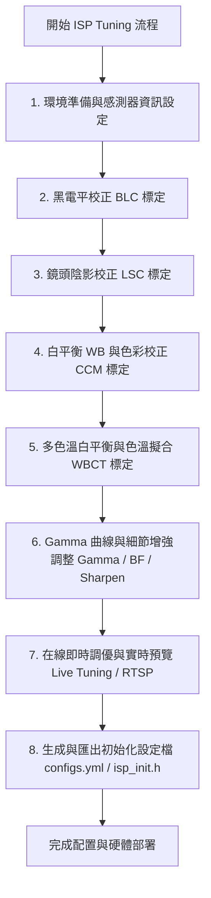
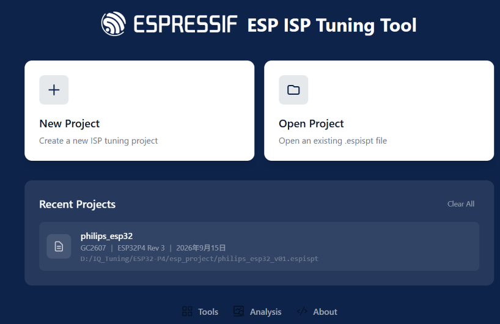
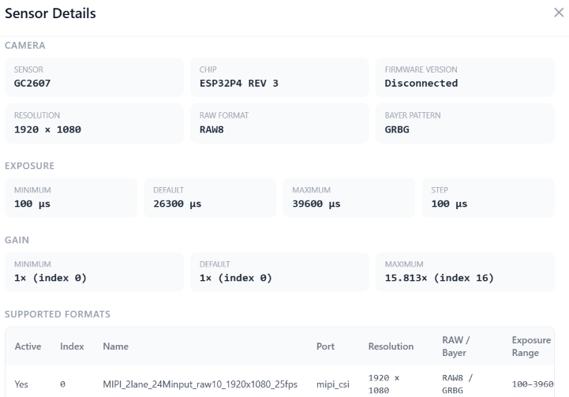
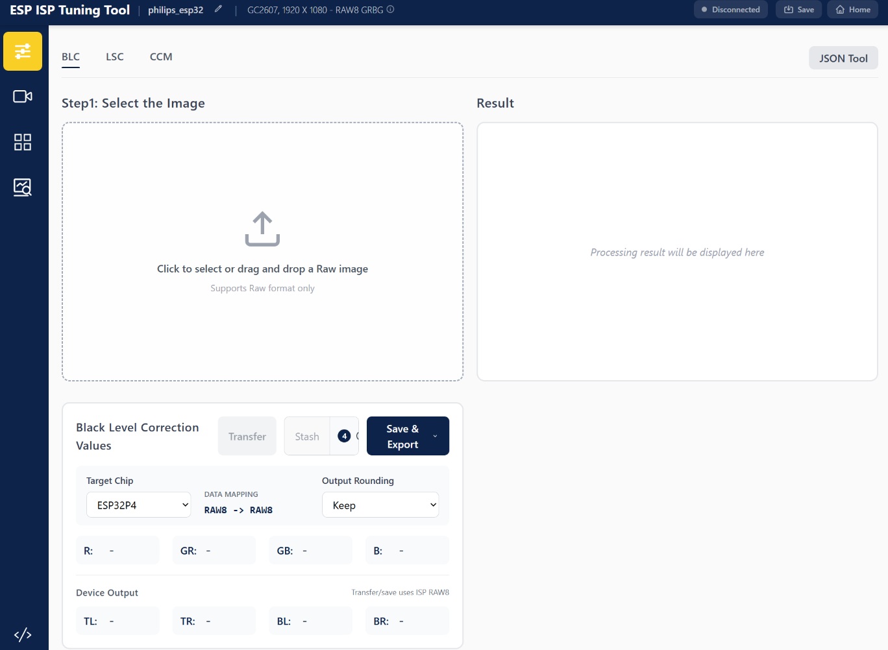
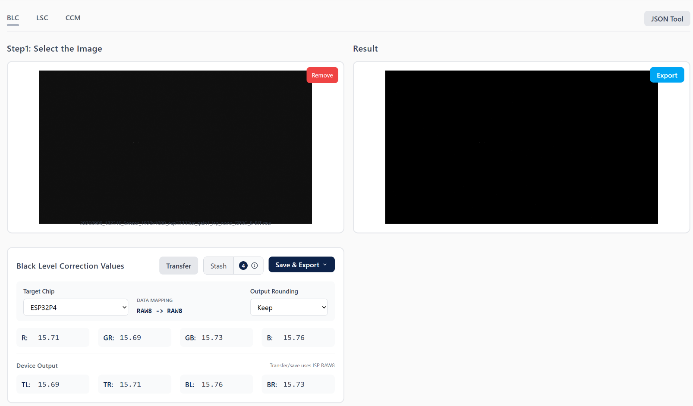
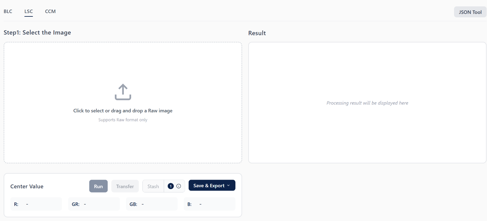
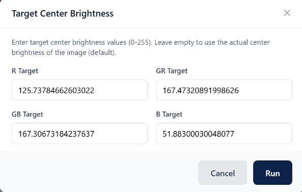
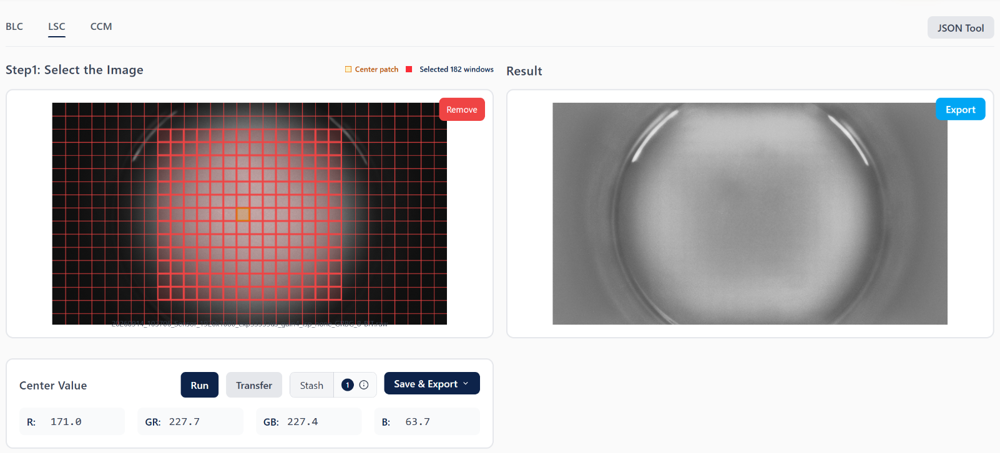
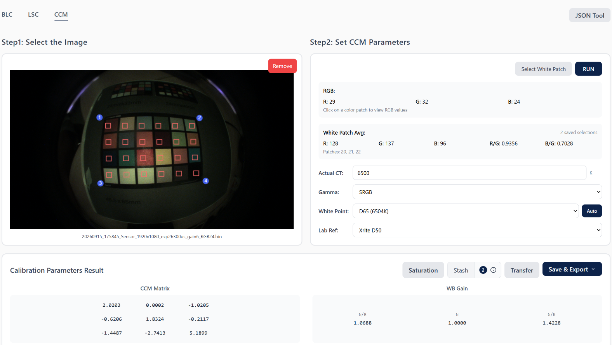

# ESP ISP 調優工具 操作與說明
ESP ISP 調優工具（ESP ISP Tuning Tool）提供了完整的影像品質（IQ）調優方案，涵蓋 **線上參數調優（Live Tuning）**、**離線參數標定（Calibration）** 以及 **圖像處理與分析工具**。
以下為 ESP ISP Tool 支援的所有核心影像調整、標定與分析項目：
## **一、核心 ISP 模組線上調整項目 (Live Tuning)**
在線上調優頁面（Live Tuning）中，工具可與 ESP32-P4 開發板實時連線，對以下 10 個核心 ISP 管道模組進行參數寫入與效果預覽：
### 1. **Exposure（曝光時間控制）**
- 說明：配置 Sensor 的感光曝光時間（微秒 $\mu s$），控制畫面整體進光量。支援自動曝光增益（Auto Exposure Gain）調整功能。
### 2. **Pixel Gain（像素增益）**
- 說明：設定 Sensor 的類比與數位像素增益，控制訊號放大倍率。可搭配 Automation 進行自動化暗場增益掃描。
### 3. **BLC（Black Level Correction / 黑電平校正）**
- 說明：扣除 Sensor 固有的暗電流（Dark Current）與固定信號偏置（Fixed Offset），維持訊號的線性一致性。支援設定 Bayer 域四個角（Top Left, Top Right, Bottom Left, Bottom Right Offset）的偏置數值。
### 4. **LSC（Lens Shading Correction / 鏡頭陰影校正）**
- 說明：補償鏡頭光學邊緣衰減（中心亮、邊緣暗）現象。可配置 Bayer 域 4 通道的增益矩陣，將畫面邊緣亮度拉齊至接近中心亮度。
### 5. **BF（Bayer Filter / 拜耳域降噪與濾波）**
- 說明：在 Bayer 原始影像階段進行降噪，支援設定降噪等級（Denoise Level）與空間濾波矩陣（Filter Matrix）。
### 6. **Demosaic（去馬賽克 / 色彩插值）**
- 說明：將 Bayer 單通道 RAW 圖像插值轉換為 RGB 彩色圖像，支援設定去馬賽克梯度比（Gradient Ratio）。
### 7. **WB（White Balance / 白平衡）**
- 說明：調整紅通道增益（Red Gain）與藍通道增益（Blue Gain），消除環境光源產生的色偏，確保白色與灰色物體正確還原。
### 8. **CCM（Color Correction Matrix / 色彩校正矩陣）**
- 說明：配置 $3 \times 3$ 的色彩校正矩陣，修正 Sensor 的色彩響應，使其精準映射至目標參考色彩（如 X-Rite 24 色卡 Lab 參考值）。
### 9. **Gamma（Gamma 曲線校正）**
- 說明：調整影像灰階與對比度。支援設定 Preset Gamma 值，或透過直接拖拽採樣點進行固定點曲線編輯，即時改變畫面的亮暗階過渡。
### 10. **Sharpen（銳化 / 邊緣增強）**
- 說明：增強影像細節與邊緣清晰度。支援配置高頻分量的高低閾值（High/Low Thresholds）、高/中閾值銳化數值以及低通濾波矩陣。
## **二、離線參數標定與擬合模組 (ISP Parameter Calibration)**
### 1. **BLC 離線標定**：
- 導入完全遮光拍攝的黑電平 RAW 影像，自動計算不同 Pixel Gain 下的黑電平偏置數值。
### 2. **LSC 離線標定**：
- 導入均勻光源（如燈箱）拍攝的 RAW 影像，自動劃分 Split-window 網格並計算全圖四通道網格增益。
### 3. **CCM 離線標定**：
- 導入 24 色卡 RAW/RGB 影像，選取角點提取色塊，搭配實際色溫（Actual CT）、白點（White Point）與 Lab 參考值自動計算 3x3 CCM 矩陣與 WB Gain。
### 4. **WBCT 標定（白平衡與色溫擬合）**：
- 收集不同色溫（如 A, U30, TL84, D50, D65）下的色卡數據，採用線性、二次或三次擬合計算 `BG/RG FIT` 與 `CT/(RG,BG)` 色溫曲線。
### **三、圖像處理與輔助分析工具 (Image Processing &amp; Analysis)**
### 1. **圖像處理工具 (Image Processing)**：
  - **24 色卡 Lab 提取**：從 PNG/JPG/BMP 色卡圖像中提取 24 個色塊的 Lab 數值並匯出 JSON。
  - **RAW / RGB 圖像預覽**：檢視 RAW 影像的灰度圖與去馬賽克彩色圖，或預覽 BGR888 格式的 RGB BIN 檔案。
  - **Gamma LUT 生成器**：生成 Gamma 曲線、16 點 Look-Up Table (LUT) 與對應的 C/C++ 代碼片段，並可將曲線即時套用至 RGB 影像。
### 2. **圖像分析工具 (Image Analysis)**：
  - **LSC 圖像分析**：繪製 3D 照度分佈圖（3D Shading Visualization），評估畫面亮度均勻度與暗角校正效果。
  - **RAW 圖像分析**：拆分並顯示 R、GR、GB、B 四通道的 Bayer 數據與亮度分佈。
  - **邊緣分析**：計算並視覺化影像高頻分量，統計最大值、最小值、平均值並提供高頻直方圖。
  - **白塊分析**：依據 Threshold（RGB之和/G/灰階）、X/Y 窗口數與 RG/BG 比例條件，篩選並標記影像中無偏色的有效白塊窗口。

## **四、ISP Tuning 調整步驟流程圖**

## **五、ISP Tuning 調整步驟說明**
### 1. **環境準備與感測器資訊設定 (Environment & Sensor Info Setup)**
- **設定檔載入**：啟動工具時，系統會載入預設設定檔 default_configs.yml 並創建可供客製化修改的複本 configs.yml 或 .espispt 專案檔。

- **感測器參數更新**：在開始標定前，必須先設定並確認感測器（Sensor）的解析度（寬與高）、位元深度（Bit Depth）以及 Bayer 格式（如 RGGB、BGGR）。

### 2. **黑電平校正 (Black Level Correction, BLC)**
- 目的：消除感測器固有的暗電流（Dark Current）與固定信號偏置（Fixed Signal Offset），確保完全無光時的像素值能準確對齊真正的黑色，維持訊號的線性一致性。
- 操作：在完全遮擋鏡頭（無光環境）下拍攝全黑 RAW 影像，計算 Bayer 各通道（R, Gr, Gb, B）的偏置數值。
- 順序依賴：BLC 是所有 ISP 標定中最優先執行的步驟，後續所有模組均需先扣除黑電平偏置。
### 3. **鏡頭陰影校正 (Lens Shading Correction, LSC)**
- 目的：補償鏡頭光學特性造成的「中心亮、邊緣暗」（光學暗角）現象，將畫面各區域亮度拉齊至接近中心亮度。
- 操作：在輝度箱、積分球或均勻光源下拍攝無紋理的灰白平面 RAW 影像，統計網格區域並計算 Bayer 四通道的網格增益矩陣。
- 順序依賴：執行 LSC 標定前，必須先完成 BLC 標定並將 BLC 結果寫入或套用至設備。
### 4. **白平衡 (WB) 與色彩校正矩陣 (CCM) 標定**
- 目的：調整 R/B 通道增益消除環境色偏，並透過 $3 \times 3$ 矩陣將感測器捕捉到的色彩映射至標準目標色彩（如 Lab 參考值）。
- 操作：在均勻光源下拍攝標準 24 色卡（ColorChecker）RAW 或 RGB 影像。框選 24 色卡區域，利用最下一排的灰色色塊（Patch 19–23）計算 WB Gains（R Gain, B Gain），並選擇誤差矩陣演算法（如 $\Delta E_{ab}^{00}$ 或 $\Delta C_{ab}^{00}$）計算 3x3 CCM 矩陣。
- 順序依賴：執行 CCM 標定前，必須先完成 BLC 與 LSC 標定並將結果寫入設備。
### 5. **多色溫白平衡與色溫擬合 (WBCT Calibration)**
- 目的：建立白平衡增益與色溫之間的對應關係，確保影像在不同光照色溫環境下皆能正確還原色彩。
- 操作：收集多個不同標準光源與色溫點（如 A, U30, TL84, D50, D65 以及極端色溫 2500K/7500K）下的 24 色卡樣本30more_horiz。執行擬合演算法（線性、二次或三次擬合），計算出 BG/RG FIT 與 CT/(RG,BG) 色溫曲線。
### 6. **Gamma 曲線與細節增強調整 (Gamma, BF & Sharpening)**
- Gamma 校正：對比或生成 Gamma 曲線（對比標準 sRGB $\gamma \approx 2.2$ 或 16 點 Look-Up Table），調整畫面灰階過渡與整體對比度。
- 降噪與銳化：設定 Bayer 域降噪（BF / BNE）與 Sharpen 銳化參數（高/低頻閾值及濾波矩陣），在抑制噪點與維持細節邊緣之間取得平衡。
### 7. **在線即時調優與實時預覽 (Live Tuning & Preview)**
- 操作：連接實體開發板，在 Live Tuning 介面中即時寫入 Exposure、Pixel Gain、Demosaic、Sharpen 等模組參數。
- 實時驗證：透過 Capture 拍照或 RTSP 實時視訊串流觀察成像效果，進行閉環微調與驗證。
### 8. **生成與匯出初始化設定檔 (Generate Configuration Files)**
- 軟體/演算法設定檔：將標定與調優完成的參數匯出為 configs.yml 或 JSON 配置文件，供 ISP 軟體參考模型運作。
- 硬體/FPGA 初始化檔：生成 isp_init.h 標頭檔，將浮點數轉換為適合硬體運算的整數格式（如 Integer CCM），供 FPGA 韌體或晶片驅動初始化載入。
## **六、ISP Tuning 工具各功能調整步驟說明**
### 1. 黑電平校正 (Black Level Correction, BLC)
- ### **BLC 核心概念與目的**
    - #### **黑電平校正（Black Level Correction, BLC）**主要用於**消除感測器固有的暗電流（Dark Current）與固定訊號偏置（Fixed Signal Offset）**。由於感測器即使在完全無光的環境下，輸出像素值也往往不為零，BLC 透過扣除此偏置值，將 0 像素值精準對齊真正的黑色，確保後續所有 ISP 處理模組皆能取得具備線性一致性的輸入訊號。
- ### 標定環境與影像採集準備
    在執行 BLC 標定前，需手動採集無光環境下的暗場 RAW 影像：
    1. **完全遮光**：關閉設備光圈，或使用鏡頭蓋完全遮擋鏡頭，確保完全沒有任何光線進入感測器。
    2. **多增益採集**：在在線調優（Live Tuning）頁面中，將曝光時間固定，並分別在**低增益（Low Gain）**與**高增益（High Gain）**下各點擊 **Capture** 拍攝並擷取一張黑電平 RAW 影像。
- ### 黑電平標定與計算步驟
    1.  **導入黑電平影像**：開啟標定頁面的 BLC 模組，載入剛才拍攝的黑電平 RAW 影像。
    
    2.  **參數辨識與確認**：工具會優先從 RAW 檔名（格式如 `Name_WxH_Nbits_Bayer.raw`）、專案設定或已連接設備自動推斷解析度、位元深度與 Bayer 格式。若辨識失敗或參數不符，會彈出對話框供手動確認與修正。
    3.  **自動計算通道偏置**：影像成功載入後，演算法會自動執行並分別計算出 Bayer 域中 **R、Gr、Gb、B** 四個通道的獨立黑電平數值（或四角偏置值）。
    
- ### 結果處理與在線驗證
    標定完成後，工具提供多種結果處置與驗證方式：
    - **Stash（暫存結果）**：輸入該張影像對應的 Pixel Gain 進行暫存。相同增益的暫存資料會自動覆蓋，並隨專案儲存。在 Live Tuning 頁面的 **Stashed BLC** 選項中，可依增益直接選用並下發至開發板進行即時驗證。
    - **Export（導出設定檔）**：可將所有暫存的 BLC 結果匯出為 `blc_table` 或直接寫入 `configs.yml` 設定檔。
    - **Transfer（直接傳遞）**：將當前計算出的 BLC 數值直接傳送至在線調優頁面。
    - **Apply（套用校正）**：亦可將計算好的 BLC 數值套用至其他待校正的 RAW 影像上，套用時可選擇是否啟用線性化（Linearization）功能。
- ### 自動化暗場增益掃描 (Automation Workflow)
    若要自動建立完整增益下的 BLC 資料庫，可在 **Online Tuning &gt; Automation** 頁籤中執行自動化採集：
    1. 固定曝光時間（Exposure Time），並設定**起始增益 (Start Gain)**、**結束增益 (End Gain)** 與**步長 (Step)**。
    2. 蓋上鏡頭蓋後點擊 **Start Capture**，工具會自動依序擷取全範圍增益下的 RAW 畫面並計算每一幀的 BLC 數值。
    3. 採集完成後，可將所有 RAW 檔案與 BLC 數據整批導出。

### 2. 鏡頭陰影校正 (Lens Shading Correction, LSC)
- ### **LSC 核心概念與目的**
    - #### **鏡頭陰影校正（Lens Shading Correction, LSC）** 用於補償由鏡頭光學特性造成的「中心亮、邊緣暗」（光學暗角/亮度衰減）現象。LSC 透過對影像不同網格位置進行 Bayer 四通道的增益補償，將畫面各區域的亮度拉齊至接近中心亮度。
        - **前置條件**：執行 LSC 標定前，**必須先完成 BLC（黑電平校正）標定**，並將 BLC 校正結果寫入或套用至設備，以確保後續計算輸入為線性訊號。
- ### **光源選擇與標定環境準備**
    LSC 標定對光照均勻度極為敏感，因此對光源與採集環境有明確規範：
    1. #### **光源與目標要求**：
    - **亮度分佈平坦且均勻**：光源必須確保全圖照射高度均勻。
    - **目標平滑無紋理**：拍攝物體不可有圖案、線條、劃痕或污跡。
    2. #### **理想標定設備與光源**：
    - **標準設備（首選）**：輝度箱（Luminance Box）、積分球（Integrating Sphere）或 DNP 燈箱。
    - **替代目標**：燈箱無明顯劃痕或污跡的灰色內壁，或透過毛玻璃均勻擴散的光源。
    - **限制條件下方案**：任意亮度分佈均勻的平整灰/白平面（如白牆），但標定精準度可能會有所降低。
    - **注意**：不同鏡頭模組（Lens Module）的光學特性不同，必須分別進行獨立標定。
    3. #### **影像採集步驟**：
        1. 將鏡頭對準目標區域，確保環境無外來雜散光干擾。
        2. 調整光源亮度，使鏡頭**中心區域的平均亮度達到最大飽和值的 70% 左右**。
        3. 拍攝並採集一張 RAW 影像。
        4. 切換不同色溫光源（如 A 光、TL84、D50、D65 等），重複上述步驟採集多組不同色溫下的 LSC RAW 影像。
- ### **Split-window 網格標定與計算步驟**
    1. **導入標定 RAW 影像**：
    - 在標定頁面開啟 LSC 模組並導入採集的 RAW 影像。
  
    - 工具會優先從檔名自動辨識解析度、位深與 Bayer 格式；若無法推斷，會跳出對話框供手動確認與修正。
    2. **自動統計中心亮度與顯示 Split-window 網格**：
    - 影像成功載入後，工具會自動統計中心區域各通道的平均亮度，並在預覽圖上疊加 **LSC Split-window 網格**。
    3. **選取目標亮度區域 (Center Value)**：
    - **單視窗選取**：可以直接點擊某個網格窗口作為目標亮度區域。
    - **多視窗框選**：可按住滑鼠拖拽出一個矩形區域，系統會自動由預先分割好的網格窗口組合而成。
    - 工具會自動計算所選窗口區域的四通道（R, Gr, Gb, B）平均亮度，並填入 **Center Value**。
    4. **執行計算 (Run)**：
    - 點擊 **Run** 按鈕，工具會以當前 Center Value（若未選擇視窗，則預設使用自動計算的中心亮度）作為目標中心亮度。
  
    - 演算法會自動計算 Bayer 四通道的網格增益矩陣（Grid Gains），並在右側即時顯示校正後的影像。
  
- ### **結果處置與在線驗證**
    - **Stash（暫存結果）**：點擊 Stash 按鈕並輸入當前影像對應的色溫（Color Temperature, CT）進行暫存。相同色溫的結果會自動覆蓋，數據隨專案檔案儲存。
    -  **Live Tuning 在線套用**：在 Live Tuning 頁面的 **Stashed LSC** 選項中，可依色溫（CT）直接選用暫存的 LSC 結果，並點擊 Send 將 Bayer 4 通道增益矩陣下發至開發板進行即時驗證。
    - **Export / Transfer**：點擊 Export 可將所有暫存的 LSC 結果導出；點擊 Transfer 可將當前 LSC 結果直接傳遞給 Live Tuning 頁面。
- ### **LSC 效果分析 (3D Shading Visualization)**
    - 校正完成後，可至圖像分析（Image Analysis）頁面的 **LSC Analysis** 模組，導入套用 LSC 參數後拍攝的 RAW 影像。工具會生成 **3D 照度分佈圖（3D Shading Visualization）**，方便直觀觀察畫面全域的亮度分佈曲面、鏡頭暗角程度與陰影校正效果。

### 3. 白平衡 (WB) 與色彩校正矩陣 (CCM) 標定
- ### **CCM 核心概念與前置條件**
    - #### **色彩校正矩陣（Color Correction Matrix, CCM）** 用於修正感測器（Sensor）的色彩響應，透過將感測器捕捉到的色彩空間轉換並映射至標準目標色彩（如 X-Rite 24 色卡 Lab 參考值），消除色偏、修正飽和度並還原真實色彩。
        - **前置條件**：執行 CCM 標定前，**必須先完成 BLC（黑電平校正）與 LSC（鏡頭陰影校正）標定**，並將 BLC 與 LSC 的校正結果寫入設備中。
- ### **標定環境與影像採集準備**
    1. **標定器材**：準備標準 X-Rite ColorChecker Classic（24 色卡）。
    2. **拍攝規範**：
        - 在均勻光源下將鏡頭對準 24 色卡，確保色卡佔據全圖面積 80% 以上。
        - 調整光源亮度，使最亮灰階 Patch 19 的 G 通道數值約達到飽和值的 0.8 倍左右56。拍攝並採集 RAW 影像或 BGR888 BIN 格式影像。
    3. **多色溫採集覆蓋**：
        - 建議優先覆蓋常用標準光源色溫點：A、U30、U35、TL84、D50、D65。
        - 建議補充低色溫與高色溫極端點（如 2500K 與 7500K），以提升 CCM 在各種實際場景下的泛化能力。
- ### **順時針角點選取與色塊提取步驟**
    1. **導入標定影像**：
        - 在標定頁面開啟 CCM 模組，導入拍攝的 RAW 或 BGR888 BIN 影像。
        - 工具會優先從檔名自動辨識解析度、位元深度與 Bayer 格式；若缺少完整參數，會彈出對話框供手動確認與修正。
    2. **順時針選取 24 色卡角點 (Clockwise Corner Selection)**：
        - 影像成功載入後，在畫面上依照順時針方向依次點擊 24 色卡的四個角點。
        - 點擊完成後，調優工具會自動對 24 色卡進行分割與色塊提取（Patch Partitioning）。
        - 提取完成後，右側的標定參數頁面會自動顯示點擊色塊的平均 RGB 數值。
 
- ### **色溫 (Actual CT)、白點 (White Point) 與白塊標定流程**
    色塊劃分完成後，需在 Set CCM Parameters 區域配置核心參數：
    1. **設定實際色溫 (Actual CT)**：
        - 在 Actual CT 欄位中填入當前採集環境下實測的固定色溫數值（例如 6504K）。
    2. **白點連動與設定 (White Point & Auto Linking)**：
        - **Auto 白點自動連動**：啟用 Auto 功能時，工具會自動根據輸入的 Actual CT 選擇最接近的標準參考白點。
        - **手動調整**：使用者亦可手動在下拉式選單中切換指定的 White Point（如 D65, D50 等）。
    3. **選擇參考 Lab 數值與 Gamma (Lab Ref & Gamma)**：
        - **Lab 參考值**：工具預設提供 X-Rite D50、3NH D50 與 TC021-S 等色卡 Preset，亦支援使用者自訂 Lab 數據。
        - **Gamma 設定**：目前預設支援 sRGB Gamma 參數。
    4. **選取白塊 (Select White Patch)**：
        - **點擊 Select White Patch 按鈕**，在色卡最下一排灰色色塊中選取至少一個白塊/灰塊（Patch 19–23）。
        - **歷史選擇沿用（History Reuse）**：工具會自動記錄白塊選取歷史；當導入同一組標定中的下一張影像時，系統會預設沿用上一次選取的白塊編號，但會自動從新影像中重新提取 RGB 平均值，避免誤用舊影像數據7。
- ### **矩陣計算、結果處置與 WBCT 色溫擬合**
    1. **執行計算 (Run)**：
        - 點擊 Run 按鈕，工具會自動計算出 $3 \times 3$ 色彩校正矩陣（CCM）與白平衡增益（WB Gain）。
        - 介面上會同時呈現 CCM 校正預覽圖 以及 僅套用 WB 的預覽圖。
        - 可點擊 Saturation 按鈕微調預覽畫面的飽和度（此操作僅改變預覽視覺效果，不會修改原始 CCM 矩陣）。
    2. **Stash / Export / Transfer**：
        - **Stash（暫存）**：點擊 Stash 並輸入當前色溫（CT）暫存 CCM 矩陣，相同色溫會自動覆蓋並隨專案保存。
        - **Export（導出）**：可導出全部暫存結果；若已導入 ISP JSON 模板，亦可直接寫入模板中。
        - **Transfer（傳遞）**：將當前 CCM 矩陣與 WB Gain 傳遞至 Live Tuning 頁面下發測試。
    3. **白平衡與色溫擬合 (WBCT Calibration)**：
        - 重複上述步驟導入不同色溫（如 A, TL84, D50, D65, 2500K, 7500K）下的色卡影像，每次成功執行 CCM 後，工具會自動建立或更新一條 WBCT Sample。
        - 在 WBCT 區域點擊 Run WBCT，選擇線性（Linear）、二次（Quadratic）或三次（Cubic）擬合模式，即可計算出 BG/RG FIT 與 CT/(RG,BG) 兩組色溫曲線。
        - 導出的 WBCT 結果即可直接對應寫入相機 Sensor IPA 配置文件中的 color_temp 節點。

### 4. 多色溫白平衡與色溫擬合 (WBCT Calibration)
- ### **WBCT 核心概念與目的**
    - #### **白平衡與色溫（White Balance and Color Temperature, WBCT）** 標定主要用於建立白平衡增益與色溫之間的對應關係。透過在多個不同色溫光源下收集的白塊樣本，演算法可計算並擬合出連續的色溫曲線，供自動白平衡（AWB）模組在各種光照環境下動態推算與還原正確的色彩。
- ### **標定環境與多色溫樣本採集**
    - **依賴關係**：WBCT 標定高度依賴在 CCM（色彩校正矩陣）標定流程中所採集的不同色溫下的 24 色卡（ColorChecker）標定圖像。
    - **光源涵蓋建議**：
        - 建議優先覆蓋常用標準光源與色溫點，例如 A、U30、U35、TL84、D50 與 D65。
        - 同時建議包含極低色溫（如 2500K）與極高色溫（如 7500K）的端點樣本，以提升色溫擬合曲線的穩定性與場景適應能力。
    - **逐一色溫樣本收集與提取步驟**
        在 CCM 標定頁面中，依序對每個色溫點下的 24 色卡影像執行以下步驟：
        1. **導入單一色溫影像**：在 CCM 頁面導入某一個色溫下拍攝的 24 色卡圖像。
        2. **順時針選取角點**：依照順時針方向點擊選取 24 色卡的四個角點進行色塊劃分。
        3. **填入實際色溫 (Actual CT)**：在 Actual CT 欄位中輸入當前圖像在拍攝環境下實測的實際色溫數值。
        4. **選取白塊 (Select White Patch)**：點擊 Select White Patch 按鈕，選取 CCM 所使用的白塊/灰塊（Patch 19–23）。工具會記錄白塊選取歷史；當導入下一張不同色溫的影像時，預設會沿用相同的白塊編號，但會自動從新影像中重新計算 RGB 平均值，避免誤用舊數據。
        5. **執行 CCM 並生成樣本**：點擊 Run 按鈕執行 CCM 計算。CCM 計算成功後，工具會自動結合當前輸入的 Actual CT 與白塊 RGB 平均值，生成或更新一條 WBCT sample。
        6. **重複採集全色溫點**：更換至其他色溫點下拍攝的 24 色卡圖像，重複上述步驟 1 至 5，直到收集齊所有目標色溫點的樣本。
- ### **色溫擬合曲線計算 (Run WBCT)**
    - 收集齊多個色溫點的 WBCT 樣本後，可在 CCM 頁面的 WBCT Calibration 區域執行曲線擬合：
    1. **檢視與管理樣本**：在 WBCT Calibration 區域中可以檢視、刪除各條樣本，或點擊 Export Samples 將收集到的 WBCT 樣本數據導出備份。
    2. **設定擬合模式與參數**：點擊 Run WBCT，選擇適合的擬合模式（線性 Linear、二次 Quadratic 或 三次 Cubic），並設定 $x_0, y_0$ 參數。
    3. **計算對應曲線**：執行擬合後，調優工具會自動計算並繪製出 BG/RG FIT 與 CT/(RG,BG) 兩組色溫對應關係曲線。
- ### **結果導出與模板寫入**
    - **導出至配置文件**：點擊 Export 按鈕導出 WBCT 標定結果。該匯出結果直接對應相機感測器 IPA 配置文件中 ian 節點下的 color_temp 配置項。
    - **寫入 JSON 模板**：若先前已透過 JSON Tool 載入或導入 ISP JSON 模板，可點擊 Save to Template 將 WBCT 標定結果直接寫入模板中。
### 5. Gamma 曲線與細節增強調整 (Gamma, BF & Sharpening)
- ### **核心概念與調優目的**
    - #### Gamma 曲線校正、拜耳域降噪 (Bayer Filter, BF) 與銳化 (Sharpen) 屬於 ISP 管道中後段負責影像階調過渡、噪點抑制與細節增強的核心模組。透過這三個模組的協同調優，能使影像在維持平滑過渡與潔淨暗部的同時，呈現清晰的邊緣細節。
- ### **Gamma 曲線生成與在線動態編輯流程**
    Gamma 校正用於將感測器的線性響應對映至符合人眼視覺與顯示器的非線性階調空間。工具提供離線生成、在線動態編輯與曲線分析三種操作方式：
    1. **LUT 生成與代碼導出 (Gamma Lookup Table Generator)**：
        - 在圖像處理 (Image Processing) 頁面的 Gamma Generate 區域，輸入 Preset Gamma 數值（建議範圍 1.5–3.0）並點擊 Generate。
        - 工具會自動繪製 Gamma 曲線、生成 16 點 Look-Up Table (LUT) 以及對應的 C/C++ 代碼片段。
        - 頁面支援導入 BGR888 格式的 RGB BIN 影像；拖動採樣點時，右側預覽圖會即時套用當前 Gamma 曲線並同步刷新。
    2. **在線動態固定點編輯 (Live Tuning Gamma Editing)**：
        - 在在線調優 (Live Tuning) 頁面的 Module Selection 中選取 Gamma 模組。
        - 輸入 Preset Gamma 值點擊 Apply 生成預設曲線，或直接在圖表上記拖動採樣點 (Sampling Points) 調整輸出階調。
        - 啟用 Auto Apply 時，拖動採樣點會即時將 Gamma 配置寫入開發板；未啟用時可點擊 Send 手動下發。
    3. **曲線視覺化對比 (Gamma Analysis)**：
        - 在分析工具 (Analysis Tools) 的 Gamma Curves 模組中，可將使用者自訂的 Gamma 曲線與標準 sRGB 色彩空間的 Gamma ($\gamma \approx 2.2$) 曲線進行繪圖對比，並點擊 Save Graphs 儲存結果。
- ### **拜耳域降噪 (Bayer Filter, BF) 標定步驟**
    拜耳域降噪是在 Raw 原始影像階段進行雜訊抑制，防止噪點進入去馬賽克 (Demosaic) 過程被放大。
    1. **模組選取**：在 Live Tuning 頁面的 Module Selection 下拉選單中選擇 BF 模組。
    2. **關鍵參數配置**：
        - **Denoise Level (降噪等級)**：設定降噪強度，抑制全圖的高頻雜訊與暗部顆粒感。
        - **Filter Matrix (濾波矩陣)**：配置空間濾波矩陣權重，控制降噪的平滑特性與範圍。
    3. **下發與即時驗證**：修改參數後點擊 Send 寫入設備，點擊 Capture 擷取影像，觀察平坦區域與暗部的雜訊抑制狀況。
- ### **銳化與細節增強 (Sharpening) 調優流程**
    銳化模組用於補償光學與降噪帶來的邊緣模糊，提升影像的高頻細節與清晰度。
    1. **模組選取**：在 Live Tuning 頁面的 Module Selection 中選取 Sharpen 模組。
    2. **核心參數配置**：
        - **High & Low Thresholds (高低閾值)**：設定高頻分量的高低閾值，劃分細節邊緣與平坦背景噪點區域。
        - **High-Threshold & Mid-Threshold Sharpen Gain (高/中閾值銳化增益)**：分別調整強邊緣與中等細節區域的增強係數。
        - **Low-Pass Filter Matrix (低通濾波矩陣)**：設定低通濾波矩陣，抑制邊緣過度銳化產生的白邊 (Over-shoot) 或高頻噪點放大。
    3. **即時寫入與預覽**：點擊 Send 下發參數，點擊 Capture 拍攝單張影像，或點擊 RTSP Preview 開啟動態視訊視窗，實時觀察物體輪廓與線條的銳利度。
- ### **邊緣與細節量化分析 (Edge Analysis)**
    為避免過度銳化導致影像品質劣化，可使用圖像分析工具進行量化評估：
    1. **圖像導入**：進入圖像分析 (Image Analysis) 頁面的 Edge Analysis 模組，導入 BIN、PNG 或 JPG 格式影像。
    2. **高頻分量繪製**：工具會自動計算畫面高頻分量，並在 High Frequency Visualization 區域繪製高頻細節分佈圖。
    3. **數據統計與直方圖**：系統會自動統計高頻分量的最大值、最小值與平均值，並繪製高頻分量直方圖 (Histogram)，幫助工程師精準評估邊緣增強程度與雜訊控制的平衡點。
## **七、ISP 模組調優順序與暫存器預設值對照表**
在 ESP ISP 調優工具中，ISP 管道模組涵蓋從 RAW 域至 RGB 域的完整處理過程。下表依照**嚴格的算法前置依賴順序**，整理所有 10 個核心模組的處理領域、前置條件、核心暫存器/參數以及預設與常見範圍：  
| 調優順序 | 模組名稱 | 處理領域 | 前置依賴條件 | 核心暫存器 / 參數項目 | 預設值與常見範圍說明 |
| ---- | ---- | ---- | ---- | ---- | ---- |
| 1 | Exposure(曝光時間) | Sensor / 前端 | 無 | Exposure Time ($\mu s$) | 預設預覽值 23800 $\mu s$（可調範圍：200 – 33200 $\mu s$）|
| 2 | Pixel Gain(像素增益) | Sensor / 前端 | 無 | Pixel / Analog Gain | 設備範圍 1x – 64x（自動化暗場掃描預設起始 1，結束 64，步長 5）|
| 3 | BLC(黑電平校正) | RAW 域 | 曝光與增益已固定 | Top Left, Top Right, Bottom Left, Bottom Right Offsets（四角偏置）| 介面預設偏置 16（或依全黑暗場採集計算之 R, Gr, Gb, B 偏置數值）| 
| 4 | LSC(鏡頭陰影校正) | RAW 域 | 必須先完成 BLC 並寫入設備 | 4-Channel Grid Gain Matrix（Bayer 四通道網格增益）| 依輝度箱/燈箱採集，調整光源使中心平均亮度達到最大值的 70% |
| 5 | BF(拜耳域降噪) | RAW 域 | BLC 完成 | Denoise Level, Filter Matrix | 控制 RAW 域平滑與高頻降噪強度，防止去馬賽克時放大噪點 |
| 6 | Demosaic(去馬賽克) | RAW $\rightarrow$ RGB | BLC, LSC 完成 | Gradient Ratio（梯度比）| 介面預設值 1（控制彩色插值方向與梯度權重）|
| 7 | WB(白平衡增益) | RGB / RAW | BLC, LSC 完成 | Red Gain, Blue Gain | 預設數值 0 / 1.0（調整 R/B 增益使灰階色塊消除色偏） |
| 8 | CCM & WBCT(色彩校正矩陣與色溫擬合) | RGB 域 | 必須先完成 BLC 與 LSC 並寫入設備 | $3 \times 3$ Correction Matrix（浮點/整數型），BG/RG FIT 與 CT/(RG,BG) 曲線 | CCM 每行和約束為 19；拍攝時 Patch 19 G 分量控制在 0.8 倍飽和度 |
| 9 | Gamma(Gamma 曲線校正) | RGB 域 | CCM, WB 完成 | Preset Gamma, 16-point LUT | 建議 Preset 值 1.5 – 3.0（基準對比 sRGB $\gamma \approx 2.2$；UI 預設值 0.78）|
| 10 | Sharpen(銳化與邊緣增強) | RGB 域 | BF, Gamma 完成 | High/Low Thresholds, High/Mid Sharpen Gains, Low-Pass Filter Matrix | 控制高頻細節增強與低通濾波，避免過度銳化產生白邊（Over-shoot） |
---
### 關鍵調優順序依賴原則
1. **BLC 必須最優先標定 (BLC First)**：
    - 黑電平偏置（Dark Current Offset）若未先扣除，後續所有模組（如 LSC、WB、CCM）輸入的訊號均為非線性，會直接導致色偏與亮度計算失真。
2. **LSC 必須在 CCM 前完成 (LSC before CCM)**：
    - 鏡頭暗角會造成畫面邊緣亮度與色彩衰減，若未先執行 LSC 補償邊緣亮度，在選取 24 色卡或算 CCM 矩陣時會因邊緣與中心光照不均而產生嚴重的矩陣計算偏差。
3. **CCM 必須在 Gamma 與 Sharpen 前完成 (CCM before Gamma/Sharpen)**：
    - CCM 的 $3 \times 3$ 矩陣變換建立在線性 RGB 空間上；若先實施非線性的 Gamma 階調壓縮或 Sharpen 高頻增強，會破壞色彩的線性比例關係。
4. **即時擷取格式自動切換**：
    - 當啟用了 Demosaic、WB、CCM、Gamma 或 Sharpen 等 RGB 域模組時，系統在點擊 Capture 時會自動切換為 RGB24 格式；若僅啟用 RAW 域模組，則預設擷取 RAW 格式。

# 問題與說明
## 一. 怎麼在線上模式即時預覽影像？
在 ESP ISP 調優工具中，線上模式提供兩種圖像預覽方式：**單張擷取預覽（Capture）** 與 **RTSP 實時視訊串流預覽（RTSP Preview）**。
### **1. 單張擷取預覽 (Single Frame Capture)**
當在 **Live Tuning** 頁面微調 ISP 模組參數時，可以隨時擷取單幀影像來觀察調整效果：
- **操作步驟**：
  1. 確保開發板已成功連接（支援 IP 或 USB 連接）。
  2. 在 **Module Selection** 中選取模組並修改參數後，點擊 **Send** 將參數寫入開發板。
  3. 點擊預覽區域下方的 **Capture** 按鈕，工具會抓取當前參數下的畫面並更新至預覽區域。
- **格式自動切換**：
  - 若啟用了 **Demosaic、WB、CCM、Gamma 或 Sharpen** 等 RGB 域模組，系統會預設擷取 **RGB24** 格式。
  - 若未啟用上述模組，則預設擷取 **RAW** 格式。
- **後續處理**：
  - 點擊 **Save** 可將最新擷取的影像儲存至本機（RAW 檔存為 `.raw`，RGB24 存為 `.bin`）。
  - 點擊 **Send to Tuning** 可將該張影像直接發送至 BLC、LSC 或 CCM 等離線標定模組。
### **2. RTSP 實時動態視訊預覽 (RTSP Live Stream)**
若需要連續觀察動態畫面的實時成像效果，可以使用 RTSP 視訊串流功能：
- **前置條件**：
  - **僅支援 IP 連接**（以太網或 Wi-Fi），**USB 連接不支援 RTSP 預覽**。
  - 請確認燒錄於 ESP32-P4 的標定固件已啟動 RTSP 服務。
- **操作步驟**：
  1. 在 **Live Tuning** 頁面下方點擊 **RTSP Preview** 按鈕。
  2. 工具會在獨立視窗中開啟並播放 `rtsp://<開發板 IP>:8554/live` 的動態視訊串流。
  3. 點擊 **Stop RTSP** 即可結束預覽；若開發板斷開連接或切換離開 Live Tuning 頁面，預覽視窗也會自動關閉。

## 二. 如何調整曝光和增益？
在 ESP ISP 調優工具中，調整**曝光（Exposure）與增益（Pixel Gain**主要有以下三種操作方式：
### **1. 手動即時調整 (Live Manual Tuning)**
- 進入頁面：切換至 Online Tuning（在線調優） 頁面的 Live Tuning 頁籤。
- 選擇模組與輸入參數：在 Module Selection 下拉式選單中，選擇要寫入的模組：
    - 選擇 Exposure：輸入目標曝光時間（單位為微秒 $\mu s$）。
    - 選擇 Pixel Gain：輸入像素增益數值。
- 寫入設備：修改參數後，點擊該模組面板中的 Send 按鈕，將新參數寫入開發板。
- 狀態檢視：模組面板底部會即時顯示當前開發板運行的曝光時間與像素增益。
### **2. 預覽區域右鍵自動曝光與增益 (Auto Exposure Gain)**
- **擷取預覽影像**：在 Live Tuning 頁面點擊 Capture 按鈕擷取當前影像。
- **切換模式與右鍵點擊**：在預覽區域切換為 Color Card（色卡） 或 LSC Grid（網格） 模式，並在特定的色塊或網格上點擊滑鼠右鍵。
- **開啟 Auto Exposure Gain 對話框**：彈出視窗後，配置以下控制條件與範圍：
    - **Channel**：選擇目標通道（如 R、GR、GB、B）。
    - **Luminance Range (Min/Max)**：設定目標亮度範圍。
    - **Adjustment Range**：設定曝光調整範圍（Exposure Min/Max us）與增益調整範圍（Pixel Gain Min/Max）。
    - **Max Iterations**：設定最大疊代次數。
- **同步更新**：自動曝光疊代計算完成後，工具會自動推算並同步更新介面上的 Exposure 與 Pixel Gain 參數。
### **3. 自動化暗場增益掃描 (Automation Gain Sweep)**
- **進入自動化頁籤**：切換至 Online Tuning 頁面的 Automation 頁籤。
- **配置掃描條件**：設定固定曝光時間（Exposure us），以及像素增益的**起始增益 (Start Gain)**、**結束增益 (End Gain)** 與**增益步長 (Step)**。
- **執行連續採集**：點擊 Start Capture，工具即會按設定順序自動變更增益並擷取每一幀 RAW 影像（例如用於 BLC 暗場增益掃描）。