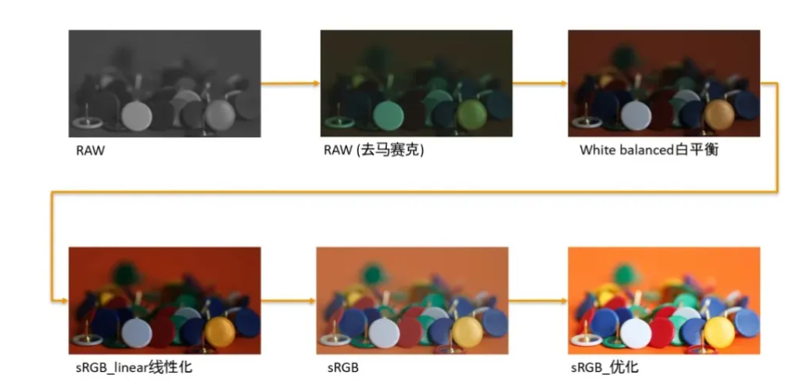
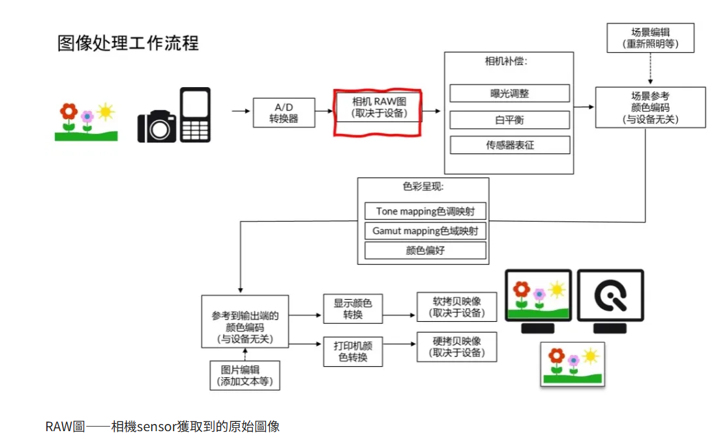
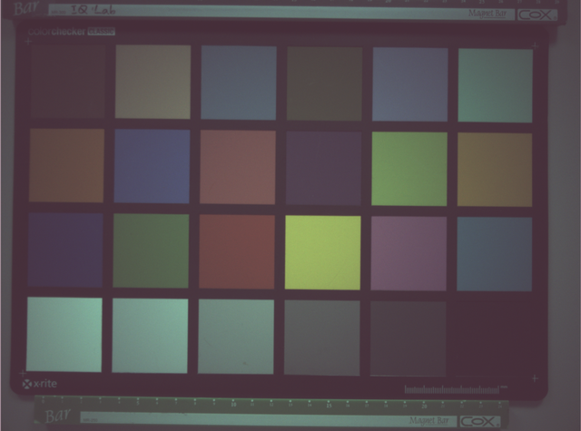
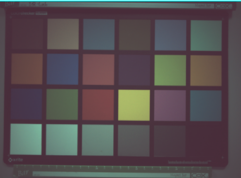
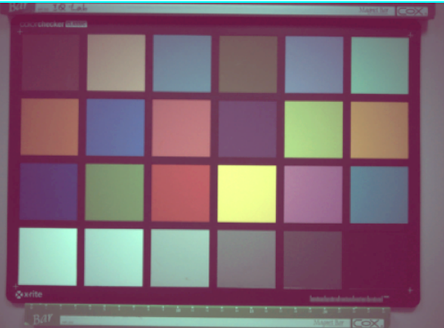

## Image 影像轉換與說明

## RAW圖——相機sensor獲取到的原始圖像
多數的彩色圖像傳感器使用Bayer模式，bayer模式顏色傳感器是採用紅、綠、藍濾片，使用插值算法進行色彩還原。因此，每個像素只能檢測一種顏色，即“看到”紅色，綠色或藍色。

- 傳感器信號不包含顏色信息，每個像素代表一種顏色

- RAW圖局部細節

## 去馬賽克
為獲得每個像素的紅色，綠色和藍色信息，“去馬賽克”的重要步驟是對丟失的信息進行插值。
這是圖像質量中至關重要的部分，因此，每個製造商對其詳細操作都應保密。
由於不同的濾光片導致對光的靈敏度不同且信號強度較低，因此噪聲級別可能會非常不同。
在去馬賽克過程中，噪聲在相鄰之間擴散，不同顏色通道中的噪聲相互關聯。

- RAW圖局部細節

## 白平衡
在數碼相機中，不同顏色通道的靈敏度可能會非常不同。
為了獲得正確的色彩，使它們出現在人的視覺系統中，攝像機會以不同的方式控制不同通道的增益。
經過白平衡後，圖像中的中性區域顯得中性，並且紅色，綠色和藍色的數字值幾乎相同。

## 色彩校正矩陣（CCM）
每個攝像機都有各自的光譜靈敏度。因此，每個攝像機都具有特定的RGB輸出。
為了獲得所有相機的一致結果，必須將此RGB_camera轉換為標準的已知色彩空間。
在一般情況下是sRGB，但可以是任何其他顏色空間。
要將值從RGB_camera轉換為sRGB，必須對數據應用3×3色彩校正矩陣（CCM*）

## GAMMA
到目前步驟為止，圖像數據仍然是線性的。
因此，將光強度加倍會使圖像中的數字值加倍，而不管圖像是在暗區還是在亮區進行檢查。為了在輸出設備上獲得正確的表示，通常在圖像上應用gamma 功能。
此色調曲線應用在圖像處理的最後階段，因為從現在開始，圖像數據變得非線性，開始接近於人眼所看到的圖像畫面。
