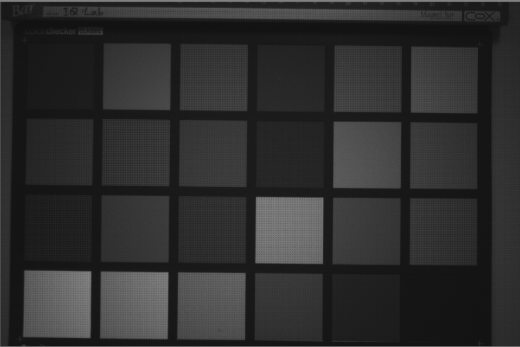
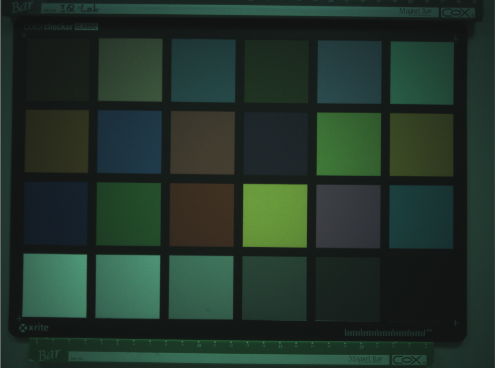
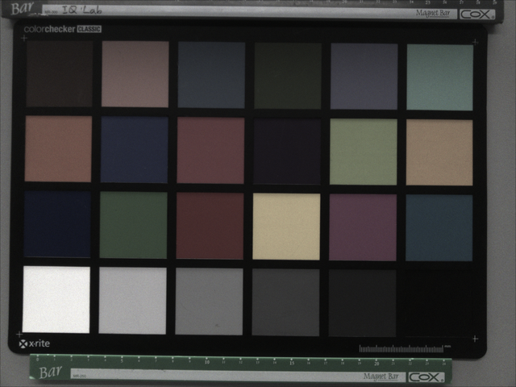
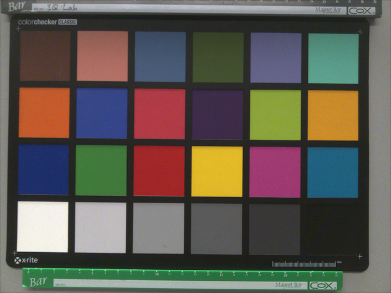
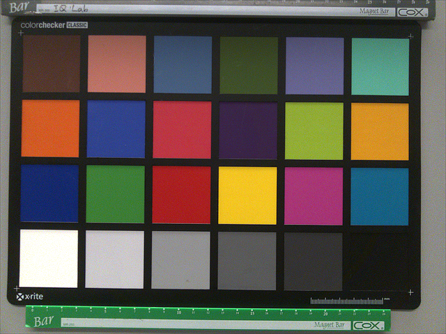

## Image 影像轉換與說明


圖像信號處理（Image Signal Processor, ISP）的工作流程是將感測器（Sensor）輸出的原始數據（RAW Data）轉換為高品質數位影像的一系列複雜步驟。以下依據提供資料詳細說明 ISP 的主要處理階段與功能：
1. 原始數據獲取與預處理 (RAW Data Stage)
影像處理始於相機感測器捕捉到的 RAW 圖。
- Bayer 模式擷取：多數彩色感測器使用 Bayer 濾光片，每個像素僅檢測紅、綠、藍三原色中的一種，此時影像仍為「馬賽克」狀態。
- 黑電平校正 (BLC, Black Level Correction)：校正感測器在全黑環境下的基礎輸出值。
- 鏡頭陰影校正 (LSC, Lens Shading Correction)：修正因鏡頭光學特性（如凸透鏡中心聚光強、邊緣弱）導致的影像中心與四周亮度不均（Luma Shading）或偏色（Color Shading）問題。
2. 色彩還原與白平衡 (Color Restoration & Balancing)
此階段旨在將單色像素資訊轉化為彩色，並修正環境光造成的色偏。
- 去馬賽克 (Demosaicing / Debayer)：透過插值演算法，計算出每個像素丟失的另外兩種顏色資訊，使每個像素都具備完整 RGB 值。
- 自動白平衡 (AWB, Auto White Balance)：針對不同色溫環境進行歸一化處理，調整不同通道的增益（Gain），使畫面中的中性區域（如白色）在數值上滿足 R'=G'=B'。
3. 色彩校正矩陣 (CCM, Color Correction Matrix)
CCM 是 ISP 管線中決定色彩還原精度的核心模組，通常位於 AWB 之後。
- 功能：由於感測器對光譜的靈敏度與人眼不同，且濾鏡可能出現色彩混疊。CCM 利用一個 3x3 矩陣 將像素從感測器特定的 RGB 空間映射到標準色彩空間（如 sRGB 或 Display P3）。
- 線性化要求：CCM 的矩陣運算必須在線性數據上執行。如果輸入已是經過 Gamma 編碼的非線性影像，必須先進行去編碼（Linearization）。
- 約束條件：運算時需遵循「行總和為 1」的原則，以確保在校正其他色彩時不會破壞既有的白平衡。
4. 影像增強與最終輸出 (Enhancement & Output)
校正完色彩後，ISP 會進行最終的視覺優化。
- Gamma 校正：由於人眼對亮度的感受是非線性的，ISP 會應用 Gamma 曲線 將線性影像數據轉換為非線性，使其更貼近人眼所見的視覺效果。
- 色彩處理 (CPROC) 與後處理：包含對比度調整、飽和度增強以及動態範圍（HDR）優化等步驟。
- 其餘高級處理：包含 3D-LUT（三維查找表）色彩精細映射、降噪（Denoise）、銳化（Sharpen）與鏡頭畸變校正等。
ISP 簡化流水線：
```
RAW 數據 → BLC → LSC → AWB → Demosaic → CCM → Gamma → CPROC → RGB 影像。
```

## RAW圖——相機sensor獲取到的原始圖像
多數的彩色圖像傳感器使用Bayer模式，bayer模式顏色傳感器是採用紅、綠、藍濾片，使用插值算法進行色彩還原。因此，每個像素只能檢測一種顏色，即“看到”紅色，綠色或藍色。

- 傳感器信號不包含顏色信息，每個像素代表一種顏色

- RAW圖局部細節

## 黑電平校正（BLC, Black Level Correction
BLC（Black Level Correction，黑電平校正）是 ISP 流程中的前端校正步驟，用來扣除 sensor 在無光或低光時仍會輸出的底部偏移值，使 RAW 的黑位回到接近 0。  
這個偏移通常來自暗電流、器件偏置、ADC pedestal，以及讀出電路的固定誤差。  


## 鏡頭陰影校正（LSC, Lens Shading Correction）
鏡頭陰影校正（LSC, Lens Shading Correction）是提升影像品質非常關鍵的一步。如果沒有經過 LSC 校正，拍出來的照片就會出現「中心亮、四周暗」（暗角）或是「中心與四周顏色不一致」（色偏）的問題。


## 去馬賽克(Demosaicing / Debayer)
為獲得每個像素的紅色，綠色和藍色信息，“去馬賽克”的重要步驟是對丟失的信息進行插值。
這是圖像質量中至關重要的部分，因此，每個製造商對其詳細操作都應保密。
由於不同的濾光片導致對光的靈敏度不同且信號強度較低，因此噪聲級別可能會非常不同。
在去馬賽克過程中，噪聲在相鄰之間擴散，不同顏色通道中的噪聲相互關聯。

- 影像進行去馬賽克（Demosaic）後畫面偏綠，最核心的原因是感光元件（Sensor）上的拜爾濾色鏡（Bayer Filter）中，綠色像素的數量是紅、藍像素的兩倍。
- 大多數感光元件表面覆蓋著 Bayer 陣列，其色彩單元由 1 個紅（R）、1 個藍（B）和 2 個綠（G）組成（佔比為 25% R、25% B、50% G）。
- 此設計是為了模擬人類視覺。人眼視網膜對綠色波長（約 550nm）的亮度和細節最為敏感。
- 由於感光元件上天生有一半的像素都在接收綠色光，原始數據（Raw Data）本身的綠色訊號量就遠大於紅、藍訊號。

## 白平衡(AWB, Auto White Balance)
在數碼相機中，不同顏色通道的靈敏度可能會非常不同。
為了獲得正確的色彩，使它們出現在人的視覺系統中，攝像機會以不同的方式控制不同通道的增益。
經過白平衡後，圖像中的中性區域顯得中性，並且紅色，綠色和藍色的數字值幾乎相同。  


## 色彩校正矩陣(CCM, Color Correction Matrix)
每個攝像機都有各自的光譜靈敏度。因此，每個攝像機都具有特定的RGB輸出。
為了獲得所有相機的一致結果，必須將此RGB_camera轉換為標準的已知色彩空間。
在一般情況下是sRGB，但可以是任何其他顏色空間。
要將值從RGB_camera轉換為sRGB，必須對數據應用3×3色彩校正矩陣（CCM*）  


## GAMMA校正(亮度曲線校正)
到目前步驟為止，圖像數據仍然是線性的。
因此，將光強度加倍會使圖像中的數字值加倍，而不管圖像是在暗區還是在亮區進行檢查。為了在輸出設備上獲得正確的表示，通常在圖像上應用gamma 功能。
此色調曲線應用在圖像處理的最後階段，因為從現在開始，圖像數據變得非線性，開始接近於人眼所看到的圖像畫面。  


## 色彩處理(CPROC)
在相機的影像信號處理（ISP）管線中，CPROC（Color Processing，色彩處理）通常位於色彩空間轉換與伽馬校正等核心基礎處理之後、輸出最終 RGB 影像前的階段。它是針對影像進行主觀畫質微調（Fine-tuning）與色彩風格化（Styling）的重要模組。
- 主要調整項目: 
1. 飽和度（Saturation）
2. 色相（Hue）
3. 亮度 / 明度（Brightness / Value）
4. 對比度（Contrast） (部分平台或架構會納入 CPROC 範疇)  



## 建議與說明
### AWB（自動白平衡）應該在 Demosaic（去馬賽克）之前執行，這是目前主流 ISP 架構（如行動裝置或 GPU ISP）中較正確且普遍的順序。
以下詳細說明其流程邏輯與對影像品質的影響：
1. 正確的處理流程
根據資料，標準的高品質 ISP 流水線為： 
## RAW 數據 → BLC → LSC → AWB → Demosaic → CCM → ...
在此流程中，AWB 的「增益應用（Gain Application）」是在 Bayer 原始數據域（Bayer Domain）進行的。
2. AWB 在 Demosaic 之前執行的原因
- 插值準確性與防止偏色：Demosaic 本質上是一個插值（Interpolation）過程，利用相鄰像素計算出缺失的顏色資訊。如果不同通道（R、G、B）的增益在插值前沒有先進行歸一化（即 AWB 校正），插值計算會因為像素間原始亮度的巨大差異而產生彩色偽影或邊緣色彩異常。
- 線性特性一致性：RAW 數據在 Demosaic 之前是完美的線性數據。AWB 的增益調整是一個簡單的線性乘法運算（R′ =R×R_Gain）。在 Bayer 域進行校正能確保插值過程是在「平衡」後的線性數據上執行的。
- 計算效率：在 Bayer 域應用 AWB 增益，只需要對每個像素進行一次乘法，比 Demosaic 後對三個完整的 RGB 通道進行運算更節省計算資源。
3. 順序對影像品質的影響
若將 AWB 放在 Demosaic 之後做，會產生以下負面影響：

影響維度 | AWB 在 Demosaic 前做（推薦）| AWB 在 Demosaic 後做
| ---- | ---- | ---- |
插值偽影 | 較少，因為 R/G/B 通道已歸一化，邊緣計算較準確。 | 較多，插值算法會放大通道間的原始不平衡，導致邊緣出現紫邊或偽色。
噪聲控制 | 有利。噪聲在 Demosaic 之前是獨立的，AWB 增益應用較單純。 | 不利。Demosaic 會將噪聲擴散至相鄰像素，此時再做 AWB 會放大已關聯的噪聲。
色彩準確度 | 高。CCM 可以直接在已平衡的 RGB 空間進行更精確的映射。 | 低。CCM 必須基於正確的白平衡點，否則會導致嚴重的色彩偏移。
4. 與後續模組（CCM）的連動
資料強調 CCM 必須在 AWB 之後執行。
- 原因：AWB 的目的是將「白色」校準為 R=G=B；而 CCM 的作用是在保持「白色」不變的前提下，將其他顏色校正到精確的目標空間。
- 約束：為了不破壞已完成的白平衡，CCM 矩陣通常會限制「每一行的總和必須為 1」，確保 R=G=B 的輸入經過矩陣運算後依然輸出 

## $$R^′=G^′ =B^′$$